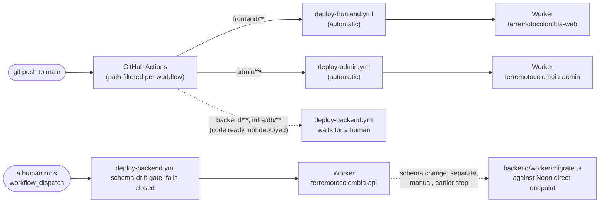

# CLAUDE.md — entry point for agents

This repository is no longer the generic template. It is the **production
deployment** of **terremotocolombia.co** (Terremoto Colombia 2026,
Mallanet.org). It serves real traffic right now.

The repository began as a fork of a public disaster-response template. Most
of the code is still generic. One fact matters most for you: the deployment
identity is already set, the launch already happened, and **anything you
push to `main` goes live**. For code conventions (endpoints, integration
modules, Drizzle, ESLint rules), read [`AGENTS.md`](AGENTS.md).

## First fact: a push to `main` deploys the frontend and the admin panel — not the backend

**Frontend and admin** deploy on their own on every push to `main`, each
with its own path filter: `deploy-frontend.yml` (`frontend/**` and
`config/deployment.config.json`) and `deploy-admin.yml` (`admin/**`). No
approval step exists for those two. Every commit is a deploy to a site
that people use to search for missing family members.

**The production backend deploy is MANUAL** (`deploy-backend.yml`,
`workflow_dispatch` only). The maintainer set this up on the afternoon of
2026-08-11, after a 6-hour `503` incident caused by schema drift. Merging
to `main` leaves the code ready, but the API Worker only deploys when a
human runs the workflow — which also runs a schema-drift gate that fails
closed. Staging still deploys on its own (`deploy-staging.yml`).



**Never do these tasks on your own initiative.** Each one needs a human:

- Run migrations (`backend/worker/migrate.ts`). No deploy runs migrations,
  and CI does not run them either. Migrations target Neon's **direct**
  endpoint, never the `-pooler` endpoint. A deploy ships **code**. The
  schema is always a separate, earlier step.
- Change secrets in Doppler or tokens in Cloudflare.
- Change DNS records, DNSSEC, or WAF rules for the zone.

## Where this actually runs

**Two environments exist.** Test a change in staging first.

| | Production (`main`) | Staging (`staging`) |
| --- | --- | --- |
| Web | terremotocolombia.co | staging.terremotocolombia.co |
| API | api.terremotocolombia.co | api-staging.terremotocolombia.co |
| Admin | admin.terremotocolombia.co | admin-staging.terremotocolombia.co |
| Web Worker | `terremotocolombia-web` | `terremotocolombia-web-staging` |
| API Worker | `terremotocolombia-api` | `terremotocolombia-api-staging` |
| Admin Worker | `terremotocolombia-admin` | `terremotocolombia-admin-staging` |
| Database | Neon branch `production` | Neon branch `staging` |
| Secrets | Doppler config `prd` | Doppler config `stg` |
| Frontend deploy | automatic on push | automatic on push |
| Backend deploy | **manual** (`deploy-backend.yml`, dispatch + drift gate) | automatic on push |
| Admin deploy | automatic on push (`deploy-admin.yml`, filter `admin/**`) | automatic on push |

Both environments share one `wrangler.jsonc` file per service — staging
lives in that file's `env.staging` block. This is deliberate. Two separate
config files would drift apart over time. A staging environment that does
not match production proves nothing. The admin panel follows the same
pattern (`admin/wrangler.jsonc`). Its Worker carries no runtime secrets: the
BFF only needs to know `EMERGENCY_API_URL`, and the session is the backend's
JWT, stored in an httpOnly cookie.

The **production** admin panel sits behind **Cloudflare Access**
(organization `terremotocolombia.cloudflareaccess.com`, one-time passcode by
email against a team allowlist). Nobody reaches even the panel's login page
without passing that check first. One Access application bypasses this
check, and only for `/api/health` — this keeps the smoke check in
`deploy-admin.yml` able to see a `200` response. Do not remove that bypass.
Access is managed through its own API, with a dedicated token
(`CLOUDFLARE_ACCESS_API_TOKEN` in Doppler `prd`), separate from the
OpenTofu module. To add a team member: add their email to the application's
Access policy, then invite them from the panel's `/users` screen.
`admin-staging` carries **no** Access layer — only the panel's own login
protects it, and it reads from the staging database branch.

| Part | Status |
| --- | --- |
| Admin panel | **deployed** in both environments (since 2026-08-10) |
| Queue worker (BullMQ/Valkey) | **not deployed** in either environment |

`backend/src/worker.ts` wraps the Express app with `httpServerHandler` from
`cloudflare:node`. The app itself **was not rewritten**. See
`backend/wrangler.jsonc` and `frontend/wrangler.jsonc`.

> **`docker-compose.prod.yml` and `docs/deploy-vps.md` do not describe
> today's production.** That path stays valid as an alternative (a VPS with
> Caddy and its own Postgres/Valkey) — and it is the only path where the
> full system works, queues and interactive transactions included — but it
> is not what serves the site today.

The Cloudflare zone (DNS, anti-spoofing records, TLS, WAF, cache, rate
limit) is managed by an OpenTofu module that lives **outside this
repository**, at `~/Colombia/infra/cloudflare`.

## Secrets: Doppler, not `.env`

The single source of truth is **Doppler**, project `terremotocolombia-web`,
config `prd`. Production uses no `.env` files.

```bash
doppler run --project terremotocolombia-web --config prd -- <command>
```

Two Cloudflare tokens exist, with **complementary** permissions — neither
one alone is enough:

| Secret | Covers |
| --- | --- |
| `CLOUDFLARE_API_TOKEN_COLOMBIA_SCOPED` | zone: DNS, settings, rulesets, DNSSEC |
| `CLOUDFLARE_ACCOUNT_API_TOKEN` | account: Workers, Pages, R2, Turnstile |

GitHub Actions only knows `DOPPLER_TOKEN`. `doppler run` injects every other
secret into the runner.

## Known limitations (do not "fix" these without thinking first)

- **No interactive transactions in Workers.** The driver there is Neon's
  HTTP driver. The 8 `db.transaction(...)` calls in `services/roles.ts` and
  `services/patient-imports/*` **fail in Workers**. They work under
  Node/compose. Reason: in Workers, one TCP socket belongs to the single
  request that opened it, so a stateful connection pool cannot work.
- **Turnstile is ACTIVE in both environments** (verified 2026-08-11 with
  `wrangler secret list`, and with a real browser submission in staging and
  in production). `TURNSTILE_SECRET_KEY` is set on the API Worker, and the
  public site key reaches the frontend bundle.
  **Consequence for new code:** every public form that writes MUST send
  `turnstileToken` (canonical pattern: `useTurnstile()` plus `getToken()`
  per submit — see `components/features/contacts/ContactForm.tsx`). A
  `POST` with no token gets a **403** response. That 403 is exactly how
  every missing-person report broke once already: someone set the secret
  on the Worker without the site key reaching the bundle first. If this
  ever needs to be redone: confirm the site key in the bundle first, then
  restore the secret.
- **Bot Fight Mode is off** for the zone. It injected a script that
  conflicted with the frontend's CSP.
- **`wrangler.jsonc` must never declare `routes`.** Custom domains attach
  through the account API instead. Declaring `routes` makes wrangler also
  call `/zones/{id}/workers/routes`, a call the account token cannot make.
  That failure aborts the deploy **after** the code upload and **before**
  the new version goes live — the Worker keeps serving the previous build,
  and the command looks like it almost worked.
- **Background jobs: nearly all ported to Cloudflare** (plan in
  `docs/plans/2026-08-10-002-…`, per-unit status in
  `docs/runbook-fase0.md`). These run in Workers: earthquake sync and
  geocoding (Cron Triggers), need publication (Queues with a DLQ persisted
  to `audit_log`), and **bulk patient import** (queue
  `terremotocolombia-imports`; its interactive transactions were rewritten
  as an idempotent state machine — the apply step uses conditional claims
  plus a per-row deterministic patient ID, and resumes after a failure
  without duplicating patients). `services/roles.ts` was rewritten the same
  way (role create/edit failed in Workers). External-source sync (unit U5)
  still sits idle — with no `ENABLE_*` source flags on, there is nothing to
  sync. Compose's BullMQ worker (unit R5) stays intact.
  `scripts/verify-jobs.sh [staging|production]` checks freshness without
  writing anything.
- **A Hyperdrive binding and a D1 database exist but see no use.**
  `backend/wrangler.jsonc` declares a Hyperdrive binding that no code reads
  today. A past attempt to wire it in made things worse: the Workers driver
  is Neon's HTTP driver, which needs a real Neon URL, and injecting
  Hyperdrive's local connection string broke almost every query. The team
  created the D1 database while evaluating a full move to Cloudflare, and no
  code uses it. **Do not turn these on assuming they are half-wired** — they
  are off on purpose. Removing them, or finishing the wiring, is the
  maintainer's call.
- **Rate limiting runs in a degraded mode.** Without `VALKEY_URL`, the
  backend's limiter falls back to per-isolate memory instead of a shared
  store. Workers run many isolates, so this is far more permissive than the
  configured number suggests. The edge rate limit (Cloudflare's own) is
  real and shared.

## Security rules (no exceptions)

- **Never commit `.env`** or any real `.env.*` file. `.env.example` is the
  only one committed, and it carries only placeholders that are obviously
  fake.
- **Never commit real data from this crisis.** Not in code, not in
  fixtures, not in tests, not in docs, not in an issue or a PR. No real
  names, ID numbers, phone numbers, private addresses, medical notes, or
  real photos of affected people enter this repository, under any
  circumstance. See `AGENTS.md` → "Security and privacy".
- **No test data in production.** The Neon database is real. If you must
  verify a write endpoint, delete the test row immediately after and say so.
  `missing_persons` is not a place to leave `test` rows.
- **No-real-data policy in seeds and fixtures.** `backend/src/seed/`
  generates **synthetic** data with a `DEMO-` prefix. It refuses to run when
  `NODE_ENV=production`, when `DATABASE_URL` does not point at a local host,
  or when non-demo rows already exist. Any new fixture follows the same
  pattern.
- **Never invent an identity.** A domain, email, phone number,
  organization name, or coordinate that is not in
  `config/deployment.config.json` or Doppler is a bug. Note: **we do not
  control** `terremotocolombia.app`, `.com`, or `.org` — third parties
  registered those the same day. The real domain is **`.co`**.

## Launch checklist status

The five `.claude/skills/disaster-*` skills describe a fork's initial
launch. **That already happened here.** Do not re-run them against this
repository unless you know exactly why.

| Skill | Status |
| --- | --- |
| `disaster-configure` | done (`config/deployment.config.json` carries real values) |
| `disaster-brand` | done (Mallanet identity, favicon, Open Graph) |
| `disaster-secrets-bootstrap` | replaced by Doppler |
| `disaster-deploy-vps` | **not used** — the deploy target is Cloudflare Workers |
| `disaster-content-audit` | see below |

**Resolved (2026-08-11):** CI's `content audit` job is green. The two
historical causes of failure are closed, by the maintainer's decision:
Mallanet's brand assets were already allowlisted, and the git-history check
(over 50 commits, built for a freshly-templated fork) was retired after a
manual check confirmed the history is all original. That check now gates on
a marker file (`scripts/content-audit/.content-audit-fresh`) that this
repository does not have, so it skips itself. The PII, secrets, and
prior-crisis-data rules still run, and any new finding still blocks the
build — investigate it, and do not allowlist it without the maintainer.

## GEO / SEO (AI search engines)

Skill vendored at `.claude/skills/geo/` (upstream:
https://github.com/zubair-trabzada/geo-seo-claude). Guide:
`docs/geo/README.md`.

- Commands: `/geo audit <url>`, `/geo quick`, `/geo schema`, `/geo llmstxt`,
  and more.
- Target: `https://terremotocolombia.co`.
- Robots policy: blocking AI *training* bots is fine. Do not "fix" this by
  opening access to GPTBot or ClaudeBot. See `frontend/app/robots.ts`.
- Audit output goes to `docs/geo/audit-YYYY-MM-DD.md`.

## Where to look

```text
config/deployment.config.json   Deployment identity (source of truth)
.neon                            Neon context (org + project, no secrets)

frontend/wrangler.jsonc          Frontend Worker config
frontend/open-next.config.ts     Next -> Workers adapter
frontend/scripts/                Codegen (copies deployment.config.json, logo)
backend/wrangler.jsonc           API Worker config (aliases, nodejs_compat)
backend/src/worker.ts            Express wrapper for Workers
backend/src/db/index.ts          Driver selection by runtime (Neon HTTP vs node-postgres)
backend/src/shims/               Stand-ins for modules that do not run in Workers
admin/wrangler.jsonc             Admin panel Worker config (no secrets)
admin/open-next.config.ts        Next -> Workers adapter for the panel

.github/workflows/deploy-frontend.yml   Automatic on push to main (path-filtered)
.github/workflows/deploy-backend.yml    MANUAL (dispatch + schema-drift gate)
.github/workflows/deploy-admin.yml      Automatic on push to main (filter admin/**)
.github/workflows/ci.yml                typecheck + build + content audit

docker-compose.prod.yml          ALTERNATIVE path (VPS). Not production today.
docs/deploy-vps.md               Runbook for that alternative path
docs/architecture.md             Architecture (update it when something real changes)
docs/DESIGN.md                   Design system / brand tokens
AGENTS.md                        Code conventions
```

If this file conflicts with `AGENTS.md` on a coding task, `AGENTS.md` wins.
This file governs how the system deploys and what a human must always do.
