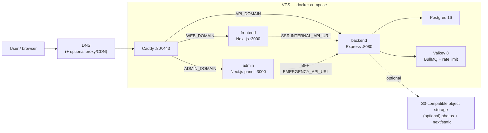
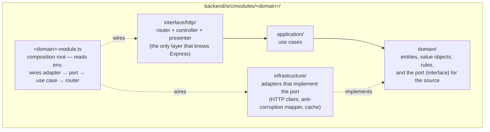
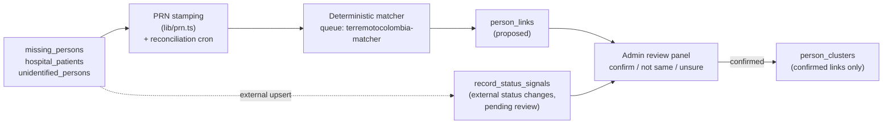
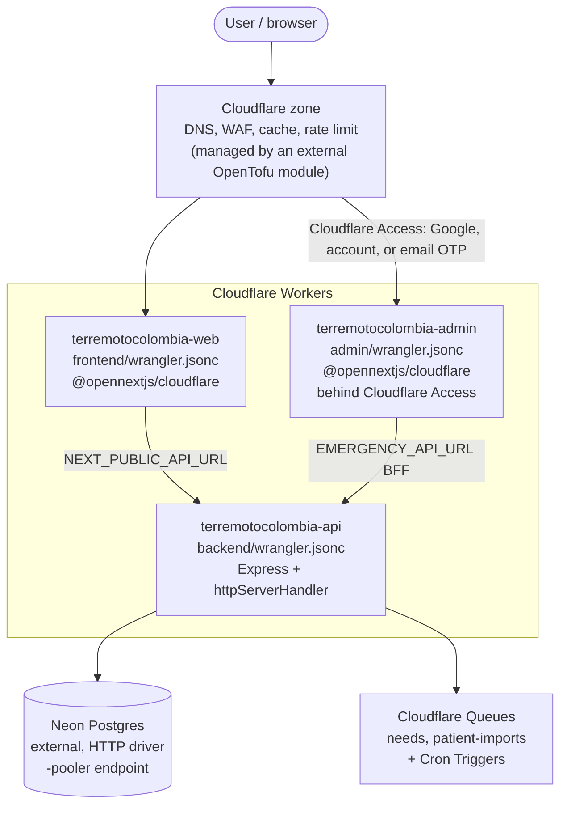

# Current architecture

This document describes how the system works today. The codebase is a
template: it does not assume any country, event, or organization. Each
deployment's identity (name, domains, map center, contact) lives in
`config/deployment.config.json` and in environment variables
(`.env.example`), never in code.

## Summary

The project is a monorepo with three application services and one shared
infrastructure layer:

- `frontend/`: Next.js + React. It renders the UI, serves assets, and calls
  the backend through an absolute URL (`NEXT_PUBLIC_API_URL`).
- `backend/`: Express + TypeScript. It serves the whole `/api` surface,
  validates its environment at startup, accesses Postgres through Drizzle,
  and shares one image with the worker and the migration job.
- `backend/worker/`: BullMQ over Valkey, for external-source sync, geocoding,
  deduplication, hub federation, and backfills/migrations. **Not deployed
  today** — see [Workers and queues](#workers-and-queues).
- `admin/`: the admin panel, a standalone Next.js microservice (a third
  tier, with role-based access through a JWT in an httpOnly cookie). Its
  BFF (`app/api/*`) forwards calls to the backend
  (`EMERGENCY_API_URL`).
  **Deployed on Cloudflare Workers since 2026-08-10**: `terremotocolombia-admin`
  serves `admin.terremotocolombia.co` (staging: `terremotocolombia-admin-staging` /
  `admin-staging.terremotocolombia.co`), through `@opennextjs/cloudflare`,
  the same as the frontend (`admin/wrangler.jsonc`, with no runtime
  secrets). Deploy: automatic in staging (`deploy-staging.yml`); automatic
  in production on push to `main`, with the `admin/**` path filter
  (`deploy-admin.yml`; it was manual until 2026-08-11). Production sits
  behind **Cloudflare Access** (native Google, Cloudflare account, or email
  OTP, all constrained by the team allowlist, with a bypass only for
  `/api/health`, for the smoke check) — see `CLAUDE.md` →
  "Where this actually runs." Note: the "Import patients" screen depends
  on the queue worker, which is still **not** deployed — on Workers, batches
  queue but do not process. Hospital data loading goes through the direct
  CRUD routes instead.
- `infra/db/`: the Drizzle schema and the SQL migrations.
- **Production today: Cloudflare Workers + Neon Postgres.**
  `docker-compose.prod.yml` + `Caddyfile.example` (a single VPS with Caddy)
  is the **alternative** path, and the only one where queues and
  interactive transactions work. See [Deployment](#deployment).

## Request flow

The diagram below shows the **alternative VPS path** (docker compose), not
the Cloudflare Workers path that serves production today. For the
Cloudflare Workers topology, see [Deployment](#deployment), section B,
below.

On the VPS, one **Caddy** instance terminates TLS and routes by hostname to
the containers. The browser calls the API through `NEXT_PUBLIC_API_URL`
(`https://${API_DOMAIN}`), and server components call it through
`INTERNAL_API_URL` (`http://backend:8080`), inside the compose network.

The frontend never accesses the database directly. On the client, it uses
`frontend/lib/api.ts`. In server components, it uses
`frontend/lib/server-api.ts`. Photos can arrive as relative paths from the
API, and the frontend anchors them to the backend with `mediaUrl()`.

## Frontend

- Next.js runs in `output: "standalone"` mode, from `frontend/`.
- Build inlines every `NEXT_PUBLIC_*` variable. A change to one of these
  variables needs a frontend rebuild and redeploy.
- TanStack Query manages client-side cache, deduplication, and polling.
- `ClientErrorReporter` and both Next.js error boundaries send a redacted
  `client_error` event through the existing OpenPanel client. The event does
  not include the error message or page path, because both can contain PII or
  an invite token.
- Public forms mount Cloudflare Turnstile with `useTurnstile()`, and send
  single-use tokens to the backend. With no `TURNSTILE_SECRET_KEY` set, the
  check turns off, for local development only — see the Turnstile note
  under [Backend API](#backend-api) for its production status.
- `NEXT_PUBLIC_ASSET_PREFIX` can point `/_next/static` at a CDN or object
  storage, when you deploy more than one frontend replica.

### Rescue map and offline mode

`/mapa-de-rescate` is a public, map-first surface inside the same frontend.
It reuses the existing shell, navigation, design tokens, and Leaflet/React
Leaflet setup. It does not add a second map SDK, and it does not need a
backend.

- The initial state comes from two versioned static JSON files, in
  `frontend/public/data/incidents/`: the incident, and the Copernicus
  EMSR916 activation. The map draws the four AOIs (areas of interest) from
  their WKT geometries. These polygons show areas of mapping activity, not
  confirmed damage boundaries.
- OpenStreetMap supplies the map context. Esri World Imagery serves only
  as a visual reference, with a capture date that is not verified. The
  application does not store or redistribute third-party tiles. The
  Before/After modes will turn on only when the JSON data publishes dated,
  licensed, and verifiable imagery.
- A dedicated manifest, `frontend/public/mapa-de-rescate.webmanifest`, opens
  this route directly in standalone mode. `frontend/public/sw.js` (a
  service worker) preloads the shell, the essential local assets, and the
  operational JSON files. Data responses that load with no network
  connection carry an internal age marker, so the UI shows "Offline" and
  the last update time. The UI never presents this data as current.
- IndexedDB stores the last valid snapshot and explicit offline packages
  per AOI. `localStorage` stores the selected mode and AOI. The header's
  global language selector controls the language — the map does not keep a
  second language state. The starting storage budget is 8 MB. A package
  contains only geometries and operational metadata of our own — no tiles,
  no Copernicus imagery, no BLP data, no PII, and no exact personal
  locations. A failed or over-quota write leaves no partial package behind.
- With no tiles loaded, the canvas still shows the epicenter, the AOIs, and
  a light local vector base map. When a layer needs a network connection,
  the UI states this explicitly. When the connection returns, the JSON
  data updates in the background, and the selected mode and AOI stay the
  same.

The public contracts for future layers — verified needs, and aggregated
resource/volunteer availability — live in `frontend/lib/rescue-map.ts`.
They carry no names, no contact details, and no real-time location. This
phase has no demo records, no automatic dispatch, and no assignment
algorithm. A future recommendation feature must run on authenticated
infrastructure, must treat verification status as an invariant, and must
require human review before any deployment.

## Backend API

- Express mounts its routers in `backend/src/routes/`, and delegates logic
  to `backend/src/services/`.
- `backend/src/config/env.ts` validates the environment, fail-fast, at
  startup.
- The API listens on `:8080`, and exposes two health checks:
  `/api/healthz` (liveness, with no I/O) and `/api/readyz` (readiness — it
  checks the database with `select 1`, on a short timeout, and returns 503
  if the database does not respond).
- CORS uses an allowlist (`CORS_ORIGINS`), because the frontend and the API
  are separate domains.
- Public mutations combine Zod validation, rate limiting, and
  `requireHuman` (Cloudflare Turnstile). Legacy admin routes use
  `ADMIN_PASSWORD` and existing headers.

  > **Turnstile is ACTIVE in both environments**, verified 2026-08-11. It
  > was OFF in production from about 2026-08-10 to 2026-08-11: the
  > frontend bundle did not carry the public site key, so the widget never
  > mounted, no token reached the backend, and `requireHuman` rejected
  > every public write with a `403`. The cause was a site-key/bundle
  > mismatch, now fixed. `SECURITY.md` has the full timeline. **For new
  > code:** assume Turnstile enforces on every guarded mutation, in both
  > staging and production. A missing or invalid token gets a real `403`.
- Polled reads use an in-process cache and an ETag, when the contract allows
  it. On Cloudflare Workers, a strict public-path allowlist also uses
  `caches.default`. Only anonymous `200` responses with an explicit public
  `s-maxage` enter this edge cache. Authenticated requests and photo routes do
  not share these JSON entries.
- The API creates an `X-Request-Id` for every request. It returns this ID to
  the browser and includes it in structured server logs. Routine access logs
  use a one-percent sample. Every 5xx access log is kept. Logs contain the
  salted IP hash and never the raw client IP.
- Workers Logs persist console events but disable automatic invocation logs.
  This keeps application errors while it avoids one extra log event for every
  successful poll.
- Neon retries only a provably read-only SQL statement. A 5xx response does
  not prove that a write did not commit, so the driver does not repeat an
  ambiguous write.
- `GET /api/reports` paginates the full report set. The public map follows
  `totalPages` in bounded batches and deduplicates IDs across page boundaries,
  so it does not lose older reports once the count passes 500 records.
- The backend proxies every third-party API call — the browser never calls
  a third party directly. This keeps cache and contract control inside the
  backend, and removes any dependency on the third party's CORS policy. A
  simple case: `/api/geocode` proxies Nominatim
  (`services/geocode.ts`).
- **API keys (integrations).** The `api/public/*` surface authenticates
  with a JWT (cookie or Bearer token), or with an **API key**
  (`Authorization: Bearer mer_sk_…`). The middleware (`middleware/auth.ts`)
  detects the key prefix, looks up its SHA-256 hash in the `api_keys`
  table (a unique index, so the lookup is O(1)), checks that the key is
  not revoked or expired, and attaches the same `req.user` object a JWT
  would set — so `requireCapability` needs no change. Keys are
  **self-service**: any invited user (with the `apikey:manage`
  capability, seeded on every role) can create, list, and revoke their own
  keys in the panel. The seed admin can revoke any user's key. Every key
  carries **scopes** (a subset of capabilities). The effective permission
  on each request is `scopes ∩ the user's live capabilities` — a
  least-privilege ceiling that applies **even to the seed admin** (see the
  check in `auth/resolve.ts`). The system shows the raw key once, at
  creation. The database stores only its hash and a non-secret prefix.
  Revoking a key sets `revokedAt` (a soft delete).
- **Hospital supplies, at `api/public/hospital-supplies`.** An operational
  surface for the admin panel: a board of every hospital with its
  RESTRICTED snapshot (status flags with internal notes, needs, help
  requests, points of contact), writes to status/needs/help, and an event
  log (`hospital_supply_events`). A hand-written router
  (`public-api/routers/hospital-supplies.router.ts`) — the resource is a
  per-hospital aggregate, not a plain CRUD model. It reuses the existing
  `hospital:read` / `hospital:edit` capabilities from the catalog, on
  purpose: it does not add new capability keys, because the capability
  seed runs only in the (human-gated) migration job. Background
  validation is the same one `services/hospitals` uses for the public POC
  (point-of-contact) surface. Mutations stamp `updatedBy` (the admin's
  email) and `source: "admin_api"`, and they do NOT mirror needs to
  ResponseGrid — that stays inside the POC flow. The panel
  (`admin/app/hospital-supplies`) consumes this API through its BFF.
- **Analítica de voluntarios en `api/public/volunteer-analytics`.** Board de
  agregados (sin PII) para ops: KPIs (voluntarios/pending/contacted + conteos
  de tasks/assignments), buckets de intención (taxonomía congelada del canvas
  + `other`), pipeline, geo, disponibilidad, skills digitales, altas por hora,
  fuentes y `callouts[]`. Router a mano
  (`public-api/routers/volunteer-analytics.router.ts`) con
  `requireCapability("volunteer:read")` (CROSS_CUTTING; el seedAuth la liga
  solo al rol sistema `admin`) + `cached()` SWR ~120s
  (`vol:analytics:full` / `vol:analytics:inc:{since}`) y bypass `?refresh=1`.
  Clasificador puro en
  `services/volunteer-analytics/classify-intent.ts`
  (prioridad field_role → offer_types → digital → free-text). El panel
  (`admin/app/volunteer-analytics`) consume el BFF
  `/api/admin/volunteer-analytics` (`Cache-Control: no-store`) con Recharts
  y Query `staleTime` 60s. Schema `volunteers*` en Drizzle: expand-only;
  **migrar Neon stg/prd es humano** (nunca el agente).

## Third-party integrations (`ENABLE_*` flags)

Every optional external integration — the collection-center directory, hub
federation, patient OCR, the example sync source — turns on with its own
flag in `.env.example`: `ENABLE_RESPONSEGRID`, `ENABLE_HUB_FEDERATION`,
`ENABLE_PATIENT_OCR`, `ENABLE_EXAMPLE_SOURCE`. Every flag defaults to
`false`. The template must start and run completely with no integration
configured. Each one degrades gracefully (a `503` response, or a disabled
feature) when its configuration is missing. See
[`docs/modules.md`](modules.md) for the full registry: what each module
does, its vendor/compliance surface, its required variables, and a
walkthrough of the example adapter as a pattern for adding a real data
source.

### Integration modules (DDD / hexagonal)

Third-party integrations live as **bounded contexts**, in
`backend/src/modules/<domain>/`, with separated layers and dependencies
that point inward — the infrastructure layer depends on the domain layer,
never the other way around:

- `domain/`: entities, value objects, pure rules, and the **port**
  (interface) that defines the source. No HTTP, no network calls, no
  `env`.
- `application/`: use cases that orchestrate the domain layer over the
  port.
- `infrastructure/`: adapters that implement the port (an HTTP client, an
  anti-corruption mapper), plus cross-cutting decorators (for example, a
  cache).
- `interface/http/`: router, controller, and presenter — the only layer
  that knows Express. The `@swagger` block lives here.
  `lib/swagger.ts` scans `modules/**` for these blocks.
- `<domain>-module.ts`: the composition root — the only file that reads
  `env`, and wires adapter to port to use case to router.

The first module is **acopio** (`modules/acopio/`, always mounted at
`/api/acopio`). It serves a static list of the earthquake's official
collection centers (`infrastructure/static/`) and citizen map reports of
type `shelter` (`infrastructure/reports/`). Public registration is
`POST /api/reports` with `type=shelter` (form at `/acopio/registrar`).
The create response includes a one-time `editToken` (HMAC, not stored).
`PATCH /api/reports/:id` accepts that token plus Turnstile and updates
place, coordinates, and needs. List and detail GET responses never
include the token. When
`ENABLE_RESPONSEGRID=true`, it also merges in the ResponseGrid directory
(`RESPONSEGRID_API_URL` / `RESPONSEGRID_EMERGENCY_SLUG`). Adding another
source means adding another adapter for the same port, wired in the
composition root — the domain layer and the HTTP layer do not change. The
endpoint ESLint rules (`require-rate-limit`, the mutation guard) also
cover `src/modules/**`.

The second module is **needs** (`modules/needs/`), the WRITE side: it
publishes a supply need to ResponseGrid through `POST /api/needs` (a
public mutation, with Turnstile and rate limiting). The API returns a
`202` response with an ID you can poll at `GET
/api/needs/status/{jobId}`. A `202` means only that the job was queued; the
browser does not show publication success until that status becomes
`completed`, and preserves the form if it becomes `failed`. BullMQ exposes
its native job state. On Cloudflare Queues, the producer, consumer, and DLQ
store a minimal durable state in `audit_log` (job ID, state, public external
reference, and failure reason only; never the citizen payload). The worker
geocodes the address through
a `Geocoder` port (an adapter over `services/geocode`, calling Nominatim),
then hands off to the `NeedPublisher` port, with retries and optional
idempotency through an `Idempotency-Key` header. The write authenticates
with a service-account **API key** (`x-api-key`,
`RESPONSEGRID_API_KEY`), and sends an optional **`author`** field (the
requester's contact, with `verified: false` set by the server) to credit
the need without requiring the person to register on ResponseGrid. With no
API key configured, the system wires a disabled publisher, and the
endpoint returns `503`. Unlike other routes, this endpoint carries **no**
`@swagger` block, on purpose: it is a write proxy backed by a service
credential, and we do not publish its contract on `/api/docs` as an abuse
surface. Turnstile and rate limiting remain the real protection.

## Data and migrations

- Postgres is the production database, co-located on the same VPS by
  default (the `db` service in `docker-compose.prod.yml`), or external, if
  you prefer. **Today it is external: Neon.** The Worker connects through
  its `-pooler` endpoint.
- **Migrations in production are a MANUAL step.** No automatic gate exists,
  unlike the `migrate` container in the VPS path. CI does not run
  migrations, and no deploy triggers one. A human runs them by hand, with
  `backend/worker/migrate.ts` and `DATABASE_URL` pointed at Neon
  **direct** (not the `-pooler` endpoint). An agent never runs a migration
  on its own initiative. See "Schema order" in `AGENTS.md` for the full
  rule set, including the 2026-08-11 outage this rule exists to prevent.
- The Drizzle schema lives in `infra/db/schema.ts`. Versioned migrations
  live in `infra/db/migrations/`.
- Deleting an imported person creates a suppression, by `legacy_id`, and
  also by `(source, external_id)` when that pair exists. External sync
  checks these suppressions, so an administrative deletion stays
  permanent. The system deletes a person's own photos from object storage
  before it deletes their row.
- The `migrate` service in `docker-compose.prod.yml` uses the backend
  image, and runs before `backend` and `worker` start. If it fails, the
  app does not roll out.
- Migrations must follow the expand-contract pattern, for rollouts with no
  downtime: old containers keep serving while the new one starts against
  the updated schema.
- **Public replica (SQL hub, optional, `ENABLE_HUB_FEDERATION`).** A second,
  read-only Postgres instance can receive, through **logical
  replication**, only the tables and columns marked publishable (with no
  direct PII, no secrets, no audit or federation data). It exposes raw,
  read-only SQL over TCP with TLS, so a sibling deployment of the same
  template can read aggregated data. The backend issues this access: a
  **super admin** (capability `mirror:manage`, gated by
  `users.is_super_admin`) creates one Postgres role per consumer. If the
  hub goes down, the primary database is not affected
  (`max_slot_wal_keep_size` caps the retained WAL). This replica does not
  depend on any cloud-provider-specific firewall automation, which stays
  out of this template — see "Out of scope for this template" below.

## Workers and queues

> **PRODUCTION STATE: the BullMQ worker is NOT deployed. Jobs are moving to
> Cloudflare** (plan `docs/plans/2026-08-10-002-…`; per-unit status in
> `docs/runbook-fase0.md`). The rest of this section describes the docker
> compose path, which stays valid for that deployment path (R5). Status by
> surface:
>
> | Surface | State on Cloudflare Workers |
> | --- | --- |
> | `GET /api/earthquakes` | **live sync**, by Cron Trigger (`*/5`); response `{ earthquakes, sync: { fetchedAt } }` |
> | Pending geocoding | **live**, by Cron Trigger (`2-59/5`) |
> | `POST /api/needs` (publication) | **live**: a Cloudflare Queue, with a `queue` consumer in `src/worker.ts`. The dead-letter queue persists to `audit_log` (`queue.dead_letter`) |
> | Source sync (people) | pending (unit U5; with no `ENABLE_*` source turned on, there is nothing to sync) |
> | Patient import | **live**: the `terremotocolombia-imports` queue, with a consumer in the same Worker. The interactive transactions were rewritten as an idempotent state machine (a conditional per-row claim, plus a deterministic patient ID, so a retry resumes with no duplicate). CSV/XLSX files are written to storage BEFORE they are queued (128 KB per message limit). An exhausted batch stays `failed`, and its dead letter goes to `audit_log` |
> | Hub federation | does not run (its flag is off) |
>
> A Cloudflare Rate Limiting binding enforces a shared, per-location flood
> ceiling before the fallback. The route middleware still applies its declared
> limit. If Valkey is absent, the exact route limit uses a bounded per-isolate
> map; the map expires inactive keys and has a hard size cap.

- Valkey backs BullMQ and the distributed rate limiter.
- The `migrate` service in `docker-compose.prod.yml` uses the same backend
  image, with a different `command`.
- Sync and hub schedulers are gated by their own flags
  (`ENABLE_EXAMPLE_SOURCE`, `ENABLE_HUB_FEDERATION`), and also by
  `SYNC_SCHEDULERS` / `HUB_SCHEDULERS`. Both stay off by default.
- The worker also stays available for manual jobs, such as migrating
  photos to object storage, and for explicitly queued jobs.
- The `patient-imports` queue processes authenticated hospital-patient
  imports (used only when `ENABLE_PATIENT_OCR` or the manual import flow
  is in use). The API route `POST /api/public/patient-imports`
  (capability `patient:import`) saves the batch to staging tables
  (`patient_imports` and `patient_import_rows`), then queues it. The
  worker normalizes, validates, and deduplicates the rows.
  `POST .../{id}/apply` queues the idempotent write into
  `hospital_patients` (only valid, unique rows apply). Raw data and
  sensitive fields (ID document, notes, contact) live in restricted
  staging tables, and never appear in public responses. Document-hash
  deduplication runs globally, across every hospital. Shelters share this
  same model, with `hospitals.facility_type = refugio`, and their people
  use `hospital_patients.status = sheltered`. Image-based OCR/ICR entry
  turns on only when a configured vision-language (VL) provider exists. It
  writes staging rows as `needs_review`, and never applies them
  automatically. With no provider configured, the route returns `501`.
  PDF input (and any format with no processing path) returns **415**, with
  a Spanish-language message — content-type acceptance has one single
  source of truth (`isSupportedImportContentType`). Reviewers resolve
  `needs_review` rows in the panel (edit, confirm, reject, or decide a
  duplicate — see the identity layer below), and every human correction to
  an OCR row logs to `ocr_corrections` (an immutable log, with a
  deterministic ID — the training data for a future phase).
- **Earthquakes** (`earthquakes.queue.ts`): the worker polls a public
  earthquake feed (the USGS realtime feed, global, by default) every
  `EARTHQUAKES_EVERY_MS` (60 seconds, by default). It filters to the
  configured bounding box
  (`EARTHQUAKES_MIN_LAT`/`MAX_LAT`/`MIN_LNG`/`MAX_LNG`; unfiltered by
  default), and upserts by event ID into the `earthquakes` table. At
  startup, if the table is empty, it queues a one-time backfill (the last
  `EARTHQUAKES_BACKFILL_DAYS` days, in one call). This scheduler **always
  runs** — it does not sit under `SYNC_SCHEDULERS`, because the data is
  public and cheap to fetch. The startup backfill is idempotent (it runs
  only when the table is empty), so the first deploy seeds the table once.
  The public surface is `GET /api/earthquakes` (read-only, anonymous,
  cached with an ETag). It returns `{ earthquakes, sync: { fetchedAt } }`
  where `sync.fetchedAt` is `MAX(fetched_at)` in epoch-ms, or `null`.
  `scripts/verify-jobs.sh` judges **sync health** (`sync.fetchedAt` ≤ 20 min),
  not the age of the latest earthquake.

## Identity layer (Family Search)

Plan `docs/plans/2026-08-11-001-…` (phases 0-1 of the requirements document
`docs/family-search-admin-requirements.md`). This layer is an ADDITIVE
overlay on top of the existing person tables — it does not change how
those tables get written.

- **PRN** (`person_records`): every person-shaped record
  (`missing_persons`, `hospital_patients`, `unidentified_persons`) gets a
  stable identifier that a caller can read over the phone (`TC-`, plus 8
  Crockford base32 characters, plus one check character; the pure codec
  lives in `lib/prn.ts`). Stamping happens best-effort at record creation,
  plus a reconciliation cron every 5 minutes
  (`4-59/5 * * * *`, function `reconcilePersonRecords`), which also runs
  cluster invariant checks and a PII scan over notes. The backfill of
  existing records happens through this same cron's first runs.
- **Deterministic matcher** (queue `terremotocolombia-matcher`, with a
  dead-letter queue that writes to `audit_log`): it proposes
  `person_links` rows, based on an exact document-hash match (across
  record types) or an exact, normalized name-plus-age match. It writes
  only result tokens into `evidence` — never raw values. It NEVER touches
  a confirmed link. It re-proposes a rejected link only with a strictly
  stronger evidence class, and the panel shows a "rejected before" banner
  for it.
- **Decisions and clusters** (`person-links.ts` / `person-clusters.ts`):
  three possible decisions — confirm, not the same person, or not sure
  (with a required note). Every decision is append-only, carries an
  evidence snapshot, and requires an attributed reviewer. Clusters are the
  connected components over CONFIRMED links. Membership converges through
  `recomputeClusterFor` (a claim on a unique partial index, eviction
  beyond the seed record, and a verify-after-write check — with no
  `db.transaction()` call). Merging two anchored clusters is an escalated
  action (capability `person:merge`), with a re-check after the claim, to
  close a TOCTOU (time-of-check to time-of-use) gap. Unmerge is a
  first-class action. Deleting a source record (through the existing
  delete routes) tombstones its PRN, links, and cluster membership, and
  triggers a recompute for EVERY previous neighbor — because removing one
  cut vertex can split a cluster into several pieces.
- **Signal, not truth** (`record_status_signals`): a `status` change that
  arrives through an external upsert (a partner-sync integration, or a
  feed) does NOT overwrite the local status. It stays pending until a
  reviewer confirms or discards it. A unique partial index in the
  database enforces idempotency for pending claims.
- **Panel** (`admin/src/contexts/family-search/`): a keyboard-first review
  queue (keys 1, 2, 3, plus Enter), with side-by-side cards and an
  evidence breakdown; a cluster detail view with history and manual
  attach; and a signals panel, with a pending-count badge in the nav.
  Capabilities: `person:search` (read), `person:review` (decide on links,
  rows, and signals), and `person:merge` (anchored merges, and unmerge).
  These stay inert until a human runs `seedAuth()` (the migration job),
  from a checkout that includes the capability catalog.
- **Deployment**: migrations `0003` and `0004` (additive only) are a
  separate manual step. `wrangler queues create terremotocolombia-matcher`
  (plus its `-dlq`) must run before the deploy that declares the consumer.
  The plan document has the full runbook.

## Deployment

> **Two topologies exist, and today path B runs in production.** Do not
> assume path A while you read the rest of this document — several
> sections (queues, transactions, Caddy) apply only to path A.

### B. Cloudflare Workers — what serves terremotocolombia.co today

| Piece | Worker | Config |
| --- | --- | --- |
| Frontend | `terremotocolombia-web` | `frontend/wrangler.jsonc`, `frontend/open-next.config.ts` |
| Admin | `terremotocolombia-admin` | `admin/wrangler.jsonc` |
| API | `terremotocolombia-api` | `backend/wrangler.jsonc`, `backend/src/worker.ts` |

- The frontend and the admin panel both adapt through
  `@opennextjs/cloudflare`.
- The API keeps its original Express code: `backend/src/worker.ts` wraps
  the same Express app with `httpServerHandler`, from `cloudflare:node`.
- The same entrypoint checks `caches.default` before Express for allowlisted
  public JSON and immutable photos. This cache is local to a Cloudflare data
  center. It reduces repeated polls without caching authenticated responses.
- `EDGE_RATE_LIMITER` is a Workers Rate Limiting binding. Production and
  staging use separate namespaces, so test traffic cannot consume production
  counters.
- Database: **Neon Postgres** (external), through its `-pooler` endpoint.
  On Workers, the driver is Neon's HTTP driver, because a TCP socket
  belongs to the request that opened it, and a stateful pool cannot
  survive between requests.
- **Consequence:** no interactive transactions on this path (the 8
  `db.transaction()` calls in `services/roles.ts` and
  `services/patient-imports/*` fail here — see "FORBIDDEN: interactive
  `db.transaction(...)`" in `AGENTS.md`), and no BullMQ/Valkey queues
  (Cloudflare Queues replace them for the jobs listed in
  [Workers and queues](#workers-and-queues)). The `admin/` panel **is**
  deployed on this path — see the Summary section above.
- Deploy: `deploy-frontend.yml` and `deploy-admin.yml` run automatically,
  on push to `main`, with a path filter. **`deploy-backend.yml` is
  manual** (`workflow_dispatch` only, since the afternoon of 2026-08-11):
  the API does not go out with the merge. It goes out when a human runs
  the workflow, after a schema-drift gate that fails closed. In staging
  (`deploy-staging.yml`), the backend deploys automatically. Migrations run
  through neither CI nor any deploy — see [Data and
  migrations](#data-and-migrations).
- An OpenTofu module, **outside this repository**, manages the Cloudflare
  zone (DNS, anti-spoofing, TLS, WAF, cache, rate limit).

### A. A single VPS with docker compose and Caddy

This is the alternative, and **more complete**, path — the only one where
queues, interactive transactions, and the `admin/` panel all work. For the
full runbook (provisioning, hardening, DNS, TLS, smoke checks, backups,
updates, and rollback):
[`docs/deploy-vps.md`](deploy-vps.md). It stays the convenient path for
local development too, because it starts Postgres and Valkey for you.

- `docker-compose.prod.yml` defines the stack, behind `Caddyfile.example`
  (one Caddy instance, reverse-proxying to `frontend:3000`,
  `backend:8080`, and `admin:3000` by hostname, reading
  `WEB_DOMAIN`/`API_DOMAIN`/`ADMIN_DOMAIN`/`ACME_EMAIL` from the
  environment through `{$VAR}` placeholders).
- Postgres and Valkey co-locate on the same VPS by default (services `db`
  and `valkey`). Migrations run as the one-off `migrate` container, gated
  before `backend` and `worker` start.
- An S3-compatible object storage service (for example, Cloudflare R2) is
  optional, for photos, and — with `NEXT_PUBLIC_ASSET_PREFIX` set — for
  Next.js static assets.
- How you deploy (push-to-deploy, CI/CD, or a manual script over SSH) is up
  to whoever operates the deployment. This template ships with no default
  CI/CD workflow for this path.

### Out of scope for this template (future work)

A multi-node orchestration model (Kubernetes/k3s plus
OpenTofu/Terraform), with a separate load balancer per service,
autoscaling, and a specific cloud provider (for example, Hetzner Cloud),
is a reasonable path for a larger-scale deployment. It is not part of this
template. If you need it:

- Recover the three-Deployment model (`web`, `api`, `admin`), each with its
  own Service/LoadBalancer and HPA, reusing the backend image for the
  worker and the migration job — the same pattern this document already
  describes for docker compose carries over 1:1 to Kubernetes manifests.
  The Ingress rules would replace what `Caddyfile.example` resolves by
  hostname today. Cloud-provider credentials (API tokens, a kubeconfig
  file) would live in your CI's secret manager, never in `.env.example`.
- Cloud-provider-specific firewall automation (to open or close a
  consumer's access to the hub replica) is optional, and also out of
  scope for this template. Without it, the hub replica simply does not
  manage firewall rules automatically.

## When you change the architecture

Every change that changes this system's shape must update:

- `docs/architecture.md`, to reflect the new state.
- `AGENTS.md`, when a rule that agents must follow changes.
- `.env.example`, when the environment contract changes (correct group,
  `[REQ]`/`[OPT]` marker, an obviously fake placeholder value).
- `docker-compose.yml` / `docker-compose.prod.yml` / `Caddyfile.example`,
  when a service, port, or domain changes.
