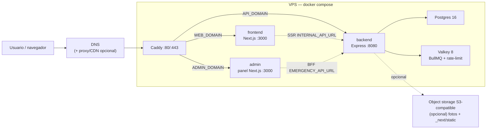

# Arquitectura actual

Este documento describe cómo funciona el sistema hoy. Es una plantilla: no
asume ningún país, evento u organización — la identidad de cada despliegue
(nombre, dominios, centro del mapa, contacto) vive en
`config/deployment.config.json` y en variables de entorno (`.env.example`),
nunca en código.

## Resumen

El proyecto es un monorepo con tres servicios de aplicación y una capa de
infraestructura compartida:

- `frontend/`: Next.js + React. Renderiza la UI, sirve assets y llama al
  backend por una URL absoluta (`NEXT_PUBLIC_API_URL`).
- `backend/`: Express + TypeScript. Sirve toda la superficie `/api`, valida
  entorno al arrancar, accede a Postgres con Drizzle y comparte imagen con el
  worker y el job de migraciones.
- `backend/worker/`: BullMQ sobre Valkey para sync de fuentes externas,
  geocode, deduplicación, federación de hub y backfills/migraciones.
  **No desplegado hoy** — ver [Workers y colas](#workers-y-colas).
- `admin/`: panel de administración como microservicio Next.js standalone
  (3er tier, RBAC con JWT en cookie httpOnly). Su BFF (`app/api/*`) reenvía al
  backend (`EMERGENCY_API_URL`).
  **Desplegado en Cloudflare Workers desde 2026-08-10**: `terremotocolombia-admin`
  sirve `admin.terremotocolombia.co` (staging: `terremotocolombia-admin-staging` /
  `admin-staging.terremotocolombia.co`), vía `@opennextjs/cloudflare` igual que
  el frontend (`admin/wrangler.jsonc`, sin secretos de runtime). Deploy: staging
  automático en `deploy-staging.yml`; producción automática en push a `main`
  con filtro `admin/**` (`deploy-admin.yml`; manual hasta 2026-08-11). Producción va detrás de **Cloudflare Access** (OTP por
  email + allowlist del equipo; bypass solo para `/api/health` por el smoke
  check) — ver `CLAUDE.md` → "Dónde corre esto de verdad". OJO: la pantalla "Importar pacientes" depende del worker
  de colas, que sigue SIN desplegar — en Workers los lotes se encolan y no se
  procesan; la carga de datos hospitalarios va por los CRUD directos.
- `infra/db/`: esquema Drizzle y migraciones SQL.
- **Producción hoy: Cloudflare Workers + Neon Postgres.**
  `docker-compose.prod.yml` + `Caddyfile.example` (VPS único con Caddy) es el
  camino **alternativo**, y el único donde funcionan colas y transacciones
  interactivas. Ver [Despliegue](#despliegue).

## Flujo de requests

Un único **Caddy** en el VPS termina TLS y enruta por hostname a los
contenedores; el navegador llama a la API por `NEXT_PUBLIC_API_URL`
(`https://${API_DOMAIN}`) y los server components por `INTERNAL_API_URL`
(`http://backend:8080`) dentro de la red del compose.

El frontend no accede directo a la base de datos. En cliente usa
`frontend/lib/api.ts`; en server components usa `frontend/lib/server-api.ts`.
Las fotos pueden venir como rutas relativas desde la API y se anclan al
backend con `mediaUrl()`.

## Frontend

- Next corre en modo `output: "standalone"` desde `frontend/`.
- `NEXT_PUBLIC_*` se inlinea en build; los cambios de esas variables requieren
  rebuild/redeploy del frontend.
- TanStack Query maneja cache, deduplicación y polling del cliente.
- Cloudflare Turnstile se monta con `useTurnstile()` en formularios públicos y
  entrega tokens de un solo uso al backend (opcional: sin `TURNSTILE_SECRET_KEY`
  se desactiva en desarrollo).
- `NEXT_PUBLIC_ASSET_PREFIX` puede apuntar a un CDN/object storage para
  `/_next/static` si despliegas más de una réplica del frontend.

### Mapa de rescate y modo offline

`/mapa-de-rescate` es una superficie pública map-first dentro del mismo
frontend. Reutiliza el shell, la navegación, los tokens de diseño y la
instalación existente de Leaflet/React Leaflet; no añade otro SDK de mapas ni
un backend obligatorio.

- El estado inicial se obtiene de dos JSON estáticos versionados en
  `frontend/public/data/incidents/`: el incidente y la activación Copernicus
  EMSR916. Los cuatro AOI se dibujan desde sus geometrías WKT. Esos polígonos
  indican áreas de producción cartográfica, no límites confirmados de daños.
- OpenStreetMap ofrece el contexto cartográfico y Esri World Imagery se usa
  exclusivamente como referencia visual con fecha de captura no verificada.
  La aplicación no almacena ni redistribuye tiles de terceros. Los modos
  Antes/Después solo se habilitarán cuando el JSON publique imagery fechada,
  licenciada y verificable.
- El manifest específico
  `frontend/public/mapa-de-rescate.webmanifest` abre directamente esta ruta
  en modo standalone. `frontend/public/sw.js` precarga el shell, los assets
  propios esenciales y los JSON operativos. Las respuestas de datos
  recuperadas sin red llevan una marca interna de antigüedad para que la UI
  muestre “Sin conexión” y la última actualización; nunca se presentan como
  actuales.
- IndexedDB conserva la última instantánea válida y paquetes offline
  explícitos por AOI; `localStorage` conserva el modo y el AOI seleccionado.
  El idioma lo gestiona el selector global del header, sin un segundo estado
  dentro del mapa. El presupuesto inicial es de 8 MB. Un
  paquete contiene solo geometrías y metadatos operativos propios; no contiene
  tiles, imágenes Copernicus, BLP, PII ni ubicaciones personales exactas.
  Las escrituras fallidas o sin cuota no dejan paquetes parciales.
- Sin tiles, el canvas mantiene el epicentro, los AOI y una base vectorial
  local ligera. Cuando una capa requiere red, la UI lo dice explícitamente.
  Al recuperar conexión se actualizan los JSON en segundo plano y se conservan
  el modo y el AOI seleccionado.

Los contratos públicos para futuras capas de necesidades verificadas y
disponibilidad agregada de recursos/voluntarios viven en
`frontend/lib/rescue-map.ts`. No contienen nombres, contacto ni ubicación en
tiempo real. No existen registros de demostración, despacho automático ni
algoritmo de asignación en esta fase. Una recomendación futura deberá ocurrir
en infraestructura autenticada, tratar el estado de verificación como
invariante y requerir revisión humana antes de cualquier despliegue.

## Backend API

- Express monta los routers en `backend/src/routes/` y delega lógica a
  `backend/src/services/`.
- `backend/src/config/env.ts` valida entorno de forma fail-fast.
- La API escucha en `:8080` y expone dos health checks: `/api/healthz`
  (liveness, sin I/O) y `/api/readyz` (readiness, chequea la DB con `select 1`
  y timeout corto → 503 si no responde).
- CORS usa allowlist (`CORS_ORIGINS`), porque el frontend y la API son
  dominios separados.
- Las mutaciones públicas combinan Zod, rate-limit y `requireHuman`
  (Cloudflare Turnstile, opcional). Las rutas admin legadas usan
  `ADMIN_PASSWORD`/headers existentes.

  > **Turnstile está DESACTIVADO en producción.** Se retiró
  > `TURNSTILE_SECRET_KEY` del Worker de la API porque el bundle del frontend
  > no llevaba la site key pública: el widget no se montaba, no había token, y
  > `requireHuman` rechazaba **todos** los reportes con 403. Hoy las escrituras
  > públicas solo dependen del WAF y el rate limit de Cloudflare. Ver
  > `SECURITY.md` para el orden exacto de reactivación.
- Lecturas polleadas usan cache en proceso y ETag cuando el contrato lo
  permite.
- `GET /api/reports` pagina el conjunto completo para que mapa y
  administración no pierdan reportes antiguos al superar 500 registros.
- APIs de terceros se consumen vía PROXY del backend (nunca desde el
  navegador), para controlar cache/contrato y no depender del CORS del
  tercero. Caso simple: `/api/geocode` proxea Nominatim (`services/geocode.ts`).
- **API keys (integraciones).** La superficie `api/public/*` se autentica con
  JWT (cookie/Bearer) O con una **API key** (`Authorization: Bearer
  mer_sk_…`). El middleware (`middleware/auth.ts`) detecta el prefijo, busca
  el hash SHA-256 en `api_keys` (índice único → O(1)), valida que no esté
  revocada/expirada y cuelga el mismo `req.user` que el JWT — así
  `requireCapability` no cambia. Las llaves son **self-service**: cualquier
  usuario invitado (capacidad `apikey:manage`, sembrada en todos los roles)
  crea/lista/revoca las suyas en el panel; el admin semilla puede revocar
  ajenas. Cada llave lleva **scopes** (subconjunto de capacidades): el
  permiso efectivo en cada request = `scopes ∩ capacidades vivas del usuario`
  — un techo least-privilege que aplica **incluso al admin semilla** (ver el
  corte en `auth/resolve.ts`). La llave cruda se muestra una sola vez; en DB
  solo va su hash + un prefijo no secreto. Revocar = soft-delete
  (`revokedAt`).
- **Insumos hospitalarios en `api/public/hospital-supplies`.** Superficie
  operativa para el panel admin: board de todos los hospitales con su
  snapshot RESTRINGIDO (semáforos con notas internas, necesidades,
  solicitudes de ayuda, POCs), escrituras de semáforo/necesidades/ayuda y
  bitácora (`hospital_supply_events`). Router a mano
  (`public-api/routers/hospital-supplies.router.ts`): el recurso es un
  agregado por hospital, no un CRUD plano. Reutiliza las capacidades
  `hospital:read` / `hospital:edit` del catálogo — a propósito NO introduce
  claves nuevas, porque el seed de capacidades solo corre en el job de
  migración (gateado a humanos). La validación de fondo es la misma de
  `services/hospitals` que usa la superficie pública de POCs; las mutaciones
  sellan `updatedBy` (email del admin) y `source: "admin_api"`, y NO espejan
  necesidades a ResponseGrid (eso pertenece al flujo del POC). El panel
  (`admin/app/hospital-supplies`) consume esto vía su BFF.

## Integraciones de terceros (flags `ENABLE_*`)

Toda integración externa opcional (directorio de acopio, federación de hub,
OCR de pacientes, fuente de sync de ejemplo) se activa con su propio flag en
`.env.example` — `ENABLE_RESPONSEGRID`, `ENABLE_HUB_FEDERATION`,
`ENABLE_PATIENT_OCR`, `ENABLE_EXAMPLE_SOURCE` — todas en `false` por defecto.
El template debe arrancar y funcionar completo sin ninguna integración
configurada; cada una degrada con gracia (endpoint 503, feature deshabilitada)
cuando falta su configuración. Ver [`docs/modules.md`](modules.md) para el
registro completo: qué hace cada módulo, su superficie de vendor/compliance,
sus variables requeridas, y el walkthrough del adaptador de ejemplo como
patrón para agregar una fuente de datos real.

### Módulos de integración (DDD/hexagonal)

Las integraciones con terceros viven como **bounded contexts** en
`backend/src/modules/<dominio>/`, con capas separadas y dependencias hacia
adentro (la infraestructura depende del dominio, no al revés):

- `domain/`: entidades + value objects + reglas puras y el **puerto**
  (interfaz) que define la fuente. Sin HTTP, sin red, sin `env`.
- `application/`: casos de uso que orquestan el dominio sobre el puerto.
- `infrastructure/`: adaptadores que implementan el puerto (cliente HTTP,
  mapper anti-corruption) y decoradores transversales (p.ej. cache).
- `interface/http/`: router + controlador + presenter (única capa que conoce
  Express). El `@swagger` vive aquí; `lib/swagger.ts` escanea `modules/**`.
- `<dominio>-module.ts`: composition root; el único sitio que lee `env` y
  cablea adaptador → puerto → caso de uso → router.

Primer módulo: **acopio** (`modules/acopio/`, siempre montado en
`/api/acopio`). Sirve una lista estática de centros oficiales del sismo
(`infrastructure/static/`) y, si `ENABLE_RESPONSEGRID=true`, fusiona el
directorio de ResponseGrid (`RESPONSEGRID_API_URL` /
`RESPONSEGRID_EMERGENCY_SLUG`). Añadir otra fuente = otro adaptador del mismo
puerto, cableado en el composition root; el dominio y la capa HTTP no cambian.
Las reglas ESLint de endpoints (`require-rate-limit`, guard de mutaciones)
también cubren `src/modules/**`.

Segundo módulo: **needs** (`modules/needs/`), lado de ESCRITURA: publica una
necesidad de insumos en ResponseGrid vía `POST /api/needs` (mutación pública
con Turnstile + rate-limit). La API devuelve `202` con un identificador
consultable en `GET /api/needs/status/{jobId}`. Un `202` solo confirma que
el job quedó en cola: el navegador no muestra éxito ni vacía el formulario
hasta que el estado llega a `completed`, y conserva los datos si llega a
`failed`. BullMQ expone su estado nativo. En Cloudflare Queues, productor,
consumidor y DLQ guardan en `audit_log` solo el job ID, estado, referencia
pública externa y motivo de fallo; nunca guardan el payload ciudadano. El
worker geocodifica la dirección con un puerto `Geocoder` (adaptador sobre
`services/geocode` → Nominatim) y delega en el puerto `NeedPublisher`, con
reintentos e idempotencia opcional mediante `Idempotency-Key`. La escritura
autentica con la **api-key** de service account (`x-api-key`,
`RESPONSEGRID_API_KEY`) y
envía un campo opcional **`author`** (contacto del solicitante, `verified:
false` fijado por el servidor) para atribuir la necesidad sin que la persona
se registre en ResponseGrid. Sin api-key, se cablea un publisher
deshabilitado y el endpoint responde 503. A diferencia del resto de routes,
este endpoint **no lleva bloque `@swagger`** a propósito: es un proxy de
escritura con credencial de servicio y no publicamos su contrato en
`/api/docs` como superficie de abuso (la protección efectiva sigue siendo
Turnstile + rate-limit).

## Datos y migraciones

- Postgres es la base de datos de producción, co-ubicada en el mismo VPS por
  defecto (servicio `db` de `docker-compose.prod.yml`) o externa si prefieres.
  **Hoy es externa: Neon**, y el Worker se conecta por su endpoint `-pooler`.
- **Las migraciones en producción son un paso MANUAL.** No hay gate automático
  como el del contenedor `migrate`: CI no las corre, y ningún despliegue las
  dispara. Se ejecutan a mano con `backend/worker/migrate.ts` y `DATABASE_URL`
  apuntando a Neon **directo** (no al `-pooler`). Un agente no las corre por
  iniciativa propia.
- Drizzle vive en `infra/db/schema.ts`; las migraciones versionadas viven en
  `infra/db/migrations/`.
- Las bajas de personas importadas crean una supresión por `legacy_id` y,
  cuando existe, por `(source, external_id)`. El sync externo consulta esas
  supresiones para que una eliminación administrativa sea permanente; las
  fotos propias se eliminan del object storage antes de borrar la fila.
- El servicio `migrate` de `docker-compose.prod.yml` usa la imagen backend y
  corre antes de que arranquen `backend`/`worker`. Si falla, la app no rota.
- Las migraciones deben ser expand-contract si vas a hacer rollouts sin
  downtime (contenedores viejos siguen sirviendo mientras el nuevo arranca
  contra el esquema actualizado).
- **Réplica pública (hub SQL, opcional, `ENABLE_HUB_FEDERATION`).** Un
  segundo Postgres de solo lectura puede recibir por **replicación lógica**
  solo las tablas/columnas publicables (sin PII directa de secretos/
  auditoría/federación) y exponer SQL crudo de solo lectura por TCP con TLS,
  para que otro despliegue hermano del mismo template pueda leer datos
  agregados. El acceso lo emite el backend: un **super admin**
  (`mirror:manage`, gateada por `users.is_super_admin`) crea un rol Postgres
  por consumidor. Si el hub cae, el primario no se afecta
  (`max_slot_wal_keep_size` acota el WAL). Esta réplica es independiente de la
  automatización de firewall específica de un proveedor cloud, que queda
  fuera de esta plantilla (ver "Fuera de esta plantilla" más abajo).

## Workers y colas

> **ESTADO EN PRODUCCIÓN: el worker BullMQ NO está desplegado; los jobs se
> están portando a Cloudflare** (plan `docs/plans/2026-08-10-002-…`, estado
> por unidad en `docs/runbook-fase0.md`). Esta sección describe el camino
> docker-compose, que sigue siendo válido (R5). Situación por superficie:
>
> | Superficie | Estado en Workers |
> | --- | --- |
> | `GET /api/earthquakes` | **sync vivo** por Cron Trigger (`*/5`) |
> | Geocodificación pendiente | **viva** por Cron Trigger (`2-59/5`) |
> | `POST /api/needs` (publicación) | **viva**: Cloudflare Queue + consumidor `queue` en `src/worker.ts`; DLQ persistido en `audit_log` (`queue.dead_letter`) |
> | Sync de fuentes (personas) | pendiente (U5; sin fuentes `ENABLE_*` habilitadas no hay nada que sincronizar) |
> | Importación de pacientes | **viva**: cola `terremotocolombia-imports` + consumidor en el mismo Worker. Las transacciones interactivas se reescribieron como máquina de estados idempotente (claim condicional por fila + id de paciente determinista → reanudable sin duplicar); archivos CSV/XLSX se materializan ANTES de encolar (límite 128 KB/mensaje). Un lote agotado queda `failed` y su carta muerta va a `audit_log` |
> | Federación de hub | no corre (flag apagado) |
>
> El rate-limit distribuido también cae a su modo degradado (en memoria, por
> isolate) porque no hay `VALKEY_URL`.

- Valkey respalda BullMQ y el rate-limit distribuido.
- El servicio `migrate` de `docker-compose.prod.yml` usa la misma imagen
  backend con otro `command`.
- Los schedulers de sync/hub están gateados por sus flags
  (`ENABLE_EXAMPLE_SOURCE`, `ENABLE_HUB_FEDERATION`) además de
  `SYNC_SCHEDULERS`/`HUB_SCHEDULERS`; ambos apagados por defecto.
- El worker sigue disponible para jobs manuales como migración de fotos a
  object storage y trabajos encolados explícitamente.
- La cola `patient-imports` procesa la importación autenticada de pacientes
  hospitalarios (solo si `ENABLE_PATIENT_OCR` o el flujo manual de importación
  están en uso): la API `POST /api/public/patient-imports` (capacidad
  `patient:import`) guarda el lote en staging (`patient_imports` +
  `patient_import_rows`) y encola; el worker normaliza, valida y deduplica
  las filas, y `POST .../{id}/apply` encola la escritura idempotente en
  `hospital_patients` (solo filas válidas y únicas). El dato crudo y los
  campos sensibles (documento, notas, contacto) viven en staging restringido
  y no se exponen en las respuestas públicas. La deduplicación por hash de
  documento es global entre hospitales. Los refugios comparten este modelo
  con `hospitals.facility_type = refugio` y sus personas usan
  `hospital_patients.status = sheltered`. La entrada OCR/ICR por imagen se
  habilita solo si existe un proveedor de visión (VL) configurado; materializa
  filas en staging como `needs_review` y nunca auto-aplica. Sin proveedor
  responde 501; PDF (y cualquier formato sin ruta de procesamiento) responde
  **415** con mensaje en español — la aceptación de content-types tiene una
  única fuente de verdad (`isSupportedImportContentType`). Las filas
  `needs_review` se resuelven en el panel (editar/confirmar/rechazar/decidir
  dedup, ver capa de identidad abajo) y cada corrección humana de una fila
  OCR queda registrada en `ocr_corrections` (log inmutable, id determinista —
  el activo de aprendizaje de la fase 3).
- **Sismos** (`earthquakes.queue.ts`): el worker poll-ea un feed público de
  sismos (por defecto el feed realtime del USGS, global) cada
  `EARTHQUAKES_EVERY_MS` (default 60s), filtra al bounding box configurado
  (`EARTHQUAKES_MIN_LAT`/`MAX_LAT`/`MIN_LNG`/`MAX_LNG`, sin recortar por
  defecto) y hace upsert por id de evento en la tabla `earthquakes`. Al
  arrancar, si la tabla está vacía, encola un backfill puntual (últimos
  `EARTHQUAKES_BACKFILL_DAYS` días, una sola llamada). Este scheduler
  **siempre corre** (no va bajo `SYNC_SCHEDULERS`): es dato público y barato.
  El backfill de arranque es idempotente (solo si la tabla está vacía), así
  que el primer deploy siembra solo. La superficie pública es `GET
  /api/earthquakes` (read-only, anónima, cacheada con ETag).

## Capa de identidad (Family Search)

Plan `docs/plans/2026-08-11-001-…` (fases 0-1 del doc de requisitos
`docs/family-search-admin-requirements.md`). Un overlay ADITIVO sobre las
poblaciones existentes — las tablas fuente no cambian su camino de escritura.

- **PRN** (`person_records`): cada registro con forma de persona
  (`missing_persons`, `hospital_patients`, `unidentified_persons`) recibe un
  identificador estable y comunicable por teléfono (`TC-` + 8 Crockford
  base32 + carácter de control; codec puro en `lib/prn.ts`). Estampado
  best-effort al crear + cron de reconciliación `4-59/5 * * * *`
  (`reconcilePersonRecords`) que además ejecuta los chequeos de invariantes
  de clusters y el escaneo de PII en notas. El backfill de lo preexistente
  son las primeras corridas del mismo cron.
- **Matcher determinista** (cola `terremotocolombia-matcher` + DLQ →
  `audit_log`): propone `person_links` por hash de documento exacto
  (cross-población) y nombre+edad exactos normalizados. Solo tokens de
  resultado en `evidence` (jamás valores crudos). NUNCA toca links
  confirmados; los rechazados solo se re-proponen con clase de evidencia
  estrictamente más fuerte (banner "rechazado antes").
- **Decisiones y clusters** (`person-links.ts` / `person-clusters.ts`): tres
  acciones (confirmar / no es la misma persona / no estoy seguro+nota),
  decisiones append-only con snapshot de evidencia y atribución obligatoria.
  Los clusters son componentes conexos sobre links CONFIRMADOS; la membresía
  se converge con `recomputeClusterFor` (claim por índice parcial único,
  desalojo más allá de la semilla, verify-after-write) — sin
  `db.transaction()`. Fusión de clusters anclados = acción escalada
  (`person:merge`) con re-chequeo post-claim (TOCTOU). Unmerge de primera
  clase. El borrado de un registro fuente (rutas de delete existentes)
  tombstonea PRN/links/membresía con recompute por CADA vecino previo
  (un vértice de corte puede partir el componente en varios fragmentos).
- **Señal, no verdad** (`record_status_signals`): una transición de `status`
  llegada por upsert externo (socio partner-sync o feed) NO pisa el status
  local — queda pendiente hasta que un revisor la confirma o descarta.
  Idempotencia DB-enforced (índice parcial único por claim pendiente).
- **Panel** (`admin/src/contexts/family-search/`): cola de revisión
  keyboard-first (1/2/3 + Enter) con tarjetas lado-a-lado y desglose de
  evidencia, ficha de cluster con historial y attach manual, panel de
  señales con badge de pendientes en el nav. Capacidades: `person:search`
  (leer), `person:review` (decidir links/filas/señales), `person:merge`
  (fusiones ancladas, unmerge). Inertes hasta que un humano corra
  `seedAuth()` (job de migración) desde un checkout que incluya el catálogo.
- **Despliegue**: migraciones `0003`/`0004` (solo aditivas) son paso humano
  aparte; `wrangler queues create terremotocolombia-matcher` (+`-dlq`) debe
  preceder al deploy que declara el consumidor; runbook completo en el plan.

## Despliegue

> **Hay dos topologías soportadas y hoy corre la B.** No asumas la A al leer el
> resto de este documento: varias secciones (colas, transacciones, Caddy) solo
> aplican a la A.

### B. Cloudflare Workers — *lo que sirve terremotocolombia.co ahora*

| Pieza | Worker | Config |
| --- | --- | --- |
| Frontend | `terremotocolombia-web` | `frontend/wrangler.jsonc`, `frontend/open-next.config.ts` |
| API | `terremotocolombia-api` | `backend/wrangler.jsonc`, `backend/src/worker.ts` |

- El frontend se adapta con `@opennextjs/cloudflare`.
- La API **no se reescribió**: `backend/src/worker.ts` envuelve la misma app de
  Express con `httpServerHandler` de `cloudflare:node`.
- Base de datos: **Neon Postgres** (externo), por su endpoint `-pooler`. En
  Workers el driver es el HTTP de Neon, porque un socket TCP pertenece a la
  petición que lo abrió y un pool con estado no sobrevive entre peticiones.
- **Consecuencia:** sin transacciones interactivas (los 8 `db.transaction` de
  `services/roles.ts` y `services/patient-imports/*` fallan aquí), sin colas
  BullMQ/Valkey y sin `admin/` desplegado.
- Despliegue: `deploy-frontend.yml` y `deploy-admin.yml` son automáticos en push
  a `main` con filtro de rutas. **`deploy-backend.yml` es manual** (solo
  `workflow_dispatch`, desde la tarde del 2026-08-11): la API no sale con el
  merge, sale cuando un humano lanza el workflow, y antes pasa por un gate de
  deriva de esquema que falla cerrado. En staging (`deploy-staging.yml`) el
  backend sí es automático. Las migraciones **no** las corre CI ni ningún
  deploy.
- La zona de Cloudflare (DNS, anti-suplantación, TLS, WAF, cache, rate limit) se
  gestiona con un módulo de OpenTofu **fuera de este repo**.

### A. Un único VPS con docker compose + Caddy

Camino alternativo y **más completo**: es el único donde funcionan las colas, las
transacciones interactivas y el panel `admin/`. Runbook paso a paso (provisión,
hardening, DNS, TLS, smoke checks, backups, actualización y rollback):
[`docs/deploy-vps.md`](deploy-vps.md). Sigue siendo la vía cómoda en local,
porque levanta Postgres y Valkey por ti.

- El stack lo define `docker-compose.prod.yml` detrás de `Caddyfile.example`
  (un único Caddy que reverse-proxea a `frontend:3000`, `backend:8080`,
  `admin:3000` por hostname, leyendo `WEB_DOMAIN`/`API_DOMAIN`/`ADMIN_DOMAIN`/
  `ACME_EMAIL` del entorno vía placeholders `{$VAR}`).
- Postgres y Valkey van co-ubicados en el mismo VPS por defecto (servicios
  `db`/`valkey`); las migraciones corren como el contenedor `migrate`
  one-off, gateado antes de que arranquen `backend`/`worker`.
- Un object storage compatible con S3 (p.ej. Cloudflare R2) es opcional para
  fotos y, con `NEXT_PUBLIC_ASSET_PREFIX`, los assets estáticos de Next.
- Cómo desplegar (push-to-deploy, CI/CD, un script manual sobre SSH) queda a
  criterio de quien opere el despliegue; esta plantilla no incluye un
  workflow de CI/CD por defecto.

### Fuera de esta plantilla (futuro trabajo)

Un modelo de orquestación multi-nodo (Kubernetes/k3s + OpenTofu/Terraform)
con Load Balancers separados por servicio, autoscaling y una nube específica
(p.ej. Hetzner Cloud) es un camino alterno razonable para despliegues de
mayor escala, pero no forma parte de esta plantilla. Si lo necesitas:

- Recupera el modelo de tres Deployments (`web`, `api`, `admin`) con su
  Service/LoadBalancer y HPA, reutilizando la imagen backend para worker y el
  job de migraciones — el mismo patrón que ya describe este documento para
  docker compose se traslada 1:1 a manifiestos de Kubernetes.
  Los Ingress/servicios que hoy resuelve `Caddyfile.example` por hostname
  pasarían a Ingress rules, y las credenciales de proveedor cloud (API
  tokens, kubeconfig) irían en el gestor de secretos de tu CI, no en
  `.env.example`.
- La automatización de firewall por API de un proveedor cloud específico
  (para abrir/cerrar acceso de un consumidor a la réplica del hub) es
  opcional y también queda fuera de esta plantilla; sin ella, la réplica del
  hub simplemente no gestiona firewall automáticamente.

## Al cambiar arquitectura

Cada cambio que modifique esta forma del sistema debe actualizar:

- `docs/architecture.md` para reflejar el estado nuevo.
- `AGENTS.md` cuando cambien reglas que los agentes deben seguir.
- `.env.example` si cambia el contrato de entorno (grupo correcto, marca
  `[REQ]`/`[OPT]`, placeholder obviamente falso).
- `docker-compose.yml` / `docker-compose.prod.yml` / `Caddyfile.example` si
  cambia un servicio, puerto o dominio.
