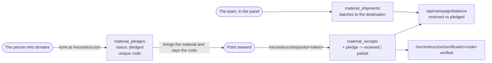

# Reconstruction campaign

The campaign collects construction material at points in several cities and
sends it to Chocó. This document gives the full flow, what the site promises
to the public, and which steps a human must do by hand.

## The flow, end to end



There are three figures, and only one counts as truth:

| Figure | What it means | Source |
| --- | --- | --- |
| **Received** | Material that a team member saw and confirmed | `material_receipts` |
| **Pledged** | A promise. It can fail to arrive | `material_pledges` with status `pledged` |
| **In transit** | It left the point, on its way to the destination | `material_shipments` |

The landing page shows the three figures separately. It never adds them
together. To add them makes a promise into a fact. On the day that one half
does not arrive, the public figure becomes a lie.

## What each part does

| Route | Who enters | Purpose |
| --- | --- | --- |
| `/reconstruccion` | anyone | See the points and the balance, pledge a donation |
| `/reconstruccion/certificado/<code>` | the person who has the code | See and verify the certificate (`noindex`) |
| `/reconstruccion/punto/<token>` | the steward of a point | Confirm deliveries (`noindex`) |
| `/construccion` | anyone | Permanent redirect to `/reconstruccion` |
| Panel → Campaign | the team, with the `campaign` capability | Points, stewards, pledges and batches |

## Certificate

The code comes from `pledge-code.ts`. It has ten characters, from an alphabet
without `0/O` and without `1/I/L`. People say this code on the telephone, and
read it from a photograph made against the light in a warehouse.

A certificate starts as **pending**. It becomes **verified** only when a
person at the point confirms the delivery. A certificate that said "verified"
at the moment a person fills in a form has no value: anyone can write that
they will bring one hundred bags of cement.

## Point steward

Create a steward in the panel (Campaign → Point stewards). The system gives
the token **one time only**, in an amber box. The database keeps only its
hash, thus you cannot read the token again. Send it through a private
channel. The link is `/reconstruccion/punto/<token>`.

The token always goes in the `x-campaign-steward-token` header, never in the
query string, thus it does not go into the edge logs.

To remove a person: delete their steward in the panel. The link stops to work
at the next request.

## Before the first deployment

1. **Apply migration `0010`** against Neon **direct** (not `-pooler`), as its
   own step, before the backend deployment. It makes five new tables and
   changes no existing table. Without it, all of `/api/campaign/*` answers
   `503`, and the remainder of the site continues to operate.
2. **Deploy the backend by hand** (`deploy-backend.yml`). The schema-drift
   gate passes when the migration is applied.
3. **Grant the `campaign` capability** to the role that operates the campaign.
4. **Make the points** in the panel, each with its hours and public contact.
   Without points, the landing page shows the form but does not tell people
   where to deliver.
5. **Make one steward per point** and send each link.

No deployment does these steps for you, and an agent does not do them on its
own initiative (see `CLAUDE.md`).

## Personal data

- The donor contact (`donor_contact`) is private. It goes to no public
  endpoint, only to the panel.
- The donor wall is **explicit opt-in**. If the box is not ticked, the system
  keeps no alias, thus there is nothing to publish, not even by accident. Only
  a person with a confirmed delivery appears there.
- A suppression request (Law 1581) **anonymizes** the pledge: it removes the
  name, the contact and the alias, and keeps the material and the date. It
  does not delete the row, because that material is already counted in a
  public figure and supported by a certificate
  (`services/campaign/anonymize.ts`).
- If the pledge write fails, the system captures it in `failed_submissions`
  before it answers `503`. Drain that table by hand — see `AGENTS.md`.

## Files

```text
infra/db/schema-campaign.ts        The five tables
infra/db/migrations/0010_*.sql     Migration (additive)
backend/src/lib/campaign-materials.ts   Material catalog
backend/src/services/campaign/     Services (public, steward and panel)
backend/src/routes/campaign*.ts    Public and steward routes
backend/src/public-api/resources/campaign-*.resource.ts   Panel CRUD
frontend/app/(content)/reconstruccion/   Landing, certificate and point
frontend/components/features/campaign/   Campaign components
admin/src/contexts/models/registry/campaign-models.ts   Panel registration
```
