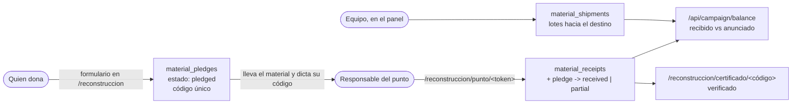

# Campaña de reconstrucción

Recolección de material de construcción en puntos de varias ciudades, para
enviarlo después al Chocó. Este documento explica el flujo completo, qué
promete la web al público y qué hay que hacer a mano para operarlo.

## El flujo, de punta a punta



Tres estados y solo uno cuenta como verdad:

| Cifra | Qué significa | De dónde sale |
| --- | --- | --- |
| **Recibido** | Material que una persona del equipo tuvo delante y confirmó | `material_receipts` |
| **Anunciado** | Una promesa. Puede no llegar | `material_pledges` en estado `pledged` |
| **En camino** | Ya salió del punto hacia el destino | `material_shipments` |

La landing muestra las tres por separado y nunca las suma. Sumarlas
convertiría una promesa en un hecho, y el día que la mitad no llegue, la
cifra pública sería mentira.

## Qué hace cada parte

| Ruta | Quién entra | Para qué |
| --- | --- | --- |
| `/reconstruccion` | cualquiera | Ver puntos, ver el balance, anunciar una donación |
| `/reconstruccion/certificado/<código>` | quien tenga el código | Ver y verificar su certificado (`noindex`) |
| `/reconstruccion/punto/<token>` | responsable de un punto | Confirmar entregas (`noindex`) |
| `/construccion` | cualquiera | Redirección permanente a `/reconstruccion` |
| Panel → Campaña | equipo con la capacidad `campaign` | Puntos, responsables, compromisos y lotes |

## Certificado

El código sale de `pledge-code.ts`: diez caracteres de un alfabeto sin
`0/O` ni `1/I/L`, porque la gente lo dicta por teléfono y lo lee de una foto
tomada a contraluz en una bodega.

El certificado nace **pendiente**. Solo pasa a **verificado** cuando alguien
del punto confirma la entrega. Un certificado que dijera "verificado" en el
momento de rellenar un formulario no valdría nada: cualquiera puede escribir
que va a llevar cien sacos de cemento.

## Responsable de punto

El alta se hace desde el panel (Campaña → Responsables de punto). El sistema
devuelve el token **una sola vez**, en un recuadro ámbar: la base guarda solo
su hash, así que no se puede volver a consultar. Se envía por un canal
privado, y el enlace es `/reconstruccion/punto/<token>`.

El token viaja siempre por la cabecera `x-campaign-steward-token`, nunca en
la query string, para que no acabe en los logs del borde.

Para dar de baja a alguien: eliminar su responsable en el panel. El enlace
deja de funcionar en la siguiente petición.

## Antes del primer despliegue

1. **Aplicar la migración `0010`** contra Neon **direct** (no `-pooler`),
   como paso propio y anterior al despliegue del backend. Crea cinco tablas
   nuevas y no toca ninguna existente. Sin ella, todo `/api/campaign/*`
   responde `503`, y el resto del sitio sigue funcionando igual.
2. **Desplegar el backend a mano** (`deploy-backend.yml`). La verificación de
   deriva de esquema pasa sola una vez aplicada la migración.
3. **Dar la capacidad `campaign`** al rol que vaya a operar la campaña.
4. **Crear los puntos** en el panel, con horario y contacto público. Sin
   puntos, la landing enseña el formulario pero no dice dónde entregar.
5. **Crear un responsable por punto** y repartir sus enlaces.

Nada de esto lo hace un despliegue por sí solo, y ninguno de estos pasos lo
ejecuta un agente por iniciativa propia (ver `CLAUDE.md`).

## Datos personales

- El contacto de quien dona (`donor_contact`) es privado: no sale en ningún
  endpoint público, solo en el panel.
- El muro de donantes es **opt-in explícito**. Sin la casilla marcada no se
  guarda alias, así que no hay nada que publicar ni por accidente. Y solo
  aparece quien ya tiene la entrega confirmada.
- Una solicitud de supresión (Ley 1581) **anonimiza** el compromiso: quita
  nombre, contacto y alias, y deja el material y la fecha. No lo borra,
  porque ese material ya está contado en una cifra pública y respaldado por
  un certificado (`services/campaign/anonymize.ts`).
- Si la escritura del compromiso falla, se captura en `failed_submissions`
  antes de devolver el `503`. Esa tabla hay que drenarla a mano — ver
  `AGENTS.md`.

## Ficheros

```text
infra/db/schema-campaign.ts        Las cinco tablas
infra/db/migrations/0010_*.sql     Migración (aditiva)
backend/src/lib/campaign-materials.ts   Catálogo de materiales
backend/src/services/campaign/     Servicios (público, responsable y panel)
backend/src/routes/campaign*.ts    Rutas públicas y del responsable
backend/src/public-api/resources/campaign-*.resource.ts   CRUD del panel
frontend/app/(content)/reconstruccion/   Landing, certificado y punto
frontend/components/features/campaign/   Componentes de la campaña
admin/src/contexts/models/registry/campaign-models.ts   Alta en el panel
```
