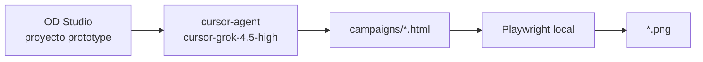

# Visuales — Terremoto Colombia

Dos caminos válidos:

| Camino | Cuándo usar |
|--------|-------------|
| **MiniMax `image-01`** | Imágenes IA directas vía `od media generate` (configurado en OD Media) |
| **Grok vía Cursor** | HTML/CSS con `cursor-grok-4.5-high` → export Playwright → PNG |

---

## MiniMax image-01 (configurado)

**Proyecto OD:** prototype `1c882bcf-4a86-4840-8312-b0fef742381a`  
**Modelo:** `minimax-image-01` · **API key:** Settings → Media → MiniMax (o `MINIMAX_API_KEY`)

```bash
export PATH="$HOME/.nvm/versions/node/v24.19.0/bin:$PATH"
cd ~/open-design

corepack pnpm exec od media generate \
  --project 1c882bcf-4a86-4840-8312-b0fef742381a \
  --surface image \
  --model minimax-image-01 \
  --aspect 16:9 \
  --output post-ancla-minimax.jpg \
  --prompt "Escalera de utilidad cívica Terremoto Colombia, Mallanet #4080f2 / #0f2154, 4 pasos en español, terremotocolombia.co"
```

**Test exitoso (2026-08-10):** `minimax-test-terremoto.jpg` — 1280×720, ~255 KB, en el proyecto OD prototype.

**Video:** `minimax-video-01` requiere plan Max/Ultra de MiniMax Token Plan.

---

## Grok vía Cursor (HTML → PNG)


| Paso | Qué | Dónde |
|------|-----|-------|
| 1 | Agente | `cursor-agent` |
| 2 | Modelo | `cursor-grok-4.5-high` |
| 3 | Proyecto OD | **prototype** `1c882bcf-4a86-4840-8312-b0fef742381a` |
| 4 | Salida | HTML en `campaigns/*.html` (frame `#export-target`) |
| 5 | Export | Playwright local → PNG |



## Proyectos que NO usar

| Proyecto | Tipo | Por qué evitarlo |
|----------|------|------------------|
| `c31e59b9-…` | image | Inyecta `od media generate` → requiere API xAI |
| `75d872c6-…` | video | Igual — media dispatcher externo |

## Autenticación Cursor

```bash
cursor-agent login
cursor-agent status   # debe mostrar tu cuenta
```

En OD: Settings → Agent → **Cursor Agent** → modelo **cursor-grok-4.5-high**.

## Pedir una visual al agente

En el proyecto prototype Terremoto (carpeta vinculada `terremotocolombia`):

> Crea o actualiza `campaigns/<nombre>.html` siguiendo `DESIGN.md`. Frame exportable 16:9 con `#export-target`, paleta Mallanet, sin cifras inventadas, crédito solo Mallanet.org. **No llames `od media generate`.**

## Exportar HTML → PNG

Desde `open-design/e2e` (requiere `pnpm install` una vez):

```bash
export PATH="$HOME/.nvm/versions/node/v24.19.0/bin:$PATH"
cd /home/jseramn/open-design/e2e

node --input-type=module -e "
import { chromium } from '@playwright/test';
const html = '/home/jseramn/terremotocolombia/docs/campaigns/post-ancla-escalera-utilidad.html';
const png  = '/home/jseramn/terremotocolombia/docs/campaigns/post-ancla-escalera-utilidad.png';
const b = await chromium.launch({ headless: true });
const p = await b.newPage({ viewport: { width: 1920, height: 1080 } });
await p.goto('file://' + html, { waitUntil: 'networkidle' });
await p.locator('#export-target').screenshot({ path: png, type: 'png' });
await b.close();
console.log('Exported', png);
"
```

O con el script del repo (ejecutar desde `open-design/e2e`):

```bash
node ../../terremotocolombia/scripts/export-campaign-frame.mjs \
  /home/jseramn/terremotocolombia/docs/campaigns/<archivo>.html \
  /home/jseramn/terremotocolombia/docs/campaigns/<archivo>.png
```

## Assets ya generados

| Archivo | Uso |
|---------|-----|
| `post-ancla-escalera-utilidad.html` | Fuente editable |
| `post-ancla-escalera-utilidad.png` | Backup tipográfico limpio (1920×1080) |
| `post-ancla-escalera-utilidad-minimax.jpg` | **Ancla A2 preferida** — MiniMax `minimax-image-01` 16:9 (1280×720); metáfora sin tipografía IA |
| `visual-kit.html` | 9 cards exportables (alternativa) |

## Publicar Ola 0

Ver [`posts-ola-0-listos.md`](./posts-ola-0-listos.md) y [`launch-now.html`](./launch-now.html).
