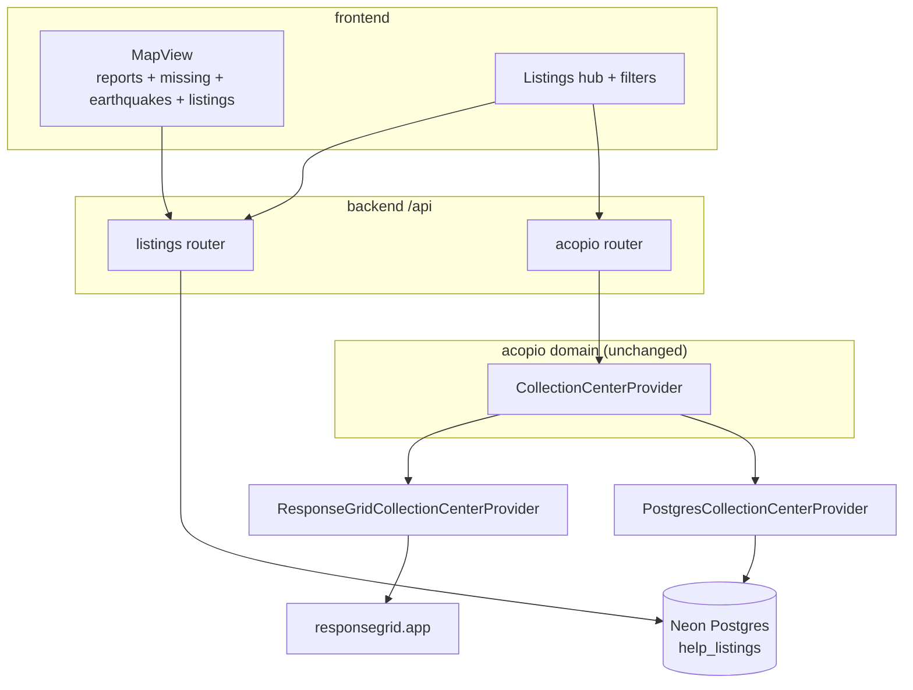
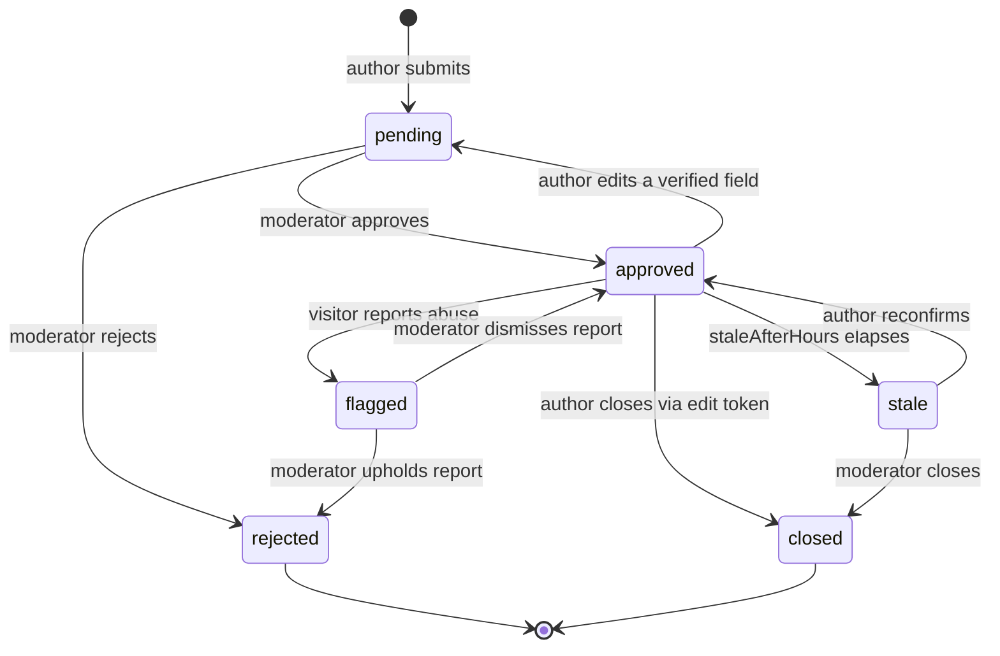
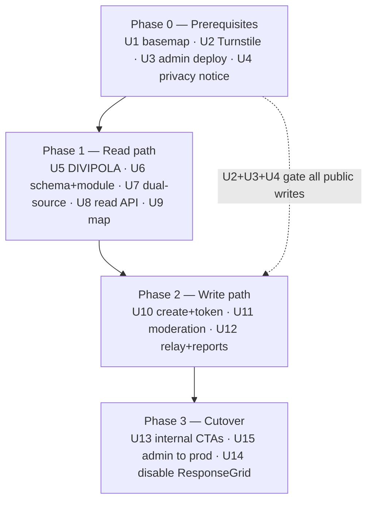

# First-Party Listings Marketplace - Plan

## Goal Capsule

**Objective.** Move the offer-help / request-help marketplace from ResponseGrid (`responsegrid.app`) into our own Postgres, rendered on our own map, moderated by our own staff — without taking the live site down and without shipping a public write path that we cannot legally or operationally support.

**Authority hierarchy.** `AGENTS.md` governs code conventions. `CLAUDE.md` governs deploy and ops. This plan governs sequencing and the decisions listed under Key Technical Decisions. Where this plan and `AGENTS.md` disagree on a code convention, `AGENTS.md` wins.

**Execution profile.** Land on a work branch, PR into `staging`, verify on staging.terremotocolombia.co against the Neon `staging` branch, then PR `staging` → `main`. Never push this work directly to `main`.

**Stop conditions.** Stop and get a human for: running migrations, deploying the backend to production, touching Doppler or Cloudflare tokens, publishing the privacy notice, and the final `ENABLE_RESPONSEGRID=false` flip in production.

**Tail ownership.** The implementing agent owns through "verified on staging." A maintainer owns the production cutover.

---

## Product Contract

### Summary

Terremotocolombia.co stops linking users out to ResponseGrid and hosts the mutual-aid marketplace itself: a moderated `help_listings` model with geomasked locations, rendered on the existing citizen map, with author self-service via a per-listing edit token and contact brokered through a server-side relay. ResponseGrid stays enabled as a second collection-center source throughout; it is switched off last.

### Problem Frame

Everything a person can *do* on terremotocolombia.co today — donate material, post a request, volunteer, register a collection point, offer transport — is an outbound link to `responsegrid.app`. Six action cards in `frontend/components/features/responsegrid/ResponseGridHub.tsx` are all `external: true`. A person in crisis reaches our site, and at the moment they try to act, they are handed to a third party on a different domain. In return we get one read-only feed: collection centers, paged out of `/emergencies/{id}/public/resources` and drawn as flat pins.

The sibling deployment `mallanet/venezuelateayuda` answered the same problem by owning the model — listings, profiles, conversations, reports, moderation — and it worked. But it is a different stack (Prisma, monolithic Next API routes, shadcn/radix), so this is a port of the *model and the UX*, not of the code.

Two things make this harder here than it was there. First, the write path is gated on infrastructure that does not currently run: the admin panel is built in CI but deployed nowhere, and Turnstile is disabled, so public writes have no proof-of-humanity. Second, collecting name, contact, and location from disaster-affected people in Colombia triggers obligations under Ley 1581 de 2012 that the deployment cannot presently discharge — there is no operational channel to action a deletion request.

### Requirements

**Marketplace model**

- R1. A listing records its type (offering or needing), category, title, description, quantity with unit, modality (in person or online), department, municipality, and location.
- R2. A listing carries a moderation status and is invisible to the public until a moderator approves it.
- R3. An author can edit and close their own listing without holding an account.
- R4. A listing declares a service radius that is shown on the map as the author's area of action.
- R5. Listings become stale after a configurable interval and are flagged to moderators rather than auto-hidden.

**Privacy and safety**

- R6. The public API never exposes a listing's true coordinates. Only the geomasked coordinates are served.
- R7. A listing's masked coordinates are a deterministic function of its true coordinates. The same true point always yields the same masked point, so no sequence of writes, edits, or reads emits an averageable sample set.
- R8. A listing author's contact details are never published. Contact is brokered server-side.
- R9. Any visitor can report a listing or an author for abuse.
- R10. A reported listing stays visible but is flagged and deprioritized until a moderator acts.
- R11. Public listing creation, contact relay, and abuse reporting each require a passing bot check.
- R23. No mutation response body contains masked or true coordinates. Only the read path serves location.
- R24. A person whose contact details were used without their consent can have the listing removed through a staff channel that does not require the edit token.
- R25. The contact relay enforces a hard per-listing daily send cap, counted in Postgres, independent of the request rate limiter.
- R26. Audit metadata for listing actions carries identifiers and status transitions only — never coordinates or contact details.

**Compliance**

- R12. A published *política de tratamiento de datos* and *aviso de privacidad* covers the data this feature collects, before public writes are enabled.
- R13. A data subject can exercise access, rectification, and deletion rights through a channel that a staff member can actually service.
- R14. Categories that may carry health information collect an explicit acknowledgement that the data is sensitive and optional, distinct from general terms acceptance.
- R27. A deletion request resolves to specific rows. `dataDeletionRequests` links to the listing it concerns rather than describing it in free text.
- R28. Closed and rejected listings have a documented retention period after which their true coordinates and contact details are erased.

**Map and geo**

- R15. Approved listings render on the main citizen map alongside incident reports and missing-persons markers.
- R16. A visitor can filter listings by type, category, department, free text, and proximity to their own location.
- R17. The map's basemap is served under terms that permit production traffic for this site.
- R18. Every municipality and department in Colombia resolves to reference coordinates, so a listing has a location even when the author does not adjust the pin.

**Migration**

- R19. Collection centers are served from our own database and from ResponseGrid simultaneously during the transition, through one provider interface.
- R20. The source of each collection center is visually distinguishable on the map while both sources are live.
- R21. Turning ResponseGrid off is a configuration change, not a code change.
- R22. Every moderation action records which staff member performed it.

### Scope Boundaries

**Deferred for later**

- Threaded 1:1 chat between users. `backend/src/services/chat.ts` is a single public room with self-asserted display names — it is not a foundation for private conversations. R8 is satisfied by the relay instead.
- Public user accounts, profiles, and avatars.
- Importing ResponseGrid's existing records into our database.
- PostGIS adoption and viewport-driven tile-based loading.
- Self-hosted basemap tiles.
- Automated fraud or spam scoring on listing text.
- Trust tiers that let verified organizations skip review.

**Outside this deployment's identity**

- Replacing the missing-persons registry, hospital directory, or seismic layers. This plan adds a surface beside them; it does not touch their behavior.
- An i18n framework. Copy stays Spanish JSX strings, per `README.md`.

### Open Questions

- OQ1. **Blocking for launch.** Does Mallanet.org already publish a *política de tratamiento de datos*, and who is the designated contact for habeas data requests? U4 cannot complete without this, and R12/R13 gate public writes.
- OQ2. **Blocking for launch.** Which basemap provider will the org commit to, and under what terms? CARTO is free only for non-commercial use and directs commercial or high-traffic users to an Enterprise license or a nonprofit grant conversation. U1 needs a chosen provider.
- OQ3. **Deferred.** Do Mallanet.org's total assets exceed 100,000 UVT? Below that threshold, RNBD registration does not attach (Decreto 1074 de 2015). Research indicates this is very unlikely to bind, so it does not gate launch.
- OQ4. **Deferred.** Should listing categories eventually be reconciled with `NEED_CATEGORIES`? KTD10 accepts the drift for now and documents the mapping.
- OQ5. **Blocking for Phase 3.** How does a Doppler config edit actually reach the running Cloudflare Worker? No workflow in this repo runs `wrangler secret bulk` or `wrangler secret put`, and `backend/wrangler.jsonc` points at a `docs/cloudflare-cutover.md` that does not exist here. R21 and U14 both assume flipping a flag is a solved, repeatable step. Confirm the real procedure with the maintainer who manages Worker secrets, exercise it on staging, and document it before treating the cutover as low-risk.
- OQ6. **Deferred, decide before U6 lands.** What is the retention period for closed and rejected listings (R28), and does a deletion request anonymize the row in place or remove it? Anonymizing keeps moderation counts and the lifecycle coherent; removing is simpler. The schema differs between the two, so this is cheaper to settle now than to retrofit.

---

## Planning Contract

### Key Technical Decisions

- KTD1. **Own the marketplace behind the existing ports; ResponseGrid becomes one provider of two.** (session-settled: user-directed — chosen over a hard cutover: the user's framing is "stop depending on it", and dual-source keeps the site whole mid-migration.) `CollectionCenterProvider` in `backend/src/modules/acopio/domain/collection-center-provider.ts` and `NeedPublisher` in `backend/src/modules/needs/domain/need-publisher.ts` are already interfaces with one implementation each. A second implementation drops in at the composition root with no domain change. Governs R19, R21.

- KTD2. **No public accounts. Each listing carries a hashed edit token.** (session-settled: user-directed — chosen over full accounts with in-app chat, and over publishing the author's contact: it collects the least PII, sidesteps the staff-table collision, and keeps the habeas-data surface small.) `users`, `roles`, and `capabilities` are a small invited staff table wired to a capability model; public self-registration does not extend it without blurring the staff/citizen authorization boundary. `hospitalPocAssignments.accessTokenHash` with `backend/src/middleware/supply-auth.ts` is the existing precedent for scoped non-staff writes. Governs R3, R8.

- KTD3. **Geomask with donut displacement, seeded deterministically from the true point.** The reference implementation draws a translucent circle centered on the real coordinates. That is the naive pattern the geomasking literature exists to correct — the centroid of the rendered shape recovers the center. Displace each listing by an offset with both a minimum and a maximum bound, so the true point is never at the visual center.

  Derive that offset **deterministically**: hash the true point snapped to a coarse grid together with a server-side secret, and use the digest as the seed. Do not draw fresh randomness per write. Determinism is what closes the averaging attack, and it closes three variants of it at once — repeated location edits re-derive the identical mask instead of emitting a new sample; the mutation response stops being an oracle; and several listings at one real address converge on one masked point rather than accumulating independent samples around it. Random-per-write masking defeats only the read-path variant and leaves the other two open.

  Two further consequences. The mask secret is a real secret: it lives in Doppler, never in the repo, and rotating it re-masks every listing. And the displayed service radius (R4) is author-declared and must not be derived from the mask offset, or the annulus becomes inferable. Governs R6, R7, R23.

- KTD4. **Defer PostGIS. Ship on `double precision` lat/lng with `earthdistance` + `cube`.** PostGIS is supported on Neon, but Drizzle 0.45 has no first-class `geography` type — the upstream PR has been open since 2023 — so it needs `customType`, and drizzle-kit has generated false "data loss" warnings on geometry columns from case-sensitivity bugs. `earthdistance` over a GiST-indexed `ll_to_earth(lat,lng)` expression carries a listings marketplace well into the tens of thousands of rows. The upgrade path stays open: a generated `geography` column can be added later beside the existing floats without rewriting reads.

- KTD5. **Move the basemap to a compliant hosted provider now; defer self-hosting.** `tile.openstreetmap.org` is used directly in three Leaflet instances today. OSMF's policy scopes that endpoint to "normal interactive viewing by a human," offers no SLA, and permits blocking without notice — a disaster site is exactly the spiky profile that attracts enforcement. Self-hosting was the obvious fix until research established that **Leaflet 1.9 cannot render PMTiles vector tiles**: the options are `protomaps-leaflet` (officially in maintenance mode, non-interactive canvas basemap), raster PMTiles (needs a rasterization pipeline), or migrating to MapLibre GL JS. None of those belongs on the critical path of a live migration. Splitting the decision in time resolves it: a provider swap is a one-line change per instance and removes the policy exposure immediately; the self-hosting-and-renderer question gets decided later with volume data. Governs R17.

- KTD6. **Get atomicity from `db.batch()` and writeable CTEs. Never call `db.transaction()`.** It throws at runtime on the `neon-http` driver. `db.batch()` wraps Neon's native batch API and executes as one real server-side Postgres transaction with a selectable isolation level; its only limit is that statements are constructed up front, with no branching on an intermediate result. Where one write feeds another, a writeable CTE (`WITH ... INSERT ... RETURNING`) gives the same atomicity in one round trip.

  **Do not copy `backend/src/services/roles.ts` or `backend/src/services/patient-imports/`.** They are the closest-looking precedent for "mutate a row, then write an audit row," and they are exactly the eight `db.transaction()` call sites `CLAUDE.md` documents as already broken on Workers. Copying them is the most likely way this plan acquires the same defect. `markMissingFound` in `backend/src/services/missing.ts` is the correct precedent, with the caveat that it is a single-table `UPDATE ... RETURNING` — the write paths here need a genuine two-table writeable CTE, which the codebase has no example of yet.

  Do not reach for the WebSocket Pool driver, and do not enable the dormant Hyperdrive binding — it is TCP-based and incompatible with Neon's driver.

- KTD7. **Set the Turnstile site key as a Cloudflare Workers *build* variable.** This is the root cause of the outage that got Turnstile disabled. `NEXT_PUBLIC_*` values are inlined by Next.js during `next build`; a runtime Worker var only becomes readable after the Worker boots, which is far too late for client-bundle inlining, so the widget rendered without a key and every verified write returned 403. It is a known sharp edge in OpenNext-on-Cloudflare, not a local mistake. Restore in the order `CLAUDE.md` specifies — site key first, verified by grepping the built bundle, then the secret. Use Managed mode, which only shows a visible challenge when risk signals warrant it, so users on low-end devices and poor connections usually pass invisibly. Governs R11.

- KTD8. **Pre-publication moderation, authenticated with `requireCapability`, not the shared admin token.** Pre-moderation is the right posture for this threat model: fake shelters, trafficking bait, and location harvesting all land at publication, and Ushahidi's Haiti retrospective is the documented case for retrofitting verification too late. `requireAdmin` compares against a single static `ADMIN_PASSWORD` and carries no actor identity, so `audit_log.actorUserId` would be null for every decision. Moderators therefore need real staff accounts through the existing invitation flow. Governs R2, R22.

- KTD9. **Listings render on the main citizen map, not on `AcopioMap`.** These are two different Leaflet instances today: `frontend/components/features/map/index.tsx` draws reports, missing persons, and earthquakes; collection centers draw on a separate instance inside `ResponseGridHub` and `/acopio`. The main map already has supercluster clustering, bounds handling, fly-to, and a draft-pin picker; `AcopioMap` has none of those. Extending the main map reuses all of it. Governs R15.

- KTD10. **Adopt the seven listing categories as their own `text` allowlist, with a documented mapping to `NEED_CATEGORIES`.** The repo already carries three unreconciled taxonomies (report types, `NEED_CATEGORIES`, and acopio's free-string category). A fourth is accepted rather than blocking this migration on a cross-cutting reconciliation. The mapping table lives with the listings domain so that publishing a listing as a need stays lossless. See OQ4.

- KTD11. **The contact relay sends synchronously.** `backend/src/modules/needs/infrastructure/needs-publication-queue.ts` throws when `VALKEY_URL` is absent, and the BullMQ worker has never been deployed — which is why the existing needs-publish feature is already inert in production. Anything modeled as "enqueue a job" silently does nothing on the live deployment. The relay therefore sends inline via `nodemailer` on the request path, with the failure surfaced to the sender rather than swallowed.

- KTD12. **Gate the whole module on `ENABLE_LISTINGS`, defaulting false.** This mirrors `ENABLE_RESPONSEGRID`: when off, the router is an empty `Router()` and no adapter is constructed, and the frontend treats the resulting 404 as "feature disabled, hide the section" via `isModuleDisabledError`. `AGENTS.md` requires every optional integration to have its own `ENABLE_*` flag defaulting false.

- KTD13. **Observability is structured logs plus an authenticated stats endpoint. `prom-client` is not available.** `startMetricsServer()` is gated behind `isNodeEntrypoint()` in `backend/src/server.ts`, which is false under Workers — the `:9090` metrics server and the Alloy scrape pipeline it feeds belong to the VPS path and have never run in production. `metricsMiddleware` still populates a registry, but nothing scrapes it and each isolate keeps its own copy, so counters neither accumulate nor survive recycling. This is the same class of finding as KTD11: a mechanism that reads as present but is inert on the deployed runtime.

  What works instead: an authenticated queue-stats endpoint behind `listing:read` that the admin panel polls (U11 needs that view for moderators anyway), and structured `console.log(JSON.stringify(...))` lines visible through `wrangler tail` and the Cloudflare dashboard. Aggregation and alerting need infrastructure that does not exist and that this plan does not build — say so rather than implying a threshold alert will fire.

### High-Level Technical Design

**Dual-source read path.** The port already exists; this adds a sibling implementation and a merge step. Nothing in `domain/` or `application/` changes.

**Listing lifecycle.** Every transition below has a named owner. Unowned transitions are how listings accumulate as map noise.

Editing a free-text description does not revert status. Editing location, category, or quantity does — those are the fields a moderator actually verified.

**Phase gating.** The prerequisite phase is not preparatory tidying; U2, U3, and U4 are hard gates on the public write path.

U1 and Phase 1 do not depend on the legal work. Only Phase 2 does.

### System-Wide Impact

- **Authorization boundary.** New `listing:*` capabilities enter `backend/src/auth/capabilities.ts`. The staff/citizen line holds because citizens never get a `users` row — KTD2.
- **Data lifecycle.** This is the first feature that stores personal data whose deletion we are legally obliged to action. It is also the first to store a coordinate we must never serve.
- **Test invariants — the existing helper cannot cover this feature.** `expectNoSensitiveFields()` in `backend/test/helpers.ts` is a **key-name** denylist. U8 deliberately serves masked coordinates under the wire keys `lat`/`lng` so the client never learns a second coordinate exists, which means a key-based scanner cannot distinguish a masked value from a leaked true one — both arrive under the same key. Adding `lat`/`lng` to the denylist would break the feature. The coordinate guarantee therefore needs a **value-based** assertion: a helper that takes a fixture's known true coordinates and asserts they appear nowhere in the response, exactly or within the mask minimum. The key-based list still grows, but only for `editTokenHash`, `contactEmail`, and `contactPhone`. U6 owns both changes.
- **Audit log readership.** `audit:read` is a broader grant than `listing:moderate`, and `audit_log.metadata` is unstructured `jsonb`. Serializing a whole listing into it — the natural thing to do for "what did the moderator see" — would retain coordinates and contact details indefinitely in a table with a wider audience than the listing itself, outside any presenter allowlist. R26 constrains this.
- **Map composition.** `MapView` gains a layer and a legend. Its props widen; `MapPanel` and `frontend/components/features/emergency/index.tsx` pass through.
- **Undeployed infrastructure.** The BullMQ worker stays undeployed. KTD11 keeps this feature off that dependency, but note that geocoding remains queue-bound elsewhere.

### Risks & Dependencies

| Risk | Impact | Mitigation |
|---|---|---|
| Moderation backlog during a surge | Listings sit `pending`; the feature looks broken exactly when it matters | Queue-depth view in the admin panel plus structured log lines (KTD13 — not `prom-client`, which is inert on Workers); staff the queue before announcing the feature |
| Turnstile restoration regresses again | Public writes 403 site-wide, as before | U2 verifies the key in the built bundle before the secret is restored; staging first. Recovery is fast: deleting the Worker secret returns `verifyTurnstile` to its disabled state with no redeploy |
| Basemap provider terms | A nonprofit disaster site may not qualify for a free tier | OQ2 resolved with the provider before U1 lands |
| Rate limiting is degraded | Per-isolate memory without `VALKEY_URL`, far more permissive than configured | Size limits defensively. The edge rate limit is the real control — but it lives in OpenTofu outside this repo, so U14 verifies rules actually cover `/api/listings*` rather than assuming they do |
| Contact relay abused against one author | A bot that finds a single approved listing can email-bomb a disaster victim and burn the sending domain's reputation | R25's per-listing daily cap is counted in Postgres, so it survives the Valkey degradation that weakens the request limiter |
| Contact details listed without the subject's consent | The platform delivers unsolicited contact to an uninvolved person, from our trusted domain | R24's token-free removal path; moderation checks contact plausibility |
| Several listings at one real address | Independent masks around a shared true point average out faster than samples from one listing | KTD3's deterministic seed makes them converge on one masked point instead |
| drizzle-kit false "data loss" on geo columns | A destructive migration gets generated | KTD4 avoids PostGIS types entirely at launch |
| Dual-source duplicate pins | The same physical collection point appears twice | R20 distinguishes source visually; automatic dedup is out of scope |
| A degraded dual-source result is cached as complete | One provider fails, its absence is cached for the full 120s TTL, and the map presents a partial list as whole | U7 does not cache a degraded result at full TTL and carries a degraded flag to the client |
| Doppler-to-Worker propagation is undocumented | The cutover flag flip may not take effect, or may take effect unobserved | OQ5 blocks Phase 3 until the procedure is confirmed and exercised on staging |

### Sources & Research

- Reference implementation: `mallanet/venezuelateayuda` — `prisma/schema.prisma` (HelpListing, Profile, Conversation, Report), `src/components/map/listings-map.tsx`, `src/lib/geo.ts`, `src/lib/venezuela.ts`.
- Existing port definitions to extend: `backend/src/modules/acopio/domain/collection-center-provider.ts`, `backend/src/modules/needs/domain/need-publisher.ts`.
- Scoped non-staff write precedent: `hospitalPocAssignments.accessTokenHash` in `infra/db/schema.ts`, `backend/src/middleware/supply-auth.ts`.
- Staleness precedent, spanning two tables in `infra/db/schema.ts`: `hospitalSupplyNeeds.lastConfirmedAt` and `hospitalSupplyStatuses.staleAfterHours`.
- Multi-stage review precedent: `patientImports` / `patientImportRows` in `infra/db/schema.ts`.
- Single-statement write precedent for Workers: `markMissingFound` in `backend/src/services/missing.ts`.
- Municipality reference data: DANE DIVIPOLA geolocated municipalities, Socrata resource `gdxc-w37w` on `datos.gov.co` — 1,122 municipalities across 33 departments, columns `cod_dpto`, `dpto`, `cod_mpio`, `nom_mpio`, `longitud`, `latitud`. Coordinates are decimal-comma strings (`"-75,680786"`) and need parsing.
- Geomasking: "Mapping Health Data: Improved Privacy Protection With Donut Method Geomasking," *American Journal of Epidemiology*.
- Moderation field evidence: Ushahidi Haiti 2010 retrospectives; American Red Cross Safe and Well verification caveats; CALP Network diversion-risk research.
- Legal: Ley 1581 de 2012; Decreto 1377 de 2013; Decreto 1074 de 2015 (RNBD asset threshold).
- Drizzle geography gap: [drizzle-orm#1315](https://github.com/drizzle-team/drizzle-orm/issues/1315), [PR #3021](https://github.com/drizzle-team/drizzle-orm/pull/3021).
- Turnstile build-var root cause: [opennextjs-cloudflare#596](https://github.com/opennextjs/opennextjs-cloudflare/issues/596).
- Tile policy: [OSMF Tile Usage Policy](https://operations.osmfoundation.org/policies/tiles/).
- PMTiles renderer constraint: [Protomaps — PMTiles for Leaflet](https://docs.protomaps.com/pmtiles/leaflet).

---

## Implementation Units

| U-ID | Title | Key files | Depends on |
|---|---|---|---|
| U1 | Move basemap off OSM tile servers | `frontend/components/features/map/index.tsx`, `.../responsegrid/AcopioMap.tsx`, `.../seismic/SeismicRiskLeafletMap.tsx` | OQ2 |
| U2 | Restore Turnstile on the build path | `frontend/wrangler.jsonc`, `.github/workflows/deploy-staging.yml`, `backend/src/lib/turnstile.ts` | — |
| U3 | Deploy the admin panel to staging | `admin/`, `.github/workflows/deploy-staging.yml` | — |
| U4 | Privacy notice and habeas data channel | `frontend/app/(content)/privacidad/`, `backend/src/routes/data-deletion.ts` | OQ1 |
| U5 | DIVIPOLA reference data module | `frontend/lib/colombia.ts`, `scripts/build-divipola.ts` | — |
| U6 | `help_listings` schema and listings domain | `infra/db/schema.ts`, `backend/src/modules/listings/domain/` | U5 |
| U7 | Postgres collection-center provider | `backend/src/modules/acopio/infrastructure/postgres/`, `.../acopio-module.ts` | U6 |
| U8 | Public read API and data hooks | `backend/src/modules/listings/interface/http/`, `frontend/lib/listings.ts`, `frontend/hooks/listings.ts` | U6 |
| U9 | Listings layer on the main map | `frontend/components/features/map/ListingsLayer.tsx`, `.../map/index.tsx` | U8 |
| U10 | Public create endpoint and edit token | `backend/src/modules/listings/application/`, `.../interface/http/` | U2, U6 |
| U11 | Moderation queue | `backend/src/auth/capabilities.ts`, `backend/src/public-api/resources/listing.resource.ts` | U3, U10 |
| U12 | Contact relay and abuse reports | `backend/src/modules/listings/application/relay-contact.ts` | U10 |
| U13 | Replace outbound CTAs with internal routes | `frontend/components/features/responsegrid/ResponseGridHub.tsx` | U9, U10 |
| U14 | Disable ResponseGrid | Doppler `stg` then `prd`, `docs/architecture.md` | U13, U15 |
| U15 | Deploy the admin panel to production | `.github/workflows/deploy-admin.yml`, `admin/wrangler.jsonc` | U3, U11 |

### U1. Move basemap off OSM tile servers

**Goal.** Stop serving production traffic from `tile.openstreetmap.org`, which the OSMF policy does not permit for this use and which can be blocked without notice during a traffic spike.

**Requirements.** R17.

**Dependencies.** OQ2 must be resolved — the provider and its terms are an org decision.

**Files.** `frontend/components/features/map/index.tsx`, `frontend/components/features/responsegrid/AcopioMap.tsx`, `frontend/components/features/seismic/SeismicRiskLeafletMap.tsx`, `frontend/lib/deployment-config.ts`, `config/deployment.config.json`.

**Approach.**
1. Add the basemap tile URL and attribution to `config/deployment.config.json` so all instances read one source of truth rather than repeating a literal.
2. Replace the `TileLayer` URL in every Leaflet instance. Grep for `tile.openstreetmap.org` to confirm none remain.
3. Keep the OSM attribution string — the data is still OSM regardless of who serves the tiles.

**Patterns to follow.** `deploymentConfig.mapCenter` in `AcopioMap.tsx` is the existing pattern for reading map settings from deployment config.

**Test scenarios.**
- No source file references `tile.openstreetmap.org` after the change.
- The tile URL resolves from `deploymentConfig` rather than a literal in any component.
- Attribution renders and includes the OpenStreetMap credit.

**Verification.** All four maps render tiles on staging with no console errors and no requests to `tile.openstreetmap.org` in the network panel.

### U2. Restore Turnstile on the build path

**Goal.** Restore a working bot check so the public write path in Phase 2 has proof-of-humanity, fixing the build-time-versus-runtime env var defect that broke it before.

**Requirements.** R11.

**Files.** `.github/workflows/deploy-staging.yml`, `.github/workflows/deploy-frontend.yml`, `frontend/wrangler.jsonc`, `backend/src/lib/turnstile.ts`, `.env.example`.

**Approach.**
1. Expose `NEXT_PUBLIC_TURNSTILE_SITE_KEY` to the `next build` step as a build-time variable, sourced from Doppler in the workflow. A runtime Worker var is too late — see KTD7.
2. Configure the widget in **Managed** mode with conservative sensitivity.
3. Build, deploy to staging, then grep the built client bundle for the site-key value. Only after confirming it is present, restore `TURNSTILE_SECRET_KEY` to the staging API Worker. **Human required — this is a Doppler secret edit, and `CLAUDE.md`'s prohibition carries no environment qualifier. Staging counts.**
4. Leave `verifyTurnstile`'s fail-open-on-unreachable behavior as is. It is a deliberate documented tradeoff favoring the victim over the bot.

**Execution note.** Verify the bundle before restoring the secret. Reversing that order is the exact sequence that 403'd every missing-persons report last time.

**Test scenarios.**
- With the secret set and no token supplied, a public write is rejected.
- With the secret set and an invalid token, the write is rejected.
- With the secret unset, `verifyTurnstile` returns true and writes proceed — the documented disabled state.
- When siteverify is unreachable, the write is allowed and the failure is logged.

**Verification.** A missing-persons report submitted on staging succeeds end to end with Turnstile active, and the site key is present in the deployed bundle.

### U3. Deploy the admin panel to staging

**Goal.** Give moderators and habeas data responders a deployed surface. Without this, U11's queue has no operator and R13 has no channel.

**Requirements.** R13, R22.

**Files.** `.github/workflows/deploy-staging.yml`, `admin/wrangler.jsonc`, `admin/`.

**Approach.**
1. Add an admin tier to the staging deploy workflow, mirroring how the frontend and API tiers are configured there.
2. Provision staff accounts for the moderators through the existing invitation flow in `backend/src/auth/`. Moderators must be real `users` rows so `audit_log.actorUserId` is populated — KTD8.
3. Confirm the admin BFF reaches the staging API over the configured internal path and that JWT-cookie auth survives the Workers deployment.

**Execution note.** Prefer a runtime smoke check over unit coverage here — this is deployment configuration, and the proof is a moderator logging in on staging.

**Test scenarios.**
- A provisioned staff user can sign in to the staging admin panel.
- A user without the required capability is refused.
- An admin mutation writes an `audit_log` row with a non-null actor.

**Verification.** A moderator signs in on the staging admin host and loads a model list view.

### U4. Privacy notice and habeas data channel

**Goal.** Meet the Ley 1581 obligations that attach the moment public listing creation collects personal data.

**Requirements.** R12, R13, R14.

**Dependencies.** OQ1.

**Files.** `frontend/app/(content)/privacidad/page.tsx`, `frontend/app/(content)/terminos/page.tsx`, `backend/src/routes/data-deletion.ts`, `infra/db/schema.ts` (`dataDeletionRequests` already exists).

**Approach.**
1. Publish the *política de tratamiento de datos* and the *aviso de privacidad* covering what this feature collects, why, retention, and the rights channel. Content is the org's to author and approve — this unit wires it up, it does not invent legal copy.
2. Route habeas data requests into the existing `dataDeletionRequests` table and surface them in the admin panel from U3 so a staff member can action them within statutory deadlines.
3. Add the sensitive-data acknowledgement to the create form for health-adjacent categories: state that the data is sensitive and that providing it is optional. This is a distinct step from accepting terms — a generic checkbox does not satisfy it.

**Execution note.** This unit is human-gated. Do not draft or publish legal copy autonomously; wire the surfaces and hand the content to the maintainer.

**Test scenarios.**
- A submitted deletion request persists and appears in the admin queue.
- The create form blocks submission for a health-adjacent category until the sensitive-data acknowledgement is given.
- The acknowledgement is recorded with the listing, distinct from terms acceptance.
- The privacy page is reachable from the create form and from the footer.

**Verification.** A maintainer confirms the published notice covers this feature, and a test deletion request is actioned end to end on staging.

### U5. DIVIPOLA reference data module

**Goal.** Give every Colombian department and municipality reference coordinates, so a listing always resolves to a location even when the author never touches the pin.

**Requirements.** R18.

**Files.** `frontend/lib/colombia.ts` (generated), `scripts/build-divipola.ts`, `frontend/tests/unit/colombia.test.ts`.

**Approach.**
1. Write a one-shot generator that reads the DANE DIVIPOLA geolocated dataset (Socrata `gdxc-w37w` on `datos.gov.co`) and emits a typed module: 33 departments, 1,122 municipalities, each with its official DANE code and coordinates.
2. Parse coordinates carefully — the source serves decimal-comma strings such as `"-75,680786"`, not floats.
3. Commit the generated file. The generator is for regeneration, not a runtime dependency; the live site must never depend on an external government endpoint.
4. Export `getZoneCoords(department, municipality?)` returning the municipality centroid, falling back to the department centroid.
5. Key the data on the DANE code, not the name. Names carry accents and vary in spelling.

**Patterns to follow.** `src/lib/venezuela.ts` in the reference repo is the shape to match, but hand-curated there; this one is generated from an official source, which is both more complete and auditable.

**Test scenarios.**
- All 33 departments and 1,122 municipalities are present.
- Armenia (DANE `63001`) resolves to approximately 4.536, -75.681.
- Every coordinate parses to a finite number, with no comma-decimal survivors.
- Every municipality's coordinates fall inside Colombia's bounding box.
- `getZoneCoords` falls back to the department centroid for an unknown municipality.
- Lookup by DANE code is exact; lookup by name is accent- and case-insensitive.

**Verification.** `cd frontend && npm test` passes, and the generated module type-checks.

### U6. `help_listings` schema and listings domain

**Goal.** Establish the data model and the domain layer, including the geomasking rule that the rest of the feature depends on.

**Requirements.** R1, R2, R4, R5, R6, R7, R27.

**Dependencies.** U5.

**Files.** `infra/db/schema.ts`, `infra/db/migrations/` (generated plus one hand-authored), `backend/src/modules/listings/domain/listing.ts`, `.../domain/listing-repository.ts`, `.../domain/geomask.ts`, `backend/test/listings-domain.test.ts`, `backend/test/helpers.ts`.

**Approach.**
1. Add `help_listings` to `infra/db/schema.ts` following repo conventions exactly: `text("id").primaryKey()` populated with `crypto.randomUUID()`; epoch-millisecond `bigint` timestamps via the local `epochMs` helper; `text` columns with app-level allowlists for `type`, `category`, `modality`, and `status` rather than native pg enums.
2. Columns: type, category, title, description, quantity, quantity unit, modality, department code, municipality code, `lat`/`lng` (true, never served), `publicLat`/`publicLng` (masked, served), `serviceRadiusKm`, `status`, `editTokenHash`, `contactEmail`/`contactPhone` (never served), `lastConfirmedAt`, `staleAfterHours`, `createdAt`, `updatedAt`. All four coordinate columns are `NOT NULL` — a listing without a location is not a valid listing, and the constraint is what stops a masked coordinate from silently going missing.
3. Also add the abuse-reports table here, not in U12. Its personal-data footprint — whether it captures the reporter's contact for follow-up — is a schema decision that belongs beside `help_listings`, reviewed once, rather than invented later inside a feature unit.
4. Add the deletion-request linkage for R27: `dataDeletionRequests` currently carries only free-text details, so a staff member cannot resolve a request to a row. Add target type and target id.
5. **Put `CREATE EXTENSION IF NOT EXISTS cube` and `earthdistance` at the head of the same hand-authored migration file that carries the table and index DDL.** Splitting them across two files leaves the ordering implicit, and if the extension file sorts later, `CREATE INDEX ... USING GIST (ll_to_earth(lat, lng))` fails on a missing function and takes the whole migration down. One file removes the question. Use `IF NOT EXISTS` so a retried deploy does not collide with a half-applied extension.
6. Indexes: a partial index on `status = 'approved'` for the public read path, a composite on `(department_code, category)` for filters, and a GiST index on `ll_to_earth(public_lat, public_lng)` for proximity — masked coordinates, since that is what U8 queries against.
7. Implement the geomask in `domain/geomask.ts` as a pure function of the true point, a coarse grid size, and a server-side secret — deterministic, per KTD3. Same input, same output, every time. There is no "compute once and remember" branch to get wrong, because recomputation is free and idempotent.
8. Extend `backend/test/helpers.ts`: add `editTokenHash`, `contactEmail`, and `contactPhone` to the key denylist, and add a new **value-based** helper that asserts a fixture's known true coordinates appear nowhere in a response. The key-based check cannot cover coordinates — see System-Wide Impact.
9. Declare the `ListingRepository` port in `domain/`, paired with its error class, matching the shape of `CollectionCenterProvider`.
10. Generate the migration with `cd backend && npm run db:generate` and commit the SQL plus the journal. Do not run it against any real database — that requires a human.

**Execution note.** Write the geomask tests first. This is the one function where a silent bug is a privacy breach rather than a visible failure.

**Test scenarios.**
- The masked point is never equal to the true point.
- The displacement distance is always at least the configured minimum and at most the maximum.
- The same true coordinates always produce the same masked coordinates, across process restarts.
- Two true points in the same coarse grid cell produce the same masked point.
- Changing the server secret changes every masked output.
- Over a large sample of distinct true points, masked offsets are distributed through the annulus rather than clustered at one bearing.
- The service radius is independent of the mask offset, with no correlation across a sample.
- Status transitions follow the lifecycle: editing a description holds status; editing location, category, or quantity reverts an approved listing to pending.
- A listing past `staleAfterHours` since `lastConfirmedAt` reports as stale and remains visible.
- The value-based helper fails a response that contains the fixture's true coordinates under any key name.
- The generated migration contains no `DROP` and no `ALTER` against any pre-existing table — it touches only the new tables and the two extensions.

**Verification.** `cd backend && npm run lint && npm run typecheck && npm test` passes, and the generated migration reviews clean.

### U7. Postgres collection-center provider

**Goal.** Serve collection centers from our own database through the existing port, alongside ResponseGrid, so the transition period shows both.

**Requirements.** R19, R20, R21.

**Dependencies.** U6.

**Files.** `backend/src/modules/acopio/infrastructure/postgres/postgres-collection-center-provider.ts`, `.../postgres/listing-collection-center-mapper.ts`, `backend/src/modules/acopio/acopio-module.ts`, `backend/src/modules/acopio/domain/collection-center.ts`, `backend/test/acopio.test.ts`.

**Approach.**
1. Implement `CollectionCenterProvider` against `help_listings`, filtered to approved collection-point listings. `sourceName` returns `postgres`.
2. Add a composing provider that fans out to every configured provider, merges results, and degrades to the providers that answered when one fails. A ResponseGrid outage must not blank our own data.
3. Wire both providers in `acopio-module.ts` — the composition root is the only place that reads env and picks adapters.
4. Carry `sourceName` onto the DTO so the client can distinguish origin (R20). The domain already has a `disputed` flag for conflicting reports; reuse that concept rather than inventing a parallel one.
5. Namespace the public-facing id by source (`<source>:<id>`) at the presenter boundary. `CollectionCenter.id` is a bare string today and both `AcopioMap.tsx` and `ResponseGridHub.tsx` use it raw as a React key — a collision between a Postgres UUID and a ResponseGrid id would silently drop a marker from the tree with no error anywhere.
6. Keep the 120-second `CachedCollectionCenterProvider` decorator wrapping the composed provider, but do not cache a degraded result at full TTL. A single ResponseGrid timeout would otherwise pin the map to Postgres-only for two minutes after the provider recovered, presenting a partial list as complete. Carry a degraded flag through to the client so the UI can say one source is temporarily unavailable.

**Patterns to follow.** `ResponseGridCollectionCenterProvider` and its mapper are the exact template. `AGENTS.md`: "Añadir otra fuente externa = otro adaptador del mismo puerto en el composition root."

**Test scenarios.**
- With both providers configured, results from both appear in the merged list.
- When ResponseGrid throws, the Postgres results still return and the failure is logged.
- When both throw, the composed provider raises `CollectionCenterProviderError`.
- Every returned center carries a `sourceName`, and no two centers in a merged list share an id.
- Only approved listings appear; pending, rejected, and closed are excluded.
- The cache decorator serves a second call within the TTL without re-querying.
- A degraded result is not served from cache for the full TTL, and carries the degraded flag.

**Verification.** `cd backend && npm test` passes; `/api/acopio` on staging returns centers from both sources.

### U8. Public read API and data hooks

**Goal.** Expose approved listings with filters and facets, and give the frontend a typed way to consume them.

**Requirements.** R1, R6, R16.

**Dependencies.** U6.

**Files.** `backend/src/modules/listings/interface/http/listings-router.ts`, `.../listings-controller.ts`, `.../listings-presenter.ts`, `backend/src/modules/listings/application/list-listings.ts`, `backend/src/modules/listings/index.ts`, `backend/src/modules/listings/listings-module.ts`, `frontend/lib/listings.ts`, `frontend/hooks/listings.ts`, `frontend/lib/query-keys.ts`, `backend/test/listings-http.test.ts`.

**Approach.**
1. Build the module following the acopio layout precisely: `domain/` → `application/` → `infrastructure/` → `interface/http/`, with `listings-module.ts` as the only env-reading composition root, and `index.ts` gating on `ENABLE_LISTINGS` by exporting an empty `Router()` when off (KTD12).
2. `GET /api/listings` accepts type, category, department, free text, and pagination; it returns items plus facet counts in one response, matching the acopio contract so the filter chips have counts without a second request.
3. The presenter is an explicit allowlist. `lat`, `lng`, `editTokenHash`, `contactEmail`, and `contactPhone` must never enter a DTO. Serve `publicLat`/`publicLng` as `lat`/`lng` so the client never learns a second coordinate exists.
4. Proximity filtering uses `earth_box` for the index-accelerated prefilter, then `earth_distance` for the exact circle — computed against the **masked** coordinates, so precision is inherently bounded.
5. Add `rateLimit` to the router. The `require-rate-limit` ESLint rule fails CI without it.
6. On the frontend, split pure helpers into `frontend/lib/listings.ts` (importable from SSR) and the TanStack Query hook into `frontend/hooks/listings.ts`. Add a `qk.listings` namespace — never an inline array key.

**Test scenarios.**
- Only approved listings are returned; pending, rejected, closed, and stale-but-unapproved are excluded.
- The response body contains no `lat`/`lng` matching the stored true coordinates, no token hash, and no contact fields — asserted via `expectNoSensitiveFields()`.
- Each filter narrows results correctly, and filters compose.
- Facet counts match the filtered result set.
- A proximity query returns only listings within the radius of the supplied point.
- Free-text search matches title, description, and municipality, case- and accent-insensitively.
- Pagination is stable across pages with no duplicates or omissions.
- With `ENABLE_LISTINGS` unset, the route returns 404 and no adapter is constructed.
- The frontend hook treats a 404 as module-disabled rather than an error.

**Verification.** `cd backend && npm test && cd ../frontend && npm test` passes; the endpoint responds correctly on staging.

### U9. Listings layer on the main map

**Goal.** Render approved listings on the citizen map beside reports and missing persons, with the service-radius circle and a near-me filter.

**Requirements.** R4, R15, R16, R20.

**Dependencies.** U8.

**Files.** `frontend/components/features/map/ListingsLayer.tsx`, `frontend/components/features/map/index.tsx`, `frontend/components/features/map/types.ts`, `frontend/components/features/map/icons.ts`, `frontend/components/features/map/MapLegend.tsx`, `frontend/hooks/useUserLocation.ts`, `frontend/styles/shell-layout.css`.

**Approach.**
1. Add a `ListingsLayer` that draws, per listing, a translucent `Circle` at the service radius plus a marker, colored by type — offering and needing distinguished, with a third treatment for online-only.
2. Register the layer in `MapView` behind a `showListings` prop, following how `MissingClusterLayer` and `WeatherLayer` are already conditionally mounted. Reuse the existing supercluster clustering rather than adding a second mechanism.
3. Add a map legend explaining the color coding and stating plainly that locations are approximate. Users must not read the circle as a precise service boundary.
4. Implement `useUserLocation` for near-me. This is net-new — there is no `navigator.geolocation` usage anywhere in the frontend today. Handle permission denied, unsupported, and timeout distinctly; never block map render on it. Given the low-end-device and poor-connectivity audience, request location only on explicit user action, never on mount.
5. Style with `e-m-` prefixed classes in `frontend/styles/shell-layout.css`. Consult `docs/DESIGN.md` before adding tokens.

**Test scenarios.**
- A listing renders both a marker and a circle at the declared service radius.
- Offering, needing, and online-only listings render distinguishably.
- Collection centers from different sources are visually distinguishable (R20).
- Denied geolocation permission shows an explanatory state and leaves the map usable.
- Unsupported geolocation hides the near-me control rather than offering a broken one.
- A geolocation timeout resolves to the denied-or-unavailable state without hanging.
- Toggling the listings layer off removes both markers and circles.
- The legend states that locations are approximate.

**Verification.** On staging, listings render on the citizen map with reports and missing persons, and near-me filters correctly after granting permission.

### U10. Public create endpoint and edit token

**Goal.** Let the public submit a listing that enters moderation, and give the author a token to manage it later without an account.

**Requirements.** R1, R2, R3, R11, R23.

**Dependencies.** U2, U6.

**Files.** `backend/src/modules/listings/application/create-listing.ts`, `.../application/manage-listing.ts`, `backend/src/modules/listings/interface/http/listings-router.ts`, `backend/src/middleware/listing-auth.ts`, `frontend/components/features/listings/CreateListingForm.tsx`, `backend/test/listings-create.test.ts`.

**Approach.**
1. `POST /api/listings` chains `rateLimit` → `requireHuman` → `validate({ body })` → `asyncHandler`, matching `backend/src/routes/reports.ts`. Both ESLint invariants depend on that shape.
2. Generate the edit token with `randomBytes(32)`, matching `backend/src/services/auth.ts` rather than leaving entropy unspecified. This token is the author's only authentication factor — there is no account and no password reset behind it. Return it to the author exactly once in the create response and persist only its SHA-256 hash.
3. Authenticate the token with a lookup conditioned on **both** the listing id from the URL and the token hash, and compare with `timingSafeEqual` as `requireAdmin` does for its single-row secret. A global hash-to-listing reverse lookup that then trusts the URL id separately is not per-listing scoping.
4. Mask coordinates via U6's deterministic function (R7). Because the mask is a pure function of the true point, the create and edit paths call it identically and no "already masked?" branch is needed.
5. **The mutation response must not contain `publicLat`/`publicLng`** (R23). Returning the updated resource is the REST convention and every other mutation here follows it, but a token holder could otherwise call edit repeatedly and read a fresh masked sample from each response. Determinism already removes the sample variation; excluding the field removes the endpoint from the attack surface entirely. Reuse the read-path presenter allowlist rather than writing a second one.
6. New listings are created `pending`. Nothing reaches the public read path until U11 approves it.
7. Implement field-sensitive status reversion as a **single `UPDATE ... RETURNING` with in-SQL change detection** — an `IS DISTINCT FROM` comparison feeding a `CASE` on `status`. Reading the row, deciding in JavaScript, then writing is two round trips with a race between them: concurrent edits both read "not yet reverted" and neither reverts. It is also the branching-on-intermediate-result that `db.batch()` cannot express (KTD6).
8. Create-plus-audit atomicity uses a writeable CTE inside `db.batch()`. Read KTD6's warning about which precedent to copy.
9. Verify `contactEmail` ownership with a confirmation link before the listing leaves `pending` (R24). Without it, anyone can name an uninvolved person's address and have every subsequent well-intentioned relay message arrive at that person from our domain.
10. Add `.env.example` entries with obviously fake placeholders, per `AGENTS.md`.

**Execution note.** Write the token-handling tests first. A token stored in plaintext, or one leaked into a read DTO, is the highest-severity defect this unit can produce.

**Test scenarios.**
- A valid submission returns 201, persists `pending`, and returns the plaintext token exactly once.
- The generated token is 32 bytes of `randomBytes` entropy.
- The stored row holds only the token hash; the plaintext appears nowhere in the database.
- No subsequent read response ever contains the token or its hash.
- A submission without a Turnstile token is rejected when the secret is configured.
- Submissions past the rate limit are rejected.
- Invalid payloads — missing title, unknown category, negative quantity, out-of-range coordinates — are each rejected with a validation error.
- A valid token edits only its own listing; a token for a different listing is refused.
- An absent or malformed token is refused.
- A token for a `closed` listing is refused for further edits.
- A token for a `rejected` listing is refused, including attempts to resubmit — a token holder cannot resurrect a listing a moderator rejected.
- Editing the description leaves an approved listing approved.
- Editing the location reverts an approved listing to pending and re-derives the same mask for the same new point.
- Resubmitting an edit with unchanged coordinates leaves the stored masked coordinates identical.
- Two concurrent edits to one listing produce a deterministic final status, not last-write-wins on a stale read.
- No mutation response body contains `publicLat`, `publicLng`, or the true coordinates.
- Closing via token sets `closed` and removes the listing from public reads.
- A listing whose `contactEmail` is unconfirmed does not leave `pending`.

**Verification.** `cd backend && npm test` passes; a listing submitted on staging appears in the moderation queue and not on the public map.

### U11. Moderation queue

**Goal.** Give moderators a deployed surface to approve, reject, and close listings, with every action attributed.

**Requirements.** R2, R5, R10, R22, R24, R26.

**Dependencies.** U3, U10.

**Files.** `backend/src/auth/capabilities.ts`, `backend/src/public-api/resources/listing.resource.ts`, `backend/src/services/listings-moderation.ts`, `backend/test/authz-matrix.test.ts`, `backend/test/catalog-integrity.test.ts`.

**Approach.**
1. Add `listing` to the capability catalog with `listing:read`, `listing:edit`, and `listing:moderate`. `catalog-integrity.test.ts` asserts the catalog stays coherent — run it after.
2. Build the moderation surface as a `resources/listing.resource.ts` entry consumed by the CRUD factory, not a hand-written router. `AGENTS.md` is explicit: "para un CRUD de modelo no escribas el router a mano."
3. Moderation actions authenticate via `requireCapability`, never `requireAdmin` — the shared static token has no actor and would leave `audit_log.actorUserId` null (KTD8).
4. **Do not expose `lat`, `lng`, `publicLat`, or `publicLng` as directly editable CRUD fields.** A generic factory will surface every schema column by default; left unrestricted, a moderator correcting a location could leave the masked point stale relative to the corrected true point, or set the masked point equal to the true one and publish an exact address. Staff location corrections route through `domain/geomask.ts` like every other write.
5. Constrain audit metadata for listing actions to an explicit allowlist — listing id, previous status, new status (R26). Never the full row.
6. Order the queue oldest-pending first, and surface queue depth, oldest-pending age, and stale-listing count.
7. Expose those counts as an authenticated stats endpoint behind `listing:read` for the admin panel to poll, plus structured log lines. Not `prom-client` — see KTD13 for why that registry is unreachable in production.
8. Staff-assisted changes on behalf of an author who lost their token require confirming the requester controls the listing's stated contact, and that verification is recorded in the audit metadata. Without that check, "I lost my token, please close listing X for me" is a trivial takeover of any listing by anyone who knows which one to name.

**Test scenarios.**
- Approving moves a listing to approved and it becomes publicly readable.
- Rejecting keeps it out of public reads.
- Every moderation action writes an `audit_log` row with a non-null actor.
- Audit metadata for a moderation action contains no coordinate or contact values.
- A staff user lacking `listing:moderate` is refused.
- An unauthenticated request is refused.
- The admin resource rejects a direct write to any coordinate column.
- A staff location correction recomputes the masked coordinates through the domain function.
- A flagged listing remains publicly visible but is marked flagged (R10).
- Stale listings appear in the queue without being hidden from the map.
- The stats endpoint reports pending count, oldest-pending age, and flagged count, and requires `listing:read`.

**Verification.** A moderator approves a staging listing through the admin panel; it appears on the public map and the audit row names them.

### U12. Contact relay and abuse reports

**Goal.** Let a helper reach a listing author without either party's contact details being published, and let anyone report abuse.

**Requirements.** R8, R9, R10, R11, R25.

**Dependencies.** U10.

**Files.** `backend/src/modules/listings/application/relay-contact.ts`, `backend/src/modules/listings/interface/http/listings-router.ts`, `backend/src/services/listing-reports.ts`, `frontend/components/features/listings/ContactForm.tsx`, `frontend/components/features/listings/ReportDialog.tsx`.

**Approach.**
1. `POST /api/listings/:id/contact` accepts a message and the sender's reply-to contact, then sends to the author's stored contact via `nodemailer` **synchronously** on the request path. The BullMQ worker is undeployed, so an enqueued job would silently never run — KTD11.
2. Neither party's contact ever appears in a response body. The relay is the only place the stored contact is read.
3. Surface send failures to the sender. A relay that fails silently is worse than no relay: the sender believes they made contact.
4. Rate-limit the relay per listing and per client, require a Turnstile token, and enforce a **hard per-listing daily cap counted in Postgres** (R25). The request limiter degrades to per-isolate memory without Valkey; a database-counted cap does not, and this endpoint is the one place where the degraded limiter's failure mode is a specific disaster victim's inbox being flooded.
5. Bound the `nodemailer` send with a timeout, mirroring the `AbortSignal.timeout` pattern in `backend/src/lib/turnstile.ts`. A slow SMTP provider must not hold Worker requests open.
6. Treat a missing `SMTP_HOST` as a hard failure. `backend/src/auth/mailer.ts` returns `{sent: false}` silently in that case — a sensible dev fallback for invitations, and the wrong default to copy here, where a silent no-op means the sender believes they made contact.
7. Surface send failures generically. No SMTP response detail reaches the sender, or delivery status becomes an oracle for whether a listing's stored address is valid.
8. Sanitize everything that becomes a mail header, not just the body — the sender's reply-to and any listing title used to build the subject. Do not rely on library defaults for this; it should be verifiable in a test.
9. Abuse reports write to the table U6 defined and set the listing's flagged marker. Reports do not auto-hide — that would let anyone silence a legitimate offer (R10). The two writes go in one `db.batch()`; neither needs the other's result.
10. Cap relayed message length and strip HTML. The relay must not become an open mail gateway.
11. Do not add a relay log table. Nothing about a relayed message persists server-side beyond the send, which keeps the erasure surface small. This is a deliberate choice, not an omission — adding one later creates a new obligation under R13.

**Test scenarios.**
- A relayed message reaches the author's stored contact.
- No response body contains either party's contact details.
- A send failure returns an error to the sender rather than a success.
- With `SMTP_HOST` unset, the relay returns an explicit error, never a silent success.
- The error surfaced to the sender carries no SMTP response detail.
- A slow SMTP provider trips the send timeout rather than holding the request open.
- Relay requests past the rate limit are rejected.
- Relay requests past the per-listing daily cap are rejected even when the rate limiter is degraded.
- A relay request without a Turnstile token is rejected when the secret is set.
- A message exceeding the length cap is rejected.
- HTML in a message body is stripped before sending.
- A reply-to value containing CRLF is rejected or sanitized before reaching nodemailer.
- A listing title containing CRLF cannot inject headers into the relay subject line.
- Filing an abuse report flags the listing and leaves it publicly visible.
- A flagged listing appears in the moderation queue.
- Relaying against a non-approved listing is refused.

**Verification.** On staging, a relayed message arrives, the recipient's address never appears in any API response, and a filed report surfaces in the admin queue.

### U13. Replace outbound CTAs with internal routes

**Goal.** Stop sending users to `responsegrid.app`. The six action cards become internal routes.

**Requirements.** R21.

**Dependencies.** U9, U10.

**Files.** `frontend/components/features/responsegrid/ResponseGridHub.tsx`, `frontend/components/features/responsegrid/ResponseGridHubHeader.tsx`, `frontend/lib/responsegrid.ts`, `frontend/app/(content)/ayuda/`.

**Approach.**
1. Convert each card whose destination now exists in-house from `external: true` to an internal route. Convert them one at a time so each is independently revertable.
2. Cards with no first-party equivalent yet — monetary donation via WhatsApp, for instance — keep their existing behavior. Do not remove a working path because it is external.
3. Keep the empty-href filter that hides unconfigured cards; it is what makes the transition safe when a destination is missing.
4. Rename the component directory away from `responsegrid` once no card points there. Leave the module code in place — U14 disables it by configuration, not deletion.

**Test scenarios.**
- Each converted card links to an internal route that resolves.
- Unconverted cards still link externally and still work.
- A card whose destination is unconfigured stays hidden rather than rendering an empty link.
- No converted card opens in a new tab with `external` semantics.

**Verification.** On staging, every action card either resolves in-app or is a deliberate external link, and none 404s.

### U14. Disable ResponseGrid

**Goal.** Flip the integration off, first on staging and then in production, with the code left in place so it can be re-enabled.

**Requirements.** R21.

**Dependencies.** U13, U15.

**Files.** Doppler configs `stg` then `prd`; `.env.example`; `docs/architecture.md`; `docs/modules.md`.

**Approach.**
0. Resolve OQ5 first. Nothing in this repo pushes a Doppler value onto a running Worker — no workflow runs `wrangler secret bulk`, and the `docs/cloudflare-cutover.md` that `backend/wrangler.jsonc` cites does not exist here. Until the real procedure is confirmed and exercised, "flip a flag" is not a known-good step and this unit cannot be called low-risk.
1. Set `ENABLE_RESPONSEGRID=false` in the Doppler `stg` config. **Human required — Doppler, staging included.** Verify that `/api/acopio` still returns centers from the Postgres provider alone and that the frontend hides nothing it should show.
2. Let the team exercise the full flow on staging before touching production.
3. A maintainer sets `ENABLE_RESPONSEGRID=false` in `prd`. This is a human action — agents do not touch Doppler.
4. Update `docs/architecture.md` and `docs/modules.md` to describe the first-party path.

**Execution note.** Verification here is behavioral on staging, not unit coverage. The change is one environment variable.

**Test scenarios.**
- With the flag off, `/api/acopio` returns Postgres-sourced centers and no ResponseGrid request is made.
- With the flag off, no ResponseGrid client is constructed at startup.
- The frontend renders the collection-centers section normally from the single remaining source.
- Re-enabling the flag restores dual-source behavior without a deploy.

**Verification.** Staging runs a full week of team testing with the flag off before the production flip is proposed.

### U15. Deploy the admin panel to production

**Goal.** Give production a moderation surface. U3 deploys admin to staging only; without this unit, enabling public writes in production ships a moderated feature that nobody in production can moderate, and leaves R13's deletion requests unactionable where the real data lives.

**Requirements.** R2, R13, R22.

**Dependencies.** U3, U11.

**Files.** `.github/workflows/deploy-admin.yml`, `admin/wrangler.jsonc`, `docs/architecture.md`.

**Approach.**
1. Model the workflow on `deploy-backend.yml`, not `deploy-frontend.yml`: `workflow_dispatch` with a typed confirmation, never auto-deploy on push. The admin panel authenticates staff and reaches production data; it belongs in the same risk class as the API.
2. Provision production staff accounts through the invitation flow. Staging accounts do not carry over — the Neon branches are separate databases.
3. Confirm the production admin host resolves, TLS is issued, and the BFF reaches the production API.

**Execution note.** Deployment configuration — verify by a moderator signing in, not by unit tests. A human runs the dispatch.

**Test scenarios.**
- The workflow refuses to run without the typed confirmation.
- The workflow does not trigger on push to any branch.
- A provisioned production staff user can sign in; a user without the capability is refused.
- A production moderation action writes an `audit_log` row with a non-null actor.

**Verification.** Two moderators sign in to the production admin host and load the listings queue before `ENABLE_LISTINGS` is enabled in `prd`.

---

## Operational Notes

### Rollback by phase

Rollback is not uniform here, and knowing which lever is instant matters most during an incident.

| Unit | Mechanism | Speed |
|---|---|---|
| U1 basemap | Revert the config change, push | Minutes, no state |
| U2 Turnstile | Delete the Worker secret — `verifyTurnstile` returns to its disabled state immediately, no redeploy needed | Sub-minute |
| U3, U15 admin | `wrangler delete`, or drop the workflow job. No shared state touched | Fast |
| U4 privacy notice | Content revert. `dataDeletionRequests` writes are additive and harmless to leave | Not a deploy revert |
| U5 DIVIPOLA module | Revert the generated module and script, push | Minutes, no state |
| U6 migration | No down-migration exists — `backend/worker/migrate.ts` only runs forward. But `help_listings` is a new table and nothing existing is altered, so before U10 ships any rows, dropping it is a complete rollback | Fast before U10, harder after |
| U7–U9 read path | Additive and flag-gated | Fast |
| U10 create | The flag halts new writes instantly but **does not repair rows already written**. A token-leak-class defect needs a human-run, scoped SQL remediation on top of the flag flip | Flag fast, data fix manual |
| U11 moderation | Additive. `audit_log` rows are permanent by design | Not applicable |
| U12 relay | Additive | Fast |
| U13 CTAs | Each card converts independently, so each reverts independently | Fast |
| U14 flag flip | Flip back to `true`. Zero data-loss risk either direction, since ResponseGrid records are never imported | Fast, once OQ5 is resolved |

### Migration procedure

Neon branching changes the risk calculus materially versus a conventional Postgres, and the plan should use it rather than treating one shot at `migrate.ts` as the only option.

1. A human creates a throwaway Neon branch from `production` and rehearses the exact generated migration against it with a scratch `DATABASE_URL`.
2. Record the pre-migration timestamp as a restore point, and confirm the account's actual point-in-time-restore window with the maintainer — it is an account-level setting outside this repo.
3. Only then run `migrate.ts` against the real branch. Migrations remain human-only.

### Ordering hazard: U7 before U6's migration

`buildAcopioRouter()` runs whenever `ENABLE_RESPONSEGRID=true`, which is the case in production today. The moment U7's backend code deploys, the composition root starts constructing the Postgres provider and querying `help_listings` — independently of `ENABLE_LISTINGS`. If the migration has not landed in that environment, the table does not exist, and whether that degrades gracefully or breaks `/api/acopio` entirely (including the ResponseGrid data that currently works) is not something to discover in production.

**Gate:** before deploying U7's backend code to any environment, confirm `SELECT to_regclass('help_listings')` is non-null against that environment's Neon branch.

### Monitoring

There is no observability stack, and `prom-client` does not run on Workers (KTD13). What is achievable without new infrastructure:

- **Queue depth, oldest-pending age, flagged count** — the authenticated stats endpoint from U11, polled by the admin panel.
- **Relay send failures, Turnstile rejections, dual-source provider errors** — structured `console.log(JSON.stringify(...))` lines, visible through `wrangler tail` and the Cloudflare dashboard.

Alerting on any of these requires a Logpush destination and a rule that does not exist today. Name that gap rather than assuming a threshold will fire.

### Go / no-go

**Phase 0 exit**
- `grep -r tile.openstreetmap.org frontend/` returns nothing, and the staging network panel shows no requests to that host.
- The Turnstile site key is present in the deployed staging bundle, verified by grep, **before** the secret is restored.
- A staff user signs in to staging admin; an admin mutation writes a non-null `audit_log` actor.
- The privacy notice is published and one test deletion request flows end to end.
- OQ1 and OQ2 are resolved by the maintainer, not inferred.

**Before the U6 migration runs anywhere**
- The generated migration carries no `DROP` and no `ALTER` against a pre-existing table.
- It has been rehearsed on a throwaway Neon branch cut from the target branch.
- A pre-migration timestamp is recorded.

**Before U7's backend code deploys anywhere**
- `SELECT to_regclass('help_listings')` is non-null in that environment.

**Before public writes are enabled anywhere**
- `TURNSTILE_SECRET_KEY` is present for that environment.
- SMTP credentials are present in Doppler for that environment.
- Cloudflare edge rate-limit and WAF rules demonstrably cover `/api/listings*` — these live in OpenTofu outside this repo, so confirm rather than assume.

**Before the production flag flip (U14)**
- OQ5 resolved: the Doppler-to-Worker propagation procedure is known and was exercised on staging.
- Staging has run a full week with the flag off, serving only Postgres-sourced centers, with coverage comparable to the dual-source baseline.
- The moderation queue is actively staffed, not merely deployed. Pre-publication moderation means an unstaffed queue makes the Postgres source look empty exactly when ResponseGrid is switched off.
- A maintainer executes the flip.

**Blast radius of a wrong flip.** The collection-centers section degrades from ResponseGrid-populated to sparse or empty, because ResponseGrid's existing records are deliberately never imported. That is a real degradation for people looking for help, not just a technical regression. Recovery is flipping back; there is no data to reconcile in either direction.

### Human-only actions

Per `CLAUDE.md`, with no environment qualifier — these apply to staging exactly as much as production:

- Any Doppler edit, including U2's secret restoration and U14's staging flag flip.
- Running migrations.
- Deploying the backend or the admin panel to production.
- Cloudflare token and DNS changes.

---

## Verification Contract

| Gate | Command | Applies to |
|---|---|---|
| Backend lint (includes `require-rate-limit`, `user-facing-mutation-needs-guard`) | `cd backend && npm run lint` | U6, U7, U8, U10, U11, U12 |
| Backend typecheck | `cd backend && npm run typecheck` | U6, U7, U8, U10, U11, U12 |
| Backend tests | `cd backend && npm test` | U6, U7, U8, U10, U11, U12 |
| Frontend lint | `cd frontend && npm run lint` | U1, U5, U8, U9, U13 |
| Frontend typecheck | `cd frontend && npm run typecheck` | U1, U5, U8, U9, U13 |
| Frontend tests | `cd frontend && npm test` | U5, U8, U9 |
| Migration generation | `cd backend && npm run db:generate` | U6 |
| Authz catalog integrity | `cd backend && npx vitest run test/catalog-integrity.test.ts test/authz-matrix.test.ts` | U11 |
| Table exists before U7 deploys | `SELECT to_regclass('help_listings')` is non-null in the target environment | U7 |
| Staging behavioral verification | Push to `staging`; both tiers auto-deploy | U1–U4, U7–U14 |
| Production admin deploy | `workflow_dispatch` with typed confirmation, human-run | U15 |

Migrations are never run by CI and never by an agent. `backend/worker/migrate.ts` targets Neon directly, not the pooler, and requires a human.

## Definition of Done

**Global**

- Every unit's verification passed on staging.
- No response body anywhere exposes an edit token or a stored contact detail — enforced by the extended key denylist in `expectNoSensitiveFields()`.
- No response body anywhere exposes true coordinates — enforced by the **value-based** helper added in U6, which compares against each fixture's known true point. The key denylist cannot cover this: masked coordinates are served under the keys `lat`/`lng` by design, so a key check cannot tell a masked value from a leaked one.
- No mutation response contains masked or true coordinates (R23).
- A listing's geomask is a pure function of its true point: resubmitting unchanged coordinates leaves the stored masked coordinates identical (R7).
- The admin listing resource permits no direct write to any coordinate column; staff location corrections route through `domain/geomask.ts` (R6).
- A token for a `closed` or `rejected` listing is refused by the edit, close, and relay endpoints.
- Audit metadata for listing actions contains no coordinate or contact values (R26).
- A person whose contact details were used without consent has a documented, staff-actionable removal path that needs no edit token (R24).
- `ENABLE_LISTINGS` and `ENABLE_RESPONSEGRID` both default false, and both are documented in `.env.example` with fake placeholders.
- `docs/architecture.md` and `docs/modules.md` describe the first-party path, and name this feature's data as in scope for the eventual decommission runbook `SECURITY.md` describes.
- No real crisis data appears in any fixture, test, or commit. Seeds stay synthetic and `DEMO-` prefixed.
- Abandoned or experimental code from approaches that did not pan out is removed, not left in the diff.

**Launch gates (in addition to the above, before public writes are enabled in production)**

- U2 complete: Turnstile verified active, with the site key confirmed present in the deployed bundle.
- U3 and U15 complete: the admin panel is deployed **to production**, and at least two moderators hold working production accounts.
- U4 complete: the privacy notice is published and a test habeas data request has been actioned end to end.
- Cloudflare edge rate-limit and WAF rules confirmed to cover `/api/listings*` specifically.
- SMTP credentials confirmed present in Doppler for the target environment.
- A retention period for closed and rejected listings is documented (R28, OQ6).
- OQ1, OQ2, and OQ5 resolved by the maintainer.

**Per-unit**

Each unit is done when its listed test scenarios pass, its verification statement holds on staging, and its files carry no `TODO` referencing work inside that unit's scope.
