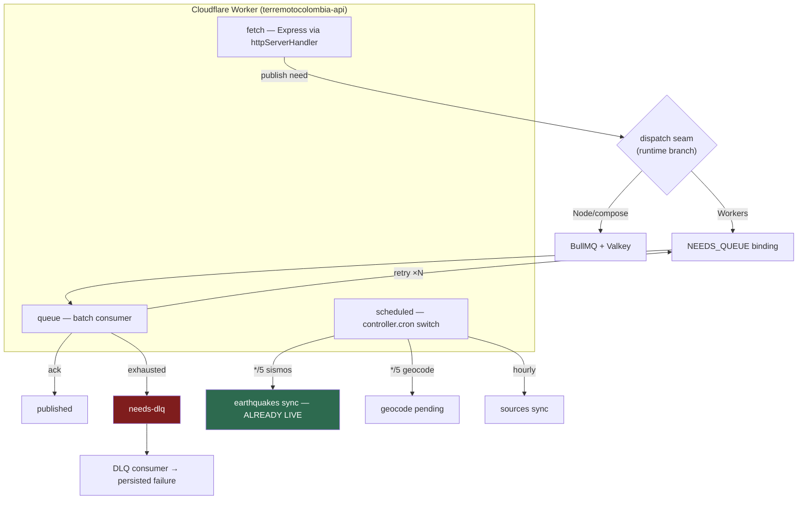

# refactor: Port queue worker to Cloudflare Queues + Cron Triggers

## Goal Capsule

**Objective.** Get the inert background jobs running on the Cloudflare Workers
infrastructure the project already pays for, without standing up a container
host or Valkey, and without smuggling a data-integrity rewrite into an
emergency change.

**Authority hierarchy.** `AGENTS.md` governs code conventions. `CLAUDE.md`
governs deploy and ops. This plan governs sequencing and the decisions under
Key Technical Decisions.

**Execution profile.** Land on `feat/phase0-queue-turnstile` (or a sibling work
branch), PR into `staging`, verify on `api-staging.terremotocolombia.co`
against the Neon `staging` branch, then PR `staging` → `main`. Never push to
`main`.

**Stop conditions — get a human.** Running migrations, deploying the backend to
production, touching Doppler or Cloudflare tokens, changing DNS/WAF, and
enabling `ENABLE_RESPONSEGRID` in any environment.

**Tail ownership.** The implementing agent owns through "verified on staging."
A maintainer owns the production cutover.

---

## Product Contract

### Summary

Move the remaining background jobs off BullMQ/Valkey onto Cloudflare Queues and
Cron Triggers, following the pattern already proven in this repo by the
earthquake sync. Needs publication and geocoding land first; patient imports,
hub federation and the one-time migration queues are explicitly not ported.

### Problem Frame

`backend/worker/index.ts` is a long-lived Node process running BullMQ against
Valkey, defined as its own `docker-compose` service with `depends_on: valkey`.
Production runs only on Cloudflare Workers — no container host, no Valkey — so
the worker is deployed nowhere and every job it owns is inert.

The framing that has been carried until now ("the queue worker is not
deployed") is **stale in one important respect**: the earthquake sync was
already ported. `backend/src/worker.ts` exports a `scheduled` handler beside
its `fetch` handler, `backend/wrangler.jsonc` already declares
`"triggers": { "crons": ["*/5 * * * *"] }`, and production data confirms it
runs — the catalogue holds today's M7.4 and its M5.0 aftershock.

That changes this work from a speculative port into **extending a pattern that
already works in this codebase**. It also resolves the one thing Cloudflare's
docs do not state plainly: whether a Worker whose `fetch` comes from
`httpServerHandler` can also export `scheduled`. It can — `worker.ts` wraps the
handler (`fetch(req, env, ctx) { return nodeHandler.fetch(...) }`) rather than
spreading it, and that shape is deployed and serving.

The queue modules are also better positioned than expected: each already splits
producer from consumer and lazy-imports its heavy logic inside the processor, so
what needs replacing is the *transport*, not the job bodies.

### Requirements

- **R1.** Needs publication runs on Cloudflare infrastructure without Valkey.
- **R2.** Geocoding runs on a schedule without Valkey.
- **R3.** Source sync (missing-persons feeds) keeps its existing `202`-and-poll
  endpoint contract while its execution moves off BullMQ.
- **R4.** A job that exhausts its retries is recoverable and inspectable
  without an admin panel and without scraping logs.
- **R5.** The `docker-compose` path keeps working; this plan does not delete it.
- **R6.** No new recurring infrastructure spend.
- **R7.** Every ported job is verifiable on staging before production.
- **R8.** Patient imports are not made *worse*: they are inert today and remain
  inert rather than being ported to a runtime where their transactions fail.

### Scope Boundaries

**In scope:** needs publication, geocoding, source sync, dead-letter visibility,
the producer-side runtime seam, and retiring Valkey from the Workers path.

**Not ported — deliberate.**

- **Patient imports (manual and OCR).** Blocked on substance, not effort:
  `services/patient-imports/*` uses interactive `db.transaction(...)`, which
  fails on the Neon HTTP driver. Porting means restructuring those paths into
  non-interactive batches or an idempotent state machine — a data-integrity
  rewrite touching medical records. That earns its own plan, not a subsection
  of this one. They are inert today; they stay inert.
- **Hub federation (ingest + images).** Gated off by `ENABLE_HUB_FEDERATION`.
  Nothing degrades by leaving it.
- **`migrate-tables` / `migrate-photos`.** Always-idle one-time import tooling
  driven by `worker/enqueue.ts`. Compose-only forever; not ported, not deleted.
- **The `duplicates` maintenance job.** On-demand and admin-triggered, so it is
  blocked on the admin panel regardless of transport.

#### Deferred to Follow-Up Work

- Patient-imports transaction rewrite (own plan).
- Durable Objects for shared rate-limit counters, if edge-only limiting ever
  proves insufficient.
- Replay tooling for dead-lettered messages (needs the admin panel).

---

## Planning Contract

### Key Technical Decisions

**KTD1 — Cloudflare Queues + Cron Triggers over containers + Valkey.**
*(session-settled: user-directed — chosen over standing up a container host and
managed Valkey: recurring cost.)* Research confirms Queues has been available
on the Workers Free plan since 2026-02-04 (10,000 operations/day, 24-hour
retention), so R6 holds on either plan tier.

**KTD2 — Extend `worker.ts`'s existing handler object; do not restructure it.**
The deployed shape already proves `fetch` + `scheduled` coexist with
`httpServerHandler`. Add `queue` as a third sibling handler. Cloudflare's docs
do not explicitly document spreading `httpServerHandler`'s return value — this
repo sidesteps that by wrapping, and the port must keep wrapping.

**KTD3 — Branch the producer by runtime, mirroring `src/db/index.ts`.**
That file already selects its driver by runtime (Neon HTTP on Workers,
node-postgres under Node). Enqueueing follows the same seam: a Queue binding
when one is bound, BullMQ when `VALKEY_URL` is present. This is what satisfies
R5 without forking the call sites, and it reuses a pattern already in the repo
rather than inventing a second dispatch idiom.

**KTD4 — Native Queues retries and DLQ replace `deadletter.ts`.**
Cloudflare Queues provides `max_retries`, `retry_delay` and `dead_letter_queue`
natively. The Redis-list DLQ in `worker/deadletter.ts` stays for the compose
path and is not reimplemented on Workers. **Behavior change to accept:**
messages in a DLQ with no consumer are deleted after 4 days, and there is no
replay UI. R4 is satisfied by a DLQ consumer that persists failures, not by
retention.

**KTD5 — Job-run visibility without a migration, by default.**
The status endpoint reports *derived* freshness from data the jobs already
write (most recent synced record per entity) rather than a new `job_runs`
table. A dedicated table would need a migration, which is a human stop
condition and a poor trade during an emergency. The DLQ consumer is the one
place a table is genuinely needed; see Open Questions.

**KTD6 — Accept permanently edge-only rate limiting on Workers.**
Removing Valkey from the Workers path makes the in-memory per-isolate fallback
permanent there. Cloudflare's edge rate limit remains the real enforcement, as
`CLAUDE.md` already documents. Durable Objects would give shared counters but
add new surface area; deferred, not adopted.

### Assumptions

- The account is on Workers **Paid**. Evidence: a Hyperdrive config exists
  (Paid-only), and the earthquake cron runs work — JSON parsing plus upserts —
  that would be tight inside the Free plan's 10 ms cron CPU budget. This is
  inference, not verification; see Open Questions.
- Needs publication volume sits far below the Free-tier 10,000 ops/day cap even
  if the account turns out to be Free.

---

## High-Level Technical Design

The `scheduled` handler already exists and already branches nothing — it runs
the earthquake sync unconditionally. Adding schedules means introducing a
`switch` on `controller.cron`, which is the documented multi-cron pattern.

---

## Implementation Units

### U1. Runtime dispatch seam for job enqueueing

**Goal.** One producer-side entry point that routes to a Cloudflare Queue
binding on Workers and to BullMQ under Node, so call sites stay unchanged.

**Requirements.** R1, R5.

**Dependencies.** None.

**Files.**
- `backend/src/modules/needs/infrastructure/needs-publication-queue.ts` (modify)
- `backend/src/lib/job-dispatch.ts` (create)
- `backend/src/lib/job-dispatch.test.ts` (create)

**Approach.**
1. Introduce a dispatch module exposing a single `enqueue`-shaped function per
   job type, with the transport resolved at call time.
2. Resolve transport by capability, not by an env flag: a bound Queue producer
   wins; `VALKEY_URL` is the fallback; neither present is a hard error with an
   actionable message, matching the fail-fast posture in `config/env.ts`.
3. Keep the existing exported job-payload types as the contract so neither
   producer nor consumer re-declares shapes.

**Patterns to follow.** `backend/src/db/index.ts` — runtime-selected driver
behind one export. Do not introduce a second dispatch idiom.

**Test scenarios.**
- With a Queue binding present and no `VALKEY_URL`, dispatch sends to the
  binding and does not construct a Redis client.
- With `VALKEY_URL` present and no binding, dispatch enqueues via BullMQ.
- With both present, the Queue binding wins.
- With neither, dispatch throws an error naming both missing options.
- Payload round-trips unchanged through the Queue path (serialized body equals
  the input job payload).

**Verification.** Unit tests pass under Node; no Redis client is constructed in
the Workers branch.

---

### U2. Needs publication as a Cloudflare Queue

**Goal.** `POST /api/needs` enqueues to a Cloudflare Queue and a `queue`
consumer publishes to ResponseGrid.

**Requirements.** R1, R6.

**Dependencies.** U1.

**Files.**
- `backend/wrangler.jsonc` (modify — `queues.producers`, `queues.consumers`)
- `backend/src/worker.ts` (modify — add `queue` handler)
- `backend/src/modules/needs/interface/http/needs-router.ts` (modify if the
  enqueue call site changes shape)
- `backend/src/worker.queue.test.ts` (create)

**Approach.**
1. Declare a producer binding and a consumer with an explicit
   `dead_letter_queue`. Set `max_retries` and `retry_delay` deliberately rather
   than inheriting defaults — publication failures are usually upstream
   outages, which want spaced retries, not three fast ones.
2. Add `queue(batch, env, ctx)` to the default export in `worker.ts` as a
   sibling of `fetch` and `scheduled`. Call `bridgeEnv(env)` first, exactly as
   `scheduled` does — `config/env.ts` reads `process.env`, and reading bindings
   in global scope throws.
3. Ack per message, not per batch, so one poisoned message cannot force
   re-delivery of its batch-mates.
4. Keep the heavy lazy-import inside the handler, as
   `needsPublication.queue.ts` already does.

**Execution note.** Land the consumer behind a queue that nothing produces to
first, then wire the producer. A consumer deployed against an empty queue is
inert and safe; the reverse strands messages.

**Patterns to follow.** `backend/src/worker.ts`'s `scheduled` handler for
`bridgeEnv` ordering and `waitUntil` usage;
`backend/worker/needsPublication.queue.ts` for the lazy import and the
`publishNeed.execute` / `executeAtLocation` branch.

**Test scenarios.**
- A batch of one publishes and acks.
- A batch of several acks each message independently; one failure does not
  re-deliver the successes.
- A publish failure calls `retry()` rather than throwing the batch.
- `bridgeEnv` runs before any code path that reads `process.env`.
- Reaching `max_retries` routes the message to the DLQ rather than dropping it.
- A message body larger than the 128 KB limit is rejected at enqueue time with
  a clear error instead of failing at delivery.

**Verification.** On staging, a queued publication is observable end to end in
`wrangler tail`. **Note the hard dependency:** full end-to-end proof needs
`ENABLE_RESPONSEGRID=true` and a ResponseGrid emergency for Colombia, which does
not exist (see Risks). Until then, verify to the boundary — the consumer runs,
the outbound call is attempted, and a failure dead-letters correctly.

---

### U3. Dead-letter visibility

**Goal.** A dead-lettered message is inspectable without an admin panel and
survives past the DLQ's 4-day retention.

**Requirements.** R4.

**Dependencies.** U2.

**Files.**
- `backend/wrangler.jsonc` (modify — DLQ consumer)
- `backend/src/worker.ts` (modify — route DLQ batches)
- `backend/src/routes/op.ts` (modify — expose failure counts)

**Approach.**
1. Bind the DLQ to a consumer in the same Worker; branch on `batch.queue` to
   distinguish primary from dead-letter traffic.
2. Persist each dead letter durably. This is the one place a table is genuinely
   warranted — see Open Questions for the migration decision.
3. Surface counts and the most recent failure reason on the existing operator
   surface rather than a new public route, keeping the `require-rate-limit`
   ESLint rule satisfied.

**Patterns to follow.** `backend/worker/deadletter.ts` for the record shape
(queue, job id, reason, attempts, failedAt) — reuse the shape, not the Redis
transport.

**Test scenarios.**
- A message arriving on the DLQ consumer is persisted with queue name, attempt
  count and failure reason.
- The DLQ consumer acks unconditionally — a failure to persist must not
  dead-letter the dead letter.
- The operator endpoint requires authentication and declares a rate limit.
- With zero failures the endpoint reports an empty state rather than erroring.

**Verification.** Force a publication failure on staging; confirm the record
appears and the count increments.

---

### U4. Geocoding on a Cron Trigger

**Goal.** Pending locations geocode on a schedule without Valkey.

**Requirements.** R2.

**Dependencies.** None (independent of U1–U3).

**Files.**
- `backend/wrangler.jsonc` (modify — second cron expression)
- `backend/src/worker.ts` (modify — `switch` on `controller.cron`)

**Approach.**
1. Add a second cron expression and convert the `scheduled` handler's body into
   a `switch (controller.cron)`, preserving the earthquake branch byte-for-byte
   in behavior. This is the documented multi-cron pattern.
2. Extract the geocode job body out of the BullMQ processor into a plain
   exported function, mirroring how `services/earthquakes.ts` exposes
   `syncFromFeed`/`backfill` as pure functions that BullMQ merely scheduled.
   That extraction is what made the earthquake port trivial.
3. Bound the work per invocation (batch of pending rows) rather than draining —
   scheduled invocations are capped, and Nominatim wants gentle pacing.

**Patterns to follow.** `backend/src/worker.ts`'s existing `scheduled` handler,
including the deliberate re-throw without `noRetry()` where the operation is
idempotent.

**Test scenarios.**
- The earthquake branch still fires on its own cron expression and is unchanged.
- The geocode branch fires only on its own expression.
- An unrecognized cron expression logs and returns without throwing.
- A geocoding batch respects its per-invocation cap.
- A provider failure mid-batch leaves already-geocoded rows persisted.

**Verification.** On staging, both crons appear in `wrangler tail` output on
their own schedules; pending geocode count decreases.

---

### U5. Source sync on a Cron Trigger

**Goal.** Missing-persons feed sync runs scheduled, with the existing
`202`-and-poll endpoint contract intact.

**Requirements.** R3.

**Dependencies.** U4 (shares the `controller.cron` switch).

**Files.**
- `backend/wrangler.jsonc` (modify — cron expression)
- `backend/src/worker.ts` (modify — branch)
- `backend/src/routes/sync.ts` (modify — status semantics)

**Approach.**
1. Add the scheduled branch invoking the existing chunked/checkpointed engine.
2. `/api/sync/status` currently reports BullMQ job state via `getJob`. On
   Workers there is no job registry — report progress from the engine's own
   checkpoint instead, so the endpoint keeps answering without lying.
3. Preserve the deterministic idempotency the BullMQ path had via `jobId` per
   (source, mode); the checkpoint provides the equivalent guarantee.

**Test scenarios.**
- A scheduled run resumes from an existing checkpoint rather than restarting.
- Two overlapping invocations do not double-write (idempotency holds).
- `/api/sync/status` returns a coherent shape with no BullMQ present.
- `/api/sync/run` still returns `202`.

**Verification.** On staging, a scheduled sync advances the checkpoint and
`/api/sync/status` reflects it.

---

### U6. Retire Valkey from the Workers path

**Goal.** Nothing in the Workers bundle imports BullMQ or ioredis; the compose
path is untouched.

**Requirements.** R5, R6.

**Dependencies.** U1, U2, U4, U5.

**Files.**
- `backend/src/config/env.ts` (modify — comment only)
- `CLAUDE.md` (modify — limitations section)
- `docs/architecture.md` (modify)
- `docs/runbook-fase0.md` (modify — mark the item resolved)

**Approach.**
1. Confirm by inspection of the built bundle that no Redis client is reachable
   from the Workers entrypoint.
2. Document that the degraded per-isolate rate limiter is now **permanent** on
   Workers by design (KTD6), not a temporary regression — `CLAUDE.md` currently
   frames it as a known limitation awaiting `VALKEY_URL`.
3. Leave `VALKEY_URL`, `worker/redis.ts`, `worker/deadletter.ts` and
   `worker/index.ts` in place for compose. Deleting them would break R5.

**Test scenarios.**
- Test expectation: none — documentation and dependency-graph verification.
  Covered by the bundle inspection in Verification.

**Verification.** A build of the Workers bundle contains no `ioredis`/`bullmq`
code; `docker compose` still starts the worker service successfully.

---

### U7. Staging verification harness

**Goal.** Prove each ported job actually ran, without an admin panel.

**Requirements.** R7.

**Dependencies.** U2, U3, U4, U5.

**Files.**
- `scripts/verify-jobs.sh` (create)
- `docs/runbook-fase0.md` (modify)

**Approach.**
1. Follow the shape of `scripts/verify-turnstile.sh`: environment argument,
   per-check output, explicit verdict, and **no writes** to production data.
2. Check derived freshness per job (KTD5) — most recent earthquake, pending
   geocode backlog, sync checkpoint age — plus dead-letter count from U3.
3. Print an explicit "cannot verify end-to-end" line for needs publication
   while ResponseGrid has no Colombia emergency, rather than reporting a false
   pass.

**Test scenarios.**
- Against staging with jobs running, every check reports fresh.
- Against an environment with a stalled cron, the corresponding check reports
  stale rather than passing silently.
- The script makes no write requests (assert by inspection of the methods used).
- A non-zero dead-letter count surfaces in the verdict.

**Verification.** The script distinguishes a healthy staging deployment from
one where a cron is not firing.

---

## Verification Contract

1. `scripts/verify-jobs.sh staging` reports fresh for earthquakes, geocode and
   sync, and zero dead letters.
2. `wrangler tail` on staging shows each cron expression firing on schedule.
3. A deliberately failed publication appears in the dead-letter record.
4. `docker compose` still starts the worker service (R5 intact).
5. No `ioredis`/`bullmq` in the Workers bundle.

## Definition of Done

- U1–U7 landed on `staging` and verified against `api-staging`.
- `CLAUDE.md`, `docs/architecture.md` and `docs/runbook-fase0.md` reflect the
  new reality, including the permanent rate-limit posture.
- Production cutover **not** performed by the implementing agent — the backend
  production deploy is a maintainer action requiring the `desplegar`
  confirmation.

---

## Phase Gates

| Gate | Condition |
| --- | --- |
| G1 → staging | U1, U4 landed; earthquake cron demonstrably unaffected |
| G2 → staging | U2, U3 landed; dead-letter path proven with a forced failure |
| G3 → staging | U5, U6, U7 landed; verification script green |
| G4 → production | Maintainer runs the manual backend deploy; `verify-jobs.sh production` green |

G4 is a human gate. It is the same gate as Fase 0 item 2 in
`docs/runbook-fase0.md`.

---

## Risks & Dependencies

**Needs publication cannot be proven end to end yet.** `ENABLE_RESPONSEGRID` is
off, and ResponseGrid has no Colombia emergency — only `terremoto-venezuela-2026`
and `incendios-centro-espana-2026` exist. U2 is verifiable only to the outbound
boundary until a third party creates it. Do not let this block U4/U5, which have
no such dependency.

**Enabling the flag without config kills the API.** `config/env.ts` calls
`process.exit(1)` when `ENABLE_RESPONSEGRID=true` without
`RESPONSEGRID_API_URL`/`RESPONSEGRID_EMERGENCY_SLUG`. On Workers that is a boot
crash on every isolate. The flag is a human stop condition for this reason.

**Plan-tier uncertainty.** If the account is on Workers Free, cron invocations
get 10 ms CPU, which the geocode batch could exceed. Mitigation is already in
U4 (bounded batches); confirm the tier before G3.

**`wrangler.jsonc` must not gain `routes`.** Adding queue configuration means
editing this file — do not let a `routes` key appear. It aborts the deploy after
upload, leaving the Worker silently serving the previous build.

**Hyperdrive and D1 stay off.** Both are provisioned but deliberately unused.
Queue work must not "helpfully" wire them.

---

## Open Questions

1. **Does the DLQ record justify a migration?** KTD5 avoids new tables, but U3
   needs durable failure records. Options: a small dedicated table (needs a
   migration — human stop condition), or reusing an existing operational table.
   Resolve before U3; do not run the migration without a maintainer.
2. **Workers plan tier.** Confirm Free vs Paid before G3 (see Risks).
3. **Retry pacing for needs publication.** `max_retries` and `retry_delay`
   should reflect ResponseGrid's real failure modes, which cannot be observed
   until the Colombia emergency exists. Ship a conservative default; revisit.

---

## Sources & Research

- Cloudflare Queues: Free-plan availability (changelog 2026-02-04), producer/
  consumer config, `max_retries`/`retry_delay`/`dead_letter_queue`, 128 KB
  message limit, 4-day unconsumed-DLQ retention, per-message `ack()`/`retry()`.
- Cloudflare Cron Triggers: `triggers.crons`, `controller.cron` switch pattern,
  minute granularity, CPU limits by plan (Free 10 ms; Paid 30 s for intervals
  under an hour).
- In-repo precedent: `backend/src/worker.ts` (`fetch` + `scheduled` coexisting
  with `httpServerHandler`), `backend/src/db/index.ts` (runtime-branched
  driver), `backend/worker/*.queue.ts` (producer/consumer split with lazy
  imports).
- Production evidence: the earthquake cron is live — the catalogue holds the
  2026-08-10 M7.4 and its M5.0 aftershock.
