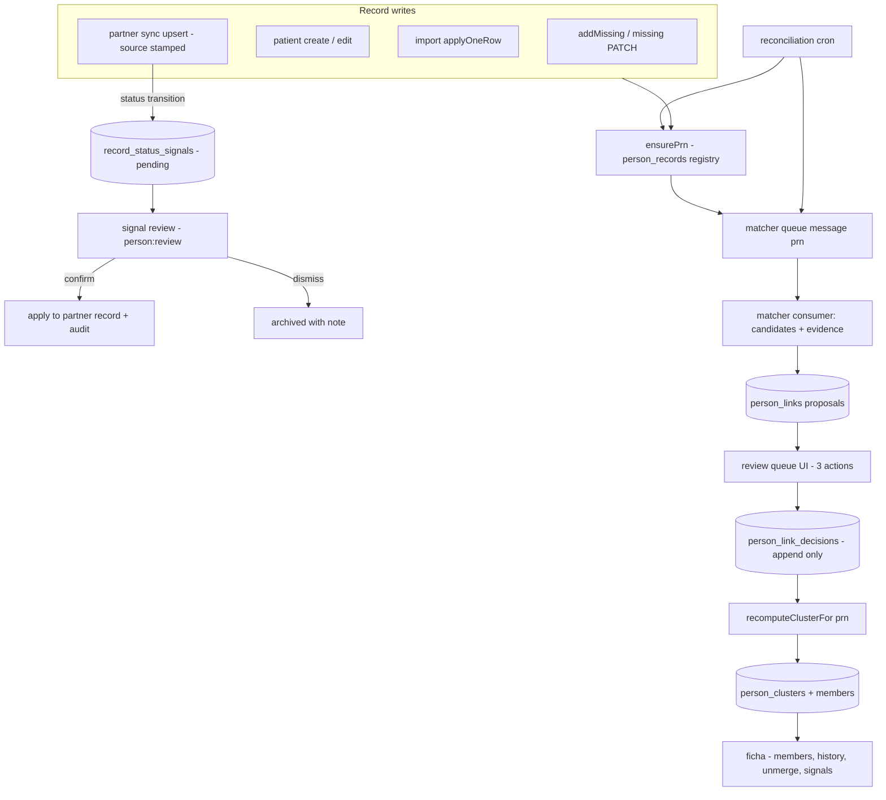
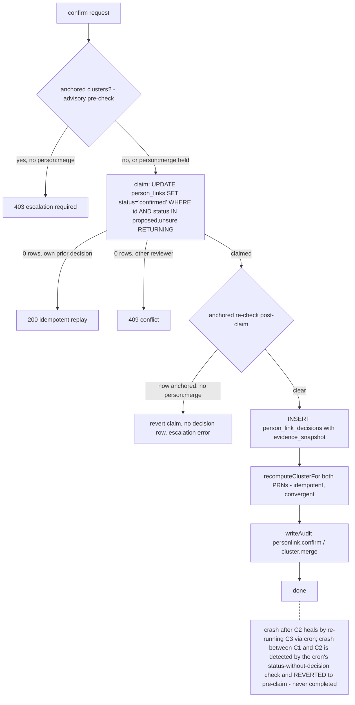
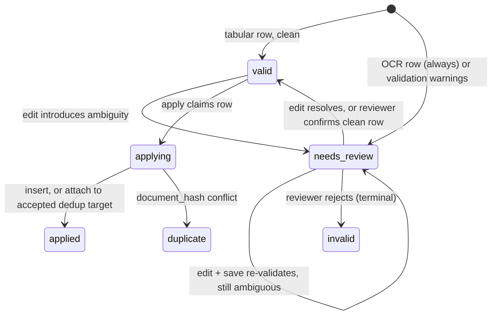

# Family Search Identity Resolution (Phases 0-1) - Plan

## Goal Capsule

- **Objective:** Ship Phase 0 (unblock import-row review), Phase 1 (PRN identity registry + deterministic linkage + match review queue) of the Family Search feature defined in the origin requirements doc, and the partner-sync precursor: one vetted partner pushing missing-person records into the platform as *signal* — mapped into the identity layer, never silently overwriting local truth.
- **Authority hierarchy:** the origin doc (`docs/family-search-admin-requirements.md`) governs product behavior; this plan governs implementation; `AGENTS.md`, `admin/AGENTS.md`, and root `CLAUDE.md` govern code conventions and deploy mechanics and win on those where they conflict.
- **Stop conditions:** never run migrations, `seedAuth()`, or `wrangler queues create` — all human-gated deployment steps (root `CLAUDE.md`). Never put real crisis data in code, fixtures, tests, or docs. No public-site behavior changes in this scope. If research or implementation shows a settled decision below cannot work, stop and surface it instead of substituting.
- **Execution profile:** code. Backend (Express-on-Workers), admin panel (Next.js bounded context), and schema migrations that are *authored* here and *applied* by the maintainer.
- **Tail ownership:** implementation lands via the repo's staging-first flow (`staging` branch → verify → merge to `main`); pushing `main` deploys production automatically, so nothing merges to `main` unverified.

---

## Product Contract

### Summary

Give every person-shaped record (missing report, hospital patient, unidentified person, partner-pushed record) a stable, phone-communicable identifier (PRN); propose links between records that appear to describe the same person using deterministic evidence only (cédula-HMAC exact, exact normalized name+age); let admin staff confirm, reject, or mark unsure on every proposal in a keyboard-first review queue; and materialize confirmed links into unwindable identity clusters. The platform owns the canonical identity record; external writes — starting with one vetted partner's push API — flow in as signal that maps onto that identity layer, and a partner's status claim ("reported found on their platform") becomes a pending signal a human confirms before local truth changes. Before any of that, unblock the import pipeline's dead end so OCR-derived rows can be edited, confirmed, and applied through the admin UI — capturing every human correction as training signal.

### Problem Frame

The platform holds five unlinked person populations with no cross-referencing of any kind — no FK, no join, no candidate suggestion. A family searching for someone must mentally join citizen reports against hospital lists. Meanwhile the one ingestion path that could grow the hospital population fastest (OCR of photographed patient lists) is a pipeline into a wall: every OCR row is forced to `needs_review`, and no endpoint or UI exists to resolve it. The origin doc defines the full identity-resolution vision (§1-§13); its own phasing marks Phases 0-1 as the independently shippable foundation.

### Actors

- A1. **Revisor** — daily-driver reviewer; holds `person:review` (and typically `patient:import`); decides match proposals and import rows.
- A2. **Revisor senior** — small allowlist; additionally holds `person:merge`; approves cluster merges, unmerges, deletions' identity effects.
- A3. **Admin de importaciones** — holds `patient:import`; uploads and applies batches (existing role, existing capability).
- A4. **Ciudadano** — anonymous public reporter via `POST /api/missing` (surface unchanged; gains accountability hash only).
- A5. **Socio** — one named, vetted partner integration; authenticates with a scoped API key (`missing:create`), pushes missing-person records under a server-stamped `partner:` source, reads via the existing public listing. Never onboarded self-service.

### Requirements

**Import review unblock (Phase 0)**

- R1. A reviewer can edit a staged import row's normalized fields; saving re-validates the row (validation + dedup re-classification) and may transition it to `valid`.
- R2. A reviewer can confirm a `needs_review` row (making it applicable) and can reject a row (terminal `invalid`; apply skips it).
- R3. A reviewer can accept or reject a dedup candidate on a row; accepting makes apply attach the row to the existing patient instead of creating a new one.
- R4. Every human edit of an OCR-derived row field is captured automatically as an `ocr_corrections` pair (model value, corrected value, provider, prompt version, reviewer, document reference) — no separate labeling workflow.
- R5. An OCR'd photo of a patient list can reach `applied` entirely through the admin UI (origin Phase 0 acceptance).
- R6. PDF uploads to patient imports are rejected consistently with a clear Spanish error naming supported formats; the accept/501 contradiction is removed. Per-page OCR of PDFs is deferred (see Scope Boundaries).
- R7. `addMissing` records an `ipHash` and writes an audit entry, like every other anonymous public write.

**Identity registry (Phase 1)**

- R8. Every record in `missing_persons`, `hospital_patients`, and `unidentified_persons` gets a PRN via the `person_records` registry — new records at creation, existing records via an idempotent backfill; source tables are never modified for this.
- R9. The PRN is `TC-` + 8 Crockford base32 characters + 1 check character: case-insensitive, phone-communicable, typo-detecting on lookup.
- R10. Staff can record a cédula on a missing report; it is stored only as `tipo_documento` + HMAC (same secret and normalization as `hospital_patients.document_hash`); the field is optional and `sin_documento` is always valid — no path makes a document mandatory.

**Linkage and review (Phase 1)**

- R11. A deterministic matcher proposes `person_links` on document-hash exact match and exact-normalized-name+age match, across populations (missing ↔ patient, missing ↔ missing), with per-field evidence recorded. Unidentified persons are reachable by manual link only in Phase 1 — they carry neither a document hash nor an age. The matcher never writes source tables and never merges anything.
- R12. Reviewers decide proposals with three actions — Confirmar coincidencia / No es la misma persona / No estoy seguro (+nota obligatoria) — each an append-only `person_link_decisions` row with mandatory reviewer attribution and a `writeAudit` entry.
- R13. Clusters are connected components over confirmed links only. Membership history is preserved: removal sets `removed_at`, rows are never deleted, and a record lives in at most one live cluster.
- R14. A rejected pair is a tombstone: the matcher must not re-propose it except when a strictly stronger evidence class appears, in which case the proposal carries a "previously rejected, new evidence" banner and the prior decision's evidence remains available for comparison.
- R15. Unmerge is a first-class `person:merge` operation: detaches membership, appends a rescinding decision, audits, and re-runs the matcher for detached records.
- R16. A reviewer can manually propose a link from the ficha (search-and-attach by name or PRN); manual proposals follow the normal decision flow.
- R17. The cluster ficha (v1) shows member records side by side with per-field values and population provenance, plus the full decision history; a PRN typed in search jumps straight to its cluster.
- R18. Confirming a link that would join two clusters that each already have ≥2 members or ≥1 confirmed link is an escalated action requiring `person:merge`, presented with both full clusters rendered.

**Partner sync as signal (Phase 1, user-directed addition)**

- R23. A vetted partner can push missing-person records in batches through the authenticated partner-sync endpoint: API-key scoped to `missing:create`, `source` stamped server-side from the authenticated identity (never from the body), idempotent upsert keyed on `(source, external_id)`, bounded batch size, rate-limited, audited.
- R24. Partner-pushed records enter the identity layer like any other record: they are PRN-stamped on upsert and swept by the matcher, so a partner record that appears to describe a locally known person surfaces as a normal review-queue proposal.
- R25. A partner-initiated **status transition** on an existing record (e.g., active → found) never goes live silently: the upsert holds the stored status and creates a pending **status signal** carrying the claimed status and provenance. Non-status fields keep the existing merge-on-upsert behavior. A brand-new record arriving already in a given status is an initial state, not a transition, and is stored as sent.
- R26. A reviewer (`person:review`) resolves each status signal: confirming applies the claimed status to the partner's record (audited) — and, when the record sits in a cluster, the ficha presents the cluster so propagation to the platform's own records stays an explicit, separately audited edit; dismissing archives the signal with a note. No trust level ever automates this (origin design principle 5).
- R27. Partner kill switches work without a deploy: revoking the API key stops all writes; `missing_person_suppressions` blocks individual records; both already exist and the plan verifies they hold for the partner path.

**Safety and governance**

- R19. New capabilities `person:search` (read family-search surfaces), `person:review` (decide links, import rows, manual proposals), `person:merge` (cluster merge, unmerge, identity effects of deletion) gate every new endpoint; every decision endpoint follows the standard chain rate-limit → requireCapability → zod validate → handler → writeAudit.
- R20. Concurrent decisions on the same link or row are safe: writes are claim-based conditional updates, and a losing reviewer receives a conflict response rather than silently overwriting.
- R21. Deleting a source record through any existing endpoint tombstones its PRN, rescinds its live links, removes its cluster membership (history preserved), and audits — from the day Phase 1 ships.
- R22. Nothing in this scope changes public-site behavior or stores a raw document number outside the already-restricted staging `raw_data`.

### Acceptance Examples

- AE1. **OCR round trip (Phase 0).** Given an uploaded photo of a patient list whose rows land in `needs_review`, when a reviewer edits a misread name, confirms the row, and applies the batch through the admin UI, then the patient exists in `hospital_patients` and each edited field has an `ocr_corrections` row pairing the model value with the correction. Covers R1, R2, R4, R5.
- AE2. **Deterministic match (Phase 1).** Given a hospital import row whose cédula HMAC equals the HMAC recorded by staff on a missing report, when the batch applies, then a strong deterministic proposal appears in the review queue with its evidence; confirming it forms a cluster visible in the ficha; unmerging it detaches the records and re-runs the matcher; every step is in `audit_log`. Covers R8, R10, R11, R12, R13, R15.
- AE3. **Deletion hygiene (Phase 1).** Given a missing report that is a confirmed member of a two-record cluster, when an admin deletes it via the existing delete endpoint, then its links are rescinded, its membership shows `removed_at`, the surviving record stands alone, and the PRN registry marks the record removed. Covers R21.
- AE4. **Partner signal round trip (Phase 1).** Given a partner pushes a record that matches a local missing report by exact normalized name+age, when the batch upserts, then the partner record gets a PRN and a review-queue proposal appears; after a reviewer confirms the link, a partner re-sync marking that record `found` does **not** change any stored status — a pending status signal appears instead; confirming the signal updates the partner record's status with audit, and the local report's status is untouched until a reviewer explicitly edits it from the ficha. Covers R23, R24, R25, R26.

### Scope Boundaries

This plan covers origin Phases 0 and 1 at implementation depth; the origin doc remains the authoritative roadmap for everything below. (session-settled: user-approved — chosen over including Phase 2 units: Phase 2 is counsel-gated and would roughly double the plan.)

**Deferred to Follow-Up Work** (origin phases, in the origin's terms)

- Phase 2 — probabilistic matching (`person_match_keys`, blocking, FS-lite scoring, bands), búsqueda screen with facets, cluster-merge sub-queue UI, nickname table, privacy-policy rewrite + consent copy + public cédula intake field (counsel-gated).
- Phase 3 — OCR intelligence loop (derived per-field confidence, structural sanity, provider routing, layout clusters, eval gating, crop-beside-fields editor).
- Phase 4 — connector framework core, `intake_items` spine, WhatsApp tipline, triage queue, source health, retention automation.
- Phase 5 — trust ladder autopilot, new enrichment capabilities, automated social (legal-basis gated).
- Per-page OCR ingestion of PDFs (rasterization dependency + per-page fan-out + stitching) — Phase 0 ships consistent rejection instead (KTD12).
- `data_deletion_requests` PRN support and public de-indexing — Phase 2; Phase 1 ships only the internal tombstone hygiene of R21.
- Golden-view survivorship projection and authority tiers — needs the source registry (Phase 4); ficha v1 shows members side by side instead.
- Full PFIF-style timeline notes on the ficha — Phase 1 derives history from decisions and membership events; a dedicated notes table comes with handoff recording in later phases.
- Generalized partner-sync protocol and open partner onboarding — this plan wires exactly one named, vetted partner; multi-partner generalization is the origin's Phase 4 connector framework, and open write access would contradict the federation stance (`docs/propuesta-erp-gobierno.md` P2, "Federado, no centralizado").
- Scoped partner **read** APIs — the existing public missing listing covers the mock partner's read side; capability-scoped read surfaces for non-public data are a later decision.
- Signal kinds beyond `status_report` — the signals table is deliberately narrow; richer intake (tips, media, free text) is the Phase 4 `intake_items` spine, which this table's shape anticipates but does not build.

**Outside this product's identity** (carried from origin)

- Automated face matching / CV pipeline; scraping Registraduría; RIPS as a live feed; SIRDEC "integration" without written agreement; competing with official registries — the platform is a feeder and relay for Fiscalía 122, Medicina Legal SIRDEC, and Cruz Roja RCF.

### Product Contract preservation

Restructured from the legacy origin doc with three user-approved changes (2026-08-11): the "audit on `updateMissing`" Phase 0 item is dropped — edits are already audited at the shared CRUD-factory layer (KTD13); PDF handling is narrowed to consistent rejection with OCR-per-page deferred (KTD12); deletion tombstoning is pulled forward from §9.1 into Phase 1 (KTD16, R21). One user-directed addition (2026-08-11): the partner-sync-as-signal scope (R23-R27), pulling a narrow, single-partner slice of the origin's §4 connector vision forward into Phase 1 on the origin's own terms (push_api transport, autopilot-moves-data-never-decisions). Everything else preserves the origin's meaning.

---

## Planning Contract

### Key Technical Decisions

- KTD1. **Hand-written routers, not the CRUD factory.** Phase 0 row endpoints extend the existing hand-written `backend/src/public-api/patient-imports.ts` router; Phase 1 decisions get a new hand-written router under `backend/src/public-api/routers/` mirroring `deletion-requests.router.ts` (two-capability, non-CRUD verbs). The three-action decision shape does not fit `createCrudRouter`'s quartet, and `patient-imports.ts` is the in-repo precedent for exactly this call.
- KTD2. **Claim-based conditional transitions everywhere a human decides.** Every decision write is a conditional UPDATE on the current status (`person_links.status IN ('proposed','unsure')`; row transitions likewise) returning the claimed row; a miss returns 409 via the existing `conflict()` helper. This is the `transitionImportStatus` idiom from `backend/src/services/patient-imports/internal.ts`, and it is what makes concurrent reviewers safe (R20) without transactions. Two refinements from adversarial review: (a) a crash between the status claim and the decision-row insert leaves a decided status with no attribution — the reconciliation cron detects any link whose status implies a decision but has no matching decision row and **reverts it to its pre-claim state** so it re-enters the queue (`decided_by` and the note existed only in the crashed request; there is nothing legitimate to backfill — never complete such a decision); (b) a 0-row claim re-reads the latest decision first — if it was made by the requesting reviewer with the same verdict, the endpoint returns idempotent success (client retry), otherwise 409 (true conflict).
- KTD3. **Cluster membership is a convergent materialization, not a transactional write.** The append-only truth is confirmed links in `person_links` + `person_link_decisions`. `recomputeClusterFor(prn)` derives the connected component over confirmed links and converges membership to it in five documented sub-steps: (1) pick the canonical cluster id — oldest among clusters holding any live member of the component, else a new id; (2) insert missing membership rows with a partial-index conflict target (`ON CONFLICT (prn) WHERE removed_at IS NULL DO NOTHING` — use the raw-SQL idiom proven for `hospital_patients.document_hash` in `apply.ts`, not the untested query-builder path, and never advisory locks: the Neon HTTP driver holds no session), then re-read — a lost insert race means another recompute is running; re-run from current state rather than erroring (the partial unique index is the serialization point); (3) set `removed_at` on the seed component's stale memberships; (4) **evict beyond the seed:** enumerate all remaining live members of every cluster touched, and any member not in the newly computed component gets its own recompute — without this, an unmerge that shrinks a merged cluster leaves unreachable members stranded in it; (5) **verify after write:** re-read each component member's live cluster; any member whose live cluster differs from the canonical id gets a follow-up recompute message enqueued (convergence in seconds, not on the cron's cadence — the decision itself already succeeded and is never failed retroactively). Idempotent and convergent: crash mid-write and re-run; the reconciliation cron (KTD8) is the safety net. This is the plan's answer to Workers' no-interactive-transactions constraint for the one multi-row write the patient-imports template does not cover.
- KTD4. **Evidence survives decisions; tombstones and unsure both rank by evidence class.** `person_link_decisions` carries an `evidence_snapshot` (score, evidence, matcher version at decision time), so re-proposal — which overwrites the single `person_links` row per pair — never loses what the reviewer rejected. Phase 1's evidence-class ranking is `document_hash_exact > name_age_exact`; a rejected (or rescinded) pair re-proposes only on a strictly stronger class, flagged for the banner (R14). The same gate applies symmetrically to `unsure`: the matcher may refresh score/evidence on an unsure link **in place** (status unchanged, no queue churn), and only a strictly stronger evidence class transitions it back to `proposed`, carrying a "previously marked unsure" banner with the reviewer's note. The ranking is an ordered enum, extensible in Phase 2.
- KTD5. **The matcher may only touch `proposed` and `unsure` rows.** Confirmed and rejected links are immutable to the matcher; the sole exception is the stronger-evidence re-proposal of KTD4. This makes design principle 1 (human decisions are never machine-overwritten) structural.
- KTD6. **Dedicated matcher queue.** A new `terremotocolombia-matcher` queue + DLQ (DLQ persisted to `audit_log`, `max_retries: 0`, like imports), wired through `wrangler.jsonc`, `worker.ts`'s `classifyQueue`, and `job-dispatch.ts`'s binding registry. Consumer parameters are decided here, not at wrangler-authoring time: `max_batch_size: 10` (each message is a single lightweight PRN, unlike imports' heavy batches), with imports' spaced-retry policy (`max_retries: 3`, `retry_delay: 30`). Chosen over a new mode on the imports queue: matching triggers on every record write, and the per-domain-queue split (needs vs imports) is the stronger precedent. Queue creation is a human deployment step that precedes the consumer deploy.
- KTD7. **PRN codec.** `TC-` + 8 Crockford base32 chars from crypto randomness + 1 Crockford check symbol (mod 37). Lookup normalizes case and the I/L→1, O→0 aliases and validates the check character before querying. Generation retries on the registry's PK collision. A pure, unit-tested codec module — no DB-generated component.
- KTD8. **PRN assignment is best-effort inline plus a reconciling cron.** Creation paths call `ensurePrn(record_type, record_id)` after their insert (idempotent via `ON CONFLICT (record_type, record_id) DO NOTHING`; never fails the parent write). A cron job sweeps each population for un-stamped rows, stamps them, and enqueues matcher sweeps. The backfill of existing rows is simply this job's first runs — one mechanism, not two. The cron also enforces three precisely defined cluster invariants: (a) every confirmed link's endpoints share a live cluster (catches split-brain from recompute races); (b) every cluster's live members are mutually reachable over confirmed links — a per-cluster connectivity walk, run less frequently because it is the expensive check, and the only one that catches over-clustering where a stranded member has zero remaining links; (c) every link whose status implies a decision has a decision row, else revert per KTD2. Cheap checks every run; the connectivity walk on a slower cadence with a time budget.
- KTD9. **Missing-report cédula capture mirrors the patients idiom — without the unique index.** Same `documentDigits`/`hashDocumentDigits` HMAC and `PATIENT_DOCUMENT_HASH_SECRET`, same PATCH-transform shape as `patients.resource.ts`, `hasDocument` in the admin DTO and excluded from public DTOs. No uniqueness constraint: two reports carrying the same cédula are a legitimate signal (report dedup) that must surface as a matcher proposal, not a 409.
- KTD10. **Phase 1 matching normalizes on the fly.** Candidate queries use document-hash equality (indexed) and exact normalized name+age via `lower`/`unaccent` expressions, guarded by the existing `accentSearchReady()`-style capability check with a TypeScript-side fallback. Bounded scans are acceptable at current volumes; `person_match_keys` and GIN indexes are Phase 2's job and nothing here forecloses them.
- KTD11. **`missing_persons.ip_hash` is a new column.** The origin's "no new schema in Phase 0 except `ocr_corrections`" gives way: every other anonymous-write table persists an `ip_hash` column, and a hash that is computed but not stored is worthless. Additive and deploy-safe.
- KTD12. **PDF uploads: reject consistently.** (session-settled: user-approved — chosen over per-page OCR rasterization: that is a feature with a new dependency and fan-out design, not a branch fix.) One source of truth for accepted content types; `application/pdf` returns 415 with a Spanish message naming supported formats.
- KTD13. **The `updateMissing` audit item is already satisfied.** (session-settled: user-approved — chosen over adding before/after field diffs.) `PATCH /api/public/missing/:id` is the only edit path and `crud-factory.ts` audits it unconditionally (`missing.edit`, actor, ipHash, touched field names). Before/after values are deliberately not added: storing old and new PII values in `audit_log` cuts against privacy minimization.
- KTD14. **Cluster-merge escalation in Phase 1 is a gated confirm, not a separate queue.** The confirm handler detects the anchored-clusters condition (R18), requires `person:merge`, and the UI renders both full clusters in a visually distinct confirm dialog. The dedicated sub-queue screen arrives with Phase 2's volume. The anchoring check is **re-validated immediately after the status claim, not only as an early pre-check** — a concurrent confirm can grow a cluster past the threshold between check and act, and the claim is the only serialization point available. If post-claim re-validation finds the merge is now anchored and the reviewer lacks `person:merge`, the claim is reverted (status back to pre-claim, no decision row) and the request returns the escalation error.
- KTD15. **Admin surfaces: extend in place for Phase 0, new bounded context for Phase 1.** The row editor extends `admin/src/contexts/patient-imports/import-rows-table.tsx` (already polling, already rendering per-row status and dedup candidates). Family search is a new `admin/src/contexts/family-search/` context with BFF routes under `admin/app/api/admin/family-search/` per `admin/AGENTS.md` (own workflow ⇒ own context). Review-queue pagination copies the repo's one cursor precedent: `audit-admin.tsx`'s `useInfiniteQuery` + keyset `before` cursor backed by an `audit.router.ts`-style endpoint.
- KTD16. **Deletion integration ships in Phase 1.** (session-settled: user-approved — chosen over deferring all deletion handling to Phase 2: the already-live admin delete endpoints would strand dangling PRNs, links, and memberships from day one.) Governs R21. The formal `data_deletion_requests` extension stays in Phase 2; both flows will share the same tombstone service.
- KTD17. **Absorb the working-tree partner-sync router, synchronous by design.** (session-settled: user-directed — chosen over the async `worker/sync` / `worker/hub` engines: both enqueue to a BullMQ queue nothing consumes in the deployed Workers stack, so a 202 would silently do nothing.) The uncommitted `backend/src/public-api/routers/partner-sync.router.ts` (source stamped server-side from the authenticated identity, `missing:create` reuse, batch cap, suppressions respected) is adopted as U13's baseline and hardened with tests rather than rebuilt.
- KTD18. **Status transitions from external upserts become signals, system-wide.** The change lives in `upsertExternalMissingBatch` itself, so the partner router and any future re-enabled sync source inherit it: an incoming status differing from the stored status holds the stored value and emits a `record_status_signals` row; all other fields keep the existing COALESCE merge; a new record's initial status is stored as sent. No currently-enabled source changes behavior (the external-source sync is inert today), so this is a tightening with no live regression surface. Cites R25.
- KTD19. **The signals table is a narrow, forward-compatible slice of the Phase 4 intake spine.** `record_status_signals` carries one kind (`status_report`), an allowlisted payload (claimed status, note, reported-at — no free text from the wire beyond the partner's resolution note, no media), provenance, and a pending/confirmed/dismissed lifecycle decided by `person:review`. Its verbs (confirm/dismiss) deliberately mirror the origin's triage actions so Phase 4's `intake_items` can absorb it as configuration, not migration. Confirming applies the claim to the partner's own record only; the platform's records change only through their existing audited edit paths (R26) — one-owner truth, explicit propagation.

### High-Level Technical Design

Prose is authoritative where a diagram and text disagree.

**Component and data flow (Phase 1 spine):**

**Link lifecycle (decision state machine):**

```mermaid
stateDiagram-v2
    [*] --> proposed: matcher or manual propose
    proposed --> confirmed: confirmar (claim; escalates if anchored clusters)
    proposed --> rejected: no es la misma persona (tombstone)
    proposed --> unsure: no estoy seguro + nota
    unsure --> confirmed: later decision
    unsure --> rejected: later decision
    unsure --> unsure: matcher refresh in place (score/evidence only)
    unsure --> proposed: strictly stronger evidence class only (banner + note)
    rejected --> proposed: strictly stronger evidence class only (banner)
    confirmed --> rejected: rescind via unmerge (person:merge)
```

**Confirm protocol (crash-safe without transactions):**

**Import row lifecycle (Phase 0 additions in bold paths):**

### Assumptions

- Current record volumes (thousands, not millions) make expression-based candidate scans acceptable for Phase 1; Phase 2's `person_match_keys` is the scaling path.
- The `unaccent` extension remains available on Neon (already used conditionally by missing search); the matcher degrades to TypeScript-side normalization if not.
- `unidentified_persons` stays read-only (origin maintainer decision 4 pending); it is PRN-stamped and searchable for manual linking, and the matcher only reaches it via document hash (it has none today) so it is effectively inert until revived.

### Sequencing

Phase 0 (U1 → U2 → U5, with U3 and U4 free-floating) is independently shippable and unblocks OCR corrections capture from day one. Phase 1 is a strict chain U6 → U7 → U8 → U9, then U10/U11 in any order; U12 needs only U6 and U8 and can start as soon as U8 lands. The partner track: U13 (harden the existing router + tests) is independently shippable immediately and unblocks the staging mock-partner test before any identity table exists; U14 (signals + the partner records' identity-layer wiring) needs U6, U7, U8, and U13; U15 (signal review UI) needs U14 and the U11 context. Of the human deployment steps, migrations + `seedAuth()` and matcher-queue creation precede feature merge; capability grants and the partner API key follow it — see Operational Notes for the exact order.

---

## Implementation Units

| U-ID | Title | Key files | Depends on |
| --- | --- | --- | --- |
| U1 | Phase 0 schema: `ocr_corrections` + `ip_hash` | `infra/db/schema.ts`, `infra/db/migrations/` | — |
| U2 | Import-row edit/confirm/reject/dedup endpoints | `backend/src/public-api/patient-imports.ts`, `backend/src/services/patient-imports/` | U1 |
| U3 | `addMissing` accountability (ipHash + audit) | `backend/src/routes/missing.ts`, `backend/src/services/missing.ts` | U1 |
| U4 | PDF consistent rejection | `backend/src/public-api/patient-imports.ts`, `backend/src/services/patient-import-parse.ts` | — |
| U5 | Admin row editor UI | `admin/src/contexts/patient-imports/`, `admin/app/api/admin/patient-imports/` | U2 |
| U6 | Phase 1 schema: person tables + missing document columns | `infra/db/schema.ts`, `infra/db/migrations/` | — |
| U7 | PRN codec, registry service, backfill/reconciliation cron | `backend/src/lib/prn.ts`, `backend/src/services/person-records.ts` | U6 |
| U8 | Deterministic matcher queue job | `backend/src/services/matcher/`, `backend/wrangler.jsonc`, `backend/src/worker.ts` | U7 |
| U9 | Link decisions, cluster engine, capabilities | `backend/src/public-api/routers/person-links.router.ts`, `backend/src/services/person-links.ts`, `backend/src/auth/capabilities.ts` | U8 |
| U10 | Deletion tombstone integration | `backend/src/services/missing.ts`, `backend/src/services/patients.ts`, `backend/src/services/person-records.ts` | U9 |
| U11 | Family-search admin context (queue + ficha) | `admin/src/contexts/family-search/`, `admin/app/api/admin/family-search/` | U9 |
| U12 | Staff cédula capture on missing reports | `backend/src/public-api/resources/missing.resource.ts`, `admin/src/contexts/models/model-registry.ts` | U6, U8 |
| U13 | Partner-sync endpoint hardening + mock-partner test setup | `backend/src/public-api/routers/partner-sync.router.ts` | — |
| U14 | Status signals + identity-layer wiring for external upserts | `backend/src/services/missing.ts`, `backend/src/services/record-signals.ts`, `backend/src/public-api/routers/record-signals.router.ts` | U6, U7, U8, U13 |
| U15 | Signal review UI | `admin/src/contexts/family-search/` | U11, U14 |

### U1. Phase 0 schema: ocr_corrections and missing ip_hash

- **Goal:** Land the only Phase 0 schema: the corrections log and the accountability column.
- **Requirements:** R4, R7.
- **Dependencies:** none.
- **Files:** `infra/db/schema.ts`, generated `infra/db/migrations/0002_*.sql` (via `npm run db:generate` in `backend/`), `backend/src/db/index.ts` (fix the stale transactions-warning comment noted in origin §2.3.6).
- **Approach:** `ocr_corrections` per origin §6.2 — `id`, `import_row_id`, `field`, `model_value`, `corrected_value`, `document_r2_key`, `layout_cluster_id` (nullable until Phase 3), `provider`, `prompt_version`, `corrected_by`, `corrected_at`; `epochMs` helper per schema conventions; index on `import_row_id`. The `id` is **deterministic** (`deterministicPatientId` idiom: hash of row id + field + values + the row's pre-edit `updatedAt` snapshot) inserted with `ON CONFLICT DO NOTHING` — a request retry collapses to one row while a genuinely later re-edit of the same field is still captured; the log is Phase 3's training signal and duplicates would skew it. `patient_imports` gains nullable `ocr_provider`, `ocr_prompt_version`, and `source_image_url` (written at ingest by U2 — nothing persists this OCR context today). `missing_persons` gains nullable `ip_hash text`, mirroring `contact_messages`. Immutable log: no update path is built, matching origin's "this log is the learning asset".
- **Patterns to follow:** table shapes and index style in `infra/db/schema.ts` (`hospitalPatients`, `patientImportRows`); restricted-jsonb comment discipline is not needed here (no raw payloads).
- **Test expectation:** none — schema-only unit; behavior is covered by U2/U3 tests.
- **Verification:** `npm run db:generate` produces a clean additive migration; `npm run typecheck` passes in `backend/`.

### U2. Import-row edit, confirm, reject, and dedup-decision endpoints

- **Goal:** Make staged rows resolvable: the missing endpoints that turn `needs_review` from a dead end into a workflow, capturing OCR corrections as a side effect.
- **Requirements:** R1, R2, R3, R4 (with U5: R5).
- **Dependencies:** U1.
- **Files:** `backend/src/public-api/patient-imports.ts`, new `backend/src/services/patient-imports/rows.ts`, `backend/src/services/patient-imports/{apply.ts,ingest.ts}` (dedup-attach path; OCR-context persistence), `backend/src/services/ocr/minimax-config.ts` (`PROMPT_VERSION` constant), `backend/src/services/patient-import-logic.ts` (re-validation reuse), `backend/src/services/patient-imports/types.ts`, new `backend/test/patient-import-rows.test.ts`.
- **Approach:**
  1. Persist OCR context at ingest: `ingestOcrImport` writes `ocr_provider` (the extraction result's model), `ocr_prompt_version` (a new exported `PROMPT_VERSION` constant in the OCR config), and `source_image_url` onto the import header before staging rows — today's ingest discards all three, leaving the corrections log and the row editor's image panel nothing to read.
  2. `PATCH .../:importId/rows/:rowId` — claim the row (conditional UPDATE, `rowStatus IN ('needs_review','valid')` — `invalid` is terminal per R2 and has no exit in the lifecycle diagram), apply field edits, re-run row validation and `classifyDedup`, set resulting status. For OCR-sourced imports, diff edited fields against the pre-edit normalized values and insert one `ocr_corrections` row per changed field (R4), with provider and prompt version read from the import header — inside the same request, before the status write, so a crash re-runs harmlessly on retry.
  3. `POST .../rows/:rowId/confirm` — conditional transition `needs_review → valid`; 422 if the row still has validation errors.
  4. `POST .../rows/:rowId/reject` — transition to terminal `invalid`; apply already skips non-`valid` rows.
  5. `POST .../rows/:rowId/dedup` — accept records the chosen candidate id on the row and transitions it `valid`; reject clears `dedup_candidates` and re-classifies. `applyOneRow` gains the attach path: an accepted-candidate row is marked applied with `patientId` set to the existing patient, no new insert and no field overwrite (conservative; field merge is a later decision).
  6. All four row endpoints use capability `patient:import` (reused per origin §10), the standard chain, and audit actions `patient-import.row.edit|confirm|reject|dedup`.
- **Patterns to follow:** claim idiom and 409-on-lost-race from `backend/src/services/patient-imports/internal.ts` (`transitionImportStatus`) and the `91e648f` patients-edit endpoints (`conflict()` from `backend/src/lib/errors.ts`); zod + route shape from `patient-imports.ts` itself.
- **Execution note:** start with failing integration tests for the claim/conflict contract and the corrections capture — they define this unit.
- **Test scenarios:**
  - Edit a `needs_review` OCR row's name → row becomes `valid`, one `ocr_corrections` row with model and corrected values, provider and prompt version copied from the import.
  - Edit that introduces an invalid age → row stays `needs_review` with the validation error listed; no corrections row for untouched fields.
  - Edit on a non-OCR (CSV) import → no `ocr_corrections` rows.
  - Confirm on a row with remaining errors → 422; confirm on a clean row → `valid`.
  - Reject → `invalid`; subsequent batch apply skips it; row count reconciles.
  - Accept dedup candidate → apply marks row applied with existing `patientId`, `hospital_patients` row count unchanged; reject candidate → candidates cleared, row re-classified.
  - Two concurrent edits on the same row → second gets 409.
  - Retry idempotency: an identical PATCH retried after a simulated crash between corrections-insert and status-write → exactly one `ocr_corrections` row; the row still reaches the correct final status.
  - Missing capability → 403; unauthenticated → 401 (mirror `authz-matrix.test.ts`).
- **Verification:** new test file green in `npm test` (backend, local stack up); AE1 backend half demonstrable via curl against the local stack.

### U3. addMissing accountability

- **Goal:** Close the one anonymous public write with no accountability trail.
- **Requirements:** R7.
- **Dependencies:** U1.
- **Files:** `backend/src/routes/missing.ts`, `backend/src/services/missing.ts`, extend an existing missing test file or new `backend/test/missing-intake.test.ts`.
- **Approach:** compute `hashIp(req)` at the route (as `contact.ts` and `data-deletion.ts` do), persist to the new column, and add `writeAudit(req, { action: "missing.create", targetType: "missing", targetId })` — actor null, ipHash captured automatically. No behavior change to validation or Turnstile handling.
- **Patterns to follow:** `backend/src/routes/contact.ts` ipHash capture; audit naming convention `<resource>.<verb>`.
- **Test scenarios:**
  - Public create persists `ip_hash` and writes a `missing.create` audit row with null actor.
  - Response shape and validation behavior unchanged (regression guard on the existing create test).
- **Verification:** backend tests green; audit row visible in the admin audit screen locally.

### U4. PDF consistent rejection

- **Goal:** Remove the accept-then-501 contradiction (R6).
- **Requirements:** R6.
- **Dependencies:** none.
- **Files:** `backend/src/public-api/patient-imports.ts`, `backend/src/services/patient-import-parse.ts`, extend `backend/test/` patient-import format tests.
- **Approach:** single source of truth for accepted upload content types (JSON/CSV/XLSX/`image/*`); `application/pdf` (and any other unsupported type) returns 415 with a Spanish message naming the supported formats and suggesting photographing pages as images. Remove `application/pdf` from `isOcrPendingContentType` so parser and route agree. The deferred per-page OCR path is a Scope Boundaries item, not a code stub.
- **Patterns to follow:** existing error helpers in `backend/src/lib/errors.ts`; Spanish user-facing copy as in existing route errors.
- **Test scenarios:**
  - PDF upload via each intake shape (multipart, JSON body with content type) → 415 with the same message; no staging rows created.
  - `image/*` and CSV/XLSX paths unchanged (regression).
- **Verification:** format tests green; no route returns 501 for PDF anymore.

### U5. Admin row editor UI

- **Goal:** The UI half of Phase 0's acceptance: resolve rows without leaving the panel.
- **Requirements:** R1, R2, R3, R5.
- **Dependencies:** U2.
- **Files:** `admin/src/contexts/patient-imports/import-rows-table.tsx` (extend in place per KTD15), new `admin/src/contexts/patient-imports/row-editor.tsx`, new BFF routes `admin/app/api/admin/patient-imports/[id]/rows/[rowId]/route.ts` (+ `confirm/`, `reject/`, `dedup/`), new `admin/tests/patient-import-row-editor.test.tsx`.
- **Approach:** expandable per-row editor panel in the existing table — source image beside the form when the import has one (served from the header's `source_image_url` persisted by U2; whole-image view; zoom-to-region waits for Phase 3 region data), editable normalized fields, validation errors inline, dedup candidates with accept/reject buttons. Actions call the BFF routes (thin `_shared/proxy.ts` pass-throughs); mutations invalidate the rows query; existing polling stays. Uses U11's shared mutation-state pattern: buttons disable while pending, non-409 errors render a retryable inline error. Spanish copy. `RequireCapability` on `patient:import` for the action surface (UX gate; backend enforces).
- **Patterns to follow:** `admin/src/contexts/patient-imports/patient-imports-admin.tsx` mutation/query wiring; BFF file-per-verb shape under `admin/app/api/admin/patient-imports/`; MSW test setup per `admin/AGENTS.md`.
- **Test scenarios:**
  - Row expands into editor; save posts edits and re-renders new status from response.
  - Confirm and reject buttons fire their endpoints and update the row chip.
  - Accept-dedup renders candidate summary and posts the candidate id.
  - 409 from a concurrent edit surfaces a "modificada por otra persona" state and refetches.
  - Actions hidden without `patient:import`.
- **Verification:** admin tests green (`npm test` in `admin/`); AE1 walked end-to-end on the local stack with a synthetic image.

### U6. Phase 1 schema: person tables + missing document columns

- **Goal:** Land the identity data model, additively and inert until read.
- **Requirements:** R8, R10, R13, R14 (schema halves).
- **Dependencies:** none (parallel to Phase 0).
- **Files:** `infra/db/schema.ts`, generated `infra/db/migrations/0003_*.sql`.
- **Approach:** per origin §3 with the plan's two deltas:
  1. `person_records` — `prn` text PK, `record_type`, `record_id`, `created_at`, plus `removed_at` (nullable; KTD16/R21 tombstone), `UNIQUE (record_type, record_id)`.
  2. `person_links` — ordered pair with a **`CHECK (prn_a < prn_b)` constraint** (the UNIQUE index alone cannot stop a reversed insert from resurrecting a tombstoned pair as a fresh row — the check makes R14 structural), `status`, `score`, `evidence` jsonb (allowlisted, PII-minimal), `evidence_class` (ordered enum per KTD4), `method`, `matcher_version`, `proposed_at`, `UNIQUE (prn_a, prn_b)`; index on `(status, proposed_at)` for the queue cursor.
  3. `person_link_decisions` — append-only: `link_id`, `decision` ∈ confirmed/rejected/unsure/rescinded, `note` (default ''), `evidence_snapshot` jsonb (KTD4), `decided_by`, `decided_at`; index on `link_id`.
  4. `person_clusters` (`id`, `status`, `created_at`) and `person_cluster_members` (`cluster_id`, `prn`, `added_at`, `removed_at`, `added_by`, partial unique `UNIQUE (prn) WHERE removed_at IS NULL`).
  5. `missing_persons` gains nullable `tipo_documento` and `document_hash` with a **non-unique** index (KTD9).
  6. `record_status_signals` per KTD19 — `id`, `prn`, `source`, `kind` (only `status_report` for now), `claimed_status` (first-class column, not buried in payload — it is the dedup key), `payload` jsonb (allowlisted: partner resolution note, reported-at), `status` ∈ pending/confirmed/dismissed, `created_at`, `decided_by`, `decided_at`, `decision_note`; partial unique index `UNIQUE (prn, kind, claimed_status) WHERE status = 'pending'` so U14's idempotency claim is DB-enforced like every other idempotency guarantee in this plan; index on `(status, created_at)` for the pending queue.
- **Patterns to follow:** partial-unique-index idiom from `hospitalPatients.document_hash`; text PK + `epochMs`; no FK to source tables (registry is an overlay, origin §3.1).
- **Test expectation:** none — schema-only; behavior covered by U7-U15.
- **Verification:** clean additive migration generated; typecheck green. One caveat for the runbook: the `missing_persons.document_hash` index builds as a plain (non-concurrent) `CREATE INDEX` — drizzle's `migrate()` wraps files in a transaction, where `CONCURRENTLY` is forbidden — briefly share-locking a live table; sub-second at current volumes and fail-fast under the existing `lock_timeout=3s` guard, but if volumes grow materially before this ships, the index moves to a manual concurrent build outside the migration.

### U7. PRN codec, registry service, and reconciliation cron

- **Goal:** Every record gets exactly one PRN, whether created yesterday or during an outage.
- **Requirements:** R8, R9.
- **Dependencies:** U6.
- **Files:** new `backend/src/lib/prn.ts`, new `backend/src/services/person-records.ts`, hooks in `backend/src/services/missing.ts`, `backend/src/services/patients.ts`, `backend/src/services/patient-imports/apply.ts`, cron registration in `backend/src/services/cron-jobs.ts` + `backend/wrangler.jsonc` (both envs) + the cron-parity test, new `backend/test/prn-codec.test.ts`, new `backend/test/person-records.test.ts`.
- **Approach:**
  1. Codec per KTD7 — pure module: `generatePrn()`, `normalizePrn(input)`, `isValidPrn(input)`.
  2. `ensurePrn(recordType, recordId)` — idempotent insert with collision retry; called best-effort after each create path's insert (never fails the parent write). The cron's batch stamping and the inline path share the **same insert discipline** (`ON CONFLICT (record_type, record_id) DO NOTHING RETURNING`) — one code path, not two that can drift.
  3. Reconciliation cron (KTD8) — for each population, LEFT JOIN against `person_records` to find un-stamped rows, stamp in bounded batches within a time budget behind an ordered cursor (the `geocode-batch` pattern — guaranteed forward progress, not an unordered "first N" scan), and enqueue a matcher message **only for the insert's RETURNING set** (rows another writer already stamped are not re-enqueued). Runs the KTD8 cluster-invariant checks on their stated cadences, plus the note-field digit-run PII scan (U9's function) on the slower cadence. First runs are the backfill; steady state is the safety net for the inline-stamp race.
  4. Cron registration follows the repo's offset discipline: a third `CRON_*` constant with an expression offset from the two existing ones (e.g. `4-59/5 * * * *` against the existing `*/5` and `2-59/5` — Cloudflare distinguishes triggers only by the cron string, and colliding expressions silently compete for one invocation budget), added to `CRON_EXPRESSIONS`, both environments' `triggers.crons` in `backend/wrangler.jsonc`, and the existing cron-parity test.
- **Patterns to follow:** cron shape and time-budget checkpointing from `backend/src/services/cron-jobs.ts` (geocode batch); `deterministicPatientId` as the precedent for id discipline in `apply.ts`.
- **Execution note:** implement the codec test-first — checksum and alias-normalization edge cases define it.
- **Test scenarios:**
  - Codec: encode/decode round trip; check character catches any single-character typo; `tc-7xk4m2q9`, `TC-7XK4M2Q9`, and I/L/O alias forms normalize to the same PRN; invalid check → rejected.
  - `ensurePrn` called twice → one registry row; PK collision path retries with a fresh PRN.
  - Create a missing report / patient / applied import row → registry row exists with the right `record_type`.
  - Cron on a seeded population with 50 un-stamped rows → all stamped, matcher messages enqueued, second run stamps nothing.
  - Cron respects the time budget (checkpoint mid-population, resumes).
- **Verification:** both test files green; local stack shows registry rows after exercising each create path.

### U8. Deterministic matcher queue job

- **Goal:** Proposals with evidence, from deterministic signals only, honoring tombstones and human immutability.
- **Requirements:** R11, R14 (matcher half).
- **Dependencies:** U7.
- **Files:** `backend/wrangler.jsonc` (producer binding + consumer for `terremotocolombia-matcher` and its DLQ), `backend/src/worker.ts` + `backend/src/lib/queue-consumer.ts` (classify + consume), `backend/src/lib/job-dispatch.ts` (binding registration), new `backend/src/services/matcher/{index.ts,candidates.ts,propose.ts}`, new `backend/test/matcher.test.ts`.
- **Approach:**
  1. Message: `{ prn }` only (Queues ≤128KB rule). Consumer is idempotent — at-least-once delivery is safe because proposal writes are upserts guarded by KTD5's status rules.
  2. Candidate generation for the trigger record: (a) `document_hash` equality across `hospital_patients` and `missing_persons` (indexed; always a "strong deterministic" proposal, `evidence_class = document_hash_exact`); (b) exact normalized name + age for the pairings (missing ↔ patient, missing ↔ missing) via KTD10 normalization — `unidentified_persons` has no age column and no document hash, so it is reachable only by manual link in Phase 1 (consistent with Assumptions). Pair ordering `prn_a < prn_b`; self-pairs and same-source-row pairs excluded.
  3. Proposal upsert per KTD4/KTD5: skip confirmed; skip rejected/rescinded unless strictly stronger class (then set `proposed`, refresh score/evidence, mark for the re-proposal banner by exposing the prior decision); insert or refresh `proposed`/`unsure` rows. Evidence jsonb is allowlisted per-field outcomes only (e.g. `{"documento":"exact"}`, `{"nombre":"exact","edad":"exact"}`) — no raw values. `matcher_version: "det-1"`, `method: "deterministic"`.
  4. Triggers: `ensurePrn` on new stamps, the record-edit paths touched in U10/U12, import apply, the partner-sync upsert (U14 owns this wiring), unmerge (U9), and the reconciliation cron.
  5. DLQ consumed by the existing generic DLQ handler → `audit_log` `queue.dead_letter`.
- **Patterns to follow:** consumer registration and classification in `queue-consumer.ts`; `consumeImportsBatch` idempotency discipline; conditional `accentSearchReady()`-style extension guard from `services/missing.ts`.
- **Test scenarios:**
  - Missing report and hospital patient share a document hash → one proposal, `document_hash_exact`, ordered pair, evidence names the field without values.
  - Two missing reports, same normalized name ("José Pérez" vs "jose perez") and same age → missing↔missing dedup proposal.
  - Same name, different age → no proposal (deterministic only — no fuzzy in Phase 1).
  - Existing confirmed link for the pair → matcher leaves it untouched.
  - Rejected-on-name pair; document hash later matches → re-proposed with stronger class and prior decision exposed; rejected-on-document pair never re-proposes in Phase 1 (no stronger class exists).
  - Unsure link touched by a same-class matcher refresh → score/evidence updated in place, status stays `unsure`; stronger class → transitions to `proposed` with the previously-unsure banner data.
  - Same message consumed twice → single link row.
  - Record with `sin_documento` and no name match → zero proposals, no error.
- **Verification:** matcher tests green; on the local stack, applying a seeded import produces visible `person_links` rows.

### U9. Link decisions, cluster engine, and capabilities

- **Goal:** The decision surface and the cluster math — the heart of Phase 1.
- **Requirements:** R12, R13, R14, R15, R16, R18, R19, R20.
- **Dependencies:** U8.
- **Files:** new `backend/src/public-api/routers/person-links.router.ts` (mounted in `backend/src/public-api/index.ts`), new `backend/src/services/person-links.ts`, new `backend/src/services/person-clusters.ts`, `backend/src/auth/capabilities.ts` (`CROSS_CUTTING` += `person:search`, `person:review`, `person:merge`), new `backend/test/person-links.test.ts`, new `backend/test/person-clusters.test.ts`.
- **Approach:**
  1. Queue list endpoint (`person:search`): status filter, strong-band-first then score ordering, keyset cursor (`before` on `(proposed_at, id)`), each item carrying both records' display fields, evidence, matcher version, and prior-rejection banner data when present.
  2. Decision endpoint (`person:review`): zod-validated `decision` ∈ confirmar/rechazar/inseguro, note required for inseguro; KTD2 claim; on a 0-row claim, distinguish idempotent replay (own prior identical decision → 200) from true conflict (→ 409); append decision row with `evidence_snapshot`; `writeAudit` `personlink.confirm|reject|unsure`.
  3. Confirm path: anchored-clusters check per KTD14 — advisory pre-check for UX, then authoritative **re-check after the claim** (revert claim without decision row if now anchored and reviewer lacks `person:merge`); anchored merges require `person:merge` and audit `cluster.merge`; then `recomputeClusterFor` both PRNs per KTD3.
  4. `recomputeClusterFor(prn)`: the four KTD3 sub-steps — BFS over confirmed links; canonical = oldest cluster holding any live component member; insert memberships with `ON CONFLICT (prn) WHERE removed_at IS NULL DO NOTHING` + re-read (lost race → re-run from current state); `removed_at` on the seed's stale rows; evict-and-recompute any live member of a touched cluster that falls outside the component. Derive minimal cluster status (`located_hospital` if any live member is a hospital patient, else `reported_missing`); safe to re-run at any point.
  5. Manual propose endpoint (`person:review`): search-and-attach creates `method: "manual"`, `status: "proposed"` (two-step — proposing and confirming stay separate decisions); audit `personlink.propose`. **Every link write site — matcher, manual propose, rescind — routes through one shared pair-ordering helper** in `person-links.ts` (the `documentDigits`-style single-normalization-function idiom), backed by U6's CHECK constraint.
  5b. Note-field discipline: the decision `note` is human-authored free text displayed in the queue and ficha and it outlives record deletion — UI helper copy and endpoint docs instruct reviewers to reference records by PRN, never by document number or full name. The monitoring heuristic is a concrete deliverable, not prose: a `scanNotesForPii` function in `person-links.ts` (digit-run scan over notes and audit metadata), run by U7's reconciliation cron on its slower cadence, with a test asserting a synthetic cédula-length digit run is flagged.
  6. Unmerge endpoint (`person:merge`): append `rescinded` decision, link → `rejected` (tombstone semantics per KTD4), recompute both components, enqueue matcher for the detached PRNs, audit `cluster.unmerge`.
  7. Record-search endpoint (`person:search`) for the ficha and manual link: name search (existing accent-aware idiom) + exact PRN jump across all stamped populations.
- **Patterns to follow:** `deletion-requests.router.ts` (two-capability, non-CRUD router); `audit.router.ts` keyset pagination; `transitionImportStatus` claim; suppressions-tombstone insert-before-mutate discipline from `services/missing.ts`.
- **Execution note:** start with failing integration tests for the claim/conflict contract and recompute convergence — this is the one area with no working precedent in the codebase.
- **Test scenarios:**
  - Confirm a proposal between two singletons → one cluster, two live members, decision row with snapshot, audit row.
  - Confirm A-B then B-C → all three in one cluster (transitive component), no duplicate memberships.
  - Two reviewers decide the same proposal concurrently → second gets 409; decision history has exactly one row.
  - Inseguro without note → 422; with note → status `unsure`, stays listed under its filter.
  - Reject → tombstone: matcher re-run produces no new proposal for the pair.
  - Unmerge a 2-cluster → memberships get `removed_at` (rows preserved), rescinded decision appended, matcher re-enqueued for both PRNs.
  - Anchored-clusters confirm without `person:merge` → 403 escalation error; with it → clusters merged into the older id, `cluster.merge` audited.
  - Anchoring TOCTOU: a second confirm grows cluster B past the threshold between reviewer A's pre-check and claim → post-claim re-check reverts A's claim (link back to `proposed`, no decision row) and returns the escalation error.
  - Merge-then-unmerge eviction: merge {A,B} with {C,D} via B-C, then unmerge B-C → C and D end in their own cluster, not stranded in the merged one.
  - Concurrent recompute: two recomputes race on a brand-new component → one wins the live-membership insert, the loser re-reads and converges; exactly one live cluster for the component.
  - Status-without-decision repair: a link manually set `confirmed` with no decision row → reconciliation reverts it to `proposed` and it re-enters the queue (never materialized as a cluster).
  - Idempotent replay: the same reviewer retries a confirm that already succeeded → 200, one decision row; a different reviewer → 409.
  - Convergence: simulate crash by running recompute after manually writing only the decision → memberships converge; running recompute twice is a no-op.
  - Capability matrix: `person:search` alone can list but not decide; no capability → 403/401 (mirror `authz-matrix.test.ts`).
  - Reversed-pair safety: manual propose with the records selected in reverse display order resolves to the same ordered pair as an existing (or tombstoned) link — no duplicate row; a direct reversed insert violates the CHECK constraint.
  - Evidence stays tokenized: the evidence-construction function's output is always drawn from the fixed outcome-token enum — a test asserts no raw field value (name, digits) ever appears in `evidence` or `evidence_snapshot`.
  - PII scan: `scanNotesForPii` flags a synthetic note containing a cédula-length digit run; a clean note passes.
  - Cluster status: cluster containing a hospital patient reads `located_hospital`.
- **Verification:** both test files green; AE2 backend path demonstrable end-to-end on the local stack.

### U10. Deletion tombstone integration

- **Goal:** No dangling identity data from the delete endpoints that already ship today.
- **Requirements:** R21.
- **Dependencies:** U9.
- **Files:** `backend/src/routes/missing.ts` (DELETE route), `backend/src/public-api/crud-factory.ts` (post-remove hook), `backend/src/services/person-records.ts` (`tombstonePersonRecord`), new `backend/test/person-deletion.test.ts`.
- **Approach:** `tombstonePersonRecord(recordType, recordId, actor)` — resolve PRN; capture the PRN's confirmed-link **neighbor set** before rescinding; append `rescinded` decisions for its live links; set membership `removed_at`; run `recomputeClusterFor` for **every former neighbor** (removing a vertex can split a component into as many fragments as the vertex had neighbors — each fragment retains at least one former neighbor, so neighbor coverage is complete); set `person_records.removed_at`; audit `person.purge`. **Invoked from the router layer, not inside the service delete functions:** the repo's convention is that only routers call `writeAudit` (they hold the request for actor and IP attribution; the delete services take only an id, with no request in scope), so the call sites are the hand-written missing DELETE route and a post-remove hook in the CRUD factory's remove handler — where the request is already in scope for the factory's own audit call. The tombstone runs before the delete (insert-before-mutate, like the suppressions idiom). The formal `data_deletion_requests` flow will call the same service in Phase 2.
- **Patterns to follow:** `removeMissing`'s suppression-then-delete ordering.
- **Test scenarios:**
  - Delete a missing report in a 3-member cluster → its membership `removed_at`, links rescinded, remaining two records still one cluster.
  - Cut-vertex deletion: cluster {A,B,C,D,E} with links A-B, B-C, B-D, D-E; delete B → three separate live clusters ({A}, {C}, {D,E}), nobody stranded in the original cluster.
  - Delete an unlinked record → registry tombstone only, no cluster churn.
  - PRN search for a removed record → resolves to a "registro eliminado" outcome, not a 500.
  - Intentional residue (asserted as the expected negative): after deleting a clustered record, its `person_links` and `person_link_decisions` rows still exist — tombstone is not erasure; the formal purge pipeline is Phase 2 (origin §9.3) and this window is a named risk, not a bug.
  - Existing delete behavior (suppressions, audit) unchanged (regression).
- **Verification:** AE3 demonstrated on the local stack.

### U11. Family-search admin context: review queue + ficha

- **Goal:** The reviewer-facing centerpiece: decide matches fast, understand clusters, undo mistakes.
- **Requirements:** R12, R15, R16, R17, R18 (UI halves).
- **Dependencies:** U9.
- **Files:** new `admin/src/contexts/family-search/{family-search-admin.tsx,review-queue.tsx,match-card.tsx,cluster-ficha.tsx,manual-link-search.tsx}`, page mount + nav entry following the patient-imports precedent, BFF routes under `admin/app/api/admin/family-search/`, new `admin/tests/family-search-*.test.tsx`.
- **Approach:**
  1. Review queue: `useInfiniteQuery` + keyset cursor (KTD15); side-by-side match card with per-field agreement coloring (green exact / red conflict / gray missing — amber joins in Phase 2), photos side by side for human comparison, evidence breakdown + matcher version always visible, re-proposal banner when present. An explicit "no hay propuestas pendientes" empty state, distinct from loading, when the first page returns zero items — reaching zero is the routine end state of a review session, not an edge case.
  2. Three actions, keyboard-first: 1/2/3 select, Enter commits, nota field required for "No estoy seguro"; visible shortcut hints. On a true 409, the card flips to "decidida por otra persona" and advances; an idempotent replay (200 on retry, per KTD2) renders as normal success. Previously-unsure and previously-rejected banners render with the prior note/evidence (KTD4).
  2b. Shared mutation-state pattern for every decision surface (reused by U5's row editor and U15's signal card): action buttons disable with an in-flight indicator while a mutation is pending (no double-submit), and any non-409 error renders a retryable inline error state — only the 409 path gets the decided-by-other treatment.
  3. Anchored-clusters confirm renders both full clusters in a **true modal overlay** — the panel's one stated exception to the no-modals convention — with focus trap, Escape-to-cancel, and a visible "Cancelar" that returns to the match card with no decision in flight (KTD14's post-claim revert needs exactly this UI state to land on); the action is disabled without `person:merge`.
  4. Ficha: members side by side with population provenance chips and PRN, decision history (from decisions + membership events), manual-link search-and-attach, unmerge behind `RequireCapability person:merge` with a rendered-both-sides confirm. After a successful manual propose, an inline confirmation states the proposal was created and now waits in the review queue (two-step by design), with a jump link to that queue item — without it a reviewer sees no cluster change and reasonably retries.
  5. Layout and entry: the context's default view is the review queue (the daily-driver surface), with a persistent PRN/name search input in the page header available from both queue and ficha; a search hit navigates to the ficha without losing queue position. PRN lookup has three non-success outcomes: inline format error (bad check character), "PRN no encontrado" (well-formed but unregistered), and "registro eliminado" (tombstoned — the outcome U10 already builds). Spanish copy throughout; side-by-side panels per `admin/AGENTS.md`.
- **Patterns to follow:** `audit-admin.tsx` (cursor), `patient-imports-admin.tsx` (context orchestration), `admin-gate.tsx` capability gates, MSW test conventions.
- **Test scenarios:**
  - Queue renders proposals strong-band first; load-more appends via cursor.
  - Keyboard flow: 1+Enter fires confirm mutation; 3 without note blocks commit.
  - 409 response flips card state and advances to the next proposal.
  - Re-proposal banner renders when prior-rejection data present.
  - Escalation dialog renders both clusters; confirm disabled without `person:merge`.
  - Ficha renders members, history, and working unmerge dialog; manual-link search attaches a proposal and shows the created-and-queued confirmation with its jump link.
  - Empty queue renders "no hay propuestas pendientes", not a blank panel or spinner.
  - Escalation modal: Escape and "Cancelar" return to the card with no mutation fired; focus is trapped while open.
  - Pending mutation disables the action buttons (second Enter is a no-op); a 500 renders the retryable inline error, not the decided-by-other state.
  - PRN input jumps to the ficha; invalid check character shows an inline format error; a well-formed unregistered PRN shows "PRN no encontrado"; a tombstoned PRN shows "registro eliminado".
- **Verification:** admin tests green; AE2 walked end-to-end through the UI on the local stack.

### U12. Staff cédula capture on missing reports

- **Goal:** The deterministic join key, enterable by staff today, public intake deferred to Phase 2.
- **Requirements:** R10, R22.
- **Dependencies:** U6, U8.
- **Files:** `backend/src/public-api/resources/missing.resource.ts`, `backend/src/services/missing.ts`, `admin/src/contexts/models/model-registry.ts`, new `backend/test/missing-document.test.ts`.
- **Approach:** mirror the `patients.resource.ts` PATCH transform from `91e648f`: accept `documentId` + `tipoDocumento`, normalize via `documentDigits` (≥4 digits), hash via `hashDocumentDigits` with `PATIENT_DOCUMENT_HASH_SECRET`, store hash + tipo only; no unique constraint (KTD9); enqueue a matcher message on change; audit rides the existing CRUD-factory `missing.edit`. **The admin/public DTO split is mechanized, not asserted:** missing persons have one shared DTO builder today, serving both the anonymous public routes and the capability-gated CRUD reads — adding `hasDocument` there the way `has_photo` was added would leak it publicly. Leave the shared builder untouched; `hasDocument` exists only in a separate builder used exclusively by the capability-gated family-search surface. Admin form field via the model registry with helper copy "solo se guarda una huella criptográfica, nunca el número". `tipo_documento` ∈ {CC, TI, CE, PA, RC, NUIP, sin_documento}; document is a string (leading zeros real); no cédula check-digit "validation" (origin §5.1 rules).
- **Patterns to follow:** `patients.resource.ts` transform + 4xx handling; `model-registry.ts` field declaration from the same commit.
- **Test scenarios:**
  - PATCH with `documentId` stores hash + tipo, never the raw number; response omits the hash.
  - Same cédula on two missing reports → both saved (no 409) and the matcher proposes a missing↔missing link.
  - Cédula matching an existing hospital patient's hash → cross-population proposal (AE2 trigger).
  - `sin_documento` records save and flow with no document; `documentId` with <4 digits → 422.
  - The anonymous public listing and detail routes are hit directly and their JSON contains no `hasDocument`, `document_hash`, or `tipo_documento` key (not an assertion on a DTO type — an assertion on the actual anonymous responses).
- **Verification:** tests green; AE2's staff-entry trigger works on the local stack.

### U13. Partner-sync endpoint hardening and mock-partner test setup

- **Goal:** Turn the working-tree partner-sync router into a tested, documented surface, and unblock the staging mock-partner test (the friend's Vercel app).
- **Requirements:** R23, R27.
- **Dependencies:** none — ships against today's schema. The identity-layer wiring for partner records (R24) is owned by U14, not this unit.
- **Files:** `backend/src/public-api/routers/partner-sync.router.ts` (exists, uncommitted — adopt per KTD17), `backend/src/public-api/index.ts` (mount, exists), new `backend/test/partner-sync.test.ts`, new `docs/partner-sync.md` (the short partner integration doc: endpoint, auth header, payload shape, batch cap, allowed media domains, dedup contract, staging base URL).
- **Approach:**
  1. Keep the router's shape: `POST /api/public/partner-sync/missing`, `missing:create` capability, server-stamped `partner:` source, zod payload, batch cap 50, `upsertExternalMissingBatch` core, `partner_sync.missing.upsert` audit.
  2. Close the open-redirect hole: validate `photoUrl` and `sourceUrl` against a maintainer-configured per-partner domain allowlist before storing (reject the record or null the field on a non-matching host) — the public photo route 302-redirects to the stored URL with no domain check, so an unvalidated partner URL turns the platform's own domain into a phishing redirector.
  3. Add `Idempotency-Key` support consistent with the import endpoints if cheap.
  4. Write the integration doc with the exact staging instructions from the mock test (API key creation is the maintainer's step — Operational Notes).
- **Patterns to follow:** the router's own header comment documents its design constraints; `hospital-supplies.router` for the source-stamping precedent; `patient-imports.ts` for Idempotency-Key handling.
- **Test scenarios:**
  - Batch of 2 new records → both created with `source = partner:<email>`, `external_id` preserved; re-sending the same batch → updates, not duplicates (unique `(source, external_id)`).
  - Body-supplied `source` ignored; a second partner's key writes under its own source only.
  - `photoUrl` on a non-allowlisted domain → rejected or nulled per the configured policy; allowlisted domain → stored.
  - Batch of 51 → 422; missing `externalId` → 422; no capability → 403; revoked key → 401.
  - Suppressed `(source, external_id)` → record not resurrected (kill-switch regression, R27).
  - Audit row `partner_sync.missing.upsert` written with counts, no PII in metadata.
- **Verification:** tests green; a curl against the local stack round-trips create-then-update; the integration doc matches observed behavior.

### U14. Status signals and identity-layer wiring for external upserts

- **Goal:** External status claims become pending signals, never silent truth changes (the "signal, not truth" system change), and every externally upserted record enters the identity layer (PRN + matcher sweep) in batch.
- **Requirements:** R24, R25, R26 (backend).
- **Dependencies:** U6, U7, U8, U13.
- **Files:** `backend/src/services/missing.ts` (`upsertExternalMissingBatch`), new `backend/src/services/record-signals.ts`, new `backend/src/public-api/routers/record-signals.router.ts` (mounted in `public-api/index.ts` — its list/confirm/dismiss verb shape and capability pairing differ from the link router's three-way decision shape, matching KTD1's file-per-concern precedent), new `backend/test/record-signals.test.ts`.
- **Approach:**
  1. Identity-layer wiring (R24, owned here so every external-upsert caller inherits it): after the batch upsert, run a **batched** `ensurePrn` (one multi-row insert mirroring the upsert's own pattern, not per-record round trips — the Neon HTTP driver is one round trip per query, and 50 sequential hook calls inside a synchronous request is real added latency) and enqueue matcher messages via the queue binding's batch send for the upserted records.
  2. In `upsertExternalMissingBatch` (KTD18): when an existing row's incoming status differs from stored, keep the stored status and resolution fields, and insert a pending `record_status_signals` row — idempotency enforced by U6's partial unique index on `(prn, kind, claimed_status) WHERE status = 'pending'` (`ON CONFLICT ... DO UPDATE` refreshing reported-at, so a re-sync repeating the same claim never stacks duplicates). All other fields merge as today. New records store their initial status as sent.
  3. Signal endpoints in `record-signals.router.ts`: list pending (`person:search`), confirm/dismiss (`person:review`, claim-based per KTD2, note on dismiss); confirm applies the claimed status to the partner record through the audited service path (`missing.edit` semantics) and marks the signal; audit actions `signal.confirm` / `signal.dismiss`.
  4. Cross-source by construction: any future re-enabled sync source flows through the same function and inherits both the signal semantics and the identity-layer wiring.
- **Patterns to follow:** claim idiom (KTD2); COALESCE survivorship already in `upsertExternalMissingBatch`; audit naming convention.
- **Execution note:** characterize `upsertExternalMissingBatch`'s current merge behavior with tests before changing it — it is shared machinery.
- **Test scenarios:**
  - Partner re-sync active→found → stored status unchanged, one pending signal with claimed status and provenance; repeating the re-sync → still one pending signal.
  - New record arriving `found` → stored as found, no signal (initial state, not transition).
  - Confirm → partner record now `found`, signal `confirmed`, decision attribution + audit row; the linked local report's status untouched (AE4).
  - Dismiss without note → 422; with note → archived, record untouched.
  - Two reviewers race on one signal → 409 for the loser.
  - Non-status field changes (description, lastSeen) still merge on re-sync without signals.
  - A 50-record batch stamps PRNs with one multi-row insert and enqueues matcher messages in batch — every upserted record ends registered and swept, with no per-record round-trip storm.
- **Verification:** tests green; AE4's backend path demonstrable on the local stack.

### U15. Signal review UI

- **Goal:** Reviewers see and resolve partner claims where they already work — the family-search context.
- **Requirements:** R26 (UI half).
- **Dependencies:** U11, U14.
- **Files:** `admin/src/contexts/family-search/` (signals list + signal card components), BFF routes under `admin/app/api/admin/family-search/signals/`, extend `admin/tests/family-search-*.test.tsx`.
- **Approach:** a "Señales" panel in the family-search context: pending signals ordered oldest-first, each card showing the partner record, claimed vs stored status, provenance, and — when the record is clustered — the cluster members with a link to the ficha (propagating to a local record happens there, explicitly). A **pending-signal count badge on the family-search nav entry** ("Señales (N)"), sourced from the list-pending endpoint on the context's existing polling cadence — without a proactive affordance, a partner's "reported found" can sit unseen indefinitely, defeating the signal mechanism's purpose. Keyboard parity with the match queue (1=confirmar, 2=descartar, Enter commits, note required for descartar — reviewers move between the two queues in one session and surge throughput applies to both). Confirm/dismiss reuse U11's shared mutation-state pattern and 409-handling; a signal badge on the ficha for affected clusters. Spanish copy.
- **Patterns to follow:** U11's queue/card components and capability gating; `RequireCapability person:review`.
- **Test scenarios:**
  - Pending signal renders claimed vs stored status and provenance chip.
  - Nav badge shows the pending count and updates on the polling cadence; zero pending → no badge.
  - Keyboard flow mirrors the match queue: 1/2 select, Enter commits, dismiss without note blocked.
  - Confirm fires mutation and removes the card; 409 shows the decided-by-other state.
  - Dismiss requires a note.
  - Clustered record's card links to the ficha; unclustered card shows the record alone.
- **Verification:** admin tests green; AE4 walked end-to-end through the UI on the local stack.

---

## Verification Contract

| Gate | Command | Applies to |
| --- | --- | --- |
| Backend typecheck + lint | `cd backend && npm run typecheck && npm run lint` | U1-U4, U6-U10, U12-U14 |
| Backend tests (integration) | `cd backend && npm test` — requires the local stack (`docker compose up -d` Postgres + Valkey) and applied migrations | U2, U3, U4, U7-U10, U12-U14 |
| Admin typecheck + tests | `cd admin && npm run typecheck && npm test` | U5, U11, U15 |
| Migration generation | `cd backend && npm run db:generate` produces additive-only migrations | U1, U6 |
| CI | `.github/workflows/ci.yml` — `build-backend`, `test-backend` (services: postgres:16 + valkey, `npm run migrate` then `npm test`), admin/frontend jobs, content audit | all |
| Acceptance walkthrough | AE1-AE4 exercised on the local stack (or staging) with `DEMO-`-prefixed synthetic data only — never production, never real names | U2, U5, U9-U15 |
| Mock-partner staging test | The external mock partner (Vercel app) round-trips create → re-sync → status signal against `api-staging` with obviously-fake names, using a staging API key scoped to `missing:create` | U13, U14 |
| Data invariants (queries, PII-free — ids and counts only) | Un-stamped-record count per population trends to zero across cron runs; no duplicated `(record_type, record_id)` in the registry; no reversed-pair duplicates in `person_links`; every confirmed link's endpoints share a live cluster; every cluster's live members are mutually reachable over confirmed links; every decided link has a decision row | U7, U9 |

No new CI secrets are required: the matcher and PRN paths reuse `PATIENT_DOCUMENT_HASH_SECRET`, already present in CI env. The `test-backend` CI Postgres must have `unaccent` available for the matcher tests' SQL path (the TS fallback covers its absence, and the tests must pass either way).

---

## Definition of Done

- All fifteen units implemented; every listed test scenario has a passing test; backend and admin typecheck, lint, and test gates green locally and in CI.
- AE1 through AE4 demonstrated end-to-end on the local stack with synthetic data; the mock-partner staging round trip performed.
- Migrations `0002`/`0003` generated and additive; capability catalog updated; the Operational Notes runbook below is accurate and handed to the maintainer (the human-gated steps themselves — migrate, seed, queue creation, grants — are scheduled, not executed, by this work).
- No real crisis data, no raw document numbers, and no `.env` material anywhere in the diff (repo cardinal rules).
- `docs/architecture.md` updated with the person-layer components (registry, matcher queue, decision flow).
- Abandoned experiments and dead-end code removed from the final diff.

---

## System-Wide Impact

- **Auth catalog:** three new `CROSS_CUTTING` capabilities; inert in every environment until the human-gated `seedAuth()` run, then granted only to the seed admin role until the maintainer assigns them (origin decision 6).
- **Queues:** one new queue + DLQ; consumer registered alongside needs/imports; DLQ failures persist to `audit_log` like the others.
- **Audit volume:** every decision writes `audit_log`; fine at Phase 1 volumes; `audit_log.action` has no index, so action-filtered dashboards stay client-side until that changes (deferred).
- **Data lifecycle:** deletion of any person-shaped record now has identity side effects (R21) — the one behavioral change to existing endpoints.
- **Deploy order:** new tables are inert until read and new endpoints 403 until capabilities are seeded, so code and schema can deploy in the documented order with no dark window (see Operational Notes).
- **Public surface:** one addition — the authenticated partner-sync endpoint (API-key gated, no anonymous access, consistent with origin §9.5's "no anonymous document upload" posture). Partner-pushed records appear in the public missing listing like any external-source record, with their source recorded. No other public route, DTO, or page changes beyond the invisible `ip_hash` capture.
- **External-sync semantics:** KTD18 changes `upsertExternalMissingBatch` for all callers — status transitions hold for review instead of overwriting. No source is live today, so no behavior regresses; when the maintainer re-enables sync sources, they inherit signal semantics automatically.

---

## Risks and Dependencies

| Risk / dependency | Mitigation |
| --- | --- |
| `main` auto-deploys all three apps on push, no approval gate | Staging-first flow (Goal Capsule tail); new endpoints are capability-gated and therefore inert in prod until the maintainer seeds and grants — a bug can't be reached anonymously |
| Migrations, `seedAuth()`, queue creation, capability grants are human-gated | Operational Notes runbook sequences them; Phase 1 feature code merges only after its migration is applied per environment |
| Consumer deploy referencing a queue that doesn't exist fails the deploy | `wrangler queues create` for matcher + DLQ happens before the `wrangler.jsonc` change merges |
| Non-transactional multi-row cluster writes (no codebase precedent) | KTD3's five-sub-step recompute (conflict-tolerant inserts, eviction beyond the seed) + KTD8's three named cron invariants — link-endpoint agreement, per-cluster connectivity (the expensive check, slower cadence), status-without-decision revert; U9's tests simulate every identified crash and race window |
| Matcher expression scans without dedicated keys | Acceptable at current volumes (Assumptions); Phase 2's `person_match_keys` is the scaling path; reconciliation cron is time-budgeted |
| `unaccent` availability differs between Neon and CI Postgres | Conditional capability check + TS fallback (KTD10); tests pass on both paths |
| Duplicate citizen reports with the same cédula could be misread as data errors | KTD9 deliberately allows them and routes them to the review queue as dedup proposals |
| Staging DB is near-empty | Acceptance walkthroughs provision `DEMO-` synthetic data first; nothing is verified against production data |
| Partner endpoint is synchronous (no queue) with a 50-record batch cap | Adequate for one partner by design (KTD17); U14's post-upsert work is batched (multi-row PRN insert, queue batch send) so the cap costs a handful of round trips, not a hundred; multi-partner scale is the Phase 4 connector framework, not a bigger cap |
| A production partner before the signal mechanism lands would overwrite status silently | U14 is the production gate for real partner data — the router's own header documents this; staging mock testing is unaffected |
| Partner writes are third-party data about real people (Ley 1581) | Production partner go-live gated on a partner data-handling agreement and the federation-stance reading (Open Questions); staging mock uses fake data only |
| Reviewer notes are free text that outlives record deletion | UI copy + endpoint docs instruct PRN references, never document numbers or full names (U9); U9's `scanNotesForPii`, run by the reconciliation cron, surfaces slips |
| Phase 1 deletion leaves link/decision residue that today's hard delete does not | Deliberate scope boundary, asserted by U10's residue test; origin §9.3's scheduled purge (Phase 2) is the close — the maintainer accepts this window knowingly |

---

## Operational Notes

Maintainer runbook, per environment (staging first, then production):

1. Merge U1/U6 schema changes; run the migrate job (`backend/worker/migrate.ts` against Neon direct) — this applies migrations **and** `seedAuth()`. Note: the `person:*` keys enter the capability catalog with U9's code, so seed them by re-running the migrate job from a checkout that includes U9 (the job is idempotent) — the step-1 run activates the schema; the post-feature-merge re-run activates the new keys.
2. `wrangler queues create terremotocolombia-matcher` and its DLQ (account-scoped token), before the backend change that declares them merges.
3. Merge feature code (staging → verify with synthetic data → `main`).
4. Grant `person:search`/`person:review` to reviewer roles and `person:merge`/`source:manage`-tier access to the senior allowlist (origin decisions 6 and 10).
5. No Doppler changes: no new secrets in this scope.
6. **Mock-partner test (staging, available as soon as U13 merges):** log into the staging admin panel, create an API key scoped to `missing:create` (existing self-service feature), and hand the partner the key plus `docs/partner-sync.md`. The partner POSTs to `https://api-staging.terremotocolombia.co/api/public/partner-sync/missing` and reads the existing public listing. Obviously-fake test names only — never real people, and never against production.

Turnstile reinstatement and shared rate limiting (origin §9.5) remain separately tracked: Phase 0-1 adds no new *anonymous* public intake surface (the partner endpoint is authenticated), so they are not blockers here — but they precede any Phase 2 public cédula field.

---

## Open Questions

All deferred — none blocks implementation start; the two partner items block **production** partner go-live only.

- Capability grants and staffing (origin decision 6): who holds `person:review` and the `person:merge` senior allowlist. Owner: maintainer, needed before the Phase 1 staging verification.
- Scheduling of the human-gated deployment steps (migrations + `seedAuth()`, matcher queue creation, grants) per environment. Owner: maintainer.
- `unidentified_persons` revival or migration (origin decision 4). Phase 1 treats it read-only and PRN-stamps it; the answer shapes Phase 2 matching value.
- Federation-stance reading: confirm that single-partner sync-as-signal into a moderated canonical layer is consistent with the public "Federado, no centralizado" commitment (`docs/propuesta-erp-gobierno.md` P2/P3). Owner: maintainer (policy interpretation of a public commitment, not an implementer's call). **An unfavorable reading carries an architectural cost, not just a go-live delay:** partner records would need reference-only cross-domain linking instead of entering the shared PRN/cluster registry, reworking the partner halves of the schema, matcher, and signal units — so render the reading before the Phase 1 schema finalizes partner participation, or accept that rework risk knowingly.
- Partner data-handling agreement: terms for a real partner sending third-party personal data (Ley 1581 processor/controller framing). Owner: maintainer + counsel. The staging mock with fake data does not wait on this.

---

## Sources and Research

- Origin: `docs/family-search-admin-requirements.md` (its Appendix A grounding index and external references — Fellegi-Sunter/Splink, PFIF, Ley 1581, crisis-informatics prior art — are adopted, not restated).
- Claim-based apply template: `backend/src/services/patient-imports/apply.ts` (`applyOneRow`, `deterministicPatientId`) and `internal.ts` (`transitionImportStatus`).
- Dedup tiers to reuse in re-validation: `backend/src/services/patient-import-logic.ts` (`classifyDedup`, `documentDigits`, `hashDocumentDigits`).
- Decision-router shape: `backend/src/public-api/routers/deletion-requests.router.ts`; audited CRUD layer: `backend/src/public-api/crud-factory.ts`.
- Cursor pagination precedent: `admin/app/audit/audit-admin.tsx` + `backend/src/public-api/routers/audit.router.ts`.
- Proven single-record cédula capture (mirrored by U12): commit `91e648f` — `backend/src/public-api/resources/patients.resource.ts`, `backend/test/patients-edit.test.ts`.
- Capability catalog and human-gated seed: `backend/src/auth/capabilities.ts`, `backend/src/auth/seed.ts`, `backend/worker/migrate.ts`.
- Queue wiring: `backend/wrangler.jsonc`, `backend/src/worker.ts`, `backend/src/lib/queue-consumer.ts`, `backend/src/lib/job-dispatch.ts`.
- Tombstone idiom: `missing_person_suppressions` handling in `backend/src/services/missing.ts`.
- Partner-sync baseline: the uncommitted working-tree router `backend/src/public-api/routers/partner-sync.router.ts` and its mount in `backend/src/public-api/index.ts` (adopted by U13 per KTD17); its header comment documents the synchronous-over-dead-queue rationale and the status-overwrite caveat U14 resolves. Sync core: `upsertExternalMissingBatch` in `backend/src/services/missing.ts`. Federation stance: `docs/propuesta-erp-gobierno.md` (P2).
- Research corrections folded into this plan: the merged patient-edit work does not overlap Phase 0 (disjoint tables); `updateMissing` is already audited (KTD13); `missing_persons` has no `ip_hash` column today (KTD11); the PDF 501 contradiction and the OCR `needs_review` dead end were re-verified against current code.
- Adversarial deepening (2026-08-11, architecture + data-integrity reviewers): produced the cut-vertex neighbor-recompute rule, the eviction and verify-after-write sub-steps, the KTD8 invariant set, the status-without-decision revert, the anchored-merge post-claim re-check, the symmetric unsure evidence gate, the reversed-pair CHECK constraint, the note-field PII discipline, the deletion-residue risk, and the deterministic `ocr_corrections` id.
