# Multi-Incident Platform Diagram Pack

**Related plan:** [Multi-Incident Platform Migration](./2026-08-12-001-refactor-multi-incident-platform-plan.md)

**Phase 0 note (2026-08-22):** current Colombia `origin/main` is `83b7c16`. Live modules now also include reconstruction campaign and official deceased lists. Draw them with the other domain modules when a later diagram refresh happens. The topology, trust, cache, and autonomy diagrams remain the target architecture.

These diagrams describe the target system before implementation. They distinguish the deployed Colombia system, the migration platform work, and the new tenant/signal control plane.

| Label | Meaning |
|---|---|
| Current | Exists in the Colombia repository today, although it can require migration hardening |
| Migration | Planned by U0-U22, U27 (family reunification), U34 (Upstash cache foundation), and U35 (volunteer coordination intelligence; post-foundation and not a U21 cutover gate) |
| New | Planned by U23-U26 and U28-U33 — extracted to `docs/plans/2026-08-14-001-feat-platform-operability-plan.md`, gated on the base plan's cutover (U21/U22) and a named second-incident driver |
| External | A system outside Mallanet's trust boundary |

Cloudflare Workers and the Compose/BullMQ stack are alternative deployment paths. A production request does not pass through both.

## 1. Complete component topology

```mermaid
flowchart TB
  citizen["Citizen browser"]
  incidentAdmin["Incident administrator"]
  platformOperator["Platform operator"]

  subgraph edge["Cloudflare edge"]
    dns["Current: DNS, CDN, WAF"]
    publicWeb["Current: public Next.js frontend"]
    adminWeb["Current: single-tenant admin, no organization scoping yet"]
    worker["Current: Worker fetch, queue, scheduled handlers"]
    authority["Migration: trusted authority canonicalizer"]
    edgeCache["Migration: Cloudflare CDN and Cache API for approved public JSON"]
    mediaCache["Current and migration: R2 plus Cloudflare media cache"]
    rateLimit["Migration: global and tenant rate limits"]
    runtimeBootstrap["New: signed/versioned deployment bootstrap"]
  end

  subgraph api["Application runtime"]
    requestContext["Current: request correlation"]
    tenantResolver["Migration: deployment to TenantScope resolver"]
    auth["Current and migration: session, capability, Turnstile, edit-token guards"]
    moduleGate["Migration: per-incident module gate"]
    domainModules["Current and migration: reports, needs, collection centers, missing, hospitals, patients, pets, volunteers, psychology"]
    scopedRepos["Migration: explicit scoped repositories"]
    providerRegistry["Migration: provider adapter registry"]
  end

  subgraph control["New platform control plane"]
    operatorCli["New: protected operator CLI or runner"]
    manifest["New: desired-state manifest and immutable revisions"]
    planner["New: read-only planner and drift detector"]
    provisioner["New: resumable provisioning reconciler"]
    readiness["New: preview readiness suite"]
    activation["New: separate activation approval and edge commit"]
    opsConsole["New: separate Mallanet operations console"]
    channelProvisioner["New: channel provisioning and verification"]
  end

  subgraph records["Domain-owned records with shared value contracts"]
    provenance["New: shared provenance envelope in domain-owned storage"]
    taxonomies["New: versioned concept schemes and mappings"]
    identity["Current plus migration: PRNs, evidence links, decisions, reversible clusters"]
    relationships["New: incident-scoped reviewed relationship assertions"]
    projections["New: purpose-specific staff, partner, family, and public projections"]
  end

  subgraph signals["New hazard signal intelligence"]
    sourceAdapters["New: versioned hazard-source adapters"]
    observationStore["New: immutable normalized observations"]
    correlator["New: deterministic event correlator"]
    hazardEvents["New: canonical hazard events and revisions"]
    policy["New: monitored-area candidate policy"]
    review["New: candidate review and decisions"]
  end

  subgraph async["Asynchronous execution"]
    cron["Current: Cron dispatcher"]
    cfQueues["Current: Cloudflare Queues"]
    consumers["Migration: versioned consumers and durable DLQ receipts"]
    bullmq["Current Compose alternative: BullMQ workers"]
  end

  subgraph coordination["Migration and new: volunteer coordination intelligence"]
    offerNeed["Structured volunteer offers and need requirements"]
    eligibility["Deterministic scope, policy, safety, geo, time, capacity eligibility"]
    ranker["Explainable ranker and bounded team/route optimizer"]
    questions["Approved dynamic-question registry"]
    assignment["Proposal, reservation, two-sided acceptance, assignment ledger"]
    moderation["Moderation, welfare escalation, appeals, kill switches"]
  end

  subgraph data["State and configuration"]
    neon[("Current and migration: Neon Postgres")]
    r2[("Current: Cloudflare R2 media")]
    valkey[("Current Compose: Valkey for BullMQ and local rate-limit compatibility, not Upstash cache")]
    upstash[("Migration: Upstash shared derived-data cache, per environment, disposable")]
    config["Migration and new: deployments, modules, catalogs, provider references"]
    ledgers["New: provisioning, candidate, activation, and release ledgers"]
  end

  subgraph external["External systems"]
    usgs["External: USGS realtime and FDSN"]
    otherSources["External: additional approved hazard sources"]
    responseGrid["External: ResponseGrid"]
    geoMail["External: geocoding and email"]
    psychology["External: psychology callback provider"]
    secrets["External: approved secret manager"]
    cloudflareApi["External: Cloudflare control plane and DNS"]
  end

  subgraph operations["Operations and release safety"]
    telemetry["Current and migration: structured logs, metrics, client errors"]
    alerts["Migration and new: security, source-health, queue, provisioning alerts"]
    release["Migration: immutable artifact promotion and rollback"]
  end

  citizen --> dns --> publicWeb --> runtimeBootstrap --> worker
  incidentAdmin --> dns --> adminWeb --> worker
  worker --> authority --> tenantResolver --> requestContext --> auth
  tenantResolver --> config
  tenantResolver --> rateLimit
  auth -->|"approved anonymous public read"| edgeCache
  auth --> moduleGate --> domainModules
  domainModules -->|"cache policy and scoped key"| upstash
  upstash -->|"miss or rejected envelope"| scopedRepos
  domainModules --> scopedRepos --> neon
  edgeCache -->|"miss"| moduleGate
  domainModules -->|"tenant-safe media authority"| mediaCache --> r2
  domainModules --> providerRegistry
  domainModules --> provenance
  domainModules --> taxonomies
  domainModules --> identity
  identity --> relationships --> projections
  provenance --> projections
  taxonomies --> relationships
  provenance --> neon
  taxonomies --> neon
  identity --> neon
  relationships --> neon
  providerRegistry --> responseGrid
  providerRegistry --> geoMail
  providerRegistry --> psychology

  platformOperator --> operatorCli --> manifest --> planner --> provisioner
  platformOperator --> opsConsole --> planner
  planner --> config
  planner -->|"read-only observe"| cloudflareApi
  planner --> secrets
  provisioner --> config
  provisioner -->|"preview only, no public routing"| cloudflareApi
  provisioner --> ledgers
  provisioner --> readiness --> activation
  activation -->|"public routing commit"| cloudflareApi
  provisioner --> channelProvisioner --> providerRegistry

  usgs --> sourceAdapters
  otherSources --> sourceAdapters
  sourceAdapters --> observationStore --> correlator --> hazardEvents --> policy --> review
  observationStore --> neon
  observationStore --> provenance
  hazardEvents --> neon
  review --> ledgers
  review -->|"approved preview request"| provisioner

  cron --> sourceAdapters
  cfQueues --> consumers --> scopedRepos
  bullmq --> consumers
  bullmq --> valkey
  sourceAdapters --> cfQueues

  domainModules --> offerNeed --> eligibility --> ranker --> assignment
  questions --> offerNeed
  assignment --> consumers
  assignment --> channelProvisioner
  assignment --> moderation
  moderation --> opsConsole
  eligibility --> taxonomies
  assignment --> neon

  worker --> telemetry
  consumers --> telemetry
  sourceAdapters --> telemetry
  provisioner --> telemetry
  telemetry --> alerts
  release --> publicWeb
  release --> adminWeb
  release --> worker
```

## 2. Entity ownership and trust boundaries

The physical hazard event is global evidence. An incident candidate is an organization-scoped proposal. A response incident is tenant-owned. A deployment binds trusted public authority to an approved collection of incidents with one deterministic default; every ordinary data call still carries exactly one trusted scope.

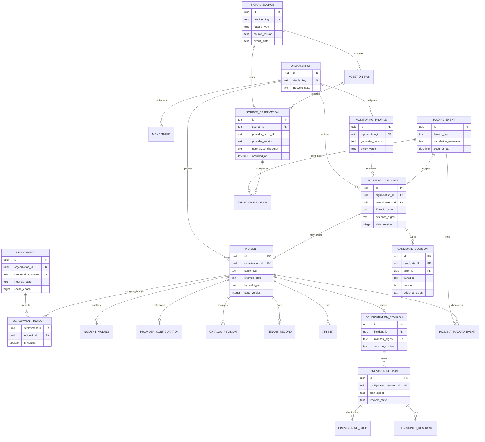

## 3. Evidence, identity, relationship, and taxonomy model

The model borrows the useful separation of sources, derivation activities, and conclusions from provenance systems, and the stable concept/mapping semantics of knowledge-organization systems. It stays relational. Family Search identity resolution and family/household relationships are separate graphs, and neither is a public projection by default.

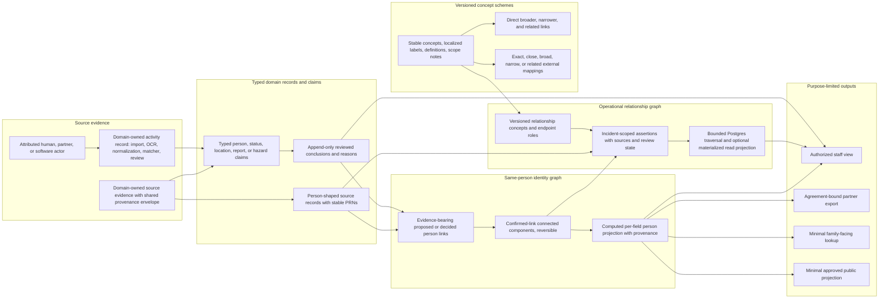

The arrows do not grant publication rights. Every output applies incident scope, purpose, consent or other approved legal basis, source restrictions, field allowlists, and retention state. Conflicting claims remain visible to authorized staff; accepted conclusions change a projection, not the historical evidence. The provenance envelope is shared code; storage remains domain-owned.

## 4. Family reunification identity, relationship, case, and privacy boundaries

```mermaid
flowchart TB
  subgraph tenant["One trusted TenantScope: organization plus incident"]
    missing["Missing-person source record"]
    patient["Hospital-patient source record"]
    unidentified["Reviewed unidentified-person record"]
    importRow["Patient import row with bounded raw retention"]

    prn["Scoped person_records and stable PRN registry"]
    matcher["Incident-scoped deterministic matcher"]
    proposal["Proposed evidence-minimal person_link"]
    identityReview["Human identity review"]
    confirmed["Confirmed identity links"]
    cluster["Computed reversible identity cluster"]
    staffProjection["Staff golden projection with per-field provenance"]

    relationship["PRN-to-PRN relationship assertion"]
    relationshipReview["Separate relationship review"]
    tracing["Tracing request and participants"]
    reunification["Reunification case"]
    disclosure["Separate contact and disclosure decision"]
    handoff["Separate official handoff decision"]
    outcome["Separate reunion or unresolved outcome"]

    authorization["Versioned processing and publication authorization"]
    publication["Expiring field allowlist and mediated contact"]
    publicView["Minimal public missing-person projection"]

    privacyOp["Checkpointed data-subject or privacy operation"]
    deindex["First: deindex and purge public caches"]
    tombstone["Then: source tombstone and raw-data policy"]
    recompute["Then: link and cluster recompute"]
    reproject["Then: relationship and case reprojection"]
    verify["Finally: verify retained evidence and disclosures"]

    missing --> prn
    patient --> prn
    unidentified --> prn
    importRow --> patient
    prn --> matcher --> proposal --> identityReview --> confirmed --> cluster --> staffProjection

    prn --> relationship --> relationshipReview
    relationshipReview -."read projection only".-> cluster
    tracing --> reunification
    cluster --> reunification
    relationshipReview --> reunification
    reunification --> disclosure --> handoff --> outcome

    authorization --> publication --> publicView
    cluster -."approved fields only".-> publication
    disclosure -."mediated route only".-> publication

    privacyOp --> deindex --> tombstone --> recompute --> reproject --> verify
  end

  otherTenant["Any other incident scope"]
  denied["Hard deny: no lookup, match, edge, cache, or Queue effect"]
  otherTenant --> denied
```

There is intentionally no arrow from a relationship assertion to the matcher or an identity merge. Identity, relationship, current status/location, disclosure, official handoff, and reunion are different decisions. Every family node is tenant-scoped; only concept definitions can be shared, and records pin the concept-scheme revision they used.

## 5. Multi-source detection and correlation pipeline

```mermaid
flowchart LR
  subgraph sources["Approved signal sources"]
    realtime["USGS realtime GeoJSON"]
    fdsn["USGS FDSN reconciliation"]
    additional["Additional approved source"]
    manual["Verified operator observation"]
  end

  adapters["Versioned source adapters"]
  networkGuard{"HTTPS, host, size, type, redirect, timeout valid?"}
  runtimeSchema{"Runtime schema and provenance valid?"}
  quarantine[("Quarantine metadata and redacted failure receipt")]
  observations[("Immutable idempotent observations and revisions")]
  health["Source freshness, latency, schema drift, cursor and circuit health"]
  correlate["Deterministic correlation by aliases, hazard, time, distance, geometry, region"]
  event[("Canonical hazard event and adopted correlation generation")]
  profiles["Organization monitoring profiles and versioned policy"]
  candidate[("Organization-scoped incident candidate")]
  review["Capability-gated human review"]
  suppress["Reject, suppress, merge, split, or request evidence"]
  provision["Signed and expiring preview-provisioning request"]
  replay["Isolated replay and outcome comparison"]
  catalog["Compatibility projection to existing earthquakes API"]

  realtime --> adapters
  fdsn --> adapters
  additional --> adapters
  manual --> adapters
  adapters --> networkGuard
  networkGuard -- "No" --> quarantine
  networkGuard -- "Yes" --> runtimeSchema
  runtimeSchema -- "No" --> quarantine
  runtimeSchema -- "Yes" --> observations
  observations --> health
  observations --> correlate --> event --> profiles --> candidate --> review
  observations --> catalog
  review -- "Approve preview" --> provision
  review -- "Reject or reshape" --> suppress
  quarantine --> replay
  observations --> replay
  replay -->|"approved adopted generation only"| correlate
```

Detection never changes public routing. Provider revisions and withdrawals append evidence and recompute candidates. Silence or outage never means that an event ended.

## 6. Tenant and incident provisioning lifecycle

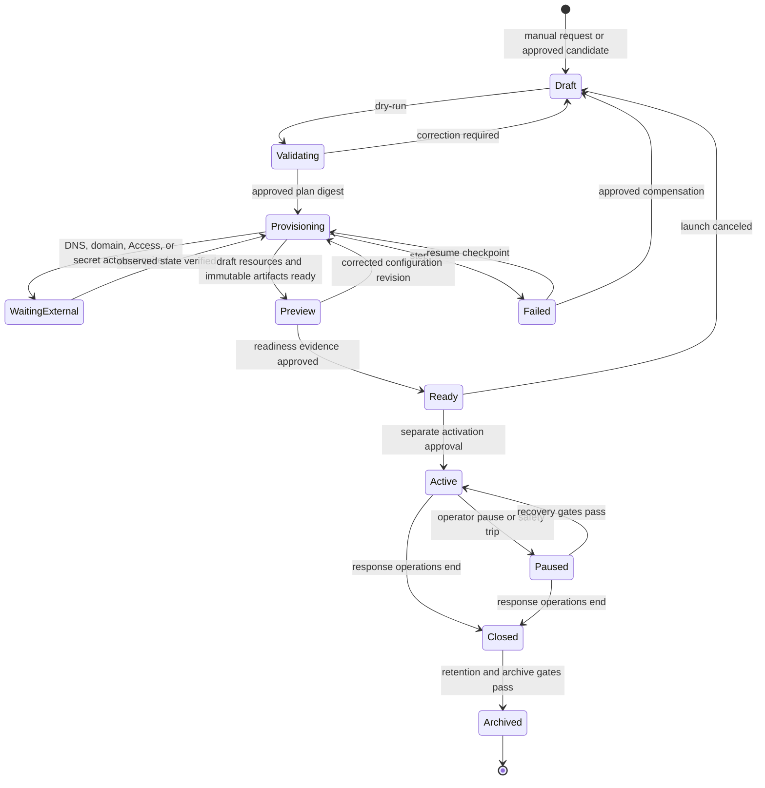

Only `Ready → Active` can attach public authority. Queue/Cron producers and outbound notifications stay off until their post-routing activation gates. Validating and WaitingExternal are provisioning-run/step states (U23's `provisioning_runs`/`provisioning_steps`), not additional values of the incident `lifecycle_state` enum fixed by R24 (`draft | provisioning | preview | ready | active | paused | closed | archived | failed`).

## 7. Candidate approval, preview, and activation sequence

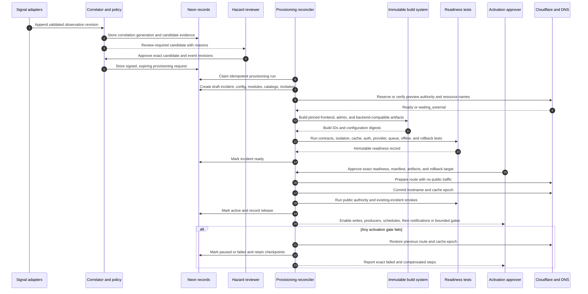

Provider secret values never enter Postgres, manifests, diagrams, logs, or readiness records. Only secret references and versions are recorded.

## 8. Zero-planned-downtime compatibility boundaries

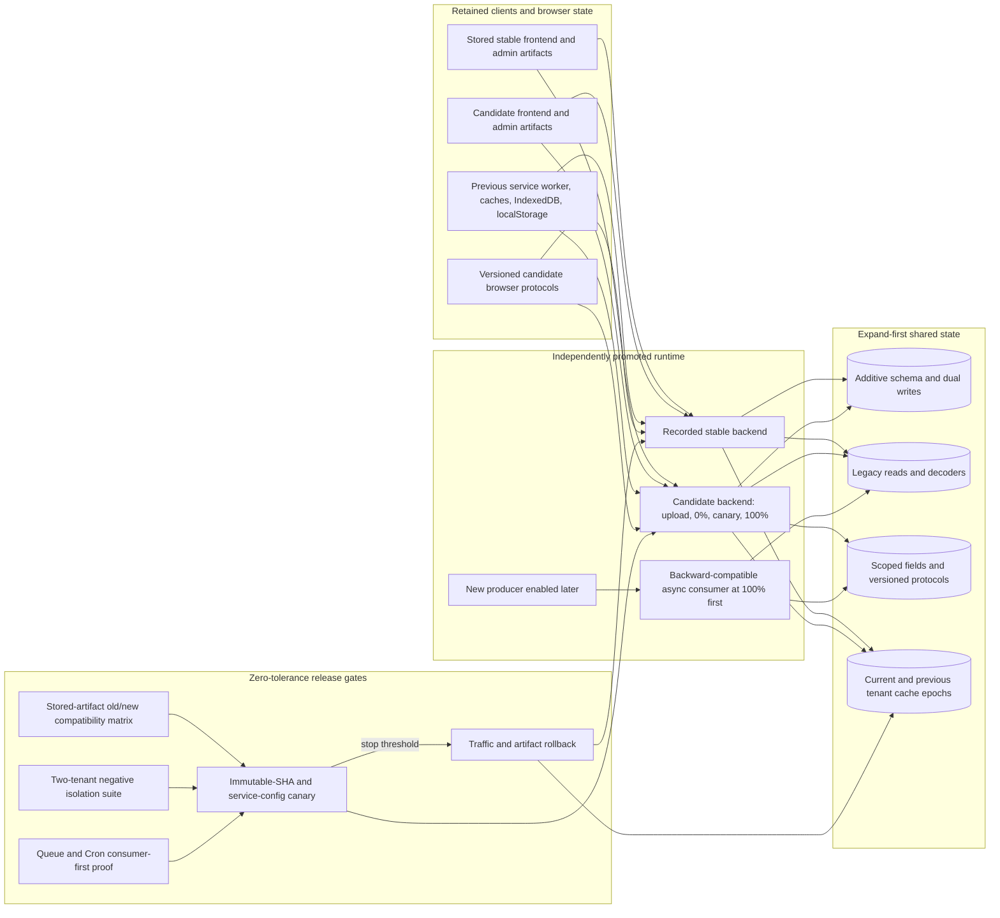

The database expands before candidate code. Consumers reach 100% before new producers. An HTTP canary does not prove Queue/Cron behavior. Rollback changes traffic and artifacts, not additive schema. Wrong-tenant, data-loss, and authorization signals have a zero-error threshold.

## 9. Capability rollout ladder

```mermaid
flowchart LR
  A["Current USGS catalog"] --> B["USGS adapter dual-write"]
  B --> C["Shadow observations and source health"]
  C --> D["Replay and compatibility parity"]
  D --> E["Shadow correlation"]
  E --> F["Review-only candidates"]
  F --> G["Approved preview provisioning"]
  G --> H["Manual two-phase activation"]
  H --> I["Additional approved sources"]
  I --> J["Multi-source policy tuning"]
```

Each arrow is a promotion gate. Stop until the previous stage has parity, source-health, replay, isolation, and rollback evidence.

## 10. Runtime public deployment and communications launch

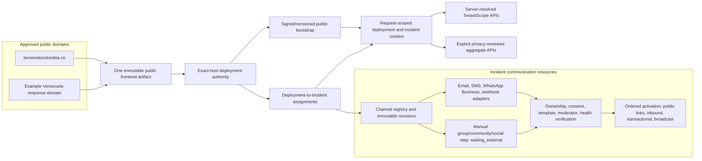

The domain selects a deployment, not a database tenant supplied by the browser. A deployment can present several approved incidents, but ordinary data calls still carry one trusted scope. Channels use the same desired-state/checkpoint model whether a provider API performs the work or a human must create and verify the resource.

## 11. Administrative surfaces and authority boundaries

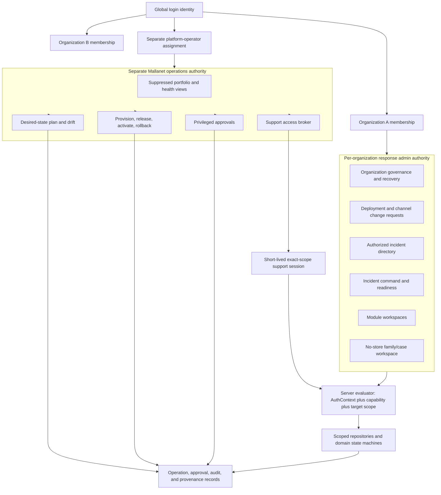

Platform, organization, deployment, incident, and module/case are fixed scope types, but deployment and incident are organization-owned peers rather than a simple hierarchy. Platform sessions and organization sessions never union. Mallanet operators can manage lifecycle metadata and safe health projections; tenant operational data requires organization membership or an approved support session.

## 12. Readiness, approval, and public activation sequence

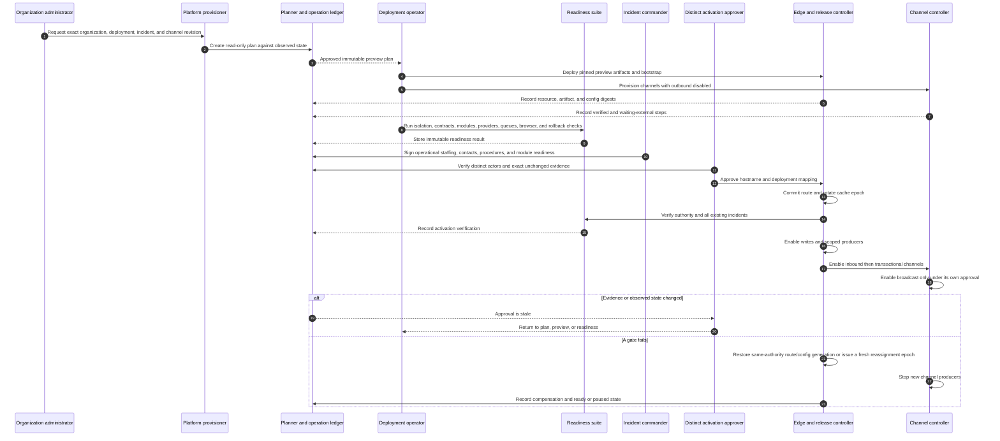

Organization readiness is necessary but does not grant infrastructure authority. The executor cannot satisfy an approval that requires another actor. Approval pins immutable evidence, not a mutable incident name.

## 13. Support-session lifecycle

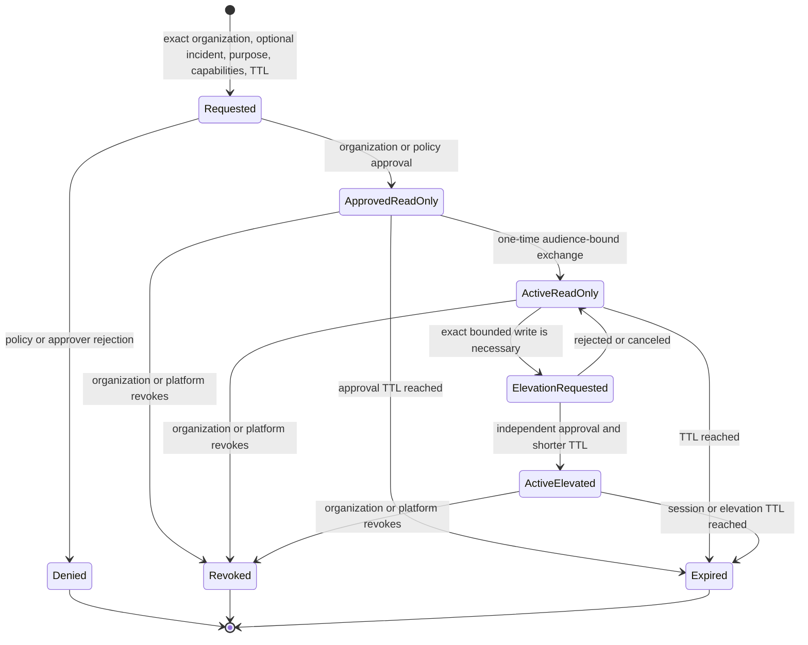

The engineer remains the actor and never impersonates an organization user. Every request checks exact scope, allowlisted capability, audience, expiry, and revocation. Membership, grants, API keys, secrets, exports, deployment/hostname actions, sensitive disclosure, and further support grants are denied by default. Break glass is a separate, stronger, notified, time-bounded procedure with mandatory review.

## 14. Cache hierarchy, trust, and no-store lane

The cache path begins only after trusted authority resolution and credential/audience classification. Upstash stores small disposable public or approved aggregate projections. It never stores photos, person/case/contact data, authorization state, queues, rate-limit truth, or operation ledgers.

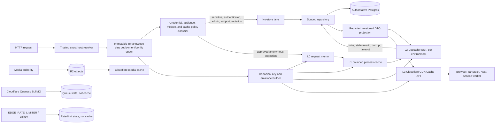

## 15. Authoritative write, invalidation, privacy purge, and reassignment

Normal writes succeed independently of cache availability. Security- or privacy-critical transitions are stricter: they advance authoritative reachability first and do not complete until every public path is verified.

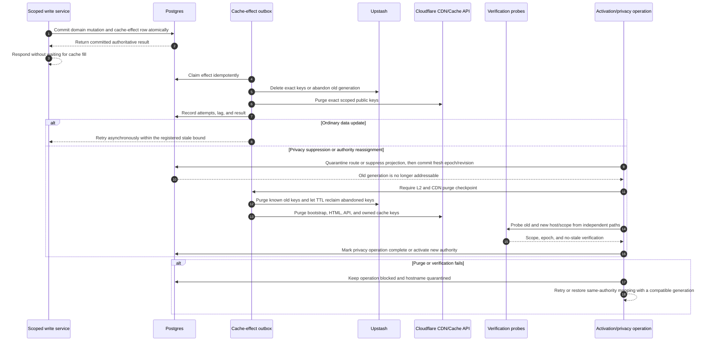

A cross-tenant hostname rollback or reassignment always issues a new epoch. It never restores an old authority epoch, even if the old Upstash keys still exist and are waiting for TTL expiry.

## 16. Volunteer-to-need intelligence and safe dispatch

The intelligence layer is deliberately split. Models can structure language and reduce uncertainty; hard policy decides who is eligible; the assignment ledger controls real-world commitments.

```mermaid
flowchart LR
  subgraph scope["Hard boundary: one Organization + Incident"]
    volunteer["Volunteer signup"] --> offer["Versioned offer\ncapabilities, pickup truck, 100-mile radius/corridor, payload, availability"]
    requester["Help request"] --> need["Versioned need\nrequired equipment, quantity, urgency, place/privacy, time, risk"]

    offer --> extract["AI-assisted extraction\nproposed fields + confidence"]
    need --> extract
    extract --> confirm["Participant confirms or corrects"]
    confirm --> missing{Material fact missing?}
    missing -- yes --> registry["Highest-value approved question\nlocalized, minimal, rate-limited"]
    registry --> confirm
    missing -- no --> candidate["Partitioned candidate retrieval\nincident + taxonomy + geography + time"]

    candidate --> hard["Deterministic hard filters\nscope, consent, safety, credentials, capacity, availability"]
    policy["Versioned jurisdiction/incident policy pack"] --> hard
    hard -- denied --> reason["Stable deny/review reason"]
    hard -- eligible --> rank["Explainable score\nurgency, fit, travel, aging, workload, fairness"]
    rank --> optimize["Optional bounded optimizer\nteams, task splits, route stops"]
    optimize --> proposal["Candidate proposal"]
    proposal --> reserve["Atomic expiring capacity reservation"]
    reserve --> consent["Two-sided acceptance"]
    consent --> disclose["Policy-gated staged location/contact disclosure"]
    disclose --> assigned["Assignment + check-ins + welfare timers"]
    assigned --> outcome{Physical-world outcome}
    outcome -->|complete with evidence| complete["Completed"]
    outcome -->|decline, expiry, no-show| replan["Release capacity and replan"]
    outcome -->|harm, conflict, overdue| casework["Moderation/welfare case\nintervene, appeal, kill switch"]
    replan --> candidate
  end

  ai["Model / embedding / route provider"] -. "advisory only" .-> extract
  ai -. "advisory only" .-> rank
  ai -. "cannot override" .-> hard
  otherIncident["Other incident"] -- "hard deny" --> hard
```

## 17. Per-category autonomy ladder and rollback

Autonomy is not a platform-wide switch. Each cell is an incident + jurisdiction + task/risk category + action policy with its own evidence and rollback target.

```mermaid
stateDiagram-v2
  [*] --> Shadow
  Shadow: Compute only; no participant effect
  Shadow --> Recommend: replay + safety + quality gates
  Recommend: Operator sees ranked candidates and reasons
  Recommend --> Ask: approved question registry + consent gates
  Ask: System can ask one bounded clarifying question
  Ask --> Invite: channel consent + rate/frequency gates
  Invite: System can send a consent-based proposal
  Invite --> Reserve: concurrency + cancellation + support gates
  Reserve: System can place an expiring capacity hold
  Reserve --> Dispatch: low-risk policy + duty-of-care approval + two approvers
  Dispatch: System can assign/replan inside approved limits

  Shadow --> Paused
  Recommend --> Paused
  Ask --> Paused
  Invite --> Paused
  Reserve --> Paused
  Dispatch --> Paused
  Paused: Stop new automated effects; preserve accepted work and welfare monitoring
  Paused --> Shadow: corrected policy/model + replay + approval
```

Every promotion pins source build, schema, model/prompt, taxonomy, policy, communication template, metric window, approvers, blast radius, and rollback target. High-risk categories remain in human review even when a low-risk category reaches dispatch.
