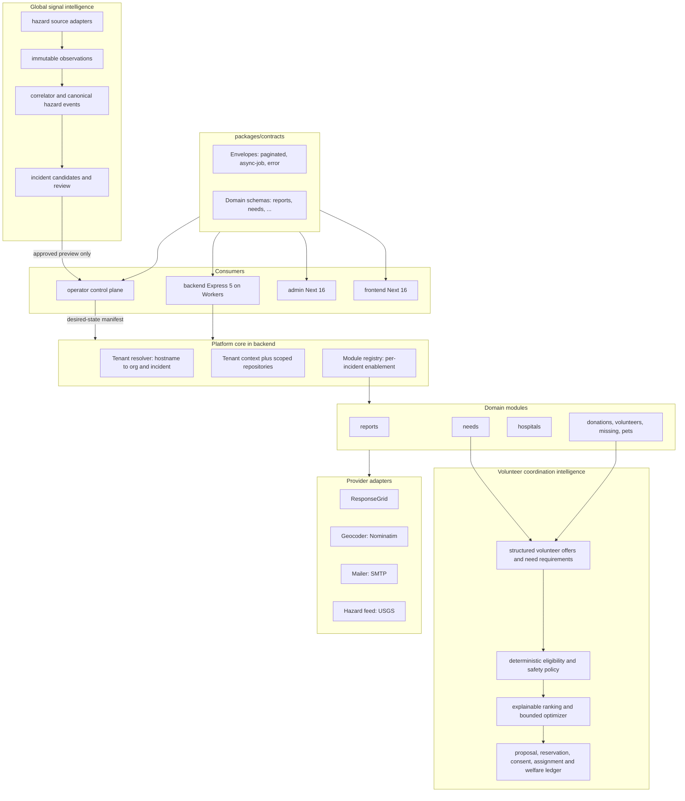
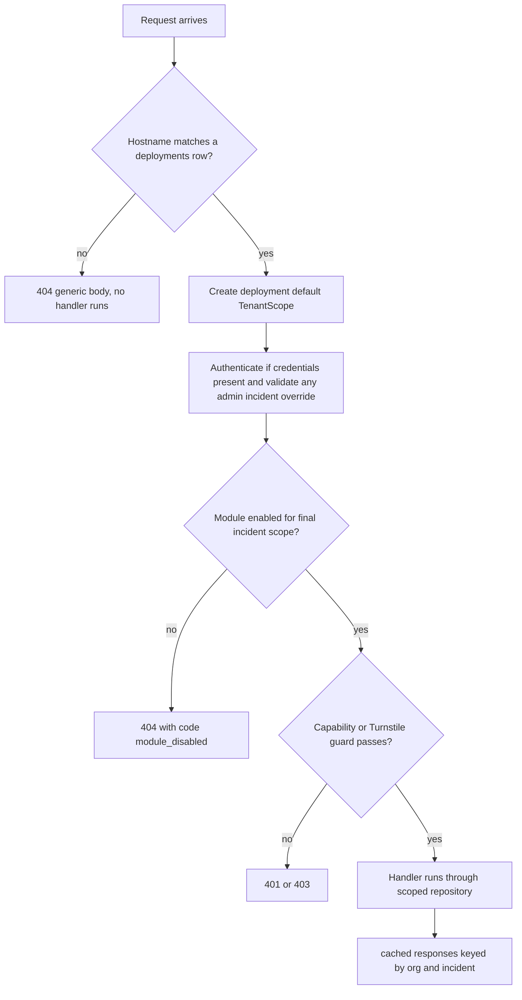
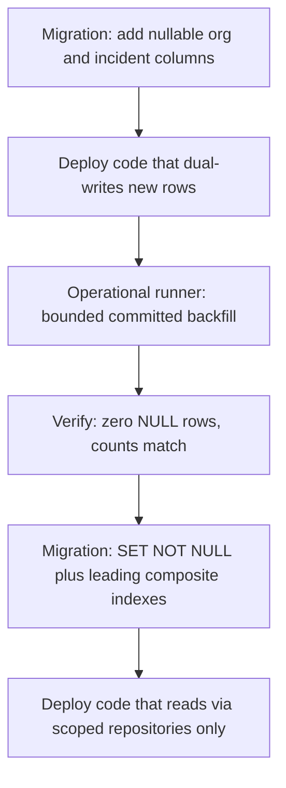

# Multi-Incident Platform Migration - Plan

**Architecture diagrams:** [Multi-Incident Platform Diagram Pack](./2026-08-12-001-refactor-multi-incident-platform-diagrams.md)

**Execution ledger:** [2026-08-21 execution ledger](./2026-08-21-001-multi-incident-platform-execution-ledger.md)

**Phase 0 reconciliation (2026-08-21):** this plan's original review SHA is `89089da`. Current immutable `origin/main` is `83b7c16` (67 commits later, including official deceased lists, reconstruction-campaign tables/routes, Stripe Checkout donations, volunteer ficha, family-query performance, and `/api/deceased` on the JSON edge-cache allowlist). Do not bootstrap from `89089da` or from a dirty feature branch. U6/U19 record `83b7c16` unless a later fetch moves `origin/main` before clone. U7 classification and U13 domain extraction must include campaign reconstruction and official deceased. The donations DDD module is an external Stripe Checkout adapter plus Payment Links; it is not Mallanet money movement. Cache inventory at `83b7c16`: 24 `cached()` sites and 34 blanket `invalidate()` calls. No platform repository exists yet.

**Target repo:** Phase A lands in this repo. Do not bootstrap from the current feature worktree. U6 selects a freshly fetched immutable `origin/main` commit. This plan's Phases B-F, U27, and post-foundation U35 land in the new platform repo; Phases G-H are owned by the linked operability follow-up plan. The platform repo is canonical for platform development after U6. This repo remains the only Colombia production release source until U21 completes. U19 imports every relevant Colombia mainline change during that interval. After U21, the platform repo becomes the production release source and this repo becomes read-only except for break-glass use. All paths below are repo-relative until the repositories diverge.

## Goal Capsule

- **Objective:** evolve Mallanet from the Colombia-only deployment into a multi-incident platform — shared contracts, tenant scoping, modules/providers/catalogs, evidence-backed person and relationship records, and a safe volunteer-to-need coordination foundation — without breaking the live Colombia production deployment. Operability capabilities that make the platform usable for a second incident (tenant/incident provisioning, hazard-signal detection, a runtime-configured public frontend, rapid communications launch, and separated nonprofit/response administration) are a separate follow-up plan; see Scope Boundaries → Deferred to Follow-Up Work.
- **Authority:** Product Contract Requirements own product behavior. Key Technical Decisions own implementation mechanisms within their cited Rs. Repo conventions (`AGENTS.md`, `CLAUDE.md`) govern where this plan is silent, especially the migration discipline: migrations are manual, land before dependent code, in their own commits.
- **Execution profile:** phased A-F, plus U27 and post-foundation U35. Phase A, B, and F units are concrete. Phase C-E units are coarse by design and are re-planned per module as they approach, except concrete U27 because the already-live identity graph must migrate atomically and U35 because safety/autonomy cannot be left to an underspecified volunteer sub-plan. U35 is not a U21 cutover gate. Each domain sub-plan must include contract migration, tenant-aware HTTP and non-HTTP access, durable-state compatibility, cache isolation, source synchronization, rollout order, and contingency actions. Phases G and H — tenant/incident provisioning, hazard-signal detection, the runtime-configured public frontend, communications, and Mallanet-wide/response-scoped administration — are extracted to the follow-up plan at `docs/plans/2026-08-14-001-feat-platform-operability-plan.md`, gated on this plan's U21/U22 completion and a named second-incident driver.
- **Stop conditions:** a schema change that cannot follow the expand-first/manual/before-code discipline; a cross-incident isolation test failure; evidence that a settled decision cannot work (report it, do not improvise around it); any change that would break a public URL or make a non-additive change to a public payload.
- **Tail ownership:** work lands through PRs. U0 replaces immediate frontend/admin activation with immutable-SHA promotion and production approval. The backend stays independently promotable. U19 owns source synchronization until U21 transfers production ownership.

---

## Product Contract

### Summary

Turn the Colombia deployment into the first tenant of a multi-incident platform: contracts become shared and validated, every operational record gains explicit organization/incident scope, domains become configurable modules, identity and operational values move into catalogs, the already-live family identity slice migrates safely, and a tenant-safe shared application cache protects the authoritative database. The platform also establishes a safe, incident-scoped volunteer coordination substrate that can grow from operator recommendations into policy-bounded autonomous dispatch. Provisioning, signal detection, runtime public deployments, communications, and nonprofit-wide operations remain in the linked operability follow-up plan.

### Problem Frame

The current system is a single-tenant deployment with hand-mirrored API types. Frontend and admin cast responses with unchecked `as T` (`frontend/lib/api.ts`, `admin/src/shared/http/http-client.ts`) against interfaces maintained by hand; commit `8f3a256` is a live specimen of the resulting drift class (reports silently truncated at page 1; queued-needs status unusable in production). Colombia-specific values are hardcoded across the codebase — including leftovers from the template's prior life (`hospital_ivss`, a Venezuelan facility type, in `frontend/lib/hospitals-meta.ts`) — and launching a new incident today means cloning a template repo and hand-editing it. The platform model replaces repo-cloning per incident with configuration on one codebase, but must be reached incrementally while Colombia stays live.

### Requirements

**Contracts**

- R1. A shared contracts package is the single source of truth for API request/response schemas, envelopes, enums, and error shapes, with TypeScript types inferred from the schemas.
- R2. Frontend and admin validate API responses at runtime for migrated endpoints. They do not use unchecked casts. In production report mode, a validation failure logs the mismatch and passes `unknown` data to an endpoint-specific legacy adapter. The adapter can preserve usable fields and add documented safe defaults. It does not type the raw value as valid. Enforce mode starts only after an explicit decision, so the migration does not hard-fail a citizen flow by default.
- R3. Reports and needs are the first migrated contract surfaces. Reports include list, detail, create, edit-token response, edit request, confirmations, photos, and the citizen-shelter projection consumed by `/api/acopio`. Needs include the queued `202 { queued, jobId }` publish flow and its status polling.
- R4. Pagination, async-job status, and the error envelope are standardized as reusable contract shapes; public payload changes are additive-only during the migration.
- R5. All existing public URLs and payload compatibility are preserved; versioned endpoints are introduced only if a compatibility adapter can no longer absorb a change.

**Platform core**

- R6. The platform core introduces organization, incident, and deployment entities; the existing Colombia deployment is seeded as the first organization and its active incident.
- R7. Every operational record is classified: tenant-scoped tables carry `organizationId`/`incidentId`; global tables (catalog, cache, infrastructure) are explicitly listed as global with a recorded reason.
- R8. Tenant context resolves server-side from hostname/deployment configuration; a request with an unrecognized hostname gets a 404; admin workflows select the incident explicitly.
- R9. One incident cannot read or mutate another incident's data. This is proven by negative isolation tests and includes every cache layer: per-request/process memory, Upstash shared application cache, Cloudflare edge cache, server-render caches, browser query/storage, and media references.
- R10. One global login principal can have independent organization memberships. Authorization evaluates `(principal/membership, capability, target scope type/ID, environment, active interval)`; named roles are organization-owned capability templates, not authority by themselves. The platform extends the existing capability catalog without adding a general policy-language/RBAC suite, and it eliminates the current NULL/global and system-role wildcard semantics before organization two.

**Modules and providers**

- R11. Reports, collection centers, needs, hospitals, donations, volunteer analytics, volunteers, psychology support, missing persons, family reunification, pets, reconstruction campaign, and official deceased lists become independently enable-able modules behind stable service interfaces. Family reunification is an authenticated/admin module that depends on selected person populations; disabling its matcher/signals/case workflows does not require disabling the public missing-person, hospital, or official-deceased modules. The reconstruction campaign and official deceased lists are live Colombia domains added after the original review SHA; they follow the same tenant and contract rules as the other operational modules.
- R12. External services (ResponseGrid, geocoding, email, hazard feeds) sit behind provider adapters with configuration checks. A module disabled for an incident returns 404 with a machine-readable `code`; an enabled module whose provider is misconfigured keeps the existing 503 behavior.
- R13. Enabling ResponseGrid for an incident remains a separate operational launch: validated incident, credentials, and a staging end-to-end test.

**Configuration and catalogs**

- R14. Country- and incident-specific values — identity document types, geography labels, facility taxonomy, currency, donation payment-link URLs, emergency contacts, hazard terminology — move into incident configuration and catalogs with stable internal IDs (donation links are catalog values, not provider adapters, per the payment scope boundary).
- R15. Modules and providers are opt-in per incident, with clear unavailable states for everything not enabled.

**Governance**

- R16. Versioned OpenAPI is generated from the shared contracts and committed as a baseline; CI fails on breaking contract changes against that baseline.
- R17. CI enforces tenant scoping (lint rule), migration discipline (the existing journal and drift gates), and provider configuration validation; each migrated module passes staging validation before production promotion.

**Migration continuity**

- R18. Ongoing Colombia changes continue safely while the platform is built. Every source commit receives a recorded merge, adaptation, configuration move, supersession, or block disposition.
- R19. Production promotion uses an immutable source SHA and an identified Worker version. The operator promotes the exact artifact that passed staging and canary checks.
- R20. Each domain migration has a tested stop, rollback, repair, and resume path. Normal rollback changes code or flags and leaves additive schema in place.
- R21. Queue messages, browser offline records, service-worker caches, and API clients remain compatible across the complete retention and rollback window.
- R22. Capability and edit tokens are bound to organization, incident, resource, purpose, and token version where applicable. A token from one incident cannot authorize a resource in another incident.

**Shared caching**

- R59. Upstash Redis over HTTPS REST is the initial shared application/result cache (L2) behind a provider-neutral cache port. PostgreSQL remains authoritative. Per-request/process memory, Cloudflare CDN/Cache API, R2 media, Next/TanStack/service-worker/browser caches, Cloudflare Queues, BullMQ/Valkey, and rate limiting remain separate layers with separate correctness and failure contracts.
- R60. Every shared cache entry is registered and typed. Its policy names owner, data/visibility class, key and value schema versions, fresh/stale/absolute TTL, negative-cache permission, maximum serialized bytes, invalidation triggers, fallback behavior, metrics, and retirement rule. Initial Upstash eligibility is limited to explicitly approved public or de-identified aggregate DTOs. Credentials, tokens, request headers, raw database rows, citizen submissions, family/person/case/evidence/contact/patient data, auth/grant/support/approval/consent/revocation/privacy-operation data, and unrestricted admin results are `no-store` at every cache layer.
- R61. A canonical key builder includes environment, trust audience, organization, incident, applicable deployment/config revision, authoritative cache epoch, resource/projection, schema/key version, locale/visibility variant, and a bounded digest of canonical parameters. A dimension can be omitted only when the registry proves it inapplicable. A reviewed global key names provider, geography, and source revision. Keys and telemetry never contain raw URLs/query strings, names, locations, phones, emails, documents, tokens, actor IDs, or guessable unsalted search/filter values.
- R62. Authoritative mutation commits before any cache effect. Ordinary derived-cache invalidation is idempotent and scoped by exact key or version/generation; broad `KEYS`, `SCAN`, wildcard deletion, `FLUSHDB`, or translating today's blanket `invalidate()` into a vendor-wide purge is prohibited. Privacy withdrawal, publication suppression, hostname reassignment, incident/deployment authority changes, and emergency correction first advance an authoritative PostgreSQL/config epoch so old entries become unreachable, then durably checkpoint Upstash invalidation, Cloudflare purge, and verification before the operation completes.
- R63. Cache failure changes performance, not correctness or tenant authority. Timeout, throttle, quota, eviction, corruption, oversize value, schema mismatch, partial pipeline error, stale replica, or total Upstash loss becomes a bounded miss and authoritative-origin read. Only a registry-approved public response can use same-scope/current-epoch stale data, and only until `staleUntil`; stale is never indefinite. A critical purge or public activation fails closed until its authoritative epoch and purge verification succeed.
- R64. Production and staging use physically separate Upstash Global databases, credentials, budgets, and alerts. The production cache uses eviction and mandatory TTLs; nothing requiring durable coordination is stored there. REST credentials stay server-side, use the narrowest available ACL/key-prefix/command permissions, rotate independently, and never enter runtime bootstrap or browsers. A provider kill switch and `disabled | shadow-write | canary-read | read-write` modes make rollback independent of cache contents.

**Volunteer coordination intelligence and safe dispatch**

- R65. Volunteer supply and help demand are incident-scoped, versioned, time-bound contracts rather than free-form profiles alone. A volunteer offer can describe capabilities, equipment, payload/passenger limits, languages, accessibility constraints, service radius or route corridor, availability, communication consent, verification tier, and work-risk limits. A need can describe required capabilities/equipment, quantity/capacity, urgency, location privacy tier, time window, dependencies, beneficiary constraints, and risk class. Every field records source, freshness, confidence, and whether the person confirmed an AI-extracted value.
- R66. Matching is bidirectional: each eligible need can retrieve volunteers and each volunteer can retrieve needs. A deterministic eligibility layer first enforces tenant/incident, module, geography, time, capacity, verification, consent, safety, legal/operational policy, and current availability. Only eligible candidates enter a versioned ranking or optimization stage. No model score can override a hard denial or make an otherwise-ineligible pair feasible.
- R67. The initial intelligence layer can extract proposed structured attributes from free text, map them to U15 taxonomies, identify uncertainty, select the next highest-value question from a localized approved registry, improve semantic recall, summarize why a candidate fits, and flag content for safety review. It cannot invent sensitive questions, silently alter confirmed facts, authorize restricted work, disclose protected locations/contact, or make an irreversible moderation or assignment decision. Every model/rule/prompt/policy version, proposed field, confidence, correction, and operator override is replayable without retaining unnecessary raw PII.
- R68. A match is not an assignment. The workflow separates candidate, proposal, expiring reservation, volunteer acceptance, requester/authorized-coordinator acceptance, assignment, check-in, completion evidence, cancellation, no-show, reassignment, dispute, and closure. Capacity is reserved atomically to prevent double-booking. Exact address and direct contact remain mediated or hidden until the applicable policy and two-sided consent permit staged disclosure.
- R69. Autonomy is earned independently for each incident, jurisdiction, task category, risk tier, and action. The ladder is: shadow evaluation; operator-visible recommendations; automatic approved clarifying questions; consent-based invitations; automatic reservation; and automatic dispatch/replanning for explicitly allowlisted low-risk work. Promotion requires recorded thresholds for safety, precision, completion, fairness, moderator load, cancellation/no-show, participant burden, and rollback readiness. High-risk, ambiguous, vulnerable-person, medical, hazardous-material, cash, private-home, passenger-transport, or locally restricted work remains human-reviewed unless a later approved policy proves a safer boundary.
- R70. Safety and moderation are foundational control-plane capabilities. Versioned jurisdiction/incident policy packs define prohibited, restricted, and allowed categories; required credentials, insurance/partner coverage, safeguarding, disclosure, welfare checks, escalation, and approval roles; and incident-command overrides. The system combines structured allowlists/denylists, deterministic rules, model signals, identity/equipment/credential evidence, anomaly/abuse detection, participant block/report tools, moderator cases, appeals, and task/category/incident kill switches. A model signal can escalate but cannot by itself clear a hard safety rule.
- R71. The matcher supports surge scale without an all-pairs scan. Candidate generation partitions by organization, incident, taxonomy, geography, time, risk, and availability; spatial/temporal indexes retrieve a bounded top-K set; idempotent event-driven recomputation updates only affected partitions. Batch optimization for scarce resources, team formation, task splitting, route stops, dependencies, aging, fairness, and workload runs with strict time/size limits and returns the best feasible plan found plus an explicit incomplete/unknown state. Queue success never means the physical task succeeded.
- R72. Volunteer outreach and match notifications use the governed communications layer from the follow-up plan. Each channel honors verified destination, purpose-specific opt-in, template/version, locale, quiet hours, rate/frequency caps, STOP/HELP, delivery receipts, and escalation policy. Dynamic questions and invitations minimize data and burden; decline, snooze, change-radius, change-availability, block, and report are always available. WhatsApp/SMS/email messages do not disclose exact private locations, sensitive need text, or counterpart contact before the staged-consent gate.
- R73. Real-world duty of care continues after assignment. Offers, needs, reservations, and location/availability claims expire and require reconfirmation. Assignments can require arrival/departure/welfare checkpoints, offline-capable acknowledgments, overdue timers, incident-command escalation, and reconciliation of delayed or conflicting events. Completion is an evidence-backed claim, not an inference from notification delivery or queue ACK. Reputation remains incident/purpose-scoped evidence with explanation and appeal; the platform does not create a hidden global social score.
- R74. The system optimizes safe completed assistance and reduction of aged unmet need—not engagement or raw match volume. Required measurements include time to first feasible proposal/assignment, acceptance, completion, cancellation/no-show, travel burden, volunteer utilization, unmet-need aging, question burden, safety reports/confirmed harm, false-positive/false-negative moderation, appeals, moderator workload, and allocation outcomes across geography, language, accessibility, connectivity, and verification tier. Learning or model promotion uses consented, minimized, policy-approved data and offline replay; production PII is not training/evaluation data by default.

**Records, evidence, relationships, and taxonomies**

- R33. A source record, a claim about a person or event, a reviewed conclusion, and the current display projection are distinct objects. Conflicting claims remain visible and attributed; accepting one conclusion does not overwrite or erase its sources.
- R34. Every imported or derived claim carries a common provenance envelope: stable source namespace and external ID, source authority class, source-event time, ingestion time, contributing human or software actor, adapter/model/rule version, original checksum or protected object reference, transformation lineage, and incident scope when the claim is operational. Domain payloads stay domain-specific.
- R35. Person-to-person and person-to-record relationships are explicit, typed, directed where the type requires it, evidence-backed, versioned, and reversible. Each assertion records the relationship concept/version, endpoints and roles, validity interval when known, confidence or review state, source references, actor, reason, and supersession/rescission history. No inferred relationship becomes confirmed truth without the domain's review policy.
- R36. Identity resolution preserves the existing PRN/confirmed-link/cluster model. PRNs identify source records; clusters represent a reviewed same-person conclusion; membership and merge history remain reversible; the display or “golden” person is a computed projection with per-field provenance, never a destructively merged row.
- R37. Controlled vocabularies use versioned concept schemes with stable machine keys, localized preferred/alternate labels, definitions and scope notes, direct broader/narrower/related links, deprecation/replacement, and explicit mappings to external schemes. Historical records and decisions retain the exact scheme revision used at the time.
- R38. Graph-shaped behavior uses explicit relational edge tables and bounded PostgreSQL traversal first. The platform does not add RDF storage, a universal graph abstraction, or a graph database for the initial build. A new store requires measured Postgres failure against named traversal, latency, scale, and operational criteria plus a migration/rollback decision.
- R39. Family-search data is purpose-limited humanitarian data. Collection, matching, staff access, partner transfer, public projection, retention, correction, deletion/tombstone, and export are separately authorized and audited. Public results expose the minimum approved fields and never expose internal clusters, relationship edges, evidence tokens, contact details, or source payloads merely because those objects exist.
- R40. Interchange uses source-specific adapters and stable external identifiers. FamilySearch GEDCOM/GEDCOM X, partner formats, and humanitarian vocabularies are research inputs or optional exchange mappings, not Mallanet's internal schema and not evidence that two records identify the same person.
- R41. Consent or another approved processing basis is a versioned receipt, not a boolean. It identifies the data subject or authorized guardian, purpose, data categories/fields, recipients, internal/partner/public visibility, notice version and language, grant/review/expiry/withdrawal times, actor, and evidence. Verification state and publication state remain separate: public does not mean verified, and verified does not mean public.
- R42. A tracing request is separate from the sought person's source records and identity cluster. It can have several requester, guardian, witness, staff, or contact participants, each with relationship assertion, contact preference, authorization, and visibility. Household/travel/reunification groups are separate from kinship and from same-person identity.
- R43. Cross-incident or cross-organization person matching/search is off by default. Any future federation requires an explicit purpose, capability, participating scopes, disclosure policy, audit trail, and tenant-safe matching token. Globally joinable document hashes, phone hashes, email hashes, or biometric identifiers are prohibited; biometrics are outside this plan.
- R44. A reunification case separates identity conclusion, relationship assertion, operational status/location, contact/disclosure, official handoff, and reunion outcome. No transition implies another. Contact or location disclosure—especially for a minor, patient, or safety hold—uses a separate capability and policy-configurable higher approval from identity review/merge.

### Key Decisions

- KD1. **The platform lives in a new repo created from an immutable mainline commit.** The clone happens at Phase B entry. The platform repo becomes canonical for platform development then. This repo remains the Colombia production release source until U21. Colombia production cuts over to the platform repo only after the final-delta and canary gates pass. (session-settled: user-approved — chosen over in-place extraction or a greenfield rewrite: cloning preserves the working production code and its CI while giving the platform a clean home.) Governs R6, R8, R18.
- KD2. **The platform replaces the clone-the-template-per-incident launch path.** Once the platform is live, new incidents launch as configuration; the template remains the fallback launch path until then. (session-settled: user-approved — chosen over maintaining both lineages indefinitely: two launch paths would fork every future fix.) Governs R6, R14, R15.
- KD3. **Scoped capability grants, not a general policy engine.** The platform extends the existing capability-key gate and fase-2 `org_id` stubs with an explicit membership/grant join model before organization two. The response admin remains organization-scoped; a separately deployed Mallanet operations console uses platform grants. This adds deployment/incident/module/case scopes and expiry/approval metadata without introducing a general-purpose RBAC/ABAC language. (session-settled: user-approved — capability grants plus fixed scope types cover nonprofit and response operations with an auditable model.) Governs R10, R51-R58 (follow-up plan).

### Simplicity guardrails

- Use one Postgres system of record. Model only the edges that the product reads or reviews; use recursive queries or projections for bounded traversal. Do not introduce Neo4j, RDF, an event-sourcing framework, or a second write authority in this program.
- Share a small provenance envelope and taxonomy infrastructure. Keep reports, person matching, hazard observations, provisioning, and audit decisions in domain-owned tables and contracts. Do not build a polymorphic “everything is an entity/claim/edge” table.
- Reuse the live Family Search identity model. U27 strengthens its sources, relationship vocabulary, privacy, and tenant adoption; it does not replace PRNs, `person_links`, decisions, or connected-component clusters.
- Keep automated facts and human conclusions separate. Adapters and matchers can propose and explain; domain state machines decide what is accepted, published, merged, or activated.
- For U35, ship deterministic eligibility, scored top-K, and the assignment state machine before embeddings or optimization. Add a model, H3 fan-out, route solver, or autonomous action only when a named measured gap and category-specific safety gate require it. Never build one global “autopilot” switch.
- Store asserted direct taxonomy links and relationship edges. Compute transitive taxonomy closure, identity clusters, and display projections; materialize only after profiling proves a read bottleneck and keep the source assertions authoritative.
- Treat interoperability as an adapter concern. Internal stable keys remain independent of any provider's vocabulary, identifier, or graph model.

### Scope Boundaries

**Deferred to Follow-Up Work**

- Zod 3 → 4 upgrade together with `@asteasolutions/zod-to-openapi` 7 → 9 (a hard fork, see KTD2) — its own isolated, fully-tested change after the migration.
- Postgres RLS as defense-in-depth tenant enforcement — KTD5 owns the driver/role/batch mechanism; the work stays deferred because each protected query must adopt that batch path first. Re-evaluate from the Phase B feasibility artifact in U6.
- Converting the three `file:`-linked packages to a minimal npm workspace root (see KTD1 alternatives).
- Per-tenant self-service CORS management (today `CORS_ORIGINS` is a static env list; adding an incident domain is a backend env change).
- `drizzle-kit` bump `^0.27` → current 0.x stable — scheduled inside U6, listed here because it must not silently ride along in a schema-changing PR.
- Platform operability: tenant/incident provisioning, hazard-signal detection, the runtime-configured public frontend, communications provisioning, organization authorization/governance, the Mallanet operations console, and governed analytics (U23-U26, U28-U33) — see [Platform Operability - Plan](./2026-08-14-001-feat-platform-operability-plan.md) (`docs/plans/2026-08-14-001-feat-platform-operability-plan.md`), gated on this plan's U21/U22 completion and a named second-incident driver.
- Unrestricted or universally autonomous dispatch. U35 can graduate individual low-risk actions/categories only through KTD66. Automated authorization of illegal/restricted work, emergency-command substitution, unreviewed high-risk dispatch, global reputation scoring, and cross-incident volunteer matching remain outside this plan.

**Outside this product's identity**

- Server-side payment processing or money movement (donations remain external payment links).

- ResponseGrid operational enablement (R13 keeps it a separate launch).

### Acceptance Examples

- AE1. **Covers R2, R3.** Given the reports list endpoint returns a page that matches the contracts schema, the frontend validates every fetched page with `safeParse`. The frontend then renders the data. Given a response that has no `totalPages`, report mode records the mismatch. The reports legacy adapter then accepts the value as `unknown`, adds its documented safe default, and returns a value that the renderer can use.
- AE2. **Covers R3, R4.** Given a citizen publishes a need, when the backend accepts it, then the response is `202` with the contracts async-job envelope, and polling the status endpoint returns a state that validates against the same envelope on both Cloudflare Queues and BullMQ transports.
- AE3. **Covers R9.** Given two seeded organizations with one incident each, when incident B's context queries any tenant-scoped endpoint, then rows created under incident A are absent, a direct write naming incident A's records is rejected, and a cached response produced under incident A is never served to incident B.
- AE4. **Covers R12, R15.** Given the pets module is disabled for an incident, when a client calls a pets route on that incident's hostname, then the response is 404 with `code: "module_disabled"`; given the needs module is enabled but ResponseGrid credentials are missing, then the existing 503 behavior is preserved.
- AE5. **Covers R8.** Given a request arrives with a hostname no deployment claims, when tenant resolution runs, then the response is a generic 404 and no tenant-scoped handler executes.
- AE6. **Covers R18.** Given Colombia receives a production fix after the platform fork, the sync ledger records every source commit. The platform adaptation passes the affected domain tests before platform feature work resumes.
- AE7. **Covers R19, R20.** Given a candidate backend Worker fails a canary threshold, the operator returns traffic to the recorded stable version. The additive schema and dual-written data remain valid for that version.
- AE8. **Covers R21.** Given an old phone holds an offline report record after the backend changes, the app migrates it to a recoverable draft. It requests fresh Turnstile verification before submission and does not discard the draft on 403, validation failure, or incompatible protocol.
- AE9. **Covers R9, R22.** Given a valid Colombia collection-center edit token, replaying it through another incident hostname returns not-found or forbidden. The response does not reveal whether the report exists.
- AE10. **Covers R9, R21.** Given a cached anonymous response for incident A, reassigning that hostname to incident B or removing it cannot serve A's response. A cache hit gets a fresh request ID and does not replay cached per-request headers.
- AE11. **Covers R21.** Given a version-1 offline report created before Turnstile was required, upgrading the app preserves it as a recoverable draft that requires fresh interactive verification. A 403 or validation response never silently deletes it.

- AE18. **Covers R33, R34, R38.** Given a hospital record and a citizen report disagree on a person's current location, both source claims remain intact with source/ingestion times and provenance. The staff projection can prefer the reviewed hospital claim without rewriting the citizen record, and reversing the decision restores the prior projection.
- AE19. **Covers R35, R36, R39.** Given two confirmed PRNs form one identity cluster and a reviewed `caregiver_of` assertion points to another person, unmerging the cluster preserves the source assertion and sends any now-ambiguous endpoint to review. It does not duplicate or silently attach the assertion to both resulting people, and incident B cannot discover the edge.
- AE20. **Covers R37, R40.** Given an external partner sends a relationship code that maps only approximately to the incident's taxonomy, the import stores the original code and adapter version, creates a `close` or broader/narrower mapping under the pinned scheme revision, and does not label it an exact match. Replaying under that revision yields the same normalized result after the current taxonomy changes.
- AE21. **Covers R33-R40.** Given a family-facing lookup, the response contains only the approved minimal person/status projection. Internal PRNs other than the public reference, cluster membership, relationship edges, contributor identity, source payload, matcher evidence, private contact fields, and unreviewed claims are absent and cannot be reached by following identifiers from the response.
- AE22. **Covers R39-R42.** Given a Colombia record whose current product flow publishes raw contact, the reviewed transition adds a mediated-contact route, migrates clients, removes the raw value from public responses/caches, and records historical authorization as `legacy_unknown` rather than inferred consent. Withdrawing the applicable authorization removes the mediated route from the public index without deleting the separately authorized internal tracing request or audit history.
- AE23. **Covers R36, R41-R43.** Given the same document value appears in two incidents, their purpose/incident-bound match tokens differ and neither matcher can discover the other. An explicitly authorized future federated workflow must use its own scoped protocol; a tenant operator cannot obtain or compare either raw value or equality token.
- AE24. **Covers R39, R42.** Given removal of a clustered public record fails during search de-indexing, the public projection is already unavailable, the request remains `processing` with a retryable checkpoint, and it is not reported complete until links, relationships, cache/search state, and required disclosure corrections verify.
- AE35. **Covers R9, R59-R61.** Given the same canonical public query is warm for incidents A and B, the Upstash keys and envelopes have different scope digests and neither request can receive the other's payload. A deliberately mismatched scope/epoch/schema envelope is discarded and the authoritative origin is read.
- AE36. **Covers R60, R61.** Given a missing-person search or report filter contains a name, phone, location phrase, email, token, or raw query, the canonical cache key/telemetry contains only a keyed bounded digest. The sensitive result is `no-store` until its policy is explicitly approved, and inspecting Upstash cannot recover the search term or payload.
- AE37. **Covers R62.** Given a cache-affecting database mutation commits and the invalidation worker fails twice, the durable effect remains pending and retries idempotently. A normal public list can be stale only through its declared window; a privacy/publication operation remains incomplete and unreachable through a new authoritative epoch until Upstash, CDN, and search verification succeeds.
- AE38. **Covers R62, R63.** Given Upstash returns timeout, throttle, 5xx, corrupt JSON, an oversized value, a partial pipeline error, or an evicted key, the cache adapter records a bounded miss and calls the scoped authoritative origin. A successful write never fails because cache population failed, and no stale-sensitive response is served.
- AE39. **Covers R63.** Given Upstash and the authoritative origin fail together, an allowlisted anonymous public projection can serve only a same-scope/current-epoch value before `staleUntil`. Bootstrap/authority, authenticated/admin, family/case, permission, consent, privacy, token, and mutation paths fail closed or return their defined unavailable response without cached sensitive data.
- AE40. **Covers R62-R64.** Given a hostname moves from incident A to B, activation first disables/quarantines the hostname, commits B's new deployment mapping and fresh epoch, and verifies Upstash/CDN/browser-cache isolation. Simulated stale replicas and undeleted A keys remain unaddressable; rollback to either authority issues another epoch rather than reusing A's old one.
- AE41. **Covers R59, R64.** Given the Upstash cache budget is exhausted or its credential is revoked, `CACHE_MODE=disabled` bypasses it without database restoration or public contract changes. Production coordination, Cloudflare Queue/BullMQ jobs, rate limiting, R2 media, and staging remain unaffected because they do not share the evictable cache database or credential.
- AE42. **Covers R59-R64.** Given staging shadow-writes and one low-risk production canary are enabled, cached/origin payload hashes, tenant scope, freshness, size, latency, command count, cost, and invalidation lag remain within the approved policy. Promotion expands by cache class; rollback stops reads/writes and lets versioned TTL keys expire.
- AE43. **Covers R65, R66, R71.** Given a volunteer in incident A offers a pickup truck, 1,000-pound payload, a 100-mile radius, and a four-hour window, only incident-A needs inside the exact distance/route, compatible time, required equipment/capacity, and allowed risk policy become candidates. An otherwise identical need in incident B never appears in either direction and no all-pairs scan runs.
- AE44. **Covers R66, R67, R70.** Given an LLM assigns a high match score to a prohibited, restricted-without-credentials, cross-incident, expired, over-capacity, or non-consented pair, deterministic eligibility rejects it with a stable reason. Changing model, prompt, embeddings, or score weights cannot make it eligible.
- AE45. **Covers R65, R67, R72, R74.** Given payload capacity is the only missing fact that can change feasibility, the system asks the approved localized capacity question once. It does not ask for an exact home address, identity document, health condition, secret, or unrelated protected trait; decline/snooze works, answer provenance is stored, and corrected AI extraction replaces no confirmed fact silently.
- AE46. **Covers R68, R71, R73.** Given two workers concurrently reserve the same volunteer/vehicle or the same indivisible need, exactly one CAS succeeds. Expiry, decline, no-show, cancellation, and delayed offline events release/reconcile capacity idempotently; a queue ACK or sent message never marks physical completion.
- AE47. **Covers R69, R70, R74.** Given a new task category or incident, its autonomy cells default to shadow/human approval. Promotion to automatic invitation/reservation/dispatch fails without policy owner, jurisdiction/duty-of-care review, replay/adversarial evidence, thresholds, two-person approval, kill switch, and rollback drill. A category kill switch stops new automated actions without destroying accepted assignments.
- AE48. **Covers R68-R70, R72, R73.** Given a private-home, minor/vulnerable-person, medical, passenger, cash, hazardous-material, weapon/contraband, exploitation, stalking/doxxing, or authority-evasion scenario, the configured policy denies or routes it to the required human case. Contact and exact location remain mediated until the separate disclosure gate; block/report opens a scoped moderation path and prevents further pairing.
- AE49. **Covers R71, R74.** Given a production-scale surge with skewed geography and scarce trucks, partitioned candidate generation stays within recorded query/queue budgets. The bounded optimizer can form teams, split quantities, and plan route stops without double-booking; timeout returns a feasible/incomplete/unknown status and deterministic fallback. Aging/starvation checks prevent a repeatedly feasible need from disappearing solely because newer requests arrive.
- AE50. **Covers R67, R69-R71.** Given AI, embeddings, routing provider, optimizer, Upstash, or one queue shard is unavailable, intake persists, deterministic/manual matching remains available within the declared load envelope, private data is not served stale, and operators can pause/replay the affected shard. Recovery does not duplicate proposals, reservations, notifications, or assignments.
- AE51. **Covers R70, R73, R74.** Given an assignment misses a required welfare checkpoint, receives contradictory completion claims, or produces a credible harm report, the system moves to overdue/unknown/disputed, escalates under the incident policy, preserves minimized evidence, stops relevant automation if thresholds trip, and never converts the event directly into an opaque permanent global reputation penalty.
- AE52. **Covers R65-R74.** A synthetic two-incident, high-volume rehearsal exercises volunteer signup, offer extraction/correction, bidirectional matching, dynamic questions, consent, proposal/reservation/acceptance, team/route planning, cancellation/reassignment, offline reconciliation, moderation, welfare escalation, fairness/starvation metrics, autonomy promotion and rollback. It proves zero cross-scope candidate, notification, cache, Queue, assignment, or admin visibility.

---

## Planning Contract

### Key Technical Decisions

- KTD1. **Contracts distribution: a source-form TypeScript package at `packages/contracts`, consumed via `file:../packages/contracts` dependencies.** Next apps add it to `transpilePackages`. The backend uses wrangler/esbuild bundling. U1 verifies that path with `wrangler deploy --dry-run` before any domain schema lands. Wrangler does not document symlink handling for `file:` dependencies. The production frontend and admin workflow filters must add `packages/contracts/**`. CI and staging already run without path filters. The production backend workflow is manual, so it needs no new trigger. Container builds are part of this distribution contract. All three Docker builds use the repository root as context. They copy `packages/contracts` before `npm ci` and preserve the layout that `file:../packages/contracts` needs. Each runtime image includes the package or its compiled output. The admin Compose context changes from `./admin` to the repository root. Remove the existing `npm ci || npm install` fallbacks. A lockfile or local-dependency failure must stop the image build. This choice avoids a root npm workspace, which would change install and hoist behavior in three live pipelines. It also avoids a private registry and its publish process during rapid contract changes. If source-form consumption fails, U1 builds `dist/` with `tsc` and points package exports to it. Workspace conversion stays deferred.
- KTD2. **Zod 3 everywhere through the migration.** The contracts package declares `zod` as a peerDependency pinned to the backend's `^3.23.x` range, and frontend/admin add the same range — one physical Zod copy per consumer, no nested duplicates (avoids the documented `instanceof`/schema-identity hazard). `@asteasolutions/zod-to-openapi` has no dual-Zod release: 7.3.4 is the last Zod-3 version, 8+ requires Zod 4, so a Zod 4 move forces the whole OpenAPI pipeline to jump in the same change — that bundled blast radius is exactly what this migration must avoid. The v4 cutover is deferred follow-up work. Governs how R1 is implemented.
- KTD3. **Envelope canon.** The paginated-list envelope standardizes on the reports shape — a domain-keyed rows array (reports keeps its `reports` wire key; array keys are never renamed) plus `total`, `page`, `pageSize`, `totalPages` metadata; `missing.ts`'s extra `totalCapped` is modeled as an optional extension field, and crud-factory's unbounded `{ items }` and `hospitals.ts`'s bare shape are modeled as distinct legacy shapes with normalization deferred until each surface migrates (R5 additive-only rule). The async-job envelope models `202 { queued: true, jobId }` plus the status states `queued | completed | failed`. The error envelope stays `{ error: string }` with a new optional machine-readable `code` field — additive, old clients unaffected. Cites R4, R5.
- KTD4. **Runtime-validation rollout: report mode first, enforce behind a flag, without typing invalid data as valid.** All frontend/admin validation uses `safeParse`, never `parse`. The shared helper returns a discriminated result (`{ valid: true, data: T } | { valid: false, raw: unknown, issues }`); it never casts `raw` to `T`. Production starts in report mode: on mismatch, log endpoint + issue paths and invoke an endpoint-specific legacy compatibility adapter that accepts `unknown`, preserves usable raw fields, and supplies only documented safe defaults. Enforce mode rejects the invalid result and is flipped per app only after burn-in. Dev and test always hard-fail. This preserves the citizen-flow fallback in R2 without moving an unchecked cast behind a helper. Cites R2.
- KTD5. **Tenant enforcement is app-level, not RLS, and requires explicit query-call-site adoption.** Production uses the `neon-http` driver (`backend/src/db/index.ts`). The driver has no interactive or session transaction API. It supports one-shot query batches. Neon documents an RLS pattern that batches `set_config(..., true)` with a query. Thus, RLS does not require a driver change. It does require every protected query to use that batch path. The runtime role must not be a superuser or have `BYPASSRLS`. It must also not bypass policy as the table owner. The design must use a separate non-owner runtime role or `FORCE ROW LEVEL SECURITY`. This is a separate cross-cutting migration. Phase B uses explicit scoped repositories. Each tenant-scoped domain migrates every select, insert, update, delete, and raw SQL call site. Each function requires an immutable `TenantScope { organizationId, incidentId }`. Migrated domain code cannot use the raw `getDb()` client. A custom ESLint rule enforces that boundary for each classified table. Activate the rule only after all HTTP, background, test, and maintenance call sites in that domain move. Each tenant-scoped composite index starts with the tenant columns. U6 records an executable RLS feasibility result. Cites R7, R9.
- KTD6. **Schema rollout is expand-contract, sequenced per domain, with data work outside the transactional schema runner.** Each tenant-scoped table gets: (1) nullable ownership columns plus composite FK declared `NOT VALID` where live-table scan cost matters, (2) deployed dual-write code, (3) a versioned, idempotent operational backfill that commits bounded batches outside `drizzle migrate`, (4) FK and temporary NOT NULL-check validation, (5) the now-low-scan `ALTER COLUMN ... SET NOT NULL` while the proving check remains valid, followed by removal of the temporary check, and (6) tenant-leading indexes. A “batched migration file” is not acceptable because the current migrator wraps the whole file in one transaction and applies a 60-second statement timeout. For hot indexes, a checksummed operation pre-creates the exact index with `CONCURRENTLY IF NOT EXISTS`; verification requires both normalized `pg_get_indexdef` equality and `pg_index.indisvalid = true` because `IF NOT EXISTS` checks only the name. The subsequent journaled migration carries the identical non-concurrent `CREATE INDEX IF NOT EXISTS`, so fresh databases remain reproducible. Failed concurrent builds are explicitly dropped/retried before the journaled migration. `drizzle-kit push` stays banned. Cites R6, R7.
- KTD7. **Tenant resolution: trusted request authority → deployment record → org/incident context.** A `deployments` table maps canonical hostnames to organization + active incident, seeded from `config/deployment.config.json`. The resolver must not use Express `req.hostname`/`req.host` while `trust proxy` is enabled: Express then prefers client-settable `X-Forwarded-Host`. On Workers, the outer Fetch handler captures and canonicalizes `new URL(request.url).hostname` and passes it to Express through an internal-only request property/header after deleting any client copy; on the VPS path, Caddy overwrites that internal value and direct backend access is denied or fails closed. Canonicalization lowercases, removes a trailing dot, rejects malformed/multiple authorities, and performs an exact deployment-row match. Unknown hostname → generic 404 before any tenant-scoped handler runs. The Workers' default `workers.dev` routes are disabled (`workers_dev: false` in all three wrangler configs) so the fallback origin never serves traffic at all. Dev/test use an explicit tenant fixture or env pin, never a permissive fallback. The resolver still composes with `frontend/middleware.ts`'s hostname classes. Every deployment-config field gets the post-migration owner already listed in this plan, and `backend/src/auth/mailer.ts` moves to explicit tenant identity. The frontend's build-time inlining stays per deployment for now. Cites R8, R9.
- KTD8. **Admin stays per-org; incident is the runtime selector; API keys pin to an incident.** `api_keys` gains nullable `organization_id` and `incident_id` during expand, with KTD14's composite ownership FK; the backfill migration assigns every existing live key to the Colombia organization/incident and tighten removes NULL — NULL never means "all incidents" (that would be a standing privilege escalation the day org 2 exists). Key creation derives both IDs from authenticated context, and `requireCapability` verifies the key's pair against the resource context. Cites R8, R10; instantiates KD3.
- KTD9. **Disabled-module semantics: per-request gate, 404 + `code: "module_disabled"`.** Route mounting stays static (crud-factory declares ops at construction time); enablement is checked per-request against the incident's module config, for reads and writes alike. The existing 503-on-misconfigured-provider path (`DisabledNeedPublisher`) is preserved and now distinguishable by `code`. Cites R12, R15.
- KTD10. **Global-vs-tenant classification is an explicit, reviewed, mechanically complete artifact.** Starting classification — global (no tenant columns): `capabilities`, global login principals/password-reset identity, and `earthquakes` (USGS event id PK; tenancy is an ingestion filter). `geocode_cache` may remain physically global only after its key includes a stable provider + country/geography/bounds namespace in addition to normalized address; normalized address alone is unsafe across countries. `failed_submissions` is incident-scoped even though its payload stays schema-loose: it contains raw citizen data, and organization/incident columns live beside rather than inside the JSON payload so retention, replay, and deletion requests cannot cross tenants. `audit_log` is mixed-scope, not best-effort: it gains `scope_type` (`global | organization | incident`) plus ownership columns and CHECK constraints requiring the IDs appropriate to the scope; incident rows use KTD14's composite FK. Existing tenant-origin audit rows backfill to Colombia, while only an explicit allowlist of infrastructure actions may remain global. Tenant admin/status queries always filter scope and IDs, so global or other-tenant audit rows are never exposed. Queue consumers carry the tenant in their payload (U18). Organization memberships, roles/assignments, tenant grants, invitations, API keys, support grants/sessions, and approval targets carry explicit ownership/scope per U30-U32 (follow-up plan); `NULL` never conveys authority. `api_keys` are incident-pinned per KTD8. There is no default classification for remaining tables: every one requires an explicit scope and reason before ALTERs begin. U7 generates the live table-name set from Drizzle schema metadata and compares it with the reviewed classification file; CI fails on any missing, duplicate, or stale entry. No fixed table count is embedded in the contract. Cites R7, R9, R10.
- KTD11. **Contract-compatibility CI uses oasdiff against the immutable PR-base specification and fails explicitly on warnings.** The generated OpenAPI spec is committed. On a PR, CI fetches `github.event.pull_request.base.sha`, extracts that exact commit's spec, validates both specs, and runs pinned oasdiff with `breaking --fail-on WARN -- <base-spec> <freshly-generated-head-spec>`; changing the baseline in the PR cannot hide a break, and `--` prevents a variable-derived path/ref from being parsed as a flag. A committed `.oasdiff.yaml` owns any severity overrides and is reviewed like code. A separate deterministic-generation check fails unless the committed HEAD spec byte-matches freshly generated output. During migration the generator is explicitly hybrid: migrated routes register shared contracts, while unmigrated routes remain marked legacy JSDoc/crud-factory sources. Every domain sub-plan removes that domain's legacy source and adds shared-contract request/response registration; a coverage manifest prevents a route from silently disappearing. Optic was archived January 2026 and must not be used. Cites R1, R16.
- KTD12. **Tenant-keyed caches ship in the same change as tenant enforcement.** Every request/process, Upstash, edge, server-render, browser-query, and media-reference cache gains stable deployment/organization/incident identity before it stores tenant-derived data. This includes `backend/src/lib/cache.ts`, `backend/src/lib/json-edge-cache.ts`, `backend/src/lib/photo-edge-cache.ts`, `frontend/lib/query-keys.ts`, and Next server caches. The Worker currently checks JSON and photo caches before Express, so U9 first resolves trusted hostname authority into immutable `TenantScope` and classifies credentials/cache policy before any lookup. Upstash stores only small approved DTO projections or media object references; photo bytes stay in R2/Cloudflare. A hit cannot bypass tenant validation or replay stored per-request headers. Hostname reassignment, incident flips, authority-rule changes, privacy suppression, and emergency response use authoritative epoch rotation plus scoped purge/verification or cache disable. Cache key, policy, invalidation, and tenant query enforcement land in the same domain PR. Cites R8, R9, R59-R64.
- KTD13. **Tenant context is explicit at every execution boundary and repository call; ALS is not an authorization dependency.** Cloudflare supports `AsyncLocalStorage.run()` but documents incomplete thenable propagation, while the installed Drizzle query builders are `QueryPromise` thenables. Therefore HTTP routes receive an immutable `TenantScope` from U9 and pass it into application services/scoped repositories; queue, Cron, BullMQ, sync, seed, backfill, retention, and test entry points construct the same type from authenticated payload/config. ALS may mirror the scope for logging/telemetry convenience only, and losing it must not change query authorization. Scheduled jobs are either allowlisted global jobs forbidden from scoped tables or enumerate enabled incidents and invoke domain work once per explicit scope. Queue schemas are versioned; legacy messages are drained or use a temporary Colombia-only decoder removed after the queue-age window. U18 owns the complete entry-point inventory. Cites R7, R8, R9.
- KTD14. **Organization/incident ownership is a database invariant.** `incidents` carries `organization_id` and a unique key on `(organization_id, id)`. Every incident-scoped operational table references that pair with a composite FK `(organization_id, incident_id) → incidents(organization_id, id)`; two independent FKs are insufficient because they permit an organization from tenant A to be paired with an incident from tenant B. Scoped repositories also reject caller-supplied tenant IDs that differ from the active execution context. Cites R7, R9.
- KTD15. **Every contract rollout proves compatibility in both deployment directions.** Today, frontend and admin activate automatically from `main` while the backend deploy is manual. U0 replaces automatic production activation with approved immutable promotion, but the artifacts remain independently deployable. A contract migration needs at least two production releases: (A) additive backend support, with old-client/new-backend and new-client/old-backend fixtures green; deploy and verify the backend; then (B) client adoption, with the old-backend fallback tested. A shared-package change can build clients before backend promotion. Workflow filters are not a rollout strategy. Schema tightening or enforce mode is a later release after report-mode burn-in. Cites R2, R4, R5, R19.
- KTD16. **The production repo stays the Colombia release source until formal cutover.** The platform clone starts from a freshly fetched immutable `origin/main` SHA, not a developer branch. After the fork, normal platform work imports the full Colombia mainline delta through a sync branch. It does not use selective, untracked cherry-picks. A P0 fix starts in the production repo, ships there, and freezes the conflicting platform area until the platform import passes. After cutover, the platform repo becomes the release source. The old repo becomes read-only except for a documented break-glass fix. Cites R18.
- KTD17. **Promotion identifies source, artifact, database state, and rollback target.** Each release record carries the full field set defined in "Release record" (Live Migration and Zero-Planned-Downtime Protocol) — source SHA, Worker version ID, database branch ID, and rollback version among them. Frontend and admin production releases move from immediate path-triggered deployment to an immutable-SHA promotion with environment approval before platform cutover. Staging stays automatic. The backend remains independently promotable so the order can stay schema, backend, admin, frontend. Cites R19, R20.
- KTD18. **Durable protocols change consumer first and producer second.** Cloudflare Queue, BullMQ, IndexedDB, and tenant-sensitive localStorage records gain a protocol version and tenant identity where applicable. Queue and offline submissions also gain a deterministic operation key, producer build SHA, and creation time. `frontend/lib/acopio-edit-store.ts` is part of this protocol: namespace its edit-token store by incident and version, migrate current records without exposing token values, and clear or quarantine incompatible scope. Deploy dual-format consumers before new producers. Keep legacy decoders until queue retry age, DLQ retention, browser-state retention, cache lifetime, and a safety margin pass with zero legacy observations. Unknown queue names fail closed to monitored quarantine; they are not acknowledged and discarded without a signal. DLQ persistence stores a redacted diagnostic record and preserves the original processor failure summary needed by patient-import retry. It does not store the full citizen payload. Cites R9, R18, R21, R22.
- KTD19. **Resource edit tokens include tenant scope.** The current report-edit HMAC signs only `reportId`. Before a second incident exists, issue tokens over organization ID, incident ID, resource type/ID, purpose, token version, key ID, issued-at, and expiry. Define revocation/key-rotation behavior. Resolve the tenant before validation, and require the same `TenantScope` in the update predicate. Token values never enter logs, analytics, URLs, referrers/history, shared caches, OpenAPI examples, or fixtures. During rollout, accept the Colombia legacy token only on the Colombia deployment and only for the stated compatibility window. Cites R9, R22.
- KTD20. **Collection centers remain a scoped reports projection during the first migration.** `/api/acopio` combines incident-owned static catalog entries, scoped citizen `shelter` reports, and an optional ResponseGrid provider. Preserve stable source/provenance IDs and documented precedence. Treat local directory, ResponseGrid merge, and needs publication as three separate capabilities. A dedicated collection-center table is deferred until the report model cannot represent a required product behavior. Cites R5, R11, R12.
- KTD21. **Request correlation and tenant authorization are separate contexts.** Preserve the existing request UUID carrier. Add a distinct immutable `TenantScope` carrier after trusted authority resolution; never use a request ID as authorization state. Logs may add non-PII organization, incident, cache status, and build/version dimensions only after scope is trusted. They do not log URLs, query strings, tokens, or citizen payloads. Cites R8, R9.
- KTD22. **External callbacks use versioned, incident-bound credentials and trusted configured URLs.** Psychology-support webhook/counter callbacks must not derive their public authority from `req.get("host")`. Each incident gets a configured callback base URL, credential/key version, idempotency key, and scoped counter identity. Keep a Colombia legacy decoder during the compatibility window and rotate or disable one incident without affecting another. Cites R8, R9, R11, R21.
- KTD23. **Organization, incident, deployment, and hazard event are different objects.** An organization is the accountable operator. An incident is an operational response period owned by one organization. A deployment binds trusted authority to an active or preview incident. A canonical hazard event is global evidence that can be linked to zero, one, or several incident responses; it never supplies tenant authorization. This prevents a source event from silently becoming a tenant or public site. Cites R6, R8, R23 (follow-up plan), R27-R32 (follow-up plan).

- KTD35. **The shared provenance substrate is a contract/value object, not shared storage.** Borrow the W3C PROV distinction between entity, activity, and agent as a vocabulary for a compact envelope: source namespace/ID/revision, source/effective/ingest times, actor, adapter/model/rule/build version, checksum or protected-object reference, derivation/revision link, scope, sensitivity, purpose, and retention class. Persist those fields or references in domain-owned tables such as person evidence, hazard observations, correlation generations, or provisioning decisions. Add a shared provenance table only after a named, authorized cross-domain lineage query and retention model is approved and tested. This avoids coupling public hazard evidence to sensitive family evidence, a polymorphic JSON claim store, or an RDF runtime. Cites R33, R34, R40.
- KTD36. **Taxonomy infrastructure is SKOS-inspired and relational.** `concept_schemes`, immutable `concept_scheme_revisions`, `concepts`, localized `concept_labels`, direct `concept_relations`, and cross-scheme `concept_mappings` implement stable IDs, preferred/alternate labels, definitions, broader/narrower/related semantics, and exact/close/broad/narrow/related mappings. A published revision is immutable; correction creates a revision and records replacements. Domain rows pin a concept and scheme revision. Imports preserve the original code and mapping decision. RDF serialization can be added at an adapter boundary later; it is not the storage model. Cites R14, R37, R40.
- KTD37. **Identity and family relationships remain two different graphs.** `person_links` says that two PRNs may describe the same person and confirmed links define reversible identity clusters. A separate incident-scoped `person_relationship_assertions` table represents parent, child, spouse/partner, guardian, caregiver, sibling, household member, reporter-for, travelling-with, and other approved concepts. Durable endpoints are scoped `subject_prn` and `object_prn`, never derived cluster IDs. Reads project endpoints onto current clusters. Endpoints are neutral subject/object plus typed roles; no gender, biological connection, household, legal authority, or identity equivalence is inferred from position. Each assertion has evidence references and append-only decisions. Cluster merge/unmerge never rewrites assertions; it reprojects them and sends ambiguous, duplicate, self, or product-forbidden cycle results to review. Cites R33-R36, R39.
- KTD38. **Corrections append; public projections are purpose-specific.** Source records and review decisions are append-only or tombstoned. Supersession points to the prior assertion and records reason/actor/time. Staff search, partner export, family-facing search, and public pages each use an allowlisted projection based on incident, purpose, consent/legal basis, source restrictions, and retention state. A source's presence or high authority never implies permission to publish it. Cites R33-R35, R39.
- KTD39. **Postgres is the graph execution engine until evidence proves otherwise.** Direct edges use tenant-leading indexes. Initial product reads are direct reviewed relationships and the existing bounded identity connected components; recursive CTEs are added only for a named path view and use concept-specific cycle/depth/node/time limits. Read projections can be materialized only after profiling. Before adding a graph database, an ADR must show the named production queries, corpus and degree distribution, Postgres query plans/latency, failed indexing/materialization options, dual-write consistency design, privacy/deletion semantics, operations owner, and rollback. Cites R35-R38.
- KTD40. **Processing authority and publication are first-class records, and raw public contact is retired safely.** `processing_authorizations` stores the versioned basis and scope from R41. `person_publications` is the only source for family/public indexes and contains an expiring field allowlist plus authorization reference. `data_subject_requests` tracks access, correction, objection, withdrawal, and deletion outcomes. The current API intentionally publishes raw `missing_persons.contact`, but sensitive-value safety overrides R5 payload preservation: add a mediated-contact object, migrate the frontend first, then stop returning the raw value. If an old client needs the `contact` key, retain it temporarily as empty/redacted—not the secret value—and purge affected public caches. Partner disclosure uses an agreement-bound export profile and a disclosure receipt. Cites R5, R39-R42.
- KTD41. **Tenant-safe identity matching precedes organization two.** Existing PRN/link/cluster rows, matcher payloads, document-HMAC evidence, suppressions, queues, caches, and reconciliation jobs migrate as one atomic tenant slice. Matching inputs and stored equality tokens are purpose- and incident-bound. A Colombia-only compatibility token can exist during backfill, but no new global join token is written. Cross-scope matching uses a future separately approved broker/protocol; it cannot query raw HMACs across tenants. Cites R9, R21, R36, R39, R43.
- KTD42. **Record removal is a convergent workflow, not best-effort cleanup after success.** A delete/withdrawal request first makes affected public projections unavailable, then checkpoints source tombstone, link/cluster recomputation, relationship reprojection, search/cache de-indexing, retained-evidence policy, and required recipient corrections. The request is complete only when required steps verify; failures remain retryable and visible. Tombstones retain only identifiers, scope, dates, and resurrection-prevention material allowed by policy. Cites R33-R36, R39, R41.
- KTD43. **Family reunification cases own operational outcomes.** Add an incident-scoped minimal `reunification_cases` aggregate only with the relationship release: state is `open | possible_match | identity_verified | contact_pending | official_handoff | reunited | closed_unresolved | safety_hold`; append-only case participants/events/decisions record scoped PRNs or protected contacts, assignment, sensitivity/minor policy, evidence, and actor. Cluster status can support internal triage but never automatically publishes a hospital/location, initiates contact, notifies family, or marks reunion. `reunification:disclose` (or equivalent) is distinct from `person:review` and `person:merge`; policy can require two-person approval. Cites R39, R41, R42, R44.
- KTD44. **Sensitive family administration is never an ordinary cached read.** Family search, cluster/evidence, authorization, contact, and case routes/BFF responses are `Cache-Control: no-store`, excluded from edge/service-worker caches and client telemetry payloads. Access events record actor, incident, purpose, object/result count, and build—never query text, PRN, contact, document token, or evidence payload. A short purpose/reason can be required for evidence/contact access. Cites R9, R39, R41-R44.
- KTD56. **Upstash is the initial disposable L2 origin shield, not a new authority or queue.** Use `@upstash/redis` over HTTPS REST so Workers and Node paths share one connectionless adapter. Start with an Upstash Global database per deployed environment, one measured primary region and no added read regions; add read regions only after production-path latency, stale-read, command-multiplication, and cost rehearsal. Enable eviction only on the cache databases. Keep Postgres authoritative; Cloudflare `caches.default` remains L3 public HTTP cache, R2 remains media storage, and browser caches remain client state. `VALKEY_URL` continues to back Compose BullMQ and its existing rate-limit fallback; Cloudflare Queue and `EDGE_RATE_LIMITER` behavior do not move as part of U34. Any future Upstash coordination/rate-limit database is a separate non-evicting resource and decision. Cites R59, R63, R64.
- KTD57. **A provider-neutral cache hierarchy and policy registry own all cache use.** The cache port supports `disabled | memory | upstash` providers and runtime modes `disabled | shadow-write | canary-read | read-write`. L0 request memoization and bounded L1 process cache can collapse duplicate work but are never shared authority. The registry is versioned configuration and rejects an unregistered call, a sensitive class, a missing TTL, or an oversized value. Initial default policy ranges are: deployment/bootstrap 30-60 seconds fresh and at most 5 minutes safe-stale when authority is unchanged; public lists/maps 30-120 seconds fresh and 5-15 minutes explicitly safe-stale; public summaries/counters 15-60 seconds; negative public not-found 5-15 seconds; admin non-sensitive aggregate 5-15 seconds with no post-mutation stale; immutable revisioned catalogs use a short pointer and long immutable object. Apply 10-20% TTL jitter and finalize every policy through load/privacy review. Cites R59, R60, R63.
- KTD58. **Keys and values are canonical, versioned, bounded, and self-validating.** One builder produces keys shaped like `mc:v1:{env}:{audience}:org:{org}:inc:{inc}:dep:{dep}:cfg:{configRev}:ep:{epoch}:res:{resource}:sv:{schema}:loc:{locale}:var:{variant}:q:{HMAC(canonicalParams)}`. Do not use `NULL` or empty scope as global. Values contain `schemaVersion`, `scopeDigest`, `configRevision`, `cacheEpoch`, `sourceRevision`, `generatedAt`, `freshUntil`, `staleUntil`, `sensitivityClass`, and the allowlisted DTO payload. Reject mismatch/corruption and read the origin. Set a 512 KiB application hard ceiling per entry initially (lower policy caps preferred), keys below 250 bytes, and bounded pipelines; never cache binaries/raw source observations. Request IDs, cookies, authorization/CORS reflection, edit tokens, and per-request headers are regenerated or excluded. Cites R60, R61.
- KTD59. **Invalidation is version/epoch reachability plus durable effects, not mass deletion.** Commit the authoritative row and an idempotent cache-effect/outbox record in the same supported transaction/batch when the mutation requires durable invalidation. The consumer deletes known exact keys or advances the scoped resource generation, purges Cloudflare when required, records lag/result, and retries safely. An authoritative Postgres/config `cache_epoch` protects tenant authority, privacy/publication suppression, hostname reassignment, incident changes, and emergency purge; Upstash's eventually consistent delete/generation state is never sufficient for those actions. Old versioned keys expire naturally. Same-authority release rollback may select a recorded compatible epoch/config; cross-tenant hostname rollback/reassignment always issues a new epoch. Cites R62, R63.
- KTD60. **Cache access is budgeted, least-privilege, observable, and fail-soft.** Reuse one server-side SDK client per isolate/process, disable vendor telemetry unless explicitly approved, use auto-pipelining/`Promise.all` within bounded command counts, and set an abort/retry budget measured from real p95/p99 paths (initial cache-read target 100-250 ms; never exceed the request's origin-fallback budget). Idempotent GET/SET may receive at most a bounded retry; ambiguous counters/leases are not retried blindly. Use local single-flight and only a best-effort expiring `SET NX` refresh lease—never a correctness lock. Track L1/L2/L3 hit/miss/stale/bypass, origin amplification, latency/timeouts/errors/throttles, invalidation lag, entry/pipeline sizes, commands/bytes/storage/cost/quota, circuit state, and credential age without raw keys/values. Production readiness verifies TLS, paid ACL REST tokens, encryption-at-rest/data-residency/DPA/SLA choices, budget alerts/headroom, token rotation, and cache-bypass origin capacity. Cites R60, R63, R64.
- KTD61. **Volunteer coordination is constrained dispatch, not an LLM marketplace.** `volunteer_offers` and `need_requests` are authoritative structured contracts; free text is supporting evidence. A pure, versioned eligibility function receives `TenantScope`, policy revision, current time, offer, need, verification evidence, and availability. It returns eligible/ineligible plus stable reason codes. A separate scorer/optimizer sees only eligible candidates and returns score components and constraints used. AI enriches inputs and explanations but never becomes tenant, policy, safety, consent, or assignment authority. Cites R65-R67.
- KTD62. **Capability, geography, time, capacity, and risk form the candidate index.** U15 owns versioned need/capability/equipment/task-risk concepts and reviewed mappings. Use PostgreSQL/PostGIS `geography` with tenant-leading GiST indexes for exact distance and corridor checks; an H3/geohash-style cell is an optional denormalized fan-out key only after measurement. Candidate generation uses incident + active state + concept descendants/mappings + time bucket + coarse spatial cells, then exact geodesic/route-provider checks. Radius means a policy-capped travel willingness, not proof that a route is open or safe. A driver can offer a route corridor, payload/bed/passenger capacity, vehicle/equipment evidence, and departure window. Cites R65, R66, R71.
- KTD63. **Ranking is explainable, fairness-aware, bounded, and reproducible.** The initial score is configuration, not trained opacity: urgency/need aging, exact capability/equipment fit, verified capacity, availability overlap, estimated travel burden, reliability evidence, workload balance, and explicit fairness/starvation terms. Persist score version, normalized feature contributions, exclusions, source freshness, and the top reason codes; never persist raw sensitive text in score metadata. For scarce resources or teams/routes, a replaceable optimizer port can use min-cost flow/CP-SAT/vehicle-routing techniques with hard time, candidate, and memory limits. It must preserve a feasible deterministic fallback, record `optimal | feasible | timed_out | infeasible | unknown`, and never sacrifice a safety constraint to improve the objective. Cites R66, R71, R74.
- KTD64. **Dynamic questioning is registry-bound active clarification.** A versioned, localized question registry names the structured field, allowed answer schema, lawful/purpose basis, sensitivity, retention, who may be asked, prerequisite facts, skip/decline behavior, and channels. A question policy estimates whether one answer can change eligibility, materially improve ranking, or unblock a safety decision and chooses the highest expected feasibility gain per burden. An LLM can propose a registry key and wording variant, but the server validates the key, purpose, answer schema, rate cap, and disclosure policy. Arbitrary model-authored requests for documents, health, exact location, secrets, or protected traits are rejected. Cites R65, R67, R72, R74.
- KTD65. **Reservations and assignments use a durable two-sided state machine.** Candidate rows are disposable; proposals and later states are authoritative. A transaction/CAS creates an expiring reservation against volunteer/equipment capacity and need quantity, preventing overbooking across concurrent workers. Required transitions are `candidate -> proposed -> reserved -> accepted_by_volunteer -> accepted_by_requester_or_coordinator -> assigned -> in_progress -> completed | cancelled | no_show | disputed`, with policy-approved shortcuts only for autonomous low-risk dispatch. Every transition is idempotent, actor-attributed, scope-checked, time-bounded, append-only in the event ledger, and compatible with delayed/offline acknowledgments. Expiry/rejection releases capacity and recomputes affected candidates. Cites R68, R71, R73.
- KTD66. **Autonomy is a policy matrix and release artifact, never one global switch.** `autonomy_policies` key on environment, organization, incident, task/risk concept, action (`extract | ask | invite | reserve | assign | disclose | replan | close`), verification requirements, approval mode, thresholds, effective interval, and policy/config/model versions. The default for every new cell is shadow or human approval. Promotion is a two-person, audited control-plane decision after replay, adversarial/synthetic tests, live shadow evidence, and rollback rehearsal. Category/incident kill switches stop new questions/invitations/reservations/assignments while preserving accepted work and operator recovery. Cites R69, R70, R74.
- KTD67. **Safety is a hard-filter pipeline plus human casework.** Policy packs classify prohibited/restricted/allowed tasks and required credentials, partner/insurance coverage, safeguarding, location/contact disclosure, welfare checks, escalation, and incident-command authority. Intake validation and deterministic rules run before candidate generation; model/content/anomaly signals can block pending review or open a scoped moderation case but cannot clear a prohibited rule. Participants can decline, block, report, appeal, and obtain a plain-language decision reason. Exact address/contact uses mediated communications and staged disclosure. Minor/vulnerable-person, medical, passenger transport, hazardous-material, cash, private-home, weapon/contraband, exploitation/trafficking, stalking/doxxing, or authority-evasion scenarios receive explicit deny/review tests and jurisdiction review rather than an implied generic policy. Cites R68-R70, R72, R73.
- KTD68. **The matcher is event-driven and degrades to safe deterministic operation.** Offer/need/freshness/policy/assignment events enter versioned idempotent Queue/BullMQ protocols under U20. Partition workers by incident and stable spatial/time/category shard; enforce per-incident concurrency, backpressure, retry, DLQ/quarantine, and fairness so one surge cannot starve another incident. PostgreSQL stores authority and durable match/assignment events. Initial Upstash use is limited to approved de-identified aggregate health under R59-R64; it does not store candidate IDs/projections, reservations, capacity truth, private offer/need payloads, moderation state, or locks. A later candidate-cache proposal requires a separate sensitivity/threat/retention review and named load proof. If AI, routing, or optimization is unavailable, deterministic filters/ranking/manual search continue. If queues fail, writes persist an outbox and operators can safely replay. Cites R63, R65-R71.
- KTD69. **Physical-world state remains uncertain until evidence and welfare checks converge.** Offers, needs, routes, availability, verification, and reservations expire independently. Assignment policy can require pre-departure reconfirmation, arrival/check-in, periodic welfare, completion evidence, requester confirmation, and overdue escalation. Offline/SMS/WhatsApp acknowledgments are deduplicated and reconciled by event time and receipt time; contradictory reports create `unknown`/`disputed` state and a case, not last-write-wins completion. Outcome signals improve incident-scoped reliability evidence only after review and never become an unappealable cross-incident reputation score. Cites R68, R70, R73, R74.

### High-Level Technical Design

Target component topology — the contracts package is consumed by all three apps; the platform core wraps every module; the control plane provisions tenants/incidents; and hazard observations remain outside tenant authorization until an approved candidate enters provisioning. See the [diagram pack](./2026-08-12-001-refactor-multi-incident-platform-diagrams.md) for the complete component, entity, lifecycle, and sequence views.

Tenant resolution per request:

Per-table expand-contract rollout (repeated per domain, in module order):

### Sequencing

| Phase | Repo | Content | Grain |
|---|---|---|---|
| A | this repo | release controls, contracts package, validation infrastructure, reports + needs migration, envelope canon, OpenAPI baseline/gate | concrete units |
| B | platform repo, while this repo still releases Colombia | clone/bootstrap, continuous source sync, org/incident schema + backfill, tenant resolution, background/browser protocol safety, Upstash cache foundation, scoped enforcement, admin selector | concrete units |
| C | platform repo | module registry, domain extraction, provider adapters, shared provenance/relationship adoption; volunteer coordination substrate and shadow matcher (U35) after volunteer/needs extraction | coarse per domain except concrete U27/U35 |
| D | platform repo | versioned taxonomies/catalogs and hardcoded-value replacement | coarse |
| E | platform repo | finish contract-backed OpenAPI coverage, CI hardening, staging promotion gates | coarse |
| F | platform repo becomes canonical at cutover | production-scale rehearsal, final source delta, canary promotion, rollback window, compatibility retirement | concrete cutover units |
| G | [follow-up plan](./2026-08-14-001-feat-platform-operability-plan.md) | extracted: tenant/incident provisioning, hazard-source platform, candidate detection/review, protected preview (U23-U26) — see the follow-up plan's entry gate | concrete operational units, follow-up plan |
| H | [follow-up plan](./2026-08-14-001-feat-platform-operability-plan.md) | extracted: runtime public frontend, communication channels, scoped workforce administration, Mallanet operations/support/approvals, governed portfolio analytics, and U26 public activation (U28-U33) — see the follow-up plan's entry gate | concrete operability units, follow-up plan |

---

## Implementation Units

| U-ID | Title | Key files | Depends on |
|---|---|---|---|
| U0 | Release-control prerequisites | deploy workflows, build identity, staging drift/domain smokes, release record | — |
| U1 | Contracts package scaffold + distribution proof | `packages/contracts/*`, app manifests/configs, three Dockerfiles, all three Compose configurations, workflow path filters | U0 |
| U4 | Validation telemetry + enforce flag | `packages/contracts/src/validate.ts`, frontend/admin logging paths | U1 |
| U2 | Reports contract migration | `packages/contracts/src/reports.ts`, `backend/src/routes/reports.ts`, `frontend/hooks/emergency.ts` | U4 |
| U3 | Needs + async-job contract migration | `packages/contracts/src/needs.ts`, needs module interface, `frontend/hooks/needs.ts` | U4 |
| U5 | Envelope canon + admin adapter | `packages/contracts/src/envelopes.ts`, `admin/src/shared/http/*` | U1 |
| U16 | OpenAPI baseline + oasdiff CI gate | committed spec, coverage manifest, `ci.yml` job | U2, U3, U5 |
| U6 | Platform repo bootstrap | new repo; identity config; CI secrets; `drizzle-kit` bump | U2, U3, U5, U16 |
| U19 | Live Colombia change intake + sync ledger | upstream marker, sync ledger/check, change dispositions | U6 |
| U7 | Platform core schema (expand) | `infra/db/schema.ts`, new migrations, classification doc | U19 |
| U9 | Tenant resolution middleware | `backend/src/middleware/*`, `deployments` seeding, env pinning | U7 |
| U20 | Background, offline-state, and cache protocol migration | Queue/BullMQ/IndexedDB payloads, SW/cache keys, DLQ handling | U7, U9 |
| U34 | Upstash distributed cache foundation | cache port/policies/keys/envelopes, Upstash REST adapter, per-env resources, observability, rollout/rollback | U9, U20 |
| U18 | Execution-boundary + write-path tenant adoption | HTTP writes, queue/cron/BullMQ entry points, payloads | U7, U9, U20 |
| U8 | Colombia backfill + tighten | operational backfill/index runners, schema-only migrations, verification queries | U7, U18 |
| U10 | Scoped query adoption + isolation tests + cache adoption | per-domain query call sites, `backend/src/db/*`, ESLint rule, cache policies/call sites | U8, U9, U34 |
| U11 | Admin incident selector + API key pinning | `admin/src/*`, `api_keys` migration, `backend/src/auth/*` | U9, U10 |
| U12 | Module registry + disabled semantics | `backend/src/modules/*`, per-request gate middleware | U9, U10 |
| U13 | Domain module extraction (per-domain series) | `backend/src/modules/<domain>/*` | U12 |
| U14 | Provider adapter generalization | ports + adapters per external service | U13 |
| U15 | Catalog infrastructure + hardcoded-value replacement | catalog tables/config, five known hardcoded sites | U10, U12 |
| U35 | Volunteer coordination intelligence + safe dispatch | offer/need contracts, matcher, question registry, assignment ledger, moderation/autonomy controls | U3, U10-U15, U18, U20; U29-U32 follow-up for live outreach/ops |
| U27 | Family reunification tenant and privacy migration | live identity slice, scoped matcher, authorizations/publication, relationships/cases, convergent removal | U7, U9-U12, U15, U18, U20 |
| U17 | CI hardening + staging promotion gates | ESLint gate wiring, provider config check, promotion checklist | U10, U16 |
| U21 | Production-scale rehearsal + platform cutover | anonymized Neon branch, release record, canary and rollback runbooks | U11, U12, U17, U19, U20, U27, U34 |
| U22 | Compatibility retirement + old-repo closure | usage evidence, contract migrations, archive/break-glass policy | U21 |
| — | *(U23, U24, U25, U26, U28, U29, U30, U31, U32, U33 — extracted)* | tenant/incident provisioning, hazard-signal detection, runtime-configured public frontend, communications provisioning, organization authorization/governance, Mallanet operations console, governed analytics | see [Platform Operability - Plan](./2026-08-14-001-feat-platform-operability-plan.md) |

### U0. Release-control prerequisites

- **Goal:** every later release identifies the tested source, built artifact, database state, and rollback target.
- **Requirements:** R19, R20.
- **Dependencies:** none.
- **Files:** `.github/workflows/deploy-frontend.yml`, `.github/workflows/deploy-admin.yml`, `.github/workflows/deploy-backend.yml`, `.github/workflows/deploy-staging.yml`, `.github/workflows/ci.yml`, frontend/admin Next configs, all three Dockerfiles, `backend/worker/check-platform-schema.ts` (new capability verifier), `docs/platform/release-record-template.md`, and domain smoke scripts under `scripts/`.
- **Approach:**
  1. Pass `APP_BUILD_SHA=${GITHUB_SHA}` to every Next and Docker build. Expose a non-sensitive build identifier in headers or a version endpoint.
  2. Split each production workflow into build/upload and promotion. Build and upload once from an immutable SHA. Record the Worker version ID without sending it traffic.
  3. Make the approved promotion accept the recorded Worker version ID. Verify that its source metadata matches the approved SHA. Do not rebuild during promotion.
  4. Keep automatic staging deploys. Keep backend, admin, and frontend production promotions independent so the operator can preserve release order.
  5. Add the schema capability preflight to staging before the backend deploy. The current staging workflow deploys the API without the existing column drift check. The new verifier adds indexes, constraint state, ownership checks, and journal SHA as Phase B adds them.
  6. Add domain smoke tests for reports, needs status, a guarded mutation, admin BFF, Queue/Cron freshness, and offline shell assets. Health endpoints remain necessary but are not sufficient.
  7. Remove masked build failures. Frontend and admin cannot use `npm ci || npm install`. The backend Docker build cannot ignore `npm run build` failure.
  8. Build Docker images once in CI. Tag them with the source SHA. Promote immutable image digests.
  9. Separate migrations from ordinary production Compose startup. Put the one-shot migration service behind an explicit operator command or profile.
  10. Add health checks for backend, frontend, and admin containers. Do not claim zero downtime on the VPS path until blue/green services and an atomic Caddy upstream switch exist.
  11. Keep immutable stored stable frontend/admin artifacts for both mixed-version lanes. Do not rebuild an old commit. A protected candidate host or version override pins HTML and every asset request to one version, including admin BFF requests.
  12. Set old-asset retention for both Next apps to at least the maximum open-tab, service-worker, and rollback window. Test build-A HTML and lazy chunks after promoting B and after rolling back.
  13. Version service configuration separately from code: Wrangler vars/aliases, secret names, Queue producers/consumers/DLQs and retries, Cron triggers, Rate Limiter namespaces, asset retention, bindings, and externally attached domains. A rollback is blocked if the stable version's required configuration is absent.
- **Test scenarios:**
  - A workflow builds SHA A in staging and refuses to promote SHA B under A's approval.
  - The served frontend, admin, and backend identifiers equal the approved SHA.
  - A staging schema mismatch stops before Worker deployment.
  - A deliberately broken backend build fails the Docker build.
  - A domain smoke fixture fails even while `/api/readyz` remains healthy.
  - Stored stable clients pass against the candidate API, and candidate clients pass against the stored stable API, including admin BFF, authenticated flows, Turnstile, old browser state, and lazy-loaded assets.
- **Verification:** complete one staging-to-production dry run with no user-facing change. Store its release record and rollback version. The production environment requires approval for frontend, admin, and backend promotions.

### U1. Contracts package scaffold and distribution proof

- **Goal:** `packages/contracts` exists, is importable from backend, frontend, and admin, and demonstrably survives each consumer's build pipeline.
- **Requirements:** R1.
- **Dependencies:** U0.
- **Files:** `packages/contracts/package.json`, `packages/contracts/src/index.ts`, `packages/contracts/src/envelopes.ts`, `packages/contracts/src/errors.ts`, `packages/contracts/tsconfig.json`, frontend/admin/backend manifests and configs, all three Dockerfiles, `docker-compose.yml`, `docker-compose.prod.yml`, `docker-compose.staging.yml`, `.dockerignore`, deployment/CI workflows, and contract tests.
- **Approach:** per KTD1 and KTD2 — source-form TS package, `zod` as peerDependency at the backend's `^3.23.x` range, `file:../packages/contracts` dependencies, and `transpilePackages` in both Next apps. Add `packages/contracts/**` to the production frontend and admin workflow filters. Add contract tests to CI. CI and staging need no trigger changes. Import a small schema in all three apps. Each app must pass typecheck and build. Inspect a backend `wrangler deploy --dry-run` bundle and verify that it includes the contracts code. Rework every Dockerfile and all three Compose configurations so the build context is the repository root. Preserve local-package topology during install. Copy package manifests and contracts first for layer caching. Run plain `npm ci`. Then copy app sources. The backend image must preserve the module layout that lets `infra/db/schema.ts` resolve `drizzle-orm`. A runtime test must prove that the contracts import resolves. A successful builder stage is not sufficient. Document that a contracts-only merge can build and upload frontend/admin candidates while the old backend remains live. U0 prevents activation without approval. Each later contract change must follow KTD15.
- **Execution note:** run the wrangler dry-run, both Next builds, and all three root-context Docker builds before writing any domain schema; if TS-source consumption fails anywhere, fall back to the `dist/` build described in KTD1 within this unit. The backend is the likeliest place it fails: its `build` script is a real `tsc -p tsconfig.json` (used by the compose path's `node dist/server.js`), and compiling a TS-source dependency out of `node_modules` can violate `rootDir` — expect the `dist/` fallback there even if wrangler's esbuild path works. Do not retain the current frontend/admin `npm ci || npm install` escape hatch.
- **Test scenarios:**
  - Happy path: paginated envelope schema parses a conforming payload and infers the expected TS type; async-job envelope accepts each of `queued | completed | failed` and rejects unknown states.
  - Edge: error envelope with and without the optional `code` field both parse (additive rule).
  - Integration: each app typechecks and builds with the contracts import present; `npm ci` succeeds from a clean checkout; all three root-context Docker builds succeed; all three Compose configurations resolve those same root contexts.
  - Runtime image: start each built image through its supported Compose path and execute one minimal route/import smoke test that reaches code using the contracts package; the backend smoke also imports the Drizzle schema path used in production.
  - Error path: make a temporary test-only package/lock mismatch and prove every native and Docker install fails at `npm ci` without falling back to `npm install`.
- **Verification:** all three CI build jobs green with the contracts import; dry-run bundle contains the contracts code; clean root-context images and all three Compose configurations are green; runtime smoke proves contracts resolution; no lockfile flag drift (`npm ci` runs with the same flags that produced the lockfiles).

### U2. Reports contract migration

- **Goal:** the full reports surface and its collection-center projection are defined once in contracts and runtime-validated by consumers.
- **Requirements:** R2, R3, R4, R5.
- **Dependencies:** U4.
- **Files:** `packages/contracts/src/reports.ts`, `backend/src/routes/reports.ts`, `backend/src/routes/reports-create.ts`, `backend/src/routes/reports-edit.ts`, `backend/src/services/report-types.ts`, `backend/src/services/reports-read.ts`, `backend/src/services/reports-write.ts`, `backend/src/services/reports-photo.ts`, the reports facade, acopio projection code, frontend report/acopio API and edit-token store, and backend/frontend contract tests.
- **Approach:** define list, detail, create `{ report, editToken }`, edit, confirmation, photo redirect, error/request-ID, and shelter-projection shapes. The frontend validates through KTD4, and edit-token values stay outside public caches and telemetry. Preserve `fetchAllReportPages` behavior. Per KTD19, bind new tokens to tenant/resource/purpose/version and keep the legacy Colombia decoder only in Colombia. Land additive backend contracts first. Do not expose edit UI against a stable API that lacks the capability: capability discovery hides it, or the frontend rolls back before the backend. Adopt clients only after both stored-artifact lanes pass.
- **Test scenarios:**
  - Covers AE1. Happy path: backend integration test asserts the live route response parses with the contracts schema (this is the handler-level contract test pattern for all future surfaces).
  - Happy path: frontend pagination test now validates each mocked page against the real contracts schema instead of a hand-built shape.
  - Error path: a response with no `totalPages` fails validation. Report mode logs the mismatch. The reports legacy adapter receives `unknown`, adds the documented default, and returns a safe view to the renderer.
  - Edge: page beyond `totalPages` returns an empty validated page.
  - Security: a valid incident-A token cannot edit or reveal incident-A data through incident B; token values never appear in URL, referrer, browser history, logs, analytics, cache keys, or fixtures.
  - Cross-domain: a citizen `shelter` report appears only in the same incident's `/api/acopio` response, with stable provenance and precedence.
- **Verification:** backend and frontend suites green; no payload diff on the wire (compare a captured production-shape response before/after).

### U3. Needs and async-job contract migration

- **Goal:** the queued-needs publish/status flow is contract-defined end to end on both queue transports.
- **Requirements:** R2, R3, R4, R5.
- **Dependencies:** U4.
- **Files:** `packages/contracts/src/needs.ts`, `packages/contracts/src/jobs.ts`, `backend/src/modules/needs/interface/http/needs-router.ts`, `backend/src/modules/needs/infrastructure/needs-publication-queue.ts`, `frontend/hooks/needs.ts`, `frontend/lib/query-keys.ts`, backend integration tests for publish + status.
- **Approach:** model the `202 { queued: true, jobId }` acceptance and the status states as the KTD3 async-job envelope; both the Cloudflare Queues (audit-log-backed) and BullMQ status readers must serialize to the same contract. Frontend polling hook validates each poll in report mode. Land backend support and production verification before the client polling adoption, per KTD15.
- **Test scenarios:**
  - Covers AE2. Happy path: publish returns the async-job envelope; status transitions `queued → completed` validate on both transports.
  - Error path: a failed job returns `failed` with a reason string; the citizen payload never appears in the status body (existing privacy property, now contract-asserted).
  - Error path: unknown `jobId` behavior is contract-defined (current semantics preserved).
  - Integration: a disabled needs capability returns 404 with `code: "module_disabled"`; an enabled capability with an unavailable provider returns the existing 503 shape, now parseable by the error envelope.
- **Verification:** backend integration suite green including the Queues-transport status path; frontend polling test green.

### U4. Validation telemetry and enforce flag

- **Goal:** report-mode mismatches are observable, and enforce mode exists behind a flag.
- **Requirements:** R2.
- **Dependencies:** U1.
- **Files:** `packages/contracts/src/validate.ts`, `frontend/lib/api.ts`, `frontend/lib/client-errors.ts`, `frontend/lib/openpanel.ts`, `frontend/components/layout/ClientErrorReporter.tsx`, and the admin equivalent in `admin/src/shared/http/`.
- **Approach:** per KTD4 — one shared `safeParse` helper with `report | enforce` behavior, an app-level flag, and hard failures in dev/test. Reuse the current redacted `client_error`/OpenPanel path instead of inventing a second browser sink. Preserve its no-message/no-page-path privacy rules. Mismatch events carry endpoint identifiers and schema issue paths only; never payloads, raw URLs, query strings, tokens, or citizen data.
- **Test scenarios:**
  - Happy path: valid payload passes through untouched in both modes.
  - Error path: invalid payload in report mode returns the discriminated invalid branch, emits exactly one telemetry event, and the endpoint's compatibility adapter produces a safe legacy view without casting `unknown` to the contract type; in enforce mode it surfaces a typed failure the caller must handle.
  - Error path: a response missing a field later read by rendering/pagination cannot cause an unchecked property access; the adapter either supplies its documented default or returns the existing recoverable UI error state.
  - Edge: telemetry event contains no request/response body fields (PII guard, aligns with the repo's existing no-PII-in-logs rule).
- **Verification:** unit suite green; a staged deploy shows mismatch events flowing in report mode with zero UI regression.

### U5. Envelope canon and admin adapter

- **Goal:** the canonical envelopes are documented in one place and admin can consume contracts idiomatically.
- **Requirements:** R4, R5.
- **Dependencies:** U1.
- **Files:** `packages/contracts/src/envelopes.ts`, `packages/contracts/README.md` (envelope inventory + compatibility rules), `admin/src/shared/http/http-client.ts`, `admin/src/shared/result.ts`, admin unit tests.
- **Approach:** per KTD3 — encode the canonical paginated envelope, the legacy shapes (unbounded `{ items }`, hospitals' bare shape, `totalCapped` extension) as named legacy schemas, and the additive error envelope. Provide a small adapter so admin's `Result<T,E>` idiom wraps the validation helper without changing admin's error philosophy; frontend keeps its thrown-`ApiError` idiom. Document the additive-only compatibility rule (R5) in the package README as the contract-change checklist.
- **Test scenarios:**
  - Happy path: admin client validates a migrated endpoint and returns `Ok`; a validation failure in enforce mode returns `Err` without throwing.
  - Edge: legacy unbounded list schema accepts crud-factory output unchanged.
  - Edge: `totalCapped` present and absent both validate against the paginated envelope.
- **Verification:** admin suite green; envelope inventory reviewed against the live route list (the three pagination shapes all have a named home).

### U6. Platform repo bootstrap

- **Goal:** the platform repo exists from an immutable Colombia mainline commit. It is canonical for platform development, but not yet for Colombia production releases.
- **Requirements:** R6; instantiates KD1.
- **Dependencies:** U2, U3, U5, U16 (contracts foundation and compatibility gate proven here first).
- **Files:** new repo (clone); `config/deployment.config.json`; `.github/workflows/*` (secrets/environments re-pointed); `README.md`/`AGENTS.md`/`CLAUDE.md` platform framing; `backend/package.json` + `infra/db/drizzle.config.ts` (`drizzle-kit` bump to current 0.x stable, its own commit); executable RLS feasibility probe + decision record for Neon HTTP batch transactions, transaction-local claims, table ownership, `BYPASSRLS`, and `FORCE ROW LEVEL SECURITY` (KTD5 evidence).
- **Approach:** clone with full history from the SHA that U19 records. Audit GitHub environments, Doppler projects, Cloudflare accounts, and zone bindings before the first deploy. The platform workflows must target isolated staging/canary resources. They must not own Colombia production resources before U21. A deploy workflow ships its selected ref, so an incorrect ref or secret can deploy the wrong code. U19 defines the one-way source import while this repo releases Colombia. Run the RLS probe on a disposable Neon branch. Use a separate runtime role that is not a superuser, table owner, or `BYPASSRLS` role. Alternatively, enable `FORCE ROW LEVEL SECURITY` and prove it applies to the owner. In one Neon HTTP batch, set both tenant claims with transaction-local `set_config` calls. Then select, insert, update, and delete. Prove that the policy hides or rejects cross-tenant rows. Start a new batch without claims and prove that no prior claim remains. Record the SQL, role attributes, table ownership, results, and decision.
- **Execution note:** verify `drizzle-kit generate` produces an empty diff after the bump before any Phase B schema work (tool-version churn must not masquerade as schema drift).
- **Test scenarios:** Test expectation: none — repo/CI bootstrap; verification is operational.
- **Verification:** platform repo CI fully green on an empty change, including the PR-base OpenAPI gate and contract coverage check; staging deploy of all three apps from the platform repo serves the Colombia experience unchanged; drift check reports clean against production schema; the disposable-branch RLS probe records expected allow, deny, and no-claim results for reads and writes.

### U19. Live Colombia change intake and sync ledger

- **Goal:** the platform absorbs every relevant Colombia change while terremotocolombia.co continues to evolve.
- **Requirements:** R18.
- **Dependencies:** U6.
- **Files:** `docs/platform/colombia-upstream.json`, `docs/platform/colombia-sync-ledger.md`, a sync completeness check under `scripts/`, and platform contribution rules in `AGENTS.md`/`CLAUDE.md`.
- **Bootstrap:**
  1. Fetch the production repository and prune its remote refs.
  2. Select the current `origin/main` commit. Do not use the current worktree branch.
  3. Record the source URL, source SHA, fetch time, and platform bootstrap SHA.
  4. Create the platform repository from that immutable commit with full history.
  5. Add the Colombia repository as the read-only `colombia` remote in the platform checkout.
- **Recurring import:**
  1. Assign one sync owner. Two sync branches must not import overlapping ranges.
  2. Run `git fetch colombia --prune`.
  3. Read `last_imported_sha` from the upstream marker.
  4. List `last_imported_sha..colombia/main` in first-parent order.
  5. Create `sync/colombia-YYYYMMDD-HHMM` from current platform main.
  6. Give every source commit one disposition: `merged-verbatim`, `adapted-to-platform`, `colombia-config-or-content-only`, `superseded`, or `blocked`.
  7. Record the destination commit, tests, and reason. The ledger does not allow an `ignored` disposition.
  8. Merge the source delta once. Resolve platform differences in the sync branch. Do not assemble an untracked set of cherry-picks.
  9. Run contract, schema, queue, cache, isolation, frontend, admin, and affected-domain checks.
  10. Merge the sync branch before dependent platform feature work.
  11. Update the marker only after the sync PR is green and merged.
- **Cadence:** import after every P0 or P1 production fix. Import at least twice per workday while source activity remains high. A platform release cannot start with an unclassified backend, schema, contract, queue, cache, authentication, or deployment commit.
- **Change ownership before cutover:**
  - Normal Colombia change: implement and release it in the production repository. Import it through the next sync branch.
  - P0 outage or security fix: patch the production repository first. Deploy and check the smallest compatible fix. Freeze the conflicting platform area. Import the fix immediately. Resume only after the affected platform tests pass.
  - Platform-only feature: keep it off for Colombia with a server-side flag. It cannot change the live Colombia behavior before a separate activation release.
  - Shared contract change: add backend support first. Prove old clients. Then deploy the clients. Import the complete compatibility bundle.
  - Schema change: import the schema source, SQL migration, journal state, snapshot, operation manifest, and dependent code as one classified bundle.
- **Stop conditions:** stop platform feature merges when a blocked source commit affects the same domain. Stop cutover when relevant sync lag is greater than zero. Stop when the oldest unclassified change exceeds the agreed service-level target.
- **Test scenarios:** the completeness check fails on an unclassified source commit; a P0 fixture freezes a conflicting feature branch; a configuration-only Colombia change moves to incident configuration without entering generic platform code; a coupled migration bundle cannot be marked complete with a missing journal or snapshot file.
- **Verification:** the dashboard shows source HEAD, imported SHA, unsynced count, oldest unsynced age, blocked entries, and schema/contract differences. A second operator can reconstruct every import from the ledger.

### U7. Platform core schema (expand step)

- **Goal:** organizations, incidents, and deployments exist; every tenant-scoped table has nullable tenant columns; the classification list is complete and reviewed.
- **Requirements:** R6, R7, R10.
- **Dependencies:** U6.
- **Files:** `infra/db/schema.ts`, `infra/db/migrations/*` (one expand migration per domain group, each its own commit), `docs/platform/table-classification.md`, and a schema/classification completeness check beside `backend/worker/check-schema-drift.ts`.
- **Approach:** new tables `organizations`, `incidents`, `deployments` (hostname, org, active incident — KTD7's lookup source). `incidents` has `organization_id` plus a unique `(organization_id, id)` key. Reuse the existing identity stubs only where they actually exist. Tenant-scoped tables gain nullable ownership per KTD6/KTD14. The classification explicitly covers newly live volunteer/task/assignment analytics data, report confirmations/edit capabilities, psychology `click_counters`/`click_counter_dedup`, patient-import recovery, reconstruction-campaign tables (`campaign_sites`, `campaign_site_stewards`, `material_pledges`, `material_receipts`, `material_shipments`), official deceased lists/records, and every cache/audit backing table; the global `psychology_help` counter key cannot remain shared between incidents. It also names the full live family-identity slice for the single U27 release train: missing/suppressions, official deceased lists/records, patients/import rows/OCR corrections, unidentified persons, PRN registry, links/decisions, clusters/members, status signals, deletion requests, hub mirrors, failed submissions, and audit references. `audit_log` gains the mixed-scope discriminator and constraints. Before the first ALTER, generate the current Drizzle table set and require exact equality with the reviewed classification artifact; no historical fixed count is trusted.
- **Execution note:** migrations land before any dependent code, each in its own commit, per the repo's standing discipline; inspect every generated SQL file (KTD6).
- **Test scenarios:**
  - Happy path: seed migration creates the Colombia organization, its incident, and its deployment rows matching `config/deployment.config.json`.
  - Error path: an operational row pairing organization A with an incident owned by organization B fails at the composite FK.
  - Edge: existing integration suite runs unchanged against the expanded schema (nullable columns are invisible to current code).
  - Integration: adding a temporary table to `schema.ts` without a classification entry fails the completeness check; `check:migration-journal` passes across the whole sequence; drift check clean after each apply.
- **Verification:** all expand migrations applied to staging; production untouched until Phase B code needs them; classification artifact reviewed and mechanically equal to the live Drizzle table set.

### U18. Execution-boundary and write-path tenant adoption (per domain)

- **Goal:** every execution boundary establishes an explicit tenant scope, and every write call site populates tenant columns before that domain's backfill and tighten run — this unit owns KTD6's dual-write step (the C1 node in the expand-contract diagram).
- **Requirements:** R6, R7, R9.
- **Dependencies:** U7, U9, U20. Precedes U8 for each domain.
- **Files:** `docs/platform/execution-boundaries.md` plus the per-domain write call sites enumerated by the classification artifact — including `backend/src/routes/reports-create.ts`, `backend/src/routes/reports-edit.ts`, `backend/src/services/reports-write.ts`, `backend/src/services/reports-photo.ts`, report side effects to needs, hospital mirrors, chat, needs publication, Queue/Cron/BullMQ processors, patient retry/DLQ recovery, psychology callbacks/counters, seed/backfill entry points, and the tenant executor shared with U10.
- **Approach:** inventory every HTTP, Cloudflare Queue, Cron, BullMQ, sync, retention, seed, migration/backfill, and test-helper entry point before changing writes. HTTP writers receive the final immutable `TenantScope` explicitly after hostname/auth resolution. Queue payloads carry a version plus organization/incident IDs and consumers construct the scope before calling domain code. Tenant-scoped scheduled work enumerates enabled incidents and passes each scope explicitly; global jobs are allowlisted and forbidden from scoped tables. Define and test the legacy-message drain/compatibility window. The needs status lookup gains an incident predicate. Roll out per domain immediately ahead of that domain's U8 backfill.
- **Test scenarios:**
  - Happy path: a report/chat/need row created after this unit deploys carries the Colombia org/incident with no backfill involved.
  - Error path: cross-incident job-status polling — a status lookup under incident B's context for incident A's `jobId` returns not-found (Covers R9; re-asserted in U10's sweep).
  - Integration: the reports→needs and hospitals→needs mirror writers carry tenant context through the queue payload on both transports.
  - Integration: geocode/person-reconciliation/import/matcher scheduled or queued work touches only the incident scope in which the tenant executor invoked it; a global job attempting a scoped-table access fails lint/tests.
  - Edge: a queued payload from the pre-tenant schema is either drained before deploy or follows the documented temporary Colombia compatibility decoder; no unversioned fallback remains after the queue-age window.
- **Verification:** the execution-boundary inventory has an owner and context source for every entry point; per domain, zero NULL tenant columns among rows created after this unit's deploy, measured before U8's backfill starts.

### U8. Colombia backfill and tighten

- **Goal:** every tenant-scoped row belongs to the Colombia org/incident and the columns become NOT NULL with leading composite indexes.
- **Requirements:** R6, R7.
- **Dependencies:** U7, U18 (each domain's write paths populate tenant columns before its backfill).
- **Files:** `infra/db/migrations/*` (constraint validation/SET NOT NULL and journaled index definitions only), `infra/db/operations/*` (checksummed resumable backfill and hot-index runners/manifests), and verification queries alongside.
- **Approach:** KTD6 steps 3-6 per domain. Run an idempotent operational backfill through the direct endpoint in bounded committed batches, recording cursor/count/checksum; do not put the loop in a Drizzle migration file. The operation runner is separate from `backend/worker/migrate.ts` and does not call `seedAuth()`. Verify zero NULLs and stable row counts, validate composite FKs and the temporary NOT NULL check, perform `ALTER COLUMN ... SET NOT NULL` while the proving check remains present, then remove the temporary check. `api_keys` backfill assigns every key to the Colombia pair. Mixed-scope `audit_log` classifies each known action and fails closed on an unknown action. For hot indexes, the operation runner preflights name collisions, removes/retries an invalid same-name index when explicitly approved, creates concurrently, and verifies normalized definition plus `indisvalid`. The normal migration contains the identical non-concurrent `CREATE INDEX IF NOT EXISTS` for fresh-database reproducibility. Never place `CREATE INDEX CONCURRENTLY` or the multi-batch data loop inside the transactional migration runner.
- **Test scenarios:**
  - Happy path: post-backfill verification query returns zero NULL tenant columns per table.
  - Error path: a row inserted mid-backfill (dual-write window) still ends up scoped — re-run of the batch is idempotent.
  - Integration: the operational backfill demonstrably commits more than one bounded batch and resumes from recorded progress after interruption without holding one transaction for the full table.
  - Integration: existing suites green after tighten; `information_schema.columns.is_nullable = 'NO'` for both columns; a deliberately unscoped test insert fails.
  - Integration: a fresh database reaches the same index definitions using only the migration journal, while production's pre-created concurrent index is verified by normalized `pg_get_indexdef` and `pg_index.indisvalid`; a deliberately invalid same-name index blocks progression.
- **Verification:** staging first, then production, per domain; drift gate green after each step; operations-manifest checksum and executor recorded; no 5xx elevation in Worker logs during backfill windows.

### U9. Tenant resolution middleware

- **Goal:** every backend request carries a resolved org/incident context derived from hostname, with explicit dev/staging behavior.
- **Requirements:** R8.
- **Dependencies:** U7.
- **Files:** `backend/src/middleware/tenant.ts` (new), `backend/src/tenant/scope.ts` (immutable validated type), `backend/src/lib/request-context.ts`, `backend/src/worker.ts`, `backend/src/lib/json-edge-cache.ts`, `backend/src/lib/photo-edge-cache.ts`, `backend/src/lib/rate-limit.ts`, `backend/src/server.ts`, config/dev pins, VPS/Caddy rules, deployment seeding, mailer and psychology callback URL construction, and tests.
- **Approach:** per KTD7/KTD21 — resolve trusted authority once in the outer Worker before JSON/photo cache lookup and pass the same immutable `TenantScope` inward. Never use `req.hostname`, `req.host`, or forwarded-host input for authority or callback URLs. Preserve request correlation as a separate context. Unknown hosts fail before caches or handlers. Edge cache keys follow KTD12's tenant/epoch/CORS-variant composition, so arbitrary Origin values cannot create an unbounded key space. Hits emit comparable redacted telemetry, strip stored per-request headers, and receive a fresh request ID. Tenant-specific Rate Limiter/Valkey keys include organization and incident; any global abuse ceiling is a distinct documented control.
- **Test scenarios:**
  - Covers AE5. Error path: unrecognized hostname → 404 generic body, no handler execution (assert via a spy route).
  - Happy path: each seeded hostname class resolves to the expected org/incident.
  - Error path: requests with forged `X-Forwarded-Host`, duplicated Host values, mixed-case/trailing-dot ambiguity, or a client-supplied copy of the internal carrier cannot select another deployment; the edge/proxy overwrites or rejects them.
  - Edge: port-suffixed localhost resolves via the env pin; missing pin in dev fails loudly at boot, not per-request.
  - Edge: health endpoints respond without tenant context.
  - Security: active-incident flip, hostname reassignment/removal, forged Origin, authenticated/API-key/incident-override request, and two incidents sharing an IP cannot cross cache or rate-limit state.
  - Edge: a cached response never replays a prior `X-Request-Id`; cache-hit logs identify cache epoch, tenant, and build without URL/query data.
- **Verification:** backend integration suite green; staging smoke shows staging hostnames resolving to the pinned tenant.

### U20. Background, offline-state, and cache protocol migration

- **Goal:** state that outlives one request remains tenant-safe and compatible across mixed application versions.
- **Requirements:** R9, R18, R21.
- **Dependencies:** U7, U9. U20 precedes each domain's U18 producer and writer migration.
- **Files:** `backend/src/worker.ts`, Queue/BullMQ dispatch and consumers, `backend/src/services/cron-jobs.ts`, `backend/wrangler.jsonc`, `backend/src/lib/cache.ts`, `backend/src/lib/json-edge-cache.ts`, `backend/src/lib/photo-edge-cache.ts`, `frontend/lib/offline-queue.ts`, `frontend/lib/rescue-map-offline.ts`, `frontend/lib/acopio-edit-store.ts`, `frontend/public/sw.js`, query/server caches, a generated browser-storage registry, and protocol fixtures in contracts.
- **Queue and BullMQ sequence:**
  1. Create an exact per-environment queue registry for needs, imports, matcher, and their DLQs. Do not classify by substring. Define a discriminated Zod payload for every Cloudflare and BullMQ job family with `schemaVersion`, `organizationId`, `incidentId`, `idempotencyKey`, `producerBuildSha`, and `createdAt`.
  2. Validate message bodies before domain code. Remove raw assertions such as `message.body as ...`.
  3. Add the new decoder while the producer still emits the old format.
  4. Deploy the compatible consumer to Cloudflare Queues and BullMQ.
  5. Test old and new fixtures on both transports. Include duplicate, retry, poison, cross-tenant, and consumer-rollback cases.
  6. Enable the new producer per job family with a runtime flag.
  7. Monitor legacy decodes, retries, backlog age, completion state, and DLQ entries.
  8. Keep the old decoder through the maximum Queue retention, BullMQ delayed/failed retention, replay period, and safety margin.
  9. Remove the old decoder only after all legacy counters stay at zero for the full window.
  10. Extend KTD18's fail-closed quarantine — never acknowledge and discard — to an unknown queue name, malformed mode, or unsupported version, with an alert.
  11. Store a redacted durable DLQ receipt while preserving the original patient-import `error_summary` and recovery audit event. Acknowledge only after receipt persistence succeeds. Use bounded persistence retries, then alert/quarantine; do not copy the full citizen payload into `audit_log`.
  12. A new async consumer reaches 100% in a separate consumer-first release before any producer/config release. An HTTP percentage canary is not evidence for Queue behavior; if independent promotion is required, split async handlers into a separate Worker.
- **Cron sequence:**
  1. Inventory trigger limits and every configured expression.
  2. Deploy handler code that accepts the old and new expressions.
  3. Give each operation a tenant, job-kind, and schedule-window idempotency key.
  4. Change trigger configuration in a separate release. Old and new schedules can overlap during propagation.
  5. Enumerate incidents independently. One incident failure must not skip later incidents.
  6. Verify freshness and duplicate suppression before removing the old handler branch.
  7. Treat an unknown Cron expression as an explicit unhandled outcome with a durable alert/metric. Do not log and return a false-success signal. Preserve the earthquakes `sync.fetchedAt` freshness contract.
- **Browser offline sequence:**
  1. Treat offline report records as drafts, not guaranteed submissions. Version them, add tenant identity and a deterministic submission key, and define PII/photo quota, retention, expiry, export, and secure deletion.
  2. Migrate current version-1 records to `verification_required`. On reconnect, require explicit user submission and a fresh interactive Turnstile proof.
  3. Never delete on 403, validation failure, incompatible version, or migration failure. Provide edit, retry, export, and explicit-delete recovery actions; delete automatically only after confirmed durable submission.
  4. Add the rescue-map database/snapshots/packages, acopio edit tokens, view state, confirmed-report IDs, chat identity, preferences, and legacy admin session tokens to a generated registry with owner, sensitivity, scope, schema version, migration, retention, and deletion. Use incident+AOI keys for rescue packages. Do not migrate auth/session tokens between tenants.
  5. Test a real v1 draft with Turnstile enabled, old/new payload/backend pairs, reconnect, quota pressure, incident switch, token isolation, and rollback.
- **Cache sequence:**
  1. Freeze cache semantics and feed U34's registry: classify each process/Upstash/edge/server/browser/media entry by authority, sensitivity, owner, scope, TTL/stale, size, invalidation, and fallback. U20 does not connect Upstash; U34 builds the provider port and U10 adopts it by domain.
  2. Add incident identity to backend process-cache keys and invalidation scopes in the same domain PR. Remove raw search/filter values and blanket invalidation before any call site can use the shared cache.
  3. Add incident identity to TanStack Query keys before the admin incident selector ships. Clear client state on scope change.
  4. Include incident authority in Next server cache paths and tags.
  5. Make photo URLs/cache keys tenant-unique or make media IDs globally unique. Photo bytes remain R2/Cloudflare media and never move into Upstash.
  6. Generate service-worker cache names from a declared cache epoch, deployment/tenant identity, and build SHA. Move hardcoded Colombia rescue manifests to incident-owned configuration.
  7. Keep the current and previous static cache namespaces during rollback. Do not delete the previous cache on activation.
  8. Replace blanket `/api/*` caching with an explicit anonymous-public endpoint allowlist. Bypass credentials, cookies, authorization, admin/API-key/incident-override headers, and responses not explicitly marked public. Use only configured API origins and preserve original request semantics during revalidation.
  9. Delete only cache names owned by this worker prefix. Test a fresh browser, old-worker/new-page, new-worker/old-page, rollback, offline reopen, foreign-cache preservation, active-incident flip, and removed/reassigned hostname.
  10. Purge `/sw.js` after frontend promotion or rollback. Poll until its digest matches the release record. Verify every referenced asset.
  11. Maintain a reviewed emergency neutralizer worker. Use it only when normal rollback cannot dislodge a defective active worker.
- **Verification:** protocol fixtures pass on Workers and Compose paths; every Queue/DLQ acknowledgement has a durable redacted receipt; no cross-tenant cache fixture passes accidentally; legacy-use counters exist; the old service worker and IndexedDB database survive a new backend release without losing a citizen draft.

### U34. Upstash distributed cache foundation and tenant-safe invalidation

- **Goal:** replace the current per-isolate-only result cache with a shared, disposable, tenant-safe Upstash L2 origin shield while keeping Postgres authoritative and every other cache/queue/media/rate-limit layer independent.
- **Requirements:** R9, R59-R64; applies KTD12 and KTD56-KTD60.
- **Dependencies:** U9, U20. U34 supplies the cache port/policy/key/invalidation infrastructure; U10 adopts it one domain at a time in the same PR as each domain's scoped query enforcement.
- **Repository evidence:** `backend/src/lib/cache.ts` is a 500-entry process `Map` with local single-flight and unbounded stale-while-refresh behavior after TTL. At reconciled main `83b7c16` the inventory is 24 `cached()` call sites and 35 `invalidate()` call sites, including 34 blanket `invalidate()` calls. New keys include `campaign:sites`, `campaign:stats`, and official-deceased search keys. The JSON edge allowlist includes `/api/deceased`. Keys such as `missing:*`, `pets:*`, `reports:*`, `hub:*`, `hospital:*`, `earthquakes:*`, collection-center providers, volunteer analytics, and campaign keys are not tenant-scoped; missing/pet/deceased search keys can include raw queries. `backend/src/lib/redis.ts` and `VALKEY_URL` serve rate-limit/BullMQ compatibility, not production Workers caching. `backend/src/worker.ts` checks Cloudflare JSON/photo caches before Express. U9 must move trusted authority and cache policy before those lookups. The original review at `89089da` recorded 20 `cached()` sites and 36 invalidations. Re-inventory from the fresh U6 SHA before implementation.
- **Files:** `backend/src/lib/cache/{index,store,key,policy,envelope,memory,upstash,invalidation,metrics}.ts` (or the repository-conventional equivalent); environment schema; backend package/lockfile for `@upstash/redis`; Worker secret/config/deploy docs; cache-effect/outbox schema and consumer if required by KTD59; domain cache adapters/call sites; cache contract/chaos/load tests; `docs/platform/cache-registry.yaml` or typed equivalent; `docs/platform/upstash-cache-runbook.md`; release/config inventory; architecture/security/operations documentation. Do not repurpose `backend/src/lib/redis.ts`, `VALKEY_URL`, or BullMQ connections.
- **Resource topology:**
  1. Create physically separate Upstash Global cache databases for production and staging. Development/test use memory/fakes unless an explicitly separate disposable integration database is selected.
  2. Start each database with one primary region and no additional read region. Choose the primary from measured production Worker→Upstash and miss-path traffic, not developer location. Record region, database ID, plan/add-ons, eviction, max size/CPS/request limits, budget, and rollback resource. Add read regions only through a later reviewed config change after eventual-stale, latency, command-replication, and cost tests.
  3. Enable eviction on the cache database only after proving every value has an absolute TTL. Do not place rate-limit enforcement, BullMQ jobs/status, idempotency, leases for irreversible work, sessions, grants, approvals, support access, delivery state, operation ledgers, or audit truth in it.
  4. Store `UPSTASH_REDIS_REST_URL` and a restricted REST token as server-side secret references. Use paid ACL/key-prefix/command restrictions when supported. Standard/full credentials are provisioning-only and never reach app runtime, logs, manifests, frontend/admin bootstrap, or test fixtures. Rotate production and staging independently.
  5. Production readiness records the DPA/data-residency review, TLS, encryption-at-rest/add-on decision, SLA/support, ACLs, token owner/age/rotation, console/Prometheus/app metrics, budget notices/hard-cap behavior, and preapproved incident budget adjustment. If these controls are not approved, production runs with cache disabled.
- **Policy registry:** every class declares owner, audience, sensitivity, key dimensions, value contract, fresh/stale/absolute TTL, jitter, negative policy, entry/pipeline limits, origin concurrency budget, invalidation events, metrics, and emergency bypass. Start with KTD57's ranges, a 512 KiB hard entry limit and lower class limits, keys under 250 bytes, and pipelines under 100 commands/1 MiB until load tests approve alternatives. Initial allowlist is small public/aggregate DTOs. Photos/files/raw provider payloads stay R2/object storage; public HTTP bodies can use Cloudflare edge cache; browser state follows U20; sensitive/authenticated classes remain no-store.
- **Read flow:**
  1. Canonicalize trusted hostname and resolve current deployment/TenantScope outside Express per U9. Classify credentials, audience, module, and endpoint cache policy before any L2/L3 lookup. Unknown authority and non-cacheable credential classes bypass Upstash.
  2. Build the canonical KTD58 key using the current authoritative epoch and keyed digest for allowlisted canonical parameters. Never use a raw request URL/query, reflected Origin, or caller-supplied tenant ID.
  3. Check L0/L1, then Upstash within KTD60's total timeout/retry budget. Validate the complete envelope's scope digest, config/epoch, source/schema/key version, sensitivity, size, and time bounds. A mismatch, malformed value, unsupported version, or stale-forbidden entry is a miss; best-effort delete it and alert without logging value/key material.
  4. A fresh hit returns only the cached DTO/body. Generate a new request ID and all request/CORS/security/cache headers from current authority/policy; never replay stored headers.
  5. A safe stale hit can return immediately only inside its approved `staleUntil`, while local single-flight and a best-effort expiring `SET NX` refresh lease reduce duplicate origin work. Lease failure never blocks a reader or becomes authorization.
  6. On miss, protect the origin with bounded per-isolate concurrency/circuit bulkheads, query the scoped authoritative repository/provider, apply the public/aggregate projection, enforce size/schema, return the origin result, then populate L2/L1 with mandatory TTL. In Workers, best-effort population can use `waitUntil`; failure is recorded but never changes the successful origin response.
- **Write and invalidation flow:**
  1. Replace the current blanket `invalidate()` calls before enabling shared reads. Each mutation declares affected scope/module/projection/query classes in the registry. No call path can translate global clear into `FLUSHDB`, `KEYS`, `SCAN`, or wildcard deletion.
  2. Commit authoritative data first. Where stale data would violate the endpoint policy, include an idempotent invalidation/outbox effect in the same supported Postgres transaction/batch. Return the committed mutation result; do not read Upstash to prove the write.
  3. The cache-effect consumer deletes known exact keys or advances the scoped/module generation, purges the corresponding Cloudflare keys when applicable, records attempts/lag/result, and retries idempotently. Versioned abandoned keys expire; invalidation never requires enumerating a tenant's keyspace.
  4. Ordinary public projections can tolerate only their registered post-write stale window if the effect is delayed. Privacy withdrawal/publication suppression, hostname/incident/deployment authority change, emergency correction, or cross-tenant reassignment first advances the authoritative Postgres/config `cache_epoch`, so old Upstash replicas/keys cannot be addressed. The workflow then invalidates/purges/search-deindexes and verifies from multiple paths before completion/activation.
  5. Same-authority code/config rollback can select a recorded compatible revision/epoch only after verification. Cross-tenant hostname reassignment or rollback always issues a new epoch. It never reactivates an epoch that previously named another tenant authority.
- **Rollout:**
  1. Freeze and classify every current process/edge/server/browser/media cache and invalidation call. Record source-of-truth versus disposable status and prohibit unregistered calls in CI.
  2. Implement the provider-neutral port, deterministic memory/fake adapters, key builder, envelope, registry, metrics, circuit/bulkhead, feature modes, and property tests before configuring Upstash.
  3. Provision staging and test ACL/token rotation, eviction, quota/throttle, metrics, and total loss. Run two-tenant and sensitive no-store tests.
  4. Deploy production with `CACHE_MODE=disabled`, then `shadow-write`. Never serve shadow data. Measure command/byte volume, payload sizes, errors, latency, projected cost, and key-scope/schema parity.
  5. Enable `canary-read` for one low-risk anonymous Colombia projection. Sample-compare origin and cache hashes/freshness/scope without logging payload. Prove origin capacity and the kill switch.
  6. Expand by registered public cache class and domain only after its U10 query/key/invalidation PR is green. Missing/family/person results stay out until U27 privacy/publication classification explicitly approves a minimal projection.
  7. Enable and rehearse durable invalidation/epoch workflows, Upstash/Neon joint failure, eviction, 401/credential rotation, 429/quota/CPS throttle, 5xx, corrupt/oversize entries, partial pipeline errors, stale-replica simulation, stampede, hostname reassignment, privacy withdrawal, and rollback.
  8. Move to `read-write` only after a production percentage canary meets hit ratio, p95/p99 added latency, origin amplification, freshness, invalidation lag, command/storage/cost, and zero-isolation-error gates for the stated observation window.
- **Failure/contingency matrix:** Upstash timeout/429/5xx/circuit-open → bypass to origin within its capacity budget. Cache fill fails after origin success → return origin. Eviction/miss → origin. Corrupt/oversize/schema mismatch → reject/best-effort delete/origin/alert. Refresh lease unavailable → local single-flight/origin or approved stale. Cache and origin unavailable → only an allowlisted same-scope/current-epoch stale public response before `staleUntil`; otherwise defined unavailable/fail-closed. Invalidation backlog → alert; ordinary data observes policy bound, privacy/activation/authority completion blocks. Credential leak → disable cache, revoke/rotate ACL token, audit and verify no sensitive class; do not wait for purge to restore origin service. Command/cost/CPS spike → stop warmers/nonessential writes, increase only approved TTLs, disable cache reads if throttling harms requests, and use preapproved budget headroom. Database/region migration → provision destination, shadow-write/repopulate, rotate configuration, retain old DB for observation, never use backup/restore as correctness or incident rollback.
- **Test scenarios:** AE35-AE42 plus deterministic key canonicalization/order; HMAC search digest; absent/duplicate/empty/global scope rejection; value envelope version mismatch; TTL jitter bounds; fresh/stale/expired clocks; single-flight/lease expiry; negative caching only for approved public not-found; cookies/auth/API keys/admin/support/incident override bypass; request-ID/header regeneration; max value/key/pipeline; separate staging/prod URL/token/prefix; ACL forbidden command/prefix; blanket invalidation static check; exact delete/generation/outbox retry; Upstash disabled/memory/upstash modes; Workers `waitUntil`; Node cleanup; L1/L2/L3 metrics without sensitive labels; Valkey/BullMQ/rate-limit unaffected.
- **Verification:** the registry accounts for every live cache and invalidation call; staging fault/load tests and a production shadow/canary record are stored; two-incident isolation and sensitive no-store scans are zero-error; public contracts are identical with cache disabled; a full Upstash outage stays within the origin capacity/error SLO; privacy and hostname drills cannot address the prior epoch; and rollback is one configuration change with no cache data restoration.

### U10. Scoped query adoption, isolation tests, and tenant-keyed caches

- **Goal:** every tenant-table query call site uses a scoped API, tenant scoping is mechanically enforced at the query layer, and negative tests cover reads, writes, raw SQL, and caches.
- **Requirements:** R7, R9.
- **Dependencies:** U8, U9, U34.
- **Files:** tenant execution context and scoped repositories under `backend/src/db/`, every per-domain Drizzle/raw-SQL call site found from the classification artifact, the custom ESLint rule, a generated cache-call-site inventory covering reports-read, hub, missing, hospitals, pets, patients, earthquakes, acopio providers, volunteer analytics, JSON/photo edge caches and invalidation sites, and `backend/tests/tenant-isolation.test.ts`.
- **Approach:** per KTD5/KTD13/KTD12/KTD21 and KTD56-KTD60 — explicit `TenantScope` arguments feed scoped repository/query functions, which add predicates and tenant values. Request correlation and optional ALS telemetry stay separate; repositories neither read ALS nor accept missing scope. Migrate one domain's queries, background callers, registered cache policy/key/envelope/invalidation, and test helpers in one PR, then activate the lint restriction. The rule recognizes aliases/raw SQL and direct/unregistered cache access. Replace blanket invalidation with the registered exact/generation/outbox effect before enabling Upstash reads. Isolation tests seed two organizations and sweep every migrated route, pre-Express edge cache, Upstash L2, L1 process cache, and non-HTTP entry point. CI fails when a new cache call site lacks registry ownership, sensitivity, TTL, scope, size, and invalidation policy.
- **Test scenarios:**
  - Covers AE3. Error path (negative): incident B's context receives zero incident-A rows on every tenant-scoped read route; cross-tenant writes are rejected; assertions check for empty-plus-error, never silent-empty-only where an error is expected.
  - Edge: cached response created under incident A is not returned to incident B (cache-key test with TTL still warm).
  - Integration: ESLint rule fails the build on a direct table access introduced in a fixture.
  - Integration: an aliased table import and a raw-SQL query naming a migrated table also fail the boundary check or must live in an explicitly reviewed scoped-repository escape hatch.
  - Integration: clearing or corrupting the optional ALS store after awaiting a real Drizzle `QueryPromise` does not alter authorization because the next repository call still requires the explicit `TenantScope`.
  - Error path: cross-incident needs job-status polling denied — incident B polling incident A's `jobId` gets not-found (the audit-log-backed read filters by incident, per KTD10 and U18).
- **Verification:** a generated query-access inventory shows no unrestricted production call site for each migrated table; isolation suite green in CI and required for merge from this unit onward (feeds U17's gate).

### U11. Admin incident selection and API-key pinning

- **Goal:** admin operates on an explicitly selected incident; API keys are incident-pinned end to end.
- **Requirements:** R8, R10.
- **Dependencies:** U9, U10.
- **Files:** admin incident-selector and BFF forwarding, `admin/app/volunteer-analytics`, its BFF route, backend authentication/capability resolution, `backend/src/public-api/routers/volunteer-analytics.router.ts`, `backend/src/services/volunteer-analytics/*`, API-key ownership migrations, and admin/backend tests.
- **Approach:** admin stays per-org (KD3). Before U30 (follow-up plan), preserve the single active-incident compatibility default. U30 (follow-up plan) then makes the host/config settle organization membership and requires an effective incident capability grant for the selected target—not merely organization ownership. The authorized incident directory includes drafts/previews that have no deployment. The browser can request an incident through the same-origin BFF, but the backend verifies active membership, grant, target ancestry, environment, and interval before replacing the default scope. Module gating and repositories receive that final scope. Anonymous requests cannot override it. API-key requests ignore the selector and must match the hostname/target plus key's pinned organization/incident/environment; mismatches are denied rather than switching tenants.
- **Test scenarios:**
  - Happy path: admin requests carry the selected incident; backend honors it only when the active membership has the required grant for that incident and environment.
  - Error path: a forged incident header for another organization is rejected even when the caller has a valid session; omission uses the documented single-active-incident default.
  - Error path: an API key pinned to incident A calling with incident B context → 403.
  - Edge: legacy key backfilled to Colombia behaves identically to before the migration (no integrator-visible change).
  - Integration: volunteer analytics requires `volunteer:read`, uses the selected incident, retains BFF `Cache-Control: no-store`, and cannot reuse incident A's `vol:analytics:*` cache under incident B.
- **Verification:** admin suite + backend auth tests green; a manual staging pass with a real `mer_sk_` key confirms unchanged integrator behavior.

### U12. Module registry and disabled-module semantics

- **Goal:** modules are per-incident configuration with uniform disabled behavior.
- **Requirements:** R11, R12, R15.
- **Dependencies:** U9, U10.
- **Files:** module config source (incident config table or `deployments`-adjacent), `backend/src/middleware/module-gate.ts` (new, per-request per KTD9), a module-discovery endpoint (e.g. `backend/src/routes/modules.ts`) with its response schema in `packages/contracts/src/modules.ts`, wiring into route groups, the frontend call sites that read build-time flags today (`frontend/components/features/needs/PublishNeedForm.tsx`, `frontend/components/features/responsegrid/ResponseGridHub.tsx`), tests.
- **Approach:** registry maps module/capability keys to route groups; the gate applies KTD9's per-request disabled/misconfigured semantics. The discovery endpoint returns contracts-defined capabilities. Model acopio local/static directory, citizen-report projection, ResponseGrid augmentation, and needs publication separately per KTD20; `/api/acopio` does not disappear merely because ResponseGrid is disabled.
- **Test scenarios:**
  - Covers AE4. Error path: disabled module read and write both → 404 with `code`; enabled-but-misconfigured provider → existing 503.
  - Happy path: the discovery endpoint's response validates against its contracts schema and reflects a module toggle without redeploy.
  - Happy path: enabled module routes unaffected (no measurable latency regression from the gate).
  - Edge: module state change takes effect without redeploy (config read path, cache TTL bounded).
- **Verification:** integration tests green; staging toggle demo of one module.

### U13. Domain module extraction (per-domain series)

- **Goal:** each domain lives behind a module interface following the existing needs/acopio DDD pattern.
- **Requirements:** R11; feeds R13's separate-launch posture.
- **Dependencies:** U12. Coarse unit — each domain gets its own sub-plan as it approaches (reports first, then measured sequencing for collection centers, hospitals, missing persons/Family Search, volunteer analytics/volunteers, psychology support, donations, and pets). The Family Search/missing-person sub-plan also depends on U27; other domains do not wait for relationship features they do not use.
- **Files:** `backend/src/modules/<domain>/{domain,application,infrastructure,interface}` per domain, mirroring `backend/src/modules/needs/`.
- **Approach:** one domain at a time through staging; public routes keep their URLs via compatibility adapters in the module's `interface/http` layer (R5). Each domain sub-plan must migrate its request/response/error schemas into `packages/contracts`, register those schemas in the hybrid OpenAPI generator, migrate every HTTP and non-HTTP query call site per KTD5/KTD13, and tenant-key its caches before the domain is considered extracted. Cross-module access only through module interfaces, enforced by an import-boundary lint (dependency-cruiser or ESLint) added with the first extraction. The donations module already follows this DDD layout at `83b7c16` (`backend/src/modules/donations/`); U13 treats it as a contract/tenant/cache adoption, not a greenfield extraction. Reconstruction campaign and official deceased lists need their own sub-plans because they did not exist at the original review SHA.
- **Test scenarios (per domain, refined in its sub-plan):** route-compatibility snapshot (same URL, same payload before/after extraction); handler response parses against the shared contract; the OpenAPI coverage manifest marks every route in the domain contract-backed; module interface unit tests; background-entry isolation; disabled-state behavior via U12's gate; both deployment directions from KTD15.
- **Verification:** per-domain staging validation before production promotion (R17); no public payload diffs.

### U14. Provider adapter generalization

- **Goal:** every external service sits behind a port with a no-op/disabled adapter.
- **Requirements:** R12, R13.
- **Dependencies:** U13 (rides the per-domain extractions). Coarse unit.
- **Files:** ports in each module's `domain/`, adapters in `infrastructure/` — generalizing the existing `Geocoder` port precedent (`backend/src/modules/needs/domain/geocoder.ts`) to mailer, hazard feed, and ResponseGrid transport.
- **Approach:** adapters stay translation-only; construction-time injection so a disabled provider becomes a no-op adapter without touching domain code; config validation stays fail-fast at boot (existing `env.ts` pattern).
- **Test scenarios:** port contract tests with a fake adapter per provider; disabled-adapter behavior matches KTD9 semantics; no adapter leaks provider-specific errors past its port boundary.
- **Verification:** module suites green with fakes; ResponseGrid staging e2e remains the gate for real enablement (R13).

### U15. Catalog infrastructure and hardcoded-value replacement

- **Goal:** country/incident-specific values come from catalogs with stable IDs; the five known hardcoded sites are migrated.
- **Requirements:** R14, R15.
- **Dependencies:** U10, U12 (schema home exists from U7; runtime catalogs use the enforced tenant and module context). Coarse unit.
- **Files:** KTD36's relational concept-scheme storage and contracts; missing-person record/relationship/document/status/disclosure concepts; emergency contacts, hospital/facility taxonomy, currency, hazard references, `backend/src/modules/acopio/infrastructure/static/colombia-quake-centers.ts`, and rescue-map dataset manifests.
- **Approach:** implement only schemes consumed by the first platform release. Stable concepts have immutable IDs; published scheme revisions pin BCP-47 preferred/alternate labels, definitions/scope notes, lifecycle, direct broader/narrower/related links, and reviewed external mappings. Enforce at most one preferred label per concept/language/revision and reject product-forbidden hierarchy cycles. Domain tables retain typed FKs/assignment tables rather than a polymorphic entity-concept table. Colombia's current values, collection centers, and rescue datasets become seeded Colombia revisions so behavior is unchanged. Currency stays USD for Colombia; no conversion logic. The template's `disaster-configure` propagation is superseded for platform deployments. Verify the acopio projection preserves stable provenance and precedence across static, citizen, and provider sources.
- **Test scenarios:** Colombia catalog snapshot equals today's hardcoded values (behavioral no-op proof); an incident with a different revision renders its own document types/contacts; multilingual preferred/alternate labels; duplicate preferred label rejection; immutable published revision; deprecation/replacement; direct hierarchy cycle rejection; exact vs close/broad mapping preserved; unknown source code remains visible and reviewable rather than silently becoming `other`; production UI can fall back to the source code while dev fails loudly on unmapped internal IDs.
- **Verification:** visual/behavioral parity on staging for Colombia; catalog swap demonstrated in a test fixture, not production.

### U35. Volunteer coordination intelligence and safe dispatch

- **Goal:** turn volunteer signup and help requests into a safe, explainable, bidirectional coordination system that can operate at surge scale and progressively automate low-risk work while preserving human authority for safety, legality, disclosure, and exceptional cases.
- **Requirements:** R65-R74; applies KTD61-KTD69. This is a post-foundation product unit, not a prerequisite for Colombia's U21 platform cutover. Its shadow-mode schema/protocol work can start after the dependencies below; live automated outreach and operator activation wait for the follow-up plan's U29 communications and U30-U32 authorization/control-plane work.
- **Dependencies:** U3, U10, U11, U12, U13 volunteer/needs extraction, U14 for route/content/verification adapters, U15, U18, U20, and U34. Live rollout also depends on follow-up U29 (channels), U30 (organization memberships), U31 (platform/support separation), and U32 (operations console). Do not make U35 depend on Family Search U27; volunteer identity/verification and family identity are separate domains.
- **Files:** new shared contracts in `packages/contracts/src/{volunteer-offers,need-requirements,matching,assignments,moderation}.ts`; capability/task-risk/question-policy concepts and revisions under U15; scope/schema migrations in `infra/db/schema.ts`; a `backend/src/modules/volunteer-coordination/` domain with eligibility, candidate generation, scoring, optimizer/question/route/model ports, assignment state machine, policy evaluator, moderation and outcome services; Queue/BullMQ consumers/producers registered under U20; volunteer/requester frontend flows; response-admin queues and cases; platform-ops autonomy/policy/health surfaces in the follow-up U32 app; and `docs/platform/{volunteer-matching,safety-policy,moderation,autonomy-promotion}.md`.
- **Minimal authoritative model:**
  1. `volunteer_profiles` remains the human/account link and privacy preferences; add scoped, versioned `volunteer_offers`, `offer_capabilities`, `offer_equipment`, `offer_availability_windows`, `offer_service_areas_or_corridors`, and verification references. Keep sensitive proof objects in protected storage with allowlisted metadata, not match rows.
  2. Normalize the existing needs surface into compatible `need_requirements`, required capability/equipment/capacity, time/urgency/dependency, location privacy, and risk/policy fields without breaking current needs contracts. A need can be divisible, team-required, or exclusive; the schema names which.
  3. `match_candidates` is disposable/recomputable and records eligibility/scoring versions, bounded reason components, freshness and expiry. `match_proposals`, `capacity_reservations`, `assignments`, and `assignment_events` are durable and append-only/state-machine governed. `match_explanations` stores safe reason codes/normalized contributions, not raw free text or secrets.
  4. `question_sessions`/`question_responses` reference versioned registry entries and structured fields. `safety_assessments`, `moderation_cases`, reports/blocks/appeals, and policy decisions remain separate from ranking. `autonomy_policies` and promotion decisions are immutable revisions with environment/incident/category/action scope.
  5. Every table and object carries composite organization/incident ownership where applicable. Composite FKs prohibit an offer, need, proposal, reservation, assignment, question, or case from joining foreign scope. No nullable/global shortcut and no cross-incident volunteer search by default.
- **U35A — contract, taxonomy, and safety baseline:** inventory every current volunteer signup/task/assignment/analytics path and capture Colombia fixtures. Define offer, need, equipment, capability, task-risk, availability, location-privacy, assignment-state, safety reason, and moderation contracts. Publish only the concepts used by launch categories. Each category policy names operational owner, allowed/restricted/prohibited status, verifier, credential/insurance/partner requirements, safeguarding, disclosure, welfare check, escalation, jurisdiction review, and incident-command override. Ship deny/review tests before the matcher can emit a proposal.
- **U35B — deterministic bidirectional matcher in shadow mode:** expand scoped tables and dual-write current volunteer/need intake. Build tenant-leading B-tree and PostGIS geography/GiST indexes; measure whether an H3/geohash fan-out is needed before adding it. On an offer/need/policy/freshness event, retrieve a bounded incident/category/time/spatial candidate set, execute the pure hard-filter function, compute a versioned explainable score, and write expiring shadow candidates. Compare need-to-volunteer and volunteer-to-need results with operator judgment; emit no participant notification or reservation. Add generated query-plan/load fixtures that prove the design is not `offers x needs`.
- **U35C — structured extraction and dynamic clarification:** run free text through a provider-neutral intelligence port that produces proposed schema fields, confidence, provenance, and safety signals. Require participant confirmation for material facts. Implement KTD64's registry and next-best-question policy. Start in offline replay, then staff preview, then a small consented live cohort. Model outage returns to manual structured intake. Low confidence, conflicting answers, or a sensitive/restricted topic becomes review; it does not trigger repeated interrogation.
- **U35D — proposal, reservation, and two-sided consent:** expose ranked, plain-language candidates to authorized response admins. Add mediated, rate-limited invitations through U29, participant accept/decline/snooze/block/report, expiring capacity reservation, second-party/coordinator acceptance, staged disclosure, assignment, check-in, completion, cancellation/no-show/dispute and reassignment. Use transactional/CAS invariants and idempotency keys across HTTP, Queue, BullMQ, WhatsApp/SMS/email callbacks, and offline events. Do not auto-assign in this stage.
- **U35E — teams, routes, scarcity, and surge:** add a replaceable optimizer only after single-pair matching meets safety/performance thresholds. Support divisible quantities, several volunteers per need, one volunteer/equipment resource across several stops, dependencies, payload/capacity and travel windows. Use bounded min-cost-flow/CP-SAT/routing jobs with deterministic feasible fallback and explicit incomplete/unknown outcomes. Add aging/starvation, vulnerability-aware reviewed priority, geography/language/accessibility/connectivity outcome monitoring, per-incident queue fairness, surge backpressure, and manual priority override with reason/audit.
- **U35F — guarded autonomy graduation:** implement the KTD66 matrix in the response-admin/platform-ops boundary. Promote one low-risk category/action at a time: shadow -> recommendation -> automatic registry question -> automatic invitation -> automatic reservation -> automatic dispatch/replan. Each promotion pins code/model/prompt/taxonomy/policy/config revisions, metrics window, approvers, rollback target, communication templates, and maximum blast radius. High-risk work stays human-reviewed. Kill switches and rollback stop new autonomous effects immediately without abandoning accepted work; exact counterpart/location disclosure remains a separate policy gate.
- **Moderation and welfare operations:** response admins see only their organization/authorized incidents and handle ordinary flags, participant blocks, assignment intervention, and welfare escalation. Platform operators can manage policy/deployment health but cannot read tenant task/contact data without U31 support access. Safety cases have severity/SLA/assignee/evidence/decision/appeal states, minimum necessary views, no-store responses, access audit, and notification/escalation rules. Overdue check-ins, route/availability staleness, conflict reports, suspected exploitation, credential fraud, and credible harm can pause an assignment/category/incident. Emergency services or incident command remain external authorities; the platform records the handoff and does not impersonate them.
- **Scale and data contract:** Postgres is authoritative; versioned outbox events drive incremental shards. Queue payloads contain scope, stable IDs, event/schema version, producer build, idempotency key, and timestamps—never raw need/volunteer text, exact address, contact, identity proof, or document value. Initial Upstash use is de-identified aggregate health only; candidate IDs/projections and reservation/capacity/safety truth remain outside the evictable cache unless a later separately approved security/load decision changes that boundary. Store location at the minimum precision needed at each stage. Expire offers, needs, questions, candidates and reservations independently; retention, withdrawal, export and deletion cover derived candidates/model inputs as well as source records.
- **Contingencies:**
  - AI/model/embedding outage or drift: disable the provider; structured deterministic intake/matching and manual search continue. Quarantine unsupported output versions; replay after repair.
  - Route/travel-time provider outage or road-condition uncertainty: use policy-approved straight-line screening only as a coarse candidate hint, label travel feasibility unknown, require reconfirmation/operator review, and never assert a safe/open route.
  - Queue/backlog surge: preserve authoritative intake/outbox, stop low-value recomputation, coalesce duplicate partition events, enforce incident fairness, degrade optimizer to deterministic top-K, expose lag, and let operators match manually.
  - Abuse/credible harm spike: stop affected autonomy cells and new disclosure, freeze risky categories, preserve accepted-assignment welfare monitoring, escalate cases, notify policy/security owners, and require review before reactivation.
  - Cross-tenant candidate/notification/cache event: trigger security incident, disable matcher/outreach globally, quarantine affected messages, rotate relevant epochs/credentials, prove scope boundaries, notify required parties, and replay only verified same-scope events.
  - Optimizer timeout/infeasible plan: publish no false optimum; return feasible/incomplete/infeasible/unknown with explanation, keep unmet needs visible, and use deterministic/operator fallback.
  - Conflicting/offline completion: retain `unknown`/`disputed`, reconcile receipts/event times and trusted evidence, protect participants from repeated outreach, and route to staff rather than last-write-wins.
  - Bad automated outreach or notification provider failure: honor STOP/block immediately from authoritative state, pause the template/category, prevent channel failover from bypassing consent/frequency caps, and offer an operator/manual-contact path when policy permits.
- **Test scenarios:** AE43-AE52 plus property tests for hard-filter invariants and state transitions; composite-FK/foreign-ID isolation; same truck/need concurrent reservation; radius/corridor boundary, time zone/DST, payload/unit conversion, expiring availability and closed-road-unknown fixtures; old/new Queue and communication callbacks; model prompt injection and fabricated-question rejection; PII/key/log/cache scans; prohibited/restricted red-team corpus in English and Spanish; participant decline/block/report/appeal; moderator/support audience separation; kill-switch propagation; per-incident overload/fairness; optimizer time limit/infeasible response; offline duplicate/conflict reconciliation; and fault injection at every reservation/notification/assignment checkpoint.
- **Verification and promotion evidence:** before participant-facing use, record schema/query plans, two-incident isolation, shadow precision/recall by category, moderator comparison, safety false-negative review, question burden, communication consent/delivery behavior, and queue/load budget. Before each autonomy step, record task-policy/duty-of-care owner, jurisdiction review, risk/adversarial results, completion/harm/fairness thresholds, minimum sample/window, two distinct approvers, rollback/kill-switch drill, and post-assignment welfare process. No claim of autonomous operation is allowed when the category is merely sending suggestions or when physical outcomes are unverified.

### U27. Family reunification tenant and privacy migration

- **Goal:** move the already-live Family Search source records, PRN overlay, deterministic matcher, reviewed links, clusters, status signals, admin surfaces, and deletion paths into one incident-scoped release train; then add the minimum authorization/publication, reversible relationship, tracing-case, and convergent removal records needed for safe family reunification. Do not introduce a universal provenance store, genealogy engine, speculative connector framework, or new automated identity decision.
- **Requirements:** R33-R44; applies KTD35-KTD44.
- **Dependencies:** U7, U9, U10, U11, U12, U15, U18, U20. U27 must finish before the Family Search U13 sub-plan and before U21 cuts Colombia over; it does not block hazard ingestion U24 (follow-up plan).
- **Files:** `packages/contracts/src/{provenance,person-relationships,tracing-privacy}.ts`; the few relationship/status/purpose concepts supplied by U15; scope migrations for the full live identity slice; new relationship decisions, processing authorizations, tracing/publication/case/removal workflow records; Family Search services, matcher/cluster/reconciliation jobs, deletion service, admin BFF/ficha/review surfaces, public missing DTO/cache path, patient-import/OCR retention paths, scoped export/public projection code; `docs/platform/family-search-data-protection.md`; and fixtures for Colombia plus two synthetic incidents.
- **Minimal data model:**
  1. Migrate the live slice together: `missing_persons`/suppressions, official deceased lists/records, hospital patients, imports/rows, OCR corrections, unidentified persons, person records, links/decisions, clusters/members, status signals, deletion requests, hub mirrors, and their audit/failed-submission references. Every polymorphic source adapter and PRN/link/cluster constraint verifies the same organization/incident pair. Official deceased lists are a live Colombia surface added after `89089da`; they are published attributed records, not a second matcher.
  2. Keep KTD35's provenance contract in domain-owned person/import/evidence tables. Add `person_evidence_items` only when evidence must outlive the current minimal `person_links.evidence` tokens; do not copy raw names, documents, contact, photos, or payloads into decisions, Queue messages, audit metadata, or a universal store.
  3. U15 owns the small taxonomy foundation. U27 consumes only schemes used now: relationship types, record/population types, status/disclosure purposes, and country document types. Do not preload a genealogy or broad humanitarian ontology.
  4. `person_relationship_assertions` uses incident-leading ownership, scoped PRN endpoints, a versioned relationship concept, endpoint roles, optional validity interval, review state, sensitivity/visibility class, and supersedes/rescinds references. Append-only decisions carry actor, reason, evidence snapshot, and expected version.
  5. `tracing_requests` and participants represent who is looking for whom and under which authority/contact preference. Minimal `reunification_cases` implements KTD43. Defer generic group history until a concrete household/travel workflow exists.
  6. `processing_authorizations`, `person_publications`, and checkpointed privacy/data-subject operations implement KTD40-KTD42. Partner correction jobs arrive with the first real partner export, not speculatively.
- **U27A — freeze and expand:** inventory every route, table, raw query, Queue/Cron producer, BFF/cache, public field, object, index, matching token, retention/deletion side effect, and audit event in the live identity slice. Capture Colombia compatibility/privacy fixtures. Add nullable composite ownership, incident-bound PRN namespace metadata, v2 match-token key version, authorization/publication/privacy-operation tables, and DB constraints that require both link endpoints and every live cluster member to share scope. Decide whether the currently orphaned `unidentified_persons` population is revived with stricter unidentified/minor policy or migrated/tombstoned; it cannot remain a global orphan.
- **U27B — consumer first, dual-write, backfill, switch, tighten:** release versioned matcher/status/reconciliation consumers carrying scope, idempotency, schema version, and build; keep a measured Colombia-only legacy decoder. Dual-write scoped PRNs and incident-derived match tokens from missing, patients, imports, partner sync, manual links, and status signals. Backfill in bounded resumable operations. Switch every search, proposal, decision, merge/unmerge, signal, invariant repair, and delete path to scoped repositories. Verify zero NULL/cross-scope/polymorphic-orphan rows and drained legacy messages, then tighten the entire slice together. A partially scoped overlay or global matcher is a stop condition.
- **U27C — privacy correction:** persist backend-enforced authorization receipts. Mark historical provenance `legacy_unknown` and require an explicit Colombia maintainer/data-protection decision for each historically public sensitive field. Never infer consent from old behavior. Introduce mediated contact, migrate clients, redact raw public contact even when shape compatibility retains the key, and purge public caches. Make family admin/BFF reads no-store and add payload-free access events. Define encryption/access and bounded purge for `patient_import_rows.raw_data`; redact/tokenize long-lived `ocr_corrections` where possible so production PII is not a default eval/few-shot asset. Replace best-effort resolved deletion with KTD42's checkpoints and fault-injection tests.
- **U27D — disabled relationship/case feature:** after A-C are stable, enable relationship assertions, tracing requests, and minimal reunification cases behind `family_reunification`. Machine/OCR/LLM output can propose but never confirm a relationship. A relationship never creates an identity link. Merge/unmerge reprojects PRN endpoints and sends ambiguous/self/conflicting results to review. Identity verification, contact/disclosure, official handoff, and reunion each remain separate decisions/capabilities.
- **Contingencies:** disable family matcher/status producers and authenticated family module without disabling public missing/hospital modules. Quarantine incompatible messages. Keep additive scoped writes. Preserve pending decisions. Roll code back to the compatible consumer while no new producer format is emitted. A privacy-operation failure keeps the public projection suppressed and the request retryable, never `resolved`.
- **Test scenarios:** same raw document in incidents A/B produces unrelated tokens and no candidate; same incident still matches. A Colombia PRN queried under B does not resolve; cross-scope link/cluster/status inserts fail in the DB. Queue/Cron isolation, old-message Colombia-only decode, confirm/reject/unsure/merge/unmerge concurrency and cut-vertex split stay correct. Relationship assertions never merge identities. Identity confirmation with a patient changes no public location/contact/notification. No backend receipt means no new public listing. Withdrawal deindexes immediately. Public responses contain no raw contact/document/hash/internal graph/evidence. Sensitive reads are no-store and access logs contain no sensitive lookup value. Privacy-operation failure at every checkpoint never resolves early. Raw import/OCR retention expires under policy. Minor/safety-hold disclosure requires the configured higher approval. Existing cluster tests remain green.
- **Verification:** run a complete two-incident rehearsal: create missing/patient records, generate/decide a proposal, form/split a cluster, assert/rescind a relationship, open/close a case, prove no cross-scope read/match/cache/Queue effect, withdraw publication authority, and finish checkpointed deindex/purge. Colombia stays behaviorally compatible except the explicitly approved raw-contact safety correction. Every displayed staff/public field traces to a domain source or `legacy_unknown`; no raw PII remains in long-lived learning fixtures; no graph database, universal provenance table, generic JSON claim store, or speculative Phase 2-5 Family Search feature is introduced.

### U16. OpenAPI baseline and oasdiff CI gate

- **Goal:** breaking contract changes cannot merge unnoticed.
- **Requirements:** R16.
- **Dependencies:** U2, U3, U5.
- **Files:** committed spec (e.g. `docs/api/openapi.json`), `docs/api/contract-coverage.json`, `.oasdiff.yaml`, a deterministic generation script beside `backend/src/lib/swagger.ts`, and a new `ci.yml` job comparing generated HEAD against the exact PR-base spec.
- **Approach:** per KTD11 — fetch the exact PR base SHA with sufficient depth, extract its committed spec without checking out or executing base code, generate and validate HEAD's spec, run a full-SHA-pinned oasdiff action/binary with failure threshold `WARN`, and separately compare generated HEAD byte-for-byte with the committed HEAD file. The coverage manifest lists every route and whether it is `contracts`, `legacy-jsdoc`, or `legacy-crud`; migrated domains may not retain legacy entries. On non-PR pushes, run validation/determinism and compare against the recorded merge-base artifact only when one is explicitly available; never guess a base from `HEAD~1` in a multi-commit merge.
- **Test scenarios:** removing a response field and updating the committed baseline in the same fixture PR still fails against the base SHA; a WARN-level fixture fails; an additive optional field passes; stale/invalid specs and missing coverage fail; two generations are byte-identical. Coverage includes report create/edit/confirm/photo, acopio projection, volunteer analytics, patient retry, psychology callbacks/counters, and earthquakes `sync.fetchedAt`.
- **Verification:** gate demonstrably red on a synthetic breaking change even when that PR edits the baseline, green on main, and Phase A cannot complete until the coverage manifest accounts for the full live route surface.

### U17. CI hardening and staging promotion gates

- **Goal:** tenant scoping, provider config, and per-module staging validation are enforced, not conventional.
- **Requirements:** R17.
- **Dependencies:** U10, U16.
- **Files:** `ci.yml`, `docker-compose.staging.yml`, provider/release-configuration validation, synthetic-data provisioning, and `docs/platform/promotion-checklist.md`.
- **Approach:** make isolation, scoping lint, provider config, schema capability, Rate Limiter partition/config, and stored-artifact mixed-version lanes required checks. Treat the staging Compose overlay as production-derived data unless masking is proven: refuse a production branch ID/endpoint, use synthetic or approved anonymized branches, and connect the app with a non-owner, non-`BYPASSRLS` runtime role. Run migrations/capability checks against the actual target endpoint, not only the local migration-service database. Record measured dataset/auth readiness instead of assuming staging is empty.
- **Test scenarios:** CI fails on a fixture that bypasses the scoped repository boundary; provider-config check fails when a gated flag is on but its companion vars are missing (mirrors `env.ts` fail-fast pairs); checklist dry-run executed once for the reports module.
- **Verification:** branch protection requires the new checks; one full promotion cycle (reports module) executed through the checklist.

### U21. Production-scale rehearsal and platform cutover

- **Goal:** rehearse the complete migration, then transfer Colombia production to an exact platform release without a DNS or database move.
- **Requirements:** R18, R19, R20, R21.
- **Dependencies:** U11, U12, U17, U19, U20, U27, plus completion of every domain that the first platform release enables.
- **Files:** `docs/platform/cutover-runbook.md`, `docs/platform/release-records/*`, `docs/platform/rehearsal-results/*`, read-only verification scripts, Worker promotion workflows, and a redacted production-scale Neon test branch.
- **Rehearsal:** use the full procedure in “Live Migration and Zero-Planned-Downtime Protocol.” Create an isolated copy-on-write branch from the recorded production point, verify that the required recovery point is inside the project's retained history window, and use only its direct non-pooler endpoint for migration/backfill operations. Run on approved anonymized data. Interrupt and resume the backfill. Roll candidate code back against the expanded schema. Re-deploy it. Exercise all mixed-version clients and job payloads.
- **Async prerequisite:** an HTTP 0%/percentage canary cannot validate Queue or Cron handlers in the same Worker. Any changed async consumer must have reached 100% in an earlier compatible release, or the async handler must be independently promoted. Unknown queue/schedule configuration must already produce a durable alert.
- **Production transfer:** keep the same public domains, Worker routes, Cloudflare bindings, Doppler environments, and Neon connection endpoint. Change only the repository and immutable SHA that produce the deployed artifacts. Do not combine this source transfer with DNS, database, provider, or identity migration.
- **Verification:** two operators sign the release record. All source changes are synchronized. The platform candidate reaches 100% through the canary gates. The old code still runs against the additive schema. The rollback drill succeeds before the cutover approval.
- **Promotion smokes:** include report create/edit token flow, reports→acopio shelter projection, volunteer analytics with incident selection, patient retry preserving the original failure summary, psychology callback/counter idempotency, and earthquake `sync.fetchedAt` freshness.

### U22. Compatibility retirement and old-repo closure

- **Goal:** remove compatibility paths only after no retained client, job, cache, or rollback target needs them.
- **Requirements:** R18, R20, R21.
- **Dependencies:** U21 and the complete rollback observation window.
- **Files:** per-domain contract migrations, decoder/cache usage dashboards, `docs/platform/colombia-sync-ledger.md`, old-repo `README.md`/branch protections, and the platform break-glass policy.
- **Approach:**
  1. Keep the platform release at 100% while the previous code remains deployable.
  2. Wait longer than the maximum queue retry, DLQ, BullMQ, IndexedDB, service-worker, CDN, server-cache, and API-client retention windows.
  3. Prove that old decoders, old reads, old writes, and legacy cache namespaces show zero use for the stated observation window.
  4. Remove legacy reads first. Observe the release.
  5. Remove legacy writes in a later release. Observe the release.
  6. Remove old fields, indexes, flags, bindings, and queue formats in a final contract release with explicit human approval.
  7. Make the old Colombia repo read-only. Keep only the documented break-glass path.
  8. If break-glass is used, port and record that commit in the platform repo immediately.
- **Verification:** no live dependency uses the retired representation; a fresh database still builds from the journal; rollback policy names the earliest still-supported version; the old repository cannot deploy through its normal workflows.

### Extracted: platform operability units

Units U23, U24, U25, U26, U28, U29, U30, U31, U32, and U33 — tenant/incident provisioning, hazard-signal detection, the runtime-configured public frontend, communications provisioning, organization authorization/governance, the Mallanet operations console, and governed analytics — now live in a separate follow-up plan: [Platform Operability - Plan](./2026-08-14-001-feat-platform-operability-plan.md) (`docs/plans/2026-08-14-001-feat-platform-operability-plan.md`). U27 (Family reunification tenant and privacy migration) stays in this plan above; it is not an operability unit, and the follow-up plan's U26 depends on it.

Work under the follow-up plan begins only after this plan's U21 (production-scale rehearsal and platform cutover) and U22 (compatibility retirement and old-repo closure) are both complete, and only once a concrete second-incident driver is named (a committed incident, timeline, or funding decision). See the follow-up plan's Goal Capsule for the full entry gate, and Scope Boundaries → Deferred to Follow-Up Work below.

---

## Live Migration and Zero-Planned-Downtime Protocol

This protocol is the operator contract for U0, U19, U20, U21, and U22. It applies while terremotocolombia.co receives normal frontend and backend changes.

“No planned downtime” means that old and new application versions can run against the same additive state. It does not mean that every failure is impossible. The protocol limits each failure to one domain or one artifact and keeps a tested recovery path.

### Migration states

| State | Production source | Database state | Allowed work | Exit gate |
|---|---|---|---|---|
| S0: baseline | Colombia repo | current schema | U0 release controls and Phase A contracts | immutable release dry run passes |
| S1: parallel build | Colombia repo | current or additive schema | platform sync, platform-only flagged work, staging tests | sync lag is zero for affected surfaces |
| S2: domain expand | Colombia repo | nullable tenant fields and compatible indexes | dual writes and legacy reads | all new writes carry correct tenant IDs |
| S3: domain backfill | Colombia repo | mixed historical rows during bounded batches | old reads stay authoritative | reconciliation and constraint checks pass |
| S4: domain scoped reads | Colombia repo | complete tenant ownership | canary scoped reads for one domain | isolation and observation gates pass |
| S5: platform candidate | Colombia repo | additive platform-ready schema | production 0% smoke and canary | all source deltas and release checks pass |
| S6: platform live | platform repo | additive schema | normal releases with compatibility retained | rollback window and retained-state windows pass |
| S7: contract complete | platform repo | tightened schema | remove proven-unused compatibility | U22 evidence and approval complete |

Do not skip a state. A failed gate returns the affected domain or artifact to its last safe state. It does not force unrelated domains to roll back.

### Test environment matrix

| Environment | Data | Client | Backend | Required evidence |
|---|---|---|---|---|
| Local synthetic | two synthetic organizations and incidents | head | head, Node/Compose | unit, integration, BullMQ, Caddy, cache isolation |
| Stable-client/head-API | synthetic | stored immutable stable frontend/admin artifacts | candidate backend | old clients and admin BFF complete critical flows |
| Head-client/stable-API | synthetic | candidate frontend/admin artifacts | stored immutable stable backend | adapters, capability discovery, and old-API fallback preserve critical flows |
| Head/head Workers | synthetic Neon branch | candidate Workers | candidate Worker with Neon HTTP | hostname, Queue, Cron, Turnstile, edge caches |
| Head/head Compose | synthetic Postgres/Valkey | candidate containers | candidate API/BullMQ worker | Docker, migrations, Valkey, VPS parity |
| Production-scale rehearsal | anonymized Neon branch | stable and candidate artifacts | stable and candidate artifacts | timing, locks, backfill restart, rollback, query plans |
| Production 0% | production, read-only smoke where possible | protected canary | candidate version override | exact artifact, bindings, tenant host, safe domain reads |

Production data must not enter ordinary development environments. Use synthetic data for PR lanes. Use an approved anonymization process for the production-scale rehearsal.

### Change intake while both repositories move

Classify each new Colombia change before platform work continues in the same area.

| Change class | Colombia release sequence | Platform action | Required compatibility proof |
|---|---|---|---|
| Frontend content or style | staging, then approved immutable frontend promotion | import generic UI; move identity and event content to Colombia configuration | old/new API fixtures, offline shell, old/new service worker |
| Backend additive, no schema | staging, exact-SHA backend canary, production | import and adapt raw DB access to explicit `TenantScope` | old client/new API, tenant isolation, domain smoke |
| Public contract | additive backend support first; clients second | update contracts and both-direction fixtures | oasdiff plus both mixed-version lanes |
| Schema | manual expand DDL first; compatible backend second | import schema, SQL, journal, snapshot, operation manifest, and code together | old code on new schema, drift plus constraint verifier |
| Admin plus API | compatible backend first; admin second | preserve Access and BFF `no-store` behavior | authenticated staging flow and production read-only smoke |
| Queue or Cron | compatible consumer/handler first; producer/config second | version payload and schedule behavior | both transports, duplicate/retry/DLQ, schedule overlap |
| Cache or service worker | additive cache epoch and previous-cache retention | port cache ownership and recovery rules | old/new worker combinations, offline reopen, rollback |
| P0 outage or security fix | patch live Colombia source first | freeze conflict, import immediately, rerun affected gates | production check plus platform regression and isolation tests |
| Platform-only capability | no Colombia production change | flag off for Colombia | disabled behavior and no route/data exposure |
| Colombia identity or operational data | change deployment configuration or approved data source | map to Colombia incident configuration | platform generic code contains no copied identity/PII |

### Release record

Create one immutable record for each staging, rehearsal, canary, production, and rollback event. Record these fields:

- source repository and source SHA;
- Colombia source SHA imported into the platform;
- contracts version and OpenAPI digest;
- migration journal SHA and schema capability version;
- active Neon branch ID and connection role name, with no credentials;
- frontend, admin, and backend Worker version IDs;
- frontend, admin, and backend build IDs;
- Docker image digests for the VPS path;
- accepted and emitted Queue, BullMQ, and IndexedDB versions;
- active feature flags and module configuration;
- configuration revision/manifest digest, provisioning run/plan digest, lifecycle state versions, and all `waiting_external` evidence;
- source/adapter versions, ingestion watermark and health state, adopted correlation generation/ruleset, candidate/event/evidence digests, and review/activation approval IDs when applicable;
- versioned service-configuration digest: Wrangler vars/aliases, secret names, Queue producers/consumers/DLQs/retries, Cron triggers, Rate Limiter namespaces, KV/R2/service bindings, custom domains, and frontend/admin asset retention;
- previous stable version IDs;
- baseline and observed metrics at every promotion step;
- operator, approver, start time, finish time, decision, and notes.

### Per-domain expand and migration procedure

Repeat this procedure for one domain. Do not run two domain backfills or read cutovers at the same time.

#### D0. Prepare

1. Select the domain and list its tables, routes, jobs, caches, offline records, and admin views.
2. Synchronize the latest Colombia source delta.
3. Create old/new API and job fixtures from synthetic data.
4. Record the stable source and Worker versions.
5. Record baseline traffic, 5xx, p95 latency, database latency, queue age, and Cron freshness.
6. Set numerical warning and stop thresholds in the release record. Isolation, data-loss, and wrong-tenant signals always have a zero threshold.
7. Confirm that the stable application works with the proposed expanded schema.

#### D1. Rehearse the schema operation

1. Reset an anonymized production-scale Neon branch from the approved source.
2. Run the exact expand migration through the direct endpoint.
3. Confirm the migration journal and schema verifier.
4. Measure lock waits and operation time.
5. Let the configured short `lock_timeout` cancel blocked DDL.
6. Do not kill an unrelated production-like session automatically.
7. Create hot indexes concurrently through the checksummed operation runner.
8. Check `pg_index.indisvalid` and normalized `pg_get_indexdef` output.
9. Repair or rebuild only a verified invalid index.
10. Run stable code against the expanded branch.

#### D2. Apply the production expand migration

1. Confirm that no migration or P0 change entered after rehearsal.
2. Create a Neon recovery checkpoint according to the approved production procedure.
3. Run the expand migration manually through the direct endpoint.
4. Do not run the operational backfill from the migration runner.
5. Verify tables, columns, defaults, indexes, constraint state, journal SHA, and ownership FKs.
6. Stop if any expected object differs.
7. Leave the current application live.

#### D3. Deploy compatible dual-write code

1. Keep old reads authoritative.
2. Populate old and new fields on every write.
3. Keep old and new request and job decoders.
4. Deploy the candidate backend at 0% traffic.
5. Use a version override for safe production smoke tests.
6. Promote through the backend canary steps.
7. Check new-row tenant completeness after every step.
8. Hold until the agreed sample and observation gate passes.
9. If new rows lack ownership, return to the stable backend and repair the write path.

#### D4. Run the operational backfill

1. Start in count-only mode.
2. Record the expected row range and ownership target.
3. Run one bounded committed batch through the direct endpoint.
4. Store the cursor, row count, checksum, duration, and operator.
5. Reconcile rows that dual-write code changed during the batch.
6. Check foreground latency, lock waits, errors, storage pressure, and queue health.
7. Pause when a warning threshold fires. Reduce batch size or concurrency before resume.
8. Interrupt the runner once during rehearsal and prove that resume is idempotent.
9. Continue until no target row remains.
10. Run null, orphan, duplicate, cross-tenant pair, and row-count checks.

#### D5. Validate database invariants

1. Add or retain FKs and CHECK constraints as `NOT VALID` where required.
2. Validate each constraint separately.
3. Validate the temporary `column IS NOT NULL` check.
4. Stop on any validation failure. Keep the constraint state and repair historical rows.
5. Set the column to `NOT NULL` only after the proof check is valid.
6. Keep the proving check until the operation is verified.
7. Remove it in the documented later schema step.

#### D6. Switch reads for one domain

1. Enable scoped reads for internal tests only.
2. Run two-tenant read, write, delete, cache, status-poll, and background-job tests.
3. Enable scoped reads in staging.
4. Run the stable-client/head-API and head-client/stable-API lanes.
5. Enable the domain for the backend 0% production version.
6. Promote through the canary stages.
7. Keep dual writes and the legacy read flag available.
8. Observe a complete traffic window before the next domain starts.
9. Disable the scoped-read flag if reconciliation differs. Do not reverse additive DDL.

#### D7. Complete the domain later

1. Keep compatibility through the complete rollback and retained-state window.
2. Prove zero legacy reads, writes, decodes, and cache hits.
3. Remove legacy reads in one release.
4. Remove legacy writes in a later release.
5. Remove old schema and resources only through U22.

### Backend Worker promotion

Use these steps for every production backend release during migration:

1. Confirm that the sync ledger has no relevant unresolved commit.
2. Confirm that the release needs only additive database state.
3. Confirm the exact approved source SHA.
4. Upload a Worker version without normal traffic.
5. Add the candidate to the deployment at 0%.
6. Send version-override requests to health, readiness, tenant resolution, unknown-host, touched domain, contract, and safe admin-read paths.
7. Confirm the response or logs identify the candidate version.
8. Promote through `1%`, `5%`, `25%`, `50%`, and `100%`.
9. At each step, wait for the release record's minimum sample and observation period.
10. Use synthetic read traffic when real traffic cannot provide the minimum sample.
11. Stop on a threshold breach. Do not continue because a later percentage can produce more evidence.
12. Keep the previous version and all required bindings through the rollback window.

The Worker handles HTTP, Queue, and Cron events. An HTTP percentage does not canary Queue or Cron behavior. Release compatible asynchronous consumers before producers and schedule changes through U20.

### Frontend and admin promotion

Do not use a random Next.js traffic split until version affinity and asset behavior pass their dedicated tests.

1. Build with `APP_BUILD_SHA` set to the approved source SHA.
2. Confirm that Next.js uses the expected deployment ID.
3. Upload the candidate version and place it at 0%.
4. Use a protected canary hostname or version override for all browser requests.
5. Verify HTML, JavaScript, CSS, fonts, manifest, images, and source build identifier.
6. Test reports list/map, report submission, needs submission/status, offline mode, language, and error recovery.
7. Test admin authentication, BFF calls, incident selection, capability checks, and one protected domain read in staging.
8. Test a fresh browser and a browser that already has the stable release open.
9. Promote the frontend or admin atomically to 100%.
10. Verify the served build SHA and asset graph.
11. Purge and verify `/sw.js` for apex and `www` after frontend promotion.
12. Keep the previous version and previous assets until rollback expires.

If percentage rollout becomes necessary, set a stable version-affinity key. Prove that HTML and all content-hashed assets stay on one version before use.

### Final repository cutover

#### T minus 7 days

1. Ban destructive schema, contract, Queue, cache, and binding changes.
2. Continue normal additive fixes through the change-intake matrix.
3. Synchronize Colombia at least twice each workday.
4. Run the full production-scale rehearsal.
5. Run code rollback against the expanded schema.
6. Check that old and new service workers, clients, Queue payloads, and IndexedDB records still work.

#### T minus 24 hours

1. Classify every source change.
2. Record production and platform candidate SHAs.
3. Confirm no relevant sync lag.
4. Deploy the platform SHA only to isolated staging and canary names.
5. Check queue backlog, oldest job, DLQ, Cron freshness, schema verifier, tenant isolation, cache isolation, and offline state.
6. Confirm the previous Worker versions and rollback commands.
7. Obtain operator and approver sign-off.

#### Cutover window

1. Allow only P0 production changes.
2. Fetch Colombia main again.
3. If a new commit exists, stop and classify it.
4. Import the final delta and run the affected gates.
5. If a P0 arrives, abort the cutover. Fix Colombia first. Import the fix. Restart the soak clock.
6. Confirm that schema state is additive and ready.
7. Promote the platform backend through the 0%, smoke, and percentage steps.
8. Promote admin after backend stability.
9. Promote frontend after backend stability.
10. Confirm build identifiers, critical flows, Queue/Cron health, and tenant isolation.
11. Mark the platform repo as the production source only after all artifacts reach the approved state.
12. Disable normal deploys from the old repository.

#### After cutover

1. Keep the previous Workers, schema compatibility, decoders, caches, and old repo available through rollback.
2. Continue observation at 100%.
3. Use the platform repo for every normal change.
4. Use old-repo break-glass only for an emergency that the platform release path cannot deliver.
5. Port any break-glass commit immediately.
6. Start U22 only after every retained-state window expires.

### Rollback levels

Use the least destructive level that restores safe behavior.

| Level | Use when | Action | State after action |
|---|---|---|---|
| L1: feature rollback | one module/read path fails | disable the module or scoped-read flag | current code stays live; additive state remains |
| L2: artifact rollback | frontend, admin, or backend version fails | promote the recorded stable Worker version to 100% | additive schema and dual-written data remain |
| L3: producer stop | Queue payload or Cron behavior fails | disable producer/operation flag; pause Queue delivery if needed | messages remain; compatible consumer can recover |
| L4: data repair | bounded rows are wrong | stop the domain backfill; inspect a point-in-time branch; repair idempotently | current app stays live on old reads |
| L5: database restore | confirmed broad corruption cannot be repaired safely | follow the human-approved Neon restore incident procedure; block app connections while a finalized restore operation is in progress | active state changes; later valid writes can be lost; endpoint can remain stable while branch ID changes |

Database restore is not a normal application rollback. Create and inspect a point-in-time branch first. A finalized Neon restore can keep the connection string but changes the branch ID and replaces active state.

### Contingency matrix

| Signal | Immediate action | Safe state | Resume condition |
|---|---|---|---|
| Tenant isolation or wrong-host result | stop promotion; route backend to stable; disable affected module; start private security response | stable code plus additive schema | root cause fixed; full isolation suite and canary pass |
| New rows have NULL or wrong tenant IDs | return affected writer to stable; pause its backfill | old reads plus nullable columns | dual-write regression passes and reconciliation is clean |
| Backend 5xx or schema errors increase | stop percentage change; roll backend to stable | previous backend on compatible schema | fix passes rehearsal and 0% smoke |
| p95 latency exceeds release threshold | stop promotion; inspect DB and Worker version metrics | current percentage or stable version | cause removed and observation gate passes |
| DDL cannot get a lock | let `lock_timeout` cancel; inspect blockers read-only | old schema and live app | lower-traffic retry is approved |
| Concurrent index is invalid | stop schema gate; verify name and definition; drop/rebuild only that index | app stays live without relying on index | `indisvalid` and normalized definition pass |
| Backfill raises latency or lock pressure | pause at checkpoint; reduce batch size or concurrency | dual writes continue; old reads remain authoritative | metrics return to baseline and one reduced batch passes |
| Backfill reconciliation differs | disable scoped-read flag; preserve evidence; repair rows | old reads and additive data | all invariants pass twice |
| Constraint validation fails | leave it `NOT VALID`; repair historical rows | current writes remain guarded where applicable | validation passes with zero bad rows |
| Frontend chunk, CSS, or hydration failure | roll frontend to stable; purge and verify `/sw.js` | stable frontend and current backend | asset graph and old/new browser states pass |
| Defective active service worker survives rollback | deploy reviewed neutralizer only after approval | caches cleared; worker unregisters | known-good worker installs and offline tests pass |
| Admin authentication or BFF regression | roll admin only | backend and frontend remain current | staging authenticated suite and production safe read pass |
| Queue retry, age, or DLQ spike | disable producer; pause delivery; do not purge | backlog retained | repaired consumer passes fixture; controlled resume drains backlog |
| DLQ receipt persistence fails | do not acknowledge; use bounded retry, then alert/quarantine | payload remains available for controlled recovery | redacted durable receipt succeeds and replay is proven |
| BullMQ worker failure | stop new worker; keep Valkey/jobs | old compatible worker or paused jobs | replacement processes duplicate safely |
| Unsupported queue name/version | quarantine and alert | message retained for diagnosis | routing/config fixed and replay test passes |
| Cron duplicates or missed freshness | disable new operation flag; keep API live | prior schedule handler remains | propagation window ends; idempotency and freshness pass |
| Edge cache returns wrong tenant or stale hostname assignment | disable cache globally or for the incident; rotate cache epoch; purge scoped entries; roll code if needed | origin handler remains live on trusted resolution | reassignment/removal suite and two-tenant probes pass |
| Offline draft gets 403/validation/incompatible response | retain as `verification_required`; stop auto-flush | citizen can edit, retry, export, or explicitly delete | fresh Turnstile submission confirms durable acceptance |
| Contract mismatch rises | stop client promotion; keep report-mode adapter | compatible old client/backend pair | both mixed-version lanes pass |
| Binding, Queue, KV, or R2 drift | stop promotion; do not delete more resources | last compatible version if bindings remain | resource restored or compatible artifact approved |
| New P0 fix enters Colombia | freeze cutover and conflicting platform work | Colombia release path stays authoritative | fix ships, imports, and affected soak restarts |
| Sync ledger has blocked relevant commit | stop platform merge or cutover | production remains on Colombia repo | disposition and platform tests are complete |
| Suspected data corruption | stop writers for affected domain if safe; create point-in-time branch; preserve evidence | unaffected domains remain live | repair or human-approved restore plan exists |
| Provisioning planner sees observed-state drift | stop apply; release no public route; regenerate plan | draft/preview resources stay isolated | new plan digest and approvals match current observed state |
| Provisioning process or adapter dies mid-run | let lease expire; resume the same run/idempotency keys | completed owned resources remain checkpointed; producers off | observed-state reconciliation proves each remaining step |
| DNS/custom-domain/Access step cannot be automated | enter `waiting_external`; emit redacted operator action | incident remains non-public | ownership/config is independently observed and verified |
| Preview readiness fails | keep `preview` or mark `failed`; correct through a new config revision | existing incidents and public routing unchanged | complete readiness suite passes against pinned artifacts/config |
| Activation route attach or public smoke fails | restore prior mapping/cache epoch; disable new producers/notifications | prior deployment remains authoritative; new incident ready/paused | root cause fixed and prepare/commit drill passes |
| Source timeout, 5xx, or rate limit | bounded retry/circuit; mark degraded; keep last valid projection | ingestion evidence/catalog retained; no withdrawal or candidate downgrade | health and reconciliation windows recover |
| Source schema drift or unsafe response | stop that adapter version; quarantine metadata/checksum; alert | other sources and prior observations continue | new version passes fixtures, shadow, replay, and parity |
| Correlation or candidate storm | disable candidate emission for the affected monitor/rule; keep ingestion | observations remain durable; no new provisioning requests | corrected isolated replay accepted and backlog reviewed |
| Candidate evidence changes after approval | expire approval and stop before activation | preview may remain isolated; public state unchanged | reviewer approves new event/candidate/manifest digests |
| Signal replay attempts a live side effect | abort replay and security-audit the boundary | live candidates, notifications, routes, and provisioning unchanged | zero-side-effect replay tests and code review pass |

### Promotion gates and evidence

The release record defines numeric performance thresholds from a recent comparable baseline. Do not invent a threshold during an incident.

These gates have zero tolerance:

- cross-tenant read, write, cache, job, or hostname result;
- lost citizen submission or silent Queue discard;
- new row with missing or invalid ownership after dual-write activation;
- incompatible schema assumption in the stable or candidate artifact;
- unclassified relevant source commit;
- unverified Worker/build identity;
- invalid required index or constraint;
- PII in logs, DLQ records, fixtures, or rehearsal artifacts.

At each canary step, record at least:

- request count and release-specific 5xx count;
- p50 and p95 latency by Worker version;
- database error, lock-wait, and query-latency measures;
- contract-mismatch signatures without payload data;
- NULL and cross-tenant ownership counts;
- Queue backlog, oldest message, retries, and DLQ count;
- Cron last-success time per incident;
- frontend JavaScript, hydration, and asset errors;
- service-worker digest, browser-storage registry version, and offline-draft outcomes;
- cache isolation probes;
- build and Worker version identifiers.

### VPS deployment boundary

The Cloudflare path is the production no-planned-downtime target. The current single-host Compose path is a parity target only. `docker compose up` can recreate changed services and cause interruption.

Do not claim zero downtime for VPS deployments until the repository adds this blue/green procedure:

1. Build immutable images in CI and record their digests.
2. Keep Postgres and Valkey outside the blue/green application lifecycle.
3. Apply additive DDL through the explicit operator path.
4. Start green frontend, admin, and backend on alternate internal names.
5. Keep the green BullMQ worker off at first.
6. Probe green through the internal network.
7. Start the green worker only after payload compatibility passes.
8. Stop the old worker after green proves idempotent processing.
9. Validate the new Caddy configuration.
10. Reload Caddy atomically toward green.
11. Observe the same release gates as the Worker path.
12. Reload Caddy toward blue for rollback.
13. Keep blue until rollback expires.
14. Leave additive schema in place during code rollback.

---

## Architecture Research Synthesis

The research is used as a set of tested design patterns, not as a mandate to reproduce another platform's schema.

| Reference architecture | Adopt | Do not copy |
|---|---|---|
| [FamilySearch Family Tree data model](https://www.familysearch.org/innovate/data-model), [GEDCOM X](https://developers.familysearch.org/main/docs/gedcom-x), and [change history](https://developers.familysearch.org/main/docs/change-history) | Keep persons/records, relationships, sources, contributors, conclusions, and change history distinct. Attach evidence to a person or relationship. Preserve old/new/removed values and attributed reasons. Use neutral endpoint roles and source-backed facts. | Genealogy-specific couple/parent structures as the platform's complete relationship vocabulary; a single shared world tree; or GEDCOM as the operational database schema. Emergency relationships include guardians, caregivers, household/travel members, reporters, witnesses, and strong social bonds that are not genealogical claims. |
| [FamilySearch GEDCOM 7](https://gedcom.io/specifications/FamilySearchGEDCOMv7.html) | Stable exchange identifiers, explicit source/citation quality, extensible versioned interchange, and the distinction between what a source said and a researcher's interpretation. | Importing its historical gender/role assumptions or treating its family container as authoritative truth. Mallanet uses neutral endpoints and versioned relationship concepts. |
| [ICRC Restoring Family Links privacy policy](https://familylinks.icrc.org/privacy-policy), [RFL data-protection code](https://www.icrc.org/en/document/rfl-code-conduct), and [humanitarian data-protection handbook](https://www.icrc.org/en/publication/430501-handbook-data-protection-humanitarian-action-second-edition) | Purpose limitation, privacy by design/default, field-minimized publication, explicit basis/consent and withdrawal, cross-check/verification separate from self-publication, correction/deletion handling, recipient controls, and continuing-need review. | Public-by-default crisis identity data or a single `consent` boolean detached from purpose, fields, recipients, notice, and expiry. |
| [Google Person Finder/PFIF data API](https://github.com/google/personfinder/wiki/DataAPI) | Source-owned namespaced IDs, separate person and status/note records, source time distinct from ingestion time, idempotent import, duplicate links rather than destructive merge, incremental cursors with deterministic tie-breakers, and non-PII tombstones that prevent stale resurrection. | Its public/unverified operating assumption or an archived implementation as a dependency. PFIF is an optional adapter profile only. |
| [Sahana Missing Person Registry](https://wiki.sahanafoundation.org/phase2/doc/mpr/english) | Reporter/requester as a first-class participant, explicit relationship to the sought person, multiple interested participants, and match-before-create workflow. | Unrestricted “all incidents” search. Cross-scope search is a separately authorized federated workflow. |
| [UNHCR continuous registration guidance](https://www.unhcr.org/registration-guidance/chapter8/continuous-registration-in-unhcr-operations/) and [PRIMES](https://www.unhcr.org/what-we-do/protect-human-rights/protection/registration-and-identity-management/primes) | Identity continuity, versioned corrections, erroneous/inactive rather than destructive deletion, reviewed reactivation, secure agreement-bound partner exchange, and group merge/split history distinct from kinship. | Biometric identity or UNHCR's legal/operational mandate. Biometrics remain out of scope. |
| [W3C PROV-O](https://www.w3.org/TR/prov-o/) | A small Entity/Activity/Agent-inspired relational provenance envelope with use, generation, derivation, revision, and attribution concepts. | RDF as the runtime store or generic predicates in place of typed domain tables. |
| [W3C SKOS](https://www.w3.org/TR/skos-reference/) | Versioned concept schemes, localized labels, definitions/scope notes, direct broader/narrower/related links, and explicit exact/close/broad/narrow/related mappings across schemes. | A taxonomy as authorization state, silent `exactMatch`, or inferred transitive links stored as source assertions. |
| [OASIS CAP 1.2](https://docs.oasis-open.org/emergency/cap/v1.2/CAP-v1.2-os.html), [HXL 1.1](https://hxlstandard.org/standard/1-1final/), and [NIEM 6](https://docs.oasis-open.org/niemopen/niem-model/v6.0/niem-model-v6.0.html) | Future named partner/source adapters with pinned profile and mapping revision. CAP preserves alert update/cancel/reference and area semantics; HXL can support frozen CSV exchange profiles; NIEM only when an agency agreement requires it. | Any of these as Mallanet's canonical schema. OCHA retired hosted HXL services in 2026, so an HXL profile must be self-contained and cannot depend on those services. |

The architecture consequence is deliberately modest: Postgres remains authoritative; domain tables keep their constraints; U15 adds the small versioned taxonomy foundation; KTD35 shares a provenance value contract while each domain owns storage; and U27 migrates the live identity slice plus minimum relationship/case/privacy records. “Graph” describes how selected records connect, not a new database product or a writable universal edge API.

---

## Verification Contract

| Gate | Command / mechanism | Applies to |
|---|---|---|
| Backend lint + typecheck | `cd backend && npm run lint && npm run typecheck` | every PR |
| Backend integration suite | `cd backend && npm test` (real Postgres + Valkey; CI service containers; `npm run migrate` first; not parallel) | every PR; isolation suite required from U10 |
| Frontend checks | `cd frontend && npm run lint && npm run typecheck && npm test`; Playwright e2e for map/report flows | every PR touching frontend or contracts |
| Admin checks | `cd admin && npm run lint && npm run typecheck && npm test` | every PR touching admin or contracts |
| Migration journal gate | `check:migration-journal` (already in `ci.yml`) | every PR |
| Schema capability gate | column drift plus indexes, `indisvalid`, normalized definitions, constraint validation, NULL ownership, composite ownership, and journal SHA | staging and every backend production deploy |
| Contract compatibility | validate both specs; deterministic HEAD generation; `oasdiff breaking --fail-on WARN -- <exact-PR-base> <generated-HEAD>` (from U16) | every PR after U16 |
| Mixed-version compatibility | stable-client/head-API and head-client/stable-API lanes | every contract, frontend, admin, or backend behavior change |
| Tenant scoping | custom ESLint rule + isolation test suite (from U10) | every PR after U10 |
| Classification completeness | generated Drizzle table set equals reviewed classification artifact (from U7) | every schema/classification PR after U7 |
| Staging validation | per-module promotion checklist (from U17), staging deploy via push to `staging` | each module before production promotion |
| Build identity | served build SHA and Worker version match the approved release record | every staging, canary, production, and rollback event |
| Source synchronization | U19 marker and ledger cover every commit through current Colombia main | every platform PR in an affected domain and all cutovers |
| Durable protocol | old/new Queue, BullMQ, IndexedDB, service-worker, and cache fixtures | every producer, consumer, offline, cache, or Cron change |
| Shared cache safety | registry completeness; deterministic key/envelope tests; sensitive no-store scan; Upstash shadow/parity, tenant-isolation, invalidation-lag, outage, eviction, quota, and kill-switch drills | every U34 adapter/policy and every U10 cache-owning domain change |
| Production-scale rehearsal | exact expand/backfill/validate/read-switch/rollback sequence on anonymized Neon branch | each new migration mechanism and U21 |
| Canary promotion | 0% override smoke, recorded percentage gates, release-specific metrics | each backend platform release; frontend/admin use protected canary then atomic promotion |

| Taxonomy integrity | immutable scheme-revision digest; label cardinality; cycle/deprecation/mapping validation; source-code round trip | every U15 scheme or mapping change |
| Family reunification isolation/privacy | full identity-slice classification; scoped-token/link/cluster DB invariants; Queue/Cron isolation; publication fixtures; no-store/access-event checks; removal fault injection | every U27 identity, matcher, relationship, case, disclosure, retention, or public-person change |
| Volunteer matching and dispatch safety | hard-filter property tests; two-incident candidate/assignment isolation; spatial/time/capacity query plans; state-machine/concurrency checks; prohibited/restricted adversarial corpus; queue/channel idempotency; shadow-vs-operator replay; fairness/starvation/surge tests; model/route/optimizer outage and autonomy rollback drills | every U35 offer, need, matcher, question, policy, moderation, optimizer, communication, assignment, or autonomy change |

Quality bar: migrations apply cleanly to an anonymized production-scale branch before production. The operator promotes only an approved immutable SHA and Worker version. The operator checks the served build identity after deployment. Health checks do not replace domain checks. A code rollback must work without reversing additive schema.

---

## Definition of Done

- All Phase A, B, and F units required for the launch profile are verified, plus U27. Phase C-E units are verified or superseded by per-module sub-plans. Each sub-plan retains contract, HTTP/non-HTTP tenant context, query-boundary, cache, durable-state, source-sync, and two-direction rollout work. Phase G and H criteria (tenant/incident provisioning, hazard-signal detection, the runtime-configured public frontend, communications, and Mallanet-wide/response-scoped administration) are deferred to the follow-up plan's own Definition of Done at `docs/plans/2026-08-14-001-feat-platform-operability-plan.md`.
- The platform repo is canonical and Colombia production runs from it. This repo is read-only except for the documented break-glass path.
- Reports and needs are contract-validated in production in report mode with a burn-in log showing no unexplained mismatches; enforce mode decision recorded.
- Isolation suite green and required in CI; the generated Drizzle table set exactly matches the reviewed classification artifact, with no unclassified or stale entries.
- Every live route is accounted for in the OpenAPI coverage manifest; after its domain migrates, its request/response/error schemas and OpenAPI registration come from `packages/contracts`, not legacy JSDoc mirrors.
- No public URL or payload broke: the captured before/after payload comparisons for migrated surfaces show additive-only diffs.
- The sync ledger accounts for every Colombia mainline change from the U6 bootstrap SHA through cutover.
- One complete production-scale rehearsal and one production code-rollback drill are recorded.
- Every production artifact exposes and matches its approved source/build identity.
- No old Queue, BullMQ, IndexedDB, service-worker, cache, or API representation remains without measured use and an owner.
- Every live cache belongs to the versioned cache-policy registry. Production Upstash has separate environment credentials, an approved budget/security record, zero sensitive classes, a tested disabled mode, and a recorded outage/origin-capacity drill. Privacy and hostname operations cannot complete until epoch change and CDN/L2 purge verification succeed.
- Abandoned experiments and dead-end code from the migration are removed, not left behind flags.

- A synthetic two-incident family rehearsal creates missing and patient records, generates and decides a match, forms and splits a cluster, asserts/rescinds a relationship, opens/closes a case, proves no cross-scope match/read/cache/Queue effect, withdraws publication authority, and completes checkpointed deindex/purge. The chosen Colombia raw-contact transition is verified in both client directions.
- Every published taxonomy revision is reproducible and immutable; historical records retain their revision; unknown external codes remain attributed and reviewable. No production PII is retained in long-lived OCR correction/evaluation artifacts by default.
- Postgres remains the only authoritative record/relationship store. No universal writable edge API, generic claim store, RDF runtime, graph database, or speculative Family Search Phase 2-5 connector/automation entered the migration.
- U35 is not a U21 cutover gate. Before any U35 participant-facing activation, its A-D safety/contract/shadow/proposal gates are complete for that incident and category. Before any automatic dispatch, the complete AE43-AE52 rehearsal, duty-of-care policy, two-person promotion, kill-switch/rollback drill, communications consent proof, and welfare/escalation operation are recorded. “Autonomous” is reported per approved action/category, never as a platform-wide claim.

---

## System-Wide Impact

- **Response caches:** the module-level `cached()` map is the highest-risk cross-tenant surface. U34 replaces it behind a provider-neutral port with bounded L0/L1 plus Upstash REST L2, while U10 sweeps every call site and removes blanket invalidation before distributed reads. Upstash stays disposable and public/aggregate-only; it does not own media, queues, rate limits, locks, authorization, or privacy truth.
- **Volunteer and needs flows:** U35 turns signup and need intake into versioned supply/demand contracts while retaining current public compatibility. It adds incident-scoped spatial/time/capability indexes, bidirectional candidates, dynamic clarification, durable reservation/assignment events, moderated communications, welfare checks, and explainable outcome metrics. Models, route providers, optimizers, Upstash, and delivery receipts remain advisory or disposable; PostgreSQL policy/consent/capacity/assignment state is authoritative.
- **Admin and nonprofit operations:** response admins operate candidates, assignments, ordinary moderation, welfare cases, and category-local pause controls only for granted incidents. The separate Mallanet console owns cross-incident health, policy revisions, autonomy promotion/rollback, safety thresholds and aggregate outcomes without ambient access to private tenant task/contact data. U31 support grants remain the only temporary bridge.

- **Proxy authority:** `backend/src/server.ts` currently sets `trust proxy` to `true`; Express consequently prefers `X-Forwarded-Host` for `req.host`/`req.hostname`. Tenant resolution must use KTD7's edge/proxy-overwritten authority carrier and must include a production test proving a client-supplied forwarded host cannot choose a tenant.
- **CORS:** static `CORS_ORIGINS` allowlist means a backend config change + redeploy per new incident domain — acceptable now; self-service management is the Scope Boundaries deferral.
- **Service worker + zone cache:** frontend deploys suffer stale-HTML windows; contract changes must stay additive (R5) precisely because an old cached frontend will talk to a new backend for hours.
- **Durable browser state:** `frontend/lib/offline-queue.ts`, `frontend/lib/rescue-map-offline.ts`, `frontend/lib/acopio-edit-store.ts`, tenant-sensitive local/session storage, and service-worker caches can outlive a deployment. U20 inventories and versions them. An upgrade cannot delete a citizen draft, reuse a rescue package across incidents, or expose an edit token to another incident.
- **Release identity:** frontend and admin Next configs already read `APP_BUILD_SHA`, but current Cloudflare workflows do not set it. U0 makes the build SHA mandatory and checks the served value.
- **Smoke-test scope:** current production workflows check `/`, `/api/health`, or `/api/readyz`. These checks miss domain, Queue, contract, tenant, and schema-capability failures. U0 adds representative read-only and synthetic checks.
- **VPS limitation:** current Compose startup can recreate changed services and couples application dependencies to a one-shot migration service. It is a parity path, not a no-downtime path, until the blue/green procedure exists.
- **Observability and rate limits:** preserve `X-Request-Id` and current structured/client telemetry privacy behavior. Add tenant/build/cache dimensions only after trusted resolution. Partition Valkey and Cloudflare `EDGE_RATE_LIMITER` keys by organization/incident; define any global abuse ceiling separately. One incident must not consume another's allowance through a shared IP.
- **Capability catalog:** any new capability (e.g. incident switching) needs its human-gated seed migration; adding to the `CROSS_CUTTING` array alone does nothing.
- **`failed_submissions`** and **`audit_log`** follow KTD10's classification without exception: the former stays incident-scoped despite its schema-loose payload, the latter mixed-scope with a NULL-never-means-global rule.

- **Global evidence versus tenant authority:** KTD23 fixes hazard events as global evidence that never becomes `TenantScope`; monitoring profiles/candidates stay organization-scoped, response incidents/deployments stay tenant-owned.

- **Family Search is already live:** PRNs, deterministic matcher proposals, reviewed links, clusters, status signals, matcher Queue/Cron, admin BFF/UI, and best-effort deletion side effects are migration inputs. U27 cannot treat them as a future greenfield module or scope source tables separately from the identity overlay.
- **Sensitive public compatibility:** the current missing-person API intentionally returns raw `contact` and can cache that response. U27 is an explicit privacy exception to ordinary additive compatibility: introduce mediated contact, migrate clients, redact the old value, and purge caches. Shape compatibility cannot justify retaining a sensitive value.

- **Identity equality tokens:** missing and patient document hashes currently share a global secret and are directly comparable. Before organization two, derive versioned incident-bound tokens and tenant-leading indexes. PRN prefixes are display identifiers only. Existing `TC-` values remain stable. New incident prefixes are immutable manifest configuration. No prefix selects tenant authority.
- **Family privacy operations:** current deletion can mark a request resolved before best-effort failed-submission/identity cleanup finishes. Public suppression becomes the first checkpoint; verified completion becomes the last. Raw patient-import rows and OCR corrections join the scoped retention inventory.

---

## Risks & Dependencies

| Risk | Impact | Mitigation |
|---|---|---|
| Migration-discipline violation during the all-table rollout | outage class (a real 6-hour precedent exists) | KTD6 sequencing; generated classification completeness; journal + drift gates; per-domain batches; generated SQL always inspected |
| Platform bootstrap uses a feature branch or stale checkout | the platform omits live changes before work starts | KTD16/U19 require a fresh fetch, immutable main SHA, full history, and recorded upstream marker |
| High source change rate causes silent two-repo divergence | fixes or coupled migration files disappear from the platform | U19 imports full deltas, classifies every commit, runs twice daily during high activity, and blocks affected work on lag |
| Immediate frontend/admin activation meets an old manual backend | contract skew breaks citizen or admin flows | U0/KTD17 separate build/upload from approved immutable promotion; KTD15 proves both directions |
| Staging deploys schema-dependent code without a drift preflight | staging repeats the production schema outage before tests run | U0 adds predeploy schema capability checks and stops before deployment |
| Health-only smoke checks pass during a domain failure | release is marked healthy while reports, needs, or admin fail | U0 adds representative domain, contract, Queue/Cron, tenant, and offline checks |
| Wrangler bundling of the `file:`-linked contracts package is undocumented | Phase A blocked or silently broken deploys | U1 proves it with dry-run inspection before content; KTD1 fallback to `dist/` build |
| Docker build contexts flatten app manifests or exclude `packages/contracts` | local installs pass while all three deployable images fail, or runtime cannot resolve the package | KTD1/U1 switch every image to a root context, preserve relative package topology, remove install fallbacks, and require build plus runtime-image smokes |
| Version skew in either direction: stale client/new backend or auto-deployed client/manual old backend | citizen-facing breakage invisible in CI | additive-only rule (R4/R5); KTD15 two-release protocol and both-direction fixtures; report-mode validation; PR-base oasdiff gate |
| Cross-tenant leakage via caches or missed query sites | privacy breach between incidents | KTD12 same-PR rule; ESLint enforcement; negative isolation tests incl. cache tests (U10) |
| Upstash key, value, or environment omits a trust dimension | cross-tenant disclosure or staging/production collision | KTD57/KTD58 canonical builder and envelope; separate databases/credentials; foreign-scope envelope rejection; two-incident tests |
| Raw crisis searches or sensitive person data enter vendor keys/values | durable third-party PII exposure | HMAC canonical variants; allowlisted DTO registry; sensitive no-store static/runtime scans; U27 privacy gate before any person projection |
| Eventual cache reads or invalidation lag serve old authority | privacy withdrawal or hostname reassignment exposes stale data | authoritative Postgres/config epoch; transactional cache-effect outbox; old generation made unaddressable; CDN/L2 verification blocks completion |
| Upstash outage, throttling, eviction, or command-cost spike amplifies Neon load | public API latency/outage or unbounded spend | circuit/bulkhead, origin concurrency budget, bounded safe stale, disabled mode, shadow/canary rollout, alerts and budget runbook |
| Upstash credential or workload is shared with queues/rate limits | cache eviction/rotation disrupts correctness state | separate resources/secrets; keep Cloudflare Queues, BullMQ/Valkey, and `EDGE_RATE_LIMITER` outside the cache selection |
| Tenant selected through spoofed `X-Forwarded-Host` while Express trusts proxies | direct cross-tenant read/write authorization bypass | KTD7 derives authority before Express, overwrites the internal carrier at the edge/proxy, ignores forwarded host headers, and adds forged-header tests |
| Two-repo drift during the A→B transition | fixes stranded in the wrong repo | KD1 makes the platform repo canonical at a single cut point; explicit backport policy in U6 |
| `neon-http` lacks interactive/session transactions | interactive transaction patterns remain unavailable; an RLS retrofit requires each query to use one batch and a role that cannot bypass policy | KTD5 app-level enforcement now; U6 tests role attributes, table ownership, forced RLS, claim cleanup, and read/write policy behavior; U8 uses bounded idempotent backfills |
| Staging DBs are near-empty | staging "validation" proves nothing without data | U17 promotion checklist includes seeding/provisioning steps |
| Zod/toolchain fork pressure (v3 EOL-ish upstream) | growing debt on a frozen major | KTD2 confines it; deferred, isolated v4 upgrade with the zod-to-openapi 7→9 jump |
| ResponseGrid coupling in needs/acopio modules | module extraction destabilizes a live integration | R13 separate-launch posture; adapter work rides per-domain sub-plans (U14) |
| Tighten lands before a domain's write paths populate tenant columns | every citizen write in that domain fails on the NOT NULL constraint | U18 precedes U8 per domain; U18's verification counts post-deploy rows before backfill starts |
| Cross-incident needs job-status polling through mixed-scope `audit_log` | R9 violation the day a second incident exists | incident carried in the queue payload; constrained audit scope and filtered reads (KTD10/U18); negative tests in U18/U10 |
| Hot-table DDL vs the migration runner's 3s `lock_timeout` and transactional wrapper | repeated failed migrations on `reports`/`chat_messages` under live traffic | U8 validates temporary checks before real `SET NOT NULL`; hot indexes are pre-created concurrently from a checksummed manifest and reproduced by journaled `IF NOT EXISTS` migrations |
| Scheduled/queued code touches scoped tables without an explicit `TenantScope` | cross-incident processing or runtime failure after lint/tighten | U18 execution-boundary inventory; versioned queue payloads; explicit per-incident executor for Cron/BullMQ/Queues; global-job allowlist |
| ALS context is lost around Drizzle's thenable `QueryPromise` on Workers | authorization silently uses no/wrong tenant after an await | KTD13 makes immutable `TenantScope` a required argument at every repository call; ALS is observability-only; Workers integration test deliberately clears it |
| Batched backfill is placed inside one transactional Drizzle migration | statement timeout, long locks, and no resumable commits | KTD6/U8 use checksummed operational runners with bounded commits; schema journal contains only reproducible schema steps |
| Organization and incident IDs form an invalid cross-tenant pair | logically corrupt ownership despite both individual FKs passing | KTD14 composite ownership FK plus scoped-repository context checks |
| Unversioned Queue, IndexedDB, localStorage, or service-worker state outlives the release | old messages fail, cross tenants, tokens leak, or citizen drafts disappear | KTD18/U20 use a storage registry, versioned payloads, consumer-first rollout, quarantine/recovery, idempotency, and measured retirement |
| Pre-Express JSON/photo cache bypasses tenant middleware | stale or cross-incident data is served before route checks | KTD12/U9 resolve trusted authority before lookup; tenant/cache-epoch keys; authenticated bypass; reassignment tests |
| Report edit token is valid across incident authority | unauthorized cross-incident mutation or record oracle | KTD19 tenant/resource-bound MAC, scoped update predicate, legacy Colombia-only decoder, negative replay test |
| Staging Compose points to production-derived Neon data | PII exposure or destructive test against live-like data | U17 target guard, synthetic/anonymized branches, non-owner role, actual-target preflight |
| HTTP canary is mistaken for Queue/Cron validation | async regression reaches all messages at once | U20/U21 require prior 100% consumer-first release or independently promoted async Worker |
| Service-worker or static-asset version skew breaks an open browser | users receive missing chunks, stale HTML, or a bad active worker | build identity, protected canary, previous-cache retention, `/sw.js` verification, rollback, and reviewed neutralizer path |
| HTTP canary passes while Queue or Cron code fails | asynchronous work corrupts or stalls outside request metrics | U20 releases consumers before producers, tests both transports, monitors backlog/DLQ/freshness, and separates schedule changes |
| Worker rollback needs a binding or resource that was removed | Cloudflare cannot restore the stable code version | release record inventories bindings; U22 retains resources through rollback and removes them only in contract releases |
| Compose deployment is described as zero downtime without blue/green | VPS users get a planned interruption during service recreation | protocol labels Compose parity-only and defines the missing immutable-image, healthcheck, Caddy-switch procedure |

| Hostname reuse serves prior incident caches/browser state | cross-incident disclosure after reassignment | delayed audited release, cache epoch and purge, tenant browser namespaces, reassignment tests |

| Only source tables become tenant-scoped while PRN/matcher/cluster state stays global | records from isolated incidents reconnect through the identity overlay | U27 migrates the complete identity slice and consumers as one release train; composite scope invariants; no organization two until tighten/isolation proof |
| Global document HMAC or identifier index correlates people across incidents | invisible cross-incident identity leak | KTD41 incident/key-version derivation, composite indexes, Colombia-only compatibility window, raw/token values absent from messages/logs |
| UI checkbox is treated as durable publication consent | no backend evidence of purpose, notice, scope, expiry, or withdrawal | KTD40 backend-enforced authorization receipt and separate publication projection; `legacy_unknown` requires explicit policy decision |
| Raw public contact is preserved for API compatibility | sensitive contact remains globally exposed and cached | mediated-contact rollout, redacted compatibility field only, cache purge, public privacy fixture, both-direction client tests |
| Privacy request says resolved before cleanup converges | live links, caches, failed submissions, or raw evidence remain after claimed deletion | KTD42 checkpointed operation, public suppression first, fault injection/retry, verified completion last |
| Relationship edge is used as identity evidence or cluster ID is stored as endpoint | false merge or relationship loss after unmerge | KTD37 separate PRN-to-PRN assertions; no matcher edge; read-time cluster projection and ambiguity review |
| Universal provenance/graph schema couples unrelated retention domains | high migration blast radius and weaker typed/tenant constraints | KTD35 shared value contract with domain-owned storage; KTD39 typed edges/Postgres; ADR gate for any new store |
| A high model score is treated as permission to perform dangerous or illegal work | physical harm, exploitation, unlawful disclosure, or nonprofit liability | KTD61/KTD67 deterministic eligibility and jurisdiction policy packs; prohibited/restricted tests; staged disclosure; human approval for high-risk work; incident/category kill switches |
| Volunteer matching becomes an all-pairs scan during a surge | database/queue collapse precisely when coordination is most needed | KTD62/KTD68 tenant/category/time/spatial partitioning, bounded top-K retrieval, incremental outbox events, query-plan/load gates, backpressure and deterministic degradation |
| Ranking optimizes easy completions and starves remote, low-connectivity, language-minority, disabled, or lower-verification requesters | inequitable assistance and hidden structural bias | KTD63 aging/fairness constraints, transparent scarcity policy, monitored allocation cohorts, operator override with reason, replay before autonomy promotion |
| Concurrent proposals double-book a volunteer, vehicle, equipment, or indivisible need | failed dispatch and cascading no-shows | KTD65 transactional/CAS capacity reservations, expiry/release, idempotent events, concurrency fault tests |
| Dynamic questions over-collect sensitive data or manipulate volunteers | privacy harm, coercion, lower trust, unlawful processing | KTD64 approved purpose-bound registry, minimum-data/burden objective, schema/sensitivity enforcement, decline/snooze, prompt-injection and fabricated-question tests |
| Notification delivery or queue success is mistaken for real-world completion | abandoned or harmed participants appear successfully served | KTD69 expiring claims, two-sided acceptance, check-in/welfare timers, offline/conflicting-event reconciliation, evidence-backed completion and escalation |
| Autonomous outreach creates spam or bypasses STOP through another channel | regulatory/provider action and participant harm | R72/U29 consent ledger, frequency/quiet-hour caps, immediate suppression across channels, no automatic failover around opt-out, template/category pause |
| Upstash or AI/route optimizer becomes hidden dispatch authority | eviction/staleness/outage corrupts reservations or blocks all matching | KTD61/KTD68 keep Postgres authoritative, prohibit private candidate/assignment state in Upstash initially, preserve deterministic/manual fallback, and require provider kill switches/outage drills |

---

## Open Questions

Deferred to implementation (execution-time facts):

- Whether wrangler bundles the symlinked contracts source cleanly (U1 dry-run decides; fallback is defined).
- Whether TS-source consumption passes every consumer's typecheck or the `dist/` fallback is needed (U1).
- Exact batching size/cadence for the U8 backfills on Neon (tune against staging first).
- The warning and stop values for 5xx, p95 latency, database latency, lock waits, and backlog age. Derive them from a comparable baseline and record them before each release.
- The approved anonymization method and access controls for the production-scale Neon rehearsal branch.
- The complete retention window for each Queue, DLQ, BullMQ job, IndexedDB record, service-worker cache, CDN cache, and rollback target. U20 measures these before decoder removal.
- Confirm U13's post-reports extraction order across collection centers, hospitals, missing persons, volunteer analytics/volunteers, psychology support, donations, and pets against measured staging results.

- The Colombia raw-contact transition: choose the mediated-contact mechanism, redacted compatibility shape/window, emergency cache purge, and owner-approved publication policy before U27C. Historical exposure is recorded as `legacy_unknown`; it is not auto-converted into consent.
- The current `unidentified_persons` disposition: revive as an incident-scoped restricted population with explicit unidentified/minor handling, or migrate/tombstone it before identity tighten.
- Family data retention clocks and protection for patient import raw JSON, OCR corrections, person evidence, public publications, cases, and minimal tombstones; identify any legal hold and who can approve it before backfill.
- The first relationship/status/disclosure concept schemes and culturally appropriate Spanish labels. Start only with concepts used by reviewed workflows; assign a domain/data-protection owner for mapping and deprecation.
- The immutable public PRN/display prefix for each new incident. Existing Colombia `TC-` identifiers remain stable; prefixes never grant or infer tenant scope.
- U35 launch policy: name the first one or two low-risk task categories, operational/duty-of-care owner, jurisdiction reviewer, required verification/coverage, disclosure/welfare rules, and the minimum shadow sample/window before participant invitations. Do not begin with passenger transport, medical work, cash handling, private-home entry, hazardous material, minors/vulnerable-person contact, or another restricted category.
- U35 geospatial proof: confirm PostGIS extension/index support and measured Neon query plans on production-scale synthetic data; add H3/geohash fan-out only if tenant-leading GiST plus time/category indexes miss the recorded latency/load target.
- U35 optimization choice: implement deterministic scored top-K first. Select a concrete min-cost-flow/CP-SAT/routing engine only when a named team, divisible-capacity, or multi-stop scenario cannot meet service/fairness goals with the simpler matcher; record runtime limits and fallback in an ADR.

Deferred product decisions (not blockers; flagged for the maintainer when they become real):

- Currency catalog default for a first non-Colombia incident (Colombia stays USD-as-today).
- Whether to schedule the Neon HTTP batch-and-role RLS migration, or combine RLS with a later driver change for other transaction needs (see Scope Boundaries → "Postgres RLS as defense-in-depth tenant enforcement" for the deferral rationale and re-evaluation trigger).

---

## Sources & Research

- Volunteer coordination and AI safety: the official [NIST AI Risk Management Framework](https://www.nist.gov/itl/ai-risk-management-framework) and [AI RMF Core/Playbook](https://airc.nist.gov/airmf-resources/airmf/5-sec-core/) support lifecycle governance, documented human-AI roles, targeted scope, monitoring, independent evaluation, and risk-based oversight rather than treating a model as operational authority. Google OR-Tools' official [assignment](https://developers.google.com/optimization/assignment), [routing](https://developers.google.com/optimization/routing), and [capacity-constrained routing](https://developers.google.com/optimization/routing/cvrp) references support a replaceable bounded optimizer for assignment, teams/capacity, and routes; U35 does not select it until the simpler deterministic matcher has a measured limitation. PostGIS official [spatial index](https://postgis.net/docs/using_postgis_dbmanagement.html#spatial_indexes) and [`ST_DWithin`](https://postgis.net/docs/ST_DWithin.html) documentation support exact indexed geography filtering behind tenant/category/time candidate narrowing.
- Upstash cache design: official [REST API](https://upstash.com/docs/redis/features/restapi), [Global database](https://upstash.com/docs/redis/features/globaldatabase), [consistency](https://upstash.com/docs/redis/features/consistency), [eviction](https://upstash.com/docs/redis/features/eviction), [security](https://upstash.com/docs/redis/features/security), [TypeScript SDK advanced options](https://upstash.com/docs/redis/sdks/ts/advanced), [auto-pipelining](https://upstash.com/docs/redis/sdks/ts/pipelining/auto-pipeline), [Regional-to-Global migration/deprecation](https://upstash.com/docs/redis/howto/migratefromregionaltoglobal), [durability](https://upstash.com/docs/redis/features/durability), [metrics](https://upstash.com/docs/redis/howto/metrics-and-charts), and [pricing](https://upstash.com/pricing/redis). These support the Worker-compatible REST choice, eventual-consistency assumptions, eviction-only disposable cache, environment isolation, bounded command/cost design, and provider kill switch in KTD56-KTD60/U34.

- Drift specimen grounding the contracts stage: commit `8f3a256` (report pagination truncation + queues status gap), `frontend/lib/api.ts` and `admin/src/shared/http/http-client.ts` unchecked casts.
- Zod/OpenAPI fork: npm registry peer-dependency data for `@asteasolutions/zod-to-openapi` (7.3.4 = zod ^3.20.2; 8.0.0+ = zod ^4); zod.dev/v4/versioning on duplicated-instance hazards and the peerDependency mitigation.
- `file:` dependency mechanics: npm CLI docs (`npm ci`, `install-links`), Next.js `transpilePackages` docs, vercel/next.js discussion #61800; wrangler bundling docs (symlink behavior undocumented — hence U1's dry-run proof); repository Dockerfiles and Compose contexts showing that the current flattened `/app/package.json` installs and admin-only build context cannot resolve the proposed sibling package.
- Drizzle expand-contract: drizzle-team/drizzle-orm issues #4168 (NOT NULL add fails on populated tables, no warning) and #4809 (`push` misreporting — `push` stays banned); drizzle-kit custom-migrations docs; drizzle-kit latest stable 0.31.x vs pinned ^0.27.
- Tenant enforcement and context: [Neon serverless driver](https://neon.com/docs/serverless/serverless-driver) (`neon-http` supports one-shot transaction batches and documents transaction-local RLS claims, but not interactive/session transactions); [Drizzle Neon driver guide](https://orm.drizzle.team/docs/connect-neon); PostgreSQL [row security policies](https://www.postgresql.org/docs/current/ddl-rowsecurity.html) (superusers, `BYPASSRLS` roles, and table owners can bypass policy unless forced); [Cloudflare AsyncLocalStorage](https://developers.cloudflare.com/workers/runtime-apis/nodejs/asynclocalstorage/) (`run()` supported, thenables not fully supported, `enterWith()`/`disable()` omitted); installed Drizzle `QueryPromise` implementation; Express [request hostname behavior](https://expressjs.com/de/5x/api/request/) and [trust proxy warning](https://expressjs.com/en/5x/api/application/).
- Online PostgreSQL changes: official [`ALTER TABLE`](https://www.postgresql.org/docs/current/sql-altertable.html) documentation for `NOT VALID`/`VALIDATE CONSTRAINT` and scan avoidance for `SET NOT NULL`; official [`CREATE INDEX`](https://www.postgresql.org/docs/current/sql-createindex.html) documentation for concurrent-build transaction restrictions and invalid-index failure residue.
- Contract-compatibility CI: official [oasdiff action](https://github.com/oasdiff/oasdiff-action) base-ref comparison and `fail-on` behavior; [oasdiff breaking-change documentation](https://github.com/oasdiff/oasdiff/blob/main/docs/BREAKING-CHANGES.md) for explicit severity thresholds; Optic archived 2026-01-12 — not usable.
- Package/build mechanics: [npm ci](https://docs.npmjs.com/cli/v11/commands/npm-ci/) lockfile/flag requirements; Next.js [`transpilePackages`](https://nextjs.org/docs/pages/api-reference/config/next-config-js/transpilePackages) support for local packages; Cloudflare [Wrangler bundling](https://developers.cloudflare.com/workers/wrangler/bundling/) and `deploy --dry-run --outdir` inspection.
- Immutable release and rollback: Cloudflare [versions and deployments](https://developers.cloudflare.com/workers/versions-and-deployments/), [gradual deployments](https://developers.cloudflare.com/workers/versions-and-deployments/gradual-deployments/), [version overrides](https://developers.cloudflare.com/workers/versions-and-deployments/version-overrides/), [version affinity](https://developers.cloudflare.com/workers/versions-and-deployments/gradual-deployments/version-affinity/), and [rollback limitations](https://developers.cloudflare.com/workers/versions-and-deployments/rollbacks/); Next.js [`deploymentId`](https://nextjs.org/docs/app/api-reference/config/next-config-js/deploymentId) for mixed-build navigation.
- Durable asynchronous state: Cloudflare Queue [delivery guarantees](https://developers.cloudflare.com/queues/reference/delivery-guarantees/) and [pause/resume behavior](https://developers.cloudflare.com/queues/configuration/pause-purge/); Cloudflare [Cron Trigger propagation](https://developers.cloudflare.com/workers/configuration/cron-triggers/).

- Record, relationship, and change-history precedent: FamilySearch [Family Tree data model](https://www.familysearch.org/innovate/data-model), [GEDCOM X](https://developers.familysearch.org/main/docs/gedcom-x), [GEDCOM 7 specification](https://gedcom.io/specifications/FamilySearchGEDCOMv7.html), and [change history](https://developers.familysearch.org/main/docs/change-history) — adopt/do-not-copy guidance in Architecture Research Synthesis.
- Humanitarian family-data protection: ICRC [Restoring Family Links privacy policy](https://familylinks.icrc.org/privacy-policy), [RFL data-protection code](https://www.icrc.org/en/document/rfl-code-conduct), and [Handbook on Data Protection in Humanitarian Action](https://www.icrc.org/en/publication/430501-handbook-data-protection-humanitarian-action-second-edition); UNHCR [continuous registration](https://www.unhcr.org/registration-guidance/chapter8/continuous-registration-in-unhcr-operations/) and [PRIMES interoperability](https://www.unhcr.org/what-we-do/protect-human-rights/protection/registration-and-identity-management/primes) — adopt/do-not-copy guidance in Architecture Research Synthesis; not a substitute for local legal/data-protection review.
- Person-finder interoperability/workflow precedent: archived Google [Person Finder Data API/PFIF](https://github.com/google/personfinder/wiki/DataAPI); Sahana [Missing Person Registry guide](https://wiki.sahanafoundation.org/phase2/doc/mpr/english) — adopt/do-not-copy guidance in Architecture Research Synthesis.
- Semantic design: W3C [PROV-O](https://www.w3.org/TR/prov-o/) and [SKOS](https://www.w3.org/TR/skos-reference/) — adopt/do-not-copy guidance in Architecture Research Synthesis.
- Optional boundary profiles: OASIS [CAP 1.2](https://docs.oasis-open.org/emergency/cap/v1.2/CAP-v1.2-os.html), [NIEM 6](https://docs.oasis-open.org/niemopen/niem-model/v6.0/niem-model-v6.0.html), and [HXL 1.1](https://hxlstandard.org/standard/1-1final/) — adopt/do-not-copy guidance in Architecture Research Synthesis; HXL profiles must be self-contained because OCHA [retired its hosted HXL services](https://centre.humdata.org/retiring-hxl-services/) in 2026.
- Rehearsal and recovery: Neon [branching](https://neon.com/docs/guides/branching-intro), [connection pooling](https://neon.com/docs/connect/connection-pooling), and [snapshot restore behavior](https://neon.com/docs/ai/ai-database-versioning). Migration tools use a direct connection. A finalized active restore replaces state, keeps the endpoint stable, and changes the branch ID, so it is an incident action rather than ordinary code rollback.
- VPS behavior: Docker Compose [`up`](https://docs.docker.com/reference/cli/docker/compose/up/) recreates changed services; the plan therefore requires blue/green routing before it claims no-downtime VPS releases.

- Validation rollout precedent: GitLab `enforce_security_report_validation` staged flag; Sentry Zod-errors integration; `safeParse`-in-production consensus.
- Repo evidence at reviewed main `89089da`: `infra/db/schema.ts`, `backend/src/db/index.ts`, process/JSON/photo edge caches, request context and rate limiting, split report routes/services, report edit-token and collection-center edit flows, acopio static/provider/projection code, volunteer analytics, psychology callbacks/counters, patient retry/DLQ paths, frontend query/offline/rescue-map/edit-token storage, service worker, deployment config/workflows, all three Dockerfiles, all three Compose configurations, Worker Queue/Cron entry points, and `backend/wrangler.jsonc`. The `e85fb61..89089da` delta is frontend presentation/navigation work (including missing/pet directory and earthquake cards) and changes no backend contract, tenant, identity, or signal-ingestion premise; retain its UI/accessibility behavior through frontend migration fixtures. Regenerate the full inventory from the execution-time main SHA before U6 bootstrap.
- Live Family Search evidence at `89089da`: identity tables in `infra/db/schema.ts`; `backend/src/services/person-{records,links,clusters}.ts`, matcher and record-signal services, matcher Queue/Cron, authenticated `/api/public/person-links`, admin family-search BFF/context, public missing DTO/tests that intentionally include raw `contact`, frontend-only consent state, shared global patient-document HMAC, patient-import/OCR raw retention, and deletion code that resolves before best-effort cleanup. U27 treats these as one existing migration slice and re-verifies every path at execution time.
